# Catálogo de operadores

Versión del catálogo: **82 operadores**.
Idioma de marca: **español**.
Regla de color: **cada línea hereda el color del operador**.

## Resumen por tipo

| Tipo | Cantidad |
| --- | --- |
| regional | 35 |
| urbano | 16 |
| metropolitano | 12 |
| nacional | 10 |
| especializado | 8 |
| internacional | 1 |

## Competencia

- **Dominante**: operador principal de un territorio o modo.
- **Competitiva**: comparte corredores con otros.
- **Nicho**: servicios especializados (nocturno, turístico, aeropuerto, ferias…).

En la red conviven monopolios locales (p. ej. metros urbanos) y competencia abierta en ejes nacionales/regionales.

## Listado

### FerroAlemania (`fa`)

| Campo | Valor |
| --- | --- |
| Código corto | **FA** |
| Tipo | nacional |
| Competencia | dominante |
| Color | `#C8102E` / `#FFFFFF` |
| Sede | Berlín |
| Lands | Baden-Wurtemberg, Baviera, Berlín, Brandeburgo, Bremen, Hamburgo, Hesse, Mecklemburgo-Pomerania Occidental, Baja Sajonia, Renania del Norte-Westfalia, Renania-Palatinado, Sarre, Sajonia, Sajonia-Anhalt, Schleswig-Holstein, Turingia |
| Servicios | `av`, `ld`, `ir`, `n`, `px` |
| Eslogan | *La columna vertebral del país* |
| Logo | `assets/logos/fa.svg` |
| Flota | ICE 4 (×20); TGV EuroDuplex (×23); ICE TD (×30); CAF Civity (×37); VIRM Doble Piso (×40); ICE 2 (×51); Stadler Giruno (×18) |

### Rápidos Federales (`raf`)

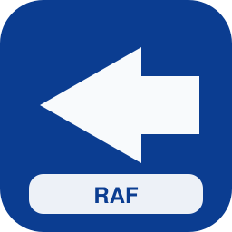

| Campo | Valor |
| --- | --- |
| Código corto | **RAF** |
| Tipo | nacional |
| Competencia | competitiva |
| Color | `#0B3D91` / `#F8FAFC` |
| Sede | Fráncfort del Meno |
| Lands | Baden-Wurtemberg, Baviera, Berlín, Brandeburgo, Bremen, Hamburgo, Hesse, Mecklemburgo-Pomerania Occidental, Baja Sajonia, Renania del Norte-Westfalia, Renania-Palatinado, Sarre, Sajonia, Sajonia-Anhalt, Schleswig-Holstein, Turingia |
| Servicios | `av`, `ld`, `px` |
| Eslogan | *Velocidad con sello federal* |
| Logo | `assets/logos/raf.svg` |
| Flota | ICE 2 (×17); Stadler Giruno (×24); Stadler KISS 200 (×27); ICE 4 (×42); TGV EuroDuplex (×45) |

### Expreso Central (`exc`)

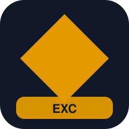

| Campo | Valor |
| --- | --- |
| Código corto | **EXC** |
| Tipo | nacional |
| Competencia | competitiva |
| Color | `#111827` / `#E39A00` |
| Sede | Erfurt |
| Lands | Berlín, Brandeburgo, Sajonia-Anhalt, Sajonia, Turingia, Hesse, Baja Sajonia, Renania del Norte-Westfalia |
| Servicios | `ld`, `ir`, `px` |
| Eslogan | *El eje este-oeste* |
| Logo | `assets/logos/exc.svg` |
| Flota | TGV EuroDuplex (×14); Stadler KISS 200 (×25); Stadler FLIRT 4 (×28); ICE 3 (×35) |

### Corredores del Norte (`cdn`)

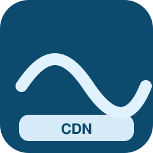

| Campo | Valor |
| --- | --- |
| Código corto | **CDN** |
| Tipo | nacional |
| Competencia | competitiva |
| Color | `#0C4A6E` / `#E0F2FE` |
| Sede | Hamburgo |
| Lands | Schleswig-Holstein, Hamburgo, Bremen, Baja Sajonia, Mecklemburgo-Pomerania Occidental, Berlín, Brandeburgo |
| Servicios | `ld`, `ir`, `ae` |
| Eslogan | *Del Báltico al Mar del Norte* |
| Logo | `assets/logos/cdn.svg` |
| Flota | Pendolino New (×15); Regio 2N Omneo (×26); ICE 4 (×29); ICE TD (×40); Railjet / Viaggio Comfort (×43) |

### VeloRápido (`vrp`)

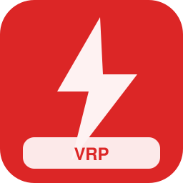

| Campo | Valor |
| --- | --- |
| Código corto | **VRP** |
| Tipo | nacional |
| Competencia | nicho |
| Color | `#DC2626` / `#FEF2F2` |
| Sede | Colonia |
| Lands | Renania del Norte-Westfalia, Hesse, Baden-Wurtemberg, Baviera, Renania-Palatinado, Sarre |
| Servicios | `av`, `px` |
| Eslogan | *Alta velocidad del Rin al Danubio* |
| Logo | `assets/logos/vrp.svg` |
| Flota | ICE 4 (×20); TGV EuroDuplex (×23); Pendolino New (×30); ICE 2 (×37) |

### Líneas Maestras (`lma`)

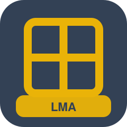

| Campo | Valor |
| --- | --- |
| Código corto | **LMA** |
| Tipo | nacional |
| Competencia | competitiva |
| Color | `#334155` / `#EAB308` |
| Sede | Hannover |
| Lands | Baden-Wurtemberg, Baviera, Berlín, Brandeburgo, Bremen, Hamburgo, Hesse, Mecklemburgo-Pomerania Occidental, Baja Sajonia, Renania del Norte-Westfalia, Renania-Palatinado, Sarre, Sajonia, Sajonia-Anhalt, Schleswig-Holstein, Turingia |
| Servicios | `ld`, `ir` |
| Eslogan | *Las rutas que unen Alemania* |
| Logo | `assets/logos/lma.svg` |
| Flota | ICN (×21); ICE 3 (×24); TGV EuroDuplex (×31); Stadler KISS 200 (×42) |

### InterCiudades Alemania (`ica`)

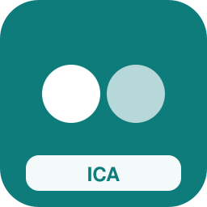

| Campo | Valor |
| --- | --- |
| Código corto | **ICA** |
| Tipo | nacional |
| Competencia | competitiva |
| Color | `#0E7C7B` / `#FFFFFF` |
| Sede | Núremberg |
| Lands | Baden-Wurtemberg, Baviera, Berlín, Brandeburgo, Bremen, Hamburgo, Hesse, Mecklemburgo-Pomerania Occidental, Baja Sajonia, Renania del Norte-Westfalia, Renania-Palatinado, Sarre, Sajonia, Sajonia-Anhalt, Schleswig-Holstein, Turingia |
| Servicios | `ld`, `ir`, `re` |
| Eslogan | *Ciudad a ciudad, sin rodeos* |
| Logo | `assets/logos/ica.svg` |
| Flota | VIRM Doble Piso (×22); Alstom Coradia Nordic (×25); ICE 2 (×32); Thalys PBKA (×39); Twindexx Swiss Express (×54) |

### Nocturno Continental (`noc`)

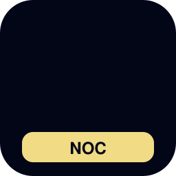

| Campo | Valor |
| --- | --- |
| Código corto | **NOC** |
| Tipo | especializado |
| Competencia | nicho |
| Color | `#020617` / `#FDE68A` |
| Sede | Múnich |
| Lands | Baden-Wurtemberg, Baviera, Berlín, Brandeburgo, Bremen, Hamburgo, Hesse, Mecklemburgo-Pomerania Occidental, Baja Sajonia, Renania del Norte-Westfalia, Renania-Palatinado, Sarre, Sajonia, Sajonia-Anhalt, Schleswig-Holstein, Turingia |
| Servicios | `n` |
| Eslogan | *Alemania mientras duermes* |
| Logo | `assets/logos/noc.svg` |
| Flota | Coches nocturnos Viaggio (×19); Railjet / Viaggio Comfort (×26) |

### Alta Velocidad Renana (`avr`)

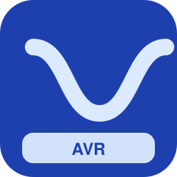

| Campo | Valor |
| --- | --- |
| Código corto | **AVR** |
| Tipo | nacional |
| Competencia | nicho |
| Color | `#1E40AF` / `#DBEAFE` |
| Sede | Mannheim |
| Lands | Renania del Norte-Westfalia, Renania-Palatinado, Hesse, Baden-Wurtemberg, Sarre |
| Servicios | `av`, `ld`, `ae` |
| Eslogan | *El corredor más denso de Europa* |
| Logo | `assets/logos/avr.svg` |
| Flota | TGV POS (×20); Pendolino New (×27); Regio 2N Omneo (×34); ICE 2 (×45); Stadler Giruno (×52) |

### Puente Europeo (`peu`)

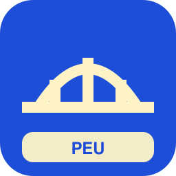

| Campo | Valor |
| --- | --- |
| Código corto | **PEU** |
| Tipo | internacional |
| Competencia | nicho |
| Color | `#1D4ED8` / `#FEF3C7` |
| Sede | Friburgo |
| Lands | Baden-Wurtemberg, Baviera, Sarre, Renania-Palatinado, Renania del Norte-Westfalia, Schleswig-Holstein, Sajonia |
| Servicios | `av`, `ld`, `n` |
| Eslogan | *Alemania conectada al continente* |
| Logo | `assets/logos/peu.svg` |
| Flota | Stadler Giruno (×25); Stadler KISS 200 (×28); Coches nocturnos Viaggio (×35); ICE 1 (×46); ICE T (×49) |

### Trenes del Rin Negro (`trw`)

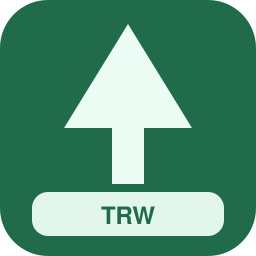

| Campo | Valor |
| --- | --- |
| Código corto | **TRW** |
| Tipo | regional |
| Competencia | dominante |
| Color | `#1F6B4A` / `#ECFDF5` |
| Sede | Stuttgart |
| Lands | Baden-Wurtemberg |
| Servicios | `re`, `rb`, `rl`, `tt` |
| Eslogan | *Selva, valle y capital* |
| Logo | `assets/logos/trw.svg` |
| Flota | Desiro Doble Piso (×22); M7 Doble Piso (×29); GTW Diésel (×40); Bombardier Flexity (×43); Stadler FLIRT 4 (×54); CAF Civity (×17) |

### Servicios del Valle del Neckar (`svb`)

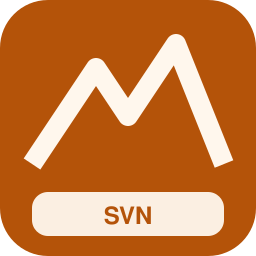

| Campo | Valor |
| --- | --- |
| Código corto | **SVN** |
| Tipo | regional |
| Competencia | competitiva |
| Color | `#B45309` / `#FFF7ED` |
| Sede | Heilbronn |
| Lands | Baden-Wurtemberg |
| Servicios | `re`, `rb`, `tt` |
| Eslogan | *El Neckar en movimiento* |
| Logo | `assets/logos/svb.svg` |
| Flota | Régiolis (×27); FLIRT WINK (×30); LINT 41 (×37); Stadler KISS 200 (×44); Desiro ML (×55) |

### AlpenBahn Sur (`alb`)

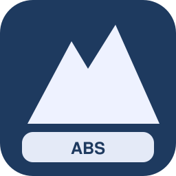

| Campo | Valor |
| --- | --- |
| Código corto | **ABS** |
| Tipo | regional |
| Competencia | competitiva |
| Color | `#1E3A5F` / `#EEF2FF` |
| Sede | Garmisch-Partenkirchen |
| Lands | Baviera, Baden-Wurtemberg |
| Servicios | `re`, `rb`, `tur`, `rl` |
| Eslogan | *Montaña y precisión* |
| Logo | `assets/logos/alb.svg` |
| Flota | GTW Eléctrico (×28); Composición panorámica (×31); FLIRT Suizo (×42); Régiolis (×49); FLIRT WINK (×16); LINT 41 (×23) |

### Bávaros Regionales (`bav`)

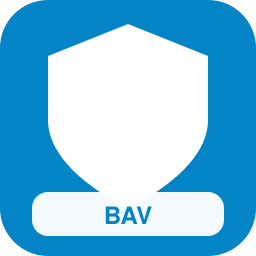

| Campo | Valor |
| --- | --- |
| Código corto | **BAV** |
| Tipo | regional |
| Competencia | dominante |
| Color | `#0284C7` / `#FFFFFF` |
| Sede | Múnich |
| Lands | Baviera |
| Servicios | `re`, `rb`, `ir`, `rl` |
| Eslogan | *Baviera entera, un billete* |
| Logo | `assets/logos/bav.svg` |
| Flota | GTW Diésel (×29); ICE TD (×32); Stadler FLIRT 3 (×43); Alstom Coradia Nordic (×50); VIRM Doble Piso (×17); Talent (×24) |

### Ferrocarril del Danubio Azul (`fda`)

| Campo | Valor |
| --- | --- |
| Código corto | **FDA** |
| Tipo | regional |
| Competencia | competitiva |
| Color | `#0EA5E9` / `#F0F9FF` |
| Sede | Ratisbona |
| Lands | Baviera |
| Servicios | `re`, `rb`, `tur` |
| Eslogan | *Siguiendo el Danubio* |
| Logo | `assets/logos/fda.svg` |
| Flota | Stadler KISS 200 (×26); Desiro ML (×37); Regio 2N Omneo (×40); GTW Eléctrico (×47); Composición panorámica (×14) |

### Media Franconia Rieles (`mfr`)

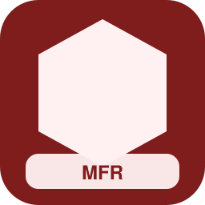

| Campo | Valor |
| --- | --- |
| Código corto | **MFR** |
| Tipo | regional |
| Competencia | competitiva |
| Color | `#7F1D1D` / `#FFF1F2` |
| Sede | Núremberg |
| Lands | Baviera |
| Servicios | `re`, `rb`, `rl` |
| Eslogan | *Franconia conectada* |
| Logo | `assets/logos/mfr.svg` |
| Flota | Desiro ML (×31); Regio 2N Omneo (×34); GTW Eléctrico (×45); Stadler KISS 200 (×48) |

### Marca Brandeburgo (`mbb`)

| Campo | Valor |
| --- | --- |
| Código corto | **MBB** |
| Tipo | regional |
| Competencia | dominante |
| Color | `#4D7C0F` / `#F7FEE7` |
| Sede | Potsdam |
| Lands | Brandeburgo, Berlín |
| Servicios | `re`, `rb`, `ir`, `rl` |
| Eslogan | *Alrededor de la capital* |
| Logo | `assets/logos/mbb.svg` |
| Flota | Stadler FLIRT 4 (×36); CAF Civity (×39); KISS 160 (×42); Desiro Classic (×53); ICN (×16); FLIRT Suizo (×27) |

### Óder Express Regional (`ode`)

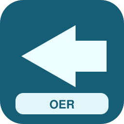

| Campo | Valor |
| --- | --- |
| Código corto | **OER** |
| Tipo | regional |
| Competencia | competitiva |
| Color | `#155E75` / `#ECFEFF` |
| Sede | Fráncfort del Óder |
| Lands | Brandeburgo |
| Servicios | `re`, `rb` |
| Eslogan | *Frontera viva* |
| Logo | `assets/logos/ode.svg` |
| Flota | M7 Doble Piso (×29); GTW Diésel (×36); Twindexx Swiss Express (×43); Desiro Doble Piso (×50) |

### Hanseas del Weser (`whv`)

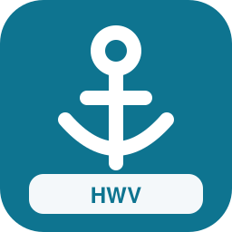

| Campo | Valor |
| --- | --- |
| Código corto | **HWV** |
| Tipo | regional |
| Competencia | dominante |
| Color | `#0E7490` / `#FFFFFF` |
| Sede | Bremen |
| Lands | Bremen, Baja Sajonia |
| Servicios | `re`, `rb`, `ae` |
| Eslogan | *Puerto, marisma y ciudad* |
| Logo | `assets/logos/whv.svg` |
| Flota | FLIRT WINK (×30); LINT 41 (×37); FLIRT Suizo (×48); Régiolis (×55) |

### Hesse Conecta (`hes`)

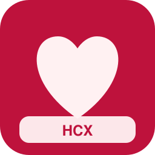

| Campo | Valor |
| --- | --- |
| Código corto | **HCX** |
| Tipo | regional |
| Competencia | dominante |
| Color | `#BE123C` / `#FFF1F2` |
| Sede | Fráncfort del Meno |
| Lands | Hesse |
| Servicios | `re`, `rb`, `ir`, `ae`, `tt` |
| Eslogan | *El corazón en red* |
| Logo | `assets/logos/hes.svg` |
| Flota | Stadler FLIRT 3 (×35); Alstom Coradia Nordic (×42); VIRM Doble Piso (×49); Talent (×16); Alstom Citadis (×19); Twindexx Swiss Express (×30); Desiro Doble Piso (×33) |

### Tren del Taunus y Main (`trm`)

| Campo | Valor |
| --- | --- |
| Código corto | **TTM** |
| Tipo | regional |
| Competencia | competitiva |
| Color | `#78350F` / `#FFFBEB` |
| Sede | Wiesbaden |
| Lands | Hesse |
| Servicios | `re`, `rb`, `tt` |
| Eslogan | *Colinas al hilo del Main* |
| Logo | `assets/logos/trm.svg` |
| Flota | KISS 160 (×32); Desiro Classic (×39); Flexity Swift (×46); Stadler FLIRT 3 (×17); Alstom Coradia Nordic (×24) |

### Báltico Líneas (`bal`)

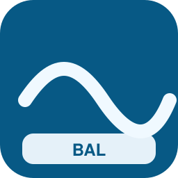

| Campo | Valor |
| --- | --- |
| Código corto | **BAL** |
| Tipo | regional |
| Competencia | dominante |
| Color | `#075985` / `#F0F9FF` |
| Sede | Rostock |
| Lands | Mecklemburgo-Pomerania Occidental, Schleswig-Holstein |
| Servicios | `re`, `rb`, `tur`, `rl` |
| Eslogan | *Costa y lagunas* |
| Logo | `assets/logos/bal.svg` |
| Flota | Stadler KISS 200 (×33); Desiro ML (×44); Regio 2N Omneo (×47); GTW Eléctrico (×18); Composición panorámica (×21); FLIRT Suizo (×32) |

### Pomerania Rápida (`pom`)

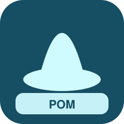

| Campo | Valor |
| --- | --- |
| Código corto | **POM** |
| Tipo | regional |
| Competencia | competitiva |
| Color | `#164E63` / `#CFFAFE` |
| Sede | Stralsund |
| Lands | Mecklemburgo-Pomerania Occidental |
| Servicios | `re`, `rb`, `tur` |
| Eslogan | *Islas y tierra firme* |
| Logo | `assets/logos/pom.svg` |
| Flota | Stadler FLIRT 3 (×38); Alstom Coradia Nordic (×45); VIRM Doble Piso (×48); Talent (×15); Stadler FLIRT 4 (×26) |

### Baja Sajonia Express (`bsx`)

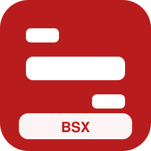

| Campo | Valor |
| --- | --- |
| Código corto | **BSX** |
| Tipo | regional |
| Competencia | dominante |
| Color | `#B91C1C` / `#FFFFFF` |
| Sede | Hannover |
| Lands | Baja Sajonia |
| Servicios | `re`, `rb`, `ir`, `rl` |
| Eslogan | *Llanura a toda marcha* |
| Logo | `assets/logos/bsx.svg` |
| Flota | Stadler KISS 200 (×39); Desiro ML (×46); Regio 2N Omneo (×53); GTW Eléctrico (×20); ICE T (×23); Stadler FLIRT 4 (×38) |

### Harz y Llanura (`har`)

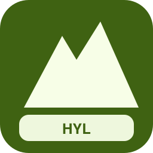

| Campo | Valor |
| --- | --- |
| Código corto | **HYL** |
| Tipo | regional |
| Competencia | competitiva |
| Color | `#3F6212` / `#F7FEE7` |
| Sede | Goslar |
| Lands | Baja Sajonia, Sajonia-Anhalt |
| Servicios | `re`, `rb`, `tur`, `rl` |
| Eslogan | *Del Harz al mar* |
| Logo | `assets/logos/har.svg` |
| Flota | Régiolis (×40); FLIRT WINK (×47); LINT 41 (×54); Stadler FLIRT 3 (×21); Alstom Coradia Nordic (×28); VIRM Doble Piso (×31) |

### Renania Rodante (`rrw`)

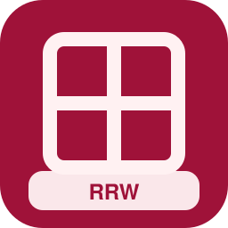

| Campo | Valor |
| --- | --- |
| Código corto | **RRW** |
| Tipo | regional |
| Competencia | dominante |
| Color | `#9F1239` / `#FFF1F2` |
| Sede | Düsseldorf |
| Lands | Renania del Norte-Westfalia |
| Servicios | `re`, `rb`, `ir`, `tt` |
| Eslogan | *La región más densa, la red más viva* |
| Logo | `assets/logos/rrw.svg` |
| Flota | ICE TD (×37); Stadler Tram-Train (×44); FLIRT Suizo (×55); Régiolis (×22); FLIRT WINK (×25); LINT 41 (×32) |

### Westfalia Express (`wex`)

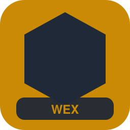

| Campo | Valor |
| --- | --- |
| Código corto | **WEX** |
| Tipo | regional |
| Competencia | competitiva |
| Color | `#CA8A04` / `#1F2937` |
| Sede | Dortmund |
| Lands | Renania del Norte-Westfalia |
| Servicios | `re`, `rb`, `ir` |
| Eslogan | *Cuenca y campos unidos* |
| Logo | `assets/logos/wex.svg` |
| Flota | Régiolis (×42); FLIRT WINK (×45); LINT 41 (×12); Twindexx Swiss Express (×23); Desiro Doble Piso (×26) |

### Ruhr Urbano Regional (`rur`)

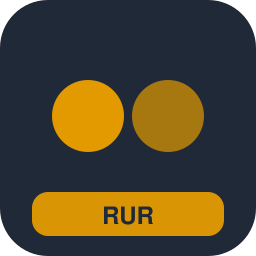

| Campo | Valor |
| --- | --- |
| Código corto | **RUR** |
| Tipo | regional |
| Competencia | competitiva |
| Color | `#1F2937` / `#E39A00` |
| Sede | Essen |
| Lands | Renania del Norte-Westfalia |
| Servicios | `re`, `rb`, `s`, `mc` |
| Eslogan | *Una metrópolis, mil estaciones* |
| Logo | `assets/logos/rur.svg` |
| Flota | GTW Eléctrico (×39); MI2N Altéo (×46); Stadler FLIRT 3 (×21); Alstom Coradia Nordic (×28); VIRM Doble Piso (×31); Talent (×34) |

### Palatinado Ferries Riel (`rpf`)

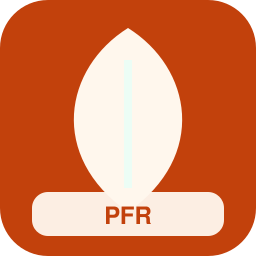

| Campo | Valor |
| --- | --- |
| Código corto | **PFR** |
| Tipo | regional |
| Competencia | dominante |
| Color | `#C2410C` / `#FFF7ED` |
| Sede | Maguncia |
| Lands | Renania-Palatinado |
| Servicios | `re`, `rb`, `tur`, `rl` |
| Eslogan | *Viñedos sobre raíles* |
| Logo | `assets/logos/rpf.svg` |
| Flota | Stadler KISS 200 (×40); Desiro ML (×51); Regio 2N Omneo (×14); GTW Eléctrico (×25); Composición panorámica (×28); FLIRT Suizo (×39) |

### Mosela y Rin Sur (`mos`)

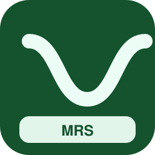

| Campo | Valor |
| --- | --- |
| Código corto | **MRS** |
| Tipo | regional |
| Competencia | competitiva |
| Color | `#14532D` / `#ECFDF5` |
| Sede | Coblenza |
| Lands | Renania-Palatinado, Sarre |
| Servicios | `re`, `rb`, `tur` |
| Eslogan | *Curvas del Mosela* |
| Logo | `assets/logos/mos.svg` |
| Flota | Stadler FLIRT 3 (×45); Alstom Coradia Nordic (×52); VIRM Doble Piso (×15); Talent (×22); Stadler FLIRT 4 (×33) |

### Sarre Movilidad (`sar`)

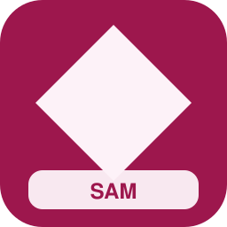

| Campo | Valor |
| --- | --- |
| Código corto | **SAM** |
| Tipo | regional |
| Competencia | dominante |
| Color | `#9D174D` / `#FDF2F8` |
| Sede | Sarrebruck |
| Lands | Sarre |
| Servicios | `re`, `rb`, `tt`, `rl` |
| Eslogan | *Pequeño Land, gran enlace* |
| Logo | `assets/logos/sar.svg` |
| Flota | Talent (×50); Stadler Tram-Train (×49); FLIRT Suizo (×20); Régiolis (×27); FLIRT WINK (×34); LINT 41 (×41) |

### Sajonia Rieles (`saj`)

| Campo | Valor |
| --- | --- |
| Código corto | **SJR** |
| Tipo | regional |
| Competencia | dominante |
| Color | `#1F8A81` / `#FFF7ED` |
| Sede | Dresde |
| Lands | Sajonia |
| Servicios | `re`, `rb`, `ir`, `rl` |
| Eslogan | *Cultura sobre vías* |
| Logo | `assets/logos/saj.svg` |
| Flota | Twindexx Swiss Express (×47); Desiro Doble Piso (×50); M7 Doble Piso (×21); GTW Diésel (×28); ICE TD (×31); Stadler FLIRT 3 (×42) |

### Montes Metálicos Tren (`erz`)

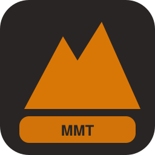

| Campo | Valor |
| --- | --- |
| Código corto | **MMT** |
| Tipo | regional |
| Competencia | competitiva |
| Color | `#292524` / `#D97706` |
| Sede | Chemnitz |
| Lands | Sajonia |
| Servicios | `re`, `rb`, `tt`, `rl` |
| Eslogan | *Valles industriales renacidos* |
| Logo | `assets/logos/erz.svg` |
| Flota | Stadler KISS 200 (×44); Desiro ML (×55); Regio 2N Omneo (×18); GTW Eléctrico (×29); Alstom Citadis (×32); Twindexx Swiss Express (×39) |

### Sajonia-Anhalt Líneas (`sah`)

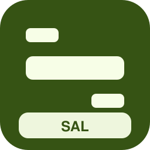

| Campo | Valor |
| --- | --- |
| Código corto | **SAL** |
| Tipo | regional |
| Competencia | dominante |
| Color | `#365314` / `#F7FEE7` |
| Sede | Magdeburgo |
| Lands | Sajonia-Anhalt |
| Servicios | `re`, `rb`, `rl` |
| Eslogan | *El Elba como eje* |
| Logo | `assets/logos/sah.svg` |
| Flota | LINT 41 (×49); FLIRT Suizo (×16); Régiolis (×23); FLIRT WINK (×30) |

### Elba Verde Regional (`elb`)

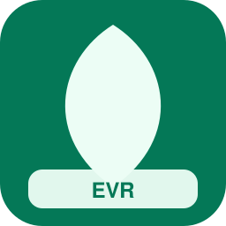

| Campo | Valor |
| --- | --- |
| Código corto | **EVR** |
| Tipo | regional |
| Competencia | competitiva |
| Color | `#047857` / `#ECFDF5` |
| Sede | Dessau |
| Lands | Sajonia-Anhalt, Baja Sajonia |
| Servicios | `re`, `rb`, `tur` |
| Eslogan | *Naturaleza y Bauhaus* |
| Logo | `assets/logos/elb.svg` |
| Flota | Talent (×46); Stadler FLIRT 4 (×17); CAF Civity (×20); KISS 160 (×27); Desiro Classic (×34) |

### Schleswig Conexión (`shc`)

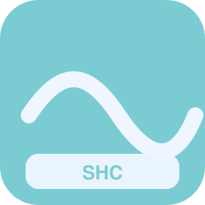

| Campo | Valor |
| --- | --- |
| Código corto | **SHC** |
| Tipo | regional |
| Competencia | dominante |
| Color | `#7BCCD2` / `#EFF6FF` |
| Sede | Kiel |
| Lands | Schleswig-Holstein, Hamburgo |
| Servicios | `re`, `rb`, `tur`, `ae` |
| Eslogan | *Dos mares, una red* |
| Logo | `assets/logos/shc.svg` |
| Flota | Stadler KISS 200 (×47); Desiro ML (×18); Regio 2N Omneo (×21); GTW Eléctrico (×28); Composición panorámica (×35); FLIRT Suizo (×46) |

### Holstein Costero (`hol`)

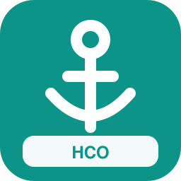

| Campo | Valor |
| --- | --- |
| Código corto | **HCO** |
| Tipo | regional |
| Competencia | competitiva |
| Color | `#0D9488` / `#FFFFFF` |
| Sede | Lübeck |
| Lands | Schleswig-Holstein |
| Servicios | `re`, `rb`, `tur` |
| Eslogan | *Hanseáticos sobre raíles* |
| Logo | `assets/logos/hol.svg` |
| Flota | Stadler FLIRT 3 (×52); Alstom Coradia Nordic (×19); VIRM Doble Piso (×22); Talent (×29); Stadler FLIRT 4 (×40) |

### Turingia Vías (`tur`)

| Campo | Valor |
| --- | --- |
| Código corto | **TUV** |
| Tipo | regional |
| Competencia | dominante |
| Color | `#A242A5` / `#FEF3C7` |
| Sede | Erfurt |
| Lands | Turingia |
| Servicios | `re`, `rb`, `ir`, `rl` |
| Eslogan | *El bosque en horario* |
| Logo | `assets/logos/tur.svg` |
| Flota | LINT 41 (×53); Twindexx Swiss Express (×20); Desiro Doble Piso (×23); M7 Doble Piso (×34); GTW Diésel (×41); ICE TD (×44) |

### Turingios del Sur (`thu`)

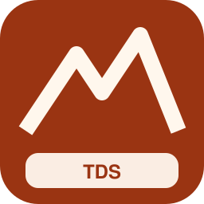

| Campo | Valor |
| --- | --- |
| Código corto | **TDS** |
| Tipo | regional |
| Competencia | competitiva |
| Color | `#9A3412` / `#FFF7ED` |
| Sede | Suhl |
| Lands | Turingia, Baviera |
| Servicios | `re`, `rb`, `rl` |
| Eslogan | *Entre Turingia y Baviera* |
| Logo | `assets/logos/thu.svg` |
| Flota | FLIRT WINK (×54); LINT 41 (×21); FLIRT Suizo (×28); Régiolis (×35) |

### Cercanías Capital (`sbe`)

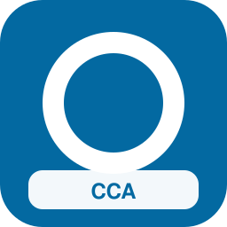

| Campo | Valor |
| --- | --- |
| Código corto | **CCA** |
| Tipo | metropolitano |
| Competencia | dominante |
| Color | `#0369A1` / `#FFFFFF` |
| Sede | Berlín |
| Lands | Berlín, Brandeburgo |
| Servicios | `s`, `or`, `mc`, `ae` |
| Eslogan | *La red que late con Berlín* |
| Logo | `assets/logos/sbe.svg` |
| Flota | KISS 160 (×51); Stadler FLIRT 4 (×18); M7 Doble Piso (×25); Stadler KISS 200 (×32); Alstom Coradia Nordic (×39); Z 24500 2N NG (×46) |

### Cercanías Hanseáticas (`shh`)

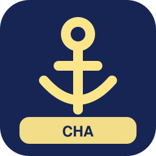

| Campo | Valor |
| --- | --- |
| Código corto | **CHA** |
| Tipo | metropolitano |
| Competencia | dominante |
| Color | `#172554` / `#FDE68A` |
| Sede | Hamburgo |
| Lands | Hamburgo, Schleswig-Holstein, Baja Sajonia |
| Servicios | `s`, `or`, `ae`, `mc` |
| Eslogan | *Puerto y periferia al unísono* |
| Logo | `assets/logos/shh.svg` |
| Flota | Z 24500 2N NG (×12); Desiro Doble Piso (×19); MI2N Altéo (×30); Desiro ML (×33); VIRM Doble Piso (×40); Stadler FLIRT 3 (×47) |

### Cercanías Isar (`smu`)

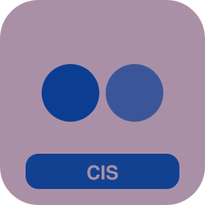

| Campo | Valor |
| --- | --- |
| Código corto | **CIS** |
| Tipo | metropolitano |
| Competencia | dominante |
| Color | `#AA90A7` / `#0B3D91` |
| Sede | Múnich |
| Lands | Baviera |
| Servicios | `s`, `or`, `ae`, `mc` |
| Eslogan | *Múnich en minutos* |
| Logo | `assets/logos/smu.svg` |
| Flota | Stadler FLIRT 3 (×13); KISS 160 (×20); Stadler FLIRT 4 (×27); M7 Doble Piso (×34); Stadler KISS 200 (×41); Alstom Coradia Nordic (×48) |

### Cercanías del Meno (`sfr`)

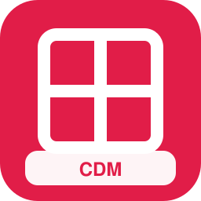

| Campo | Valor |
| --- | --- |
| Código corto | **CDM** |
| Tipo | metropolitano |
| Competencia | dominante |
| Color | `#E11D48` / `#FFFFFF` |
| Sede | Fráncfort del Meno |
| Lands | Hesse |
| Servicios | `s`, `ae`, `mc`, `tt` |
| Eslogan | *El nudo metropolitano* |
| Logo | `assets/logos/sfr.svg` |
| Flota | Flexity Swift (×14); Desiro ML (×21); VIRM Doble Piso (×28); Bombardier Flexity (×35); Stadler FLIRT 3 (×42); KISS 160 (×49) |

### Cercanías Suabia (`sst`)

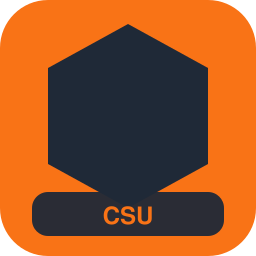

| Campo | Valor |
| --- | --- |
| Código corto | **CSU** |
| Tipo | metropolitano |
| Competencia | dominante |
| Color | `#F97316` / `#1F2937` |
| Sede | Stuttgart |
| Lands | Baden-Wurtemberg |
| Servicios | `s`, `tt`, `or`, `ae` |
| Eslogan | *Valle de Stuttgart enlazado* |
| Logo | `assets/logos/sst.svg` |
| Flota | Stadler FLIRT 4 (×15); M7 Doble Piso (×22); Talent (×29); Stadler KISS 200 (×36); Alstom Coradia Nordic (×43); Z 24500 2N NG (×50) |

### Cercanías Colonia-Bonn (`sco`)

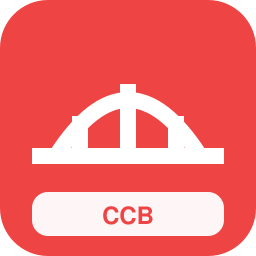

| Campo | Valor |
| --- | --- |
| Código corto | **CCB** |
| Tipo | metropolitano |
| Competencia | dominante |
| Color | `#EF4444` / `#FFFFFF` |
| Sede | Colonia |
| Lands | Renania del Norte-Westfalia |
| Servicios | `s`, `tt`, `mc`, `ae` |
| Eslogan | *Dos ciudades, una red* |
| Logo | `assets/logos/sco.svg` |
| Flota | Desiro Doble Piso (×16); MI2N Altéo (×23); Flexity Swift (×30); Desiro ML (×37); VIRM Doble Piso (×44); Bombardier Flexity (×51) |

### Cercanías Rin-Ruhr (`srh`)

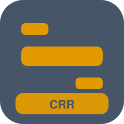

| Campo | Valor |
| --- | --- |
| Código corto | **CRR** |
| Tipo | metropolitano |
| Competencia | competitiva |
| Color | `#475569` / `#E39A00` |
| Sede | Dortmund |
| Lands | Renania del Norte-Westfalia |
| Servicios | `s`, `or`, `mc`, `re` |
| Eslogan | *La metrópolis lineal* |
| Logo | `assets/logos/srh.svg` |
| Flota | KISS 160 (×21); FLIRT Suizo (×24); Stadler FLIRT 4 (×35); M7 Doble Piso (×42); Twindexx Swiss Express (×45); Stadler KISS 200 (×16) |

### Cercanías del Elba (`sdn`)

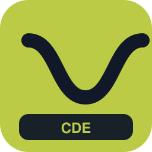

| Campo | Valor |
| --- | --- |
| Código corto | **CDE** |
| Tipo | metropolitano |
| Competencia | dominante |
| Color | `#BBCB45` / `#111827` |
| Sede | Dresde |
| Lands | Sajonia |
| Servicios | `s`, `mc`, `tt` |
| Eslogan | *Dresde y alrededores* |
| Logo | `assets/logos/sdn.svg` |
| Flota | Z 24500 2N NG (×18); Stadler Tram-Train (×25); Desiro Doble Piso (×32); MI2N Altéo (×39); Flexity Swift (×46) |

### Cercanías Sajona Norte (`slp`)

| Campo | Valor |
| --- | --- |
| Código corto | **CSN** |
| Tipo | metropolitano |
| Competencia | dominante |
| Color | `#2563EB` / `#EFF6FF` |
| Sede | Leipzig |
| Lands | Sajonia, Sajonia-Anhalt |
| Servicios | `s`, `mc`, `ae` |
| Eslogan | *Leipzig como hub* |
| Logo | `assets/logos/slp.svg` |
| Flota | MI2N Altéo (×19); Desiro ML (×26); VIRM Doble Piso (×33); Stadler FLIRT 3 (×40); KISS 160 (×47) |

### Cercanías Hannover (`sha`)

| Campo | Valor |
| --- | --- |
| Código corto | **CHN** |
| Tipo | metropolitano |
| Competencia | dominante |
| Color | `#169CC8` / `#FFFFFF` |
| Sede | Hannover |
| Lands | Baja Sajonia |
| Servicios | `s`, `mc`, `ae` |
| Eslogan | *La estrella de Baja Sajonia* |
| Logo | `assets/logos/sha.svg` |
| Flota | Stadler FLIRT 4 (×20); M7 Doble Piso (×27); Stadler KISS 200 (×34); Alstom Coradia Nordic (×41); Z 24500 2N NG (×48) |

### Cercanías Núremberg (`snr`)

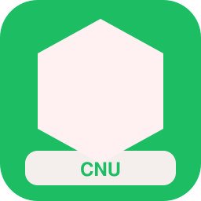

| Campo | Valor |
| --- | --- |
| Código corto | **CNU** |
| Tipo | metropolitano |
| Competencia | dominante |
| Color | `#1DBD63` / `#FFF1F2` |
| Sede | Núremberg |
| Lands | Baviera |
| Servicios | `s`, `u`, `mc` |
| Eslogan | *Franconia metropolitana* |
| Logo | `assets/logos/snr.svg` |
| Flota | Desiro Doble Piso (×21); MI2N Altéo (×28); Stadler FLIRT 4 (×35); M7 Doble Piso (×42); Metro MX / Siemens (×49) |

### Cercanías del Rin Medio (`skl`)

| Campo | Valor |
| --- | --- |
| Código corto | **CRM** |
| Tipo | metropolitano |
| Competencia | competitiva |
| Color | `#0F766E` / `#F0FDFA` |
| Sede | Maguncia |
| Lands | Renania-Palatinado, Hesse |
| Servicios | `s`, `tt`, `mc` |
| Eslogan | *Mainz-Wiesbaden-Fráncfort al detalle* |
| Logo | `assets/logos/skl.svg` |
| Flota | M7 Doble Piso (×22); Talent (×29); Stadler KISS 200 (×36); Alstom Coradia Nordic (×43); Z 24500 2N NG (×50) |

### Metro Capital (`ube`)

| Campo | Valor |
| --- | --- |
| Código corto | **MCA** |
| Tipo | urbano |
| Competencia | dominante |
| Color | `#F59E0B` / `#111827` |
| Sede | Berlín |
| Lands | Berlín |
| Servicios | `u` |
| Eslogan | *Bajo la ciudad, sobre el tiempo* |
| Logo | `assets/logos/ube.svg` |
| Flota | Metro MP89/MP05 (×23); Metro MX / Siemens (×30) |

### Metro Isar (`umu`)

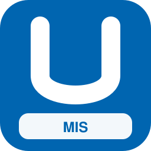

| Campo | Valor |
| --- | --- |
| Código corto | **MIS** |
| Tipo | urbano |
| Competencia | dominante |
| Color | `#0065B0` / `#FFFFFF` |
| Sede | Múnich |
| Lands | Baviera |
| Servicios | `u` |
| Eslogan | *Profundidad bávara* |
| Logo | `assets/logos/umu.svg` |
| Flota | Metro MX / Siemens (×24); Metro MP89/MP05 (×31) |

### Metro Hanseático (`uhh`)

| Campo | Valor |
| --- | --- |
| Código corto | **MHA** |
| Tipo | urbano |
| Competencia | dominante |
| Color | `#E30613` / `#FFFFFF` |
| Sede | Hamburgo |
| Lands | Hamburgo |
| Servicios | `u` |
| Eslogan | *Túneles con brisa marina* |
| Logo | `assets/logos/uhh.svg` |
| Flota | Metro MP89/MP05 (×25); Metro MX / Siemens (×32) |

### Metro Franconia (`unu`)

| Campo | Valor |
| --- | --- |
| Código corto | **MFRU** |
| Tipo | urbano |
| Competencia | dominante |
| Color | `#211BD5` / `#FFFFFF` |
| Sede | Núremberg |
| Lands | Baviera |
| Servicios | `u` |
| Eslogan | *La U de Núremberg* |
| Logo | `assets/logos/unu.svg` |
| Flota | Metro MX / Siemens (×26); Metro MP89/MP05 (×33) |

### Tranvías Capital (`tbe`)

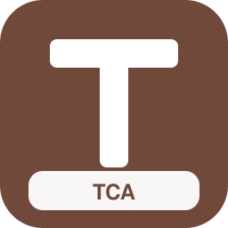

| Campo | Valor |
| --- | --- |
| Código corto | **TCA** |
| Tipo | urbano |
| Competencia | dominante |
| Color | `#71493B` / `#FFFFFF` |
| Sede | Berlín |
| Lands | Berlín |
| Servicios | `t` |
| Eslogan | *La superficie también mueve* |
| Logo | `assets/logos/tbe.svg` |
| Flota | Alstom Citadis (×27) |

### Tranvías Magdeburgo (`tmd`)

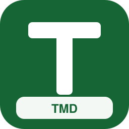

| Campo | Valor |
| --- | --- |
| Código corto | **TMD** |
| Tipo | urbano |
| Competencia | dominante |
| Color | `#166534` / `#FFFFFF` |
| Sede | Magdeburgo |
| Lands | Sajonia-Anhalt |
| Servicios | `t` |
| Eslogan | *Elba urbano* |
| Logo | `assets/logos/tmd.svg` |
| Flota | Stadler Tram-Train (×28) |

### Tranvías Dresde (`tdr`)

| Campo | Valor |
| --- | --- |
| Código corto | **TDR** |
| Tipo | urbano |
| Competencia | dominante |
| Color | `#FBBF24` / `#111827` |
| Sede | Dresde |
| Lands | Sajonia |
| Servicios | `t`, `tt` |
| Eslogan | *Amarillo por la ciudad barroca* |
| Logo | `assets/logos/tdr.svg` |
| Flota | Stadler Tram-Train (×33); Flexity Swift (×40); Bombardier Flexity (×47); Alstom Citadis (×54) |

### Tranvías Leipzig (`tle`)

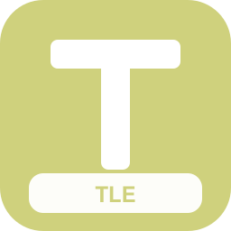

| Campo | Valor |
| --- | --- |
| Código corto | **TLE** |
| Tipo | urbano |
| Competencia | dominante |
| Color | `#CFD17D` / `#FFFFFF` |
| Sede | Leipzig |
| Lands | Sajonia |
| Servicios | `t` |
| Eslogan | *La red azul de Leipzig* |
| Logo | `assets/logos/tle.svg` |
| Flota | Tram Albatros (×30) |

### Tranvías Colonia (`tko`)

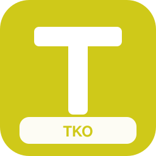

| Campo | Valor |
| --- | --- |
| Código corto | **TKO** |
| Tipo | urbano |
| Competencia | dominante |
| Color | `#CFC919` / `#FFFFFF` |
| Sede | Colonia |
| Lands | Renania del Norte-Westfalia |
| Servicios | `t`, `tt`, `u` |
| Eslogan | *Stadtbahn del Rin* |
| Logo | `assets/logos/tko.svg` |
| Flota | Bombardier Flexity (×35); Metro MX / Siemens (×38); Stadler Tram-Train (×49); Alstom Citadis (×16); Talent (×19) |

### Tranvías Stuttgart (`tst`)

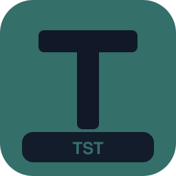

| Campo | Valor |
| --- | --- |
| Código corto | **TST** |
| Tipo | urbano |
| Competencia | dominante |
| Color | `#356F6A` / `#111827` |
| Sede | Stuttgart |
| Lands | Baden-Wurtemberg |
| Servicios | `t`, `tt`, `u` |
| Eslogan | *Zahnrad y Stadtbahn* |
| Logo | `assets/logos/tst.svg` |
| Flota | Tram Albatros (×32); Bombardier Flexity (×43); Metro MX / Siemens (×46); Stadler Tram-Train (×17); Alstom Citadis (×24) |

### Tranvías Hannover (`tha`)

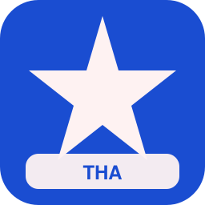

| Campo | Valor |
| --- | --- |
| Código corto | **THA** |
| Tipo | urbano |
| Competencia | dominante |
| Color | `#1A4DD1` / `#FEF2F2` |
| Sede | Hannover |
| Lands | Baja Sajonia |
| Servicios | `t`, `u` |
| Eslogan | *Stadtbahn en estrella* |
| Logo | `assets/logos/tha.svg` |
| Flota | Bombardier Flexity (×33); Metro MP89/MP05 (×40); Tram Albatros (×47); Flexity Swift (×14) |

### Tranvías Francfort (`tfr`)

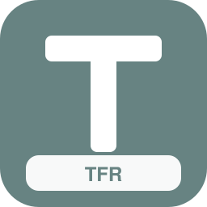

| Campo | Valor |
| --- | --- |
| Código corto | **TFR** |
| Tipo | urbano |
| Competencia | dominante |
| Color | `#678382` / `#FFFFFF` |
| Sede | Fráncfort del Meno |
| Lands | Hesse |
| Servicios | `t`, `u` |
| Eslogan | *Raíles entre rascacielos* |
| Logo | `assets/logos/tfr.svg` |
| Flota | Tram Albatros (×34); Flexity Swift (×41); Alstom Citadis (×48); Metro MX / Siemens (×15) |

### Tranvías Múnich (`tmu`)

| Campo | Valor |
| --- | --- |
| Código corto | **TMU** |
| Tipo | urbano |
| Competencia | dominante |
| Color | `#0891B2` / `#FFFFFF` |
| Sede | Múnich |
| Lands | Baviera |
| Servicios | `t` |
| Eslogan | *Tram por la capital bávara* |
| Logo | `assets/logos/tmu.svg` |
| Flota | Tram Albatros (×35) |

### Tranvías Düsseldorf (`tdu`)

| Campo | Valor |
| --- | --- |
| Código corto | **TDU** |
| Tipo | urbano |
| Competencia | dominante |
| Color | `#69ADD7` / `#FFF1F2` |
| Sede | Düsseldorf |
| Lands | Renania del Norte-Westfalia |
| Servicios | `t`, `tt` |
| Eslogan | *Rheinbahn en español* |
| Logo | `assets/logos/tdu.svg` |
| Flota | Alstom Citadis (×40); Talent (×43); Tram Albatros (×50); Stadler Tram-Train (×21) |

### Tranvías Bremen (`tbr`)

| Campo | Valor |
| --- | --- |
| Código corto | **TBR** |
| Tipo | urbano |
| Competencia | dominante |
| Color | `#BA68B0` / `#FFFFFF` |
| Sede | Bremen |
| Lands | Bremen |
| Servicios | `t` |
| Eslogan | *La ciudad hanseática sobre raíles* |
| Logo | `assets/logos/tbr.svg` |
| Flota | Alstom Citadis (×37) |

### Tranvías Rostock (`tro`)

| Campo | Valor |
| --- | --- |
| Código corto | **TRO** |
| Tipo | urbano |
| Competencia | dominante |
| Color | `#D49246` / `#E0F2FE` |
| Sede | Rostock |
| Lands | Mecklemburgo-Pomerania Occidental |
| Servicios | `t` |
| Eslogan | *Báltico urbano* |
| Logo | `assets/logos/tro.svg` |
| Flota | Stadler Tram-Train (×38) |

### AeroEnlace Alemania (`aex`)

| Campo | Valor |
| --- | --- |
| Código corto | **AEA** |
| Tipo | especializado |
| Competencia | nicho |
| Color | `#26A874` / `#FDE68A` |
| Sede | Fráncfort del Meno |
| Lands | Berlín, Hamburgo, Baviera, Hesse, Renania del Norte-Westfalia, Baden-Wurtemberg, Baja Sajonia |
| Servicios | `ae`, `px` |
| Eslogan | *Del andén a la puerta de embarque* |
| Logo | `assets/logos/aex.svg` |
| Flota | ICE 3 Velaro D (×39) |

### Panorámicos Alemanes (`pan`)

| Campo | Valor |
| --- | --- |
| Código corto | **PAN** |
| Tipo | especializado |
| Competencia | nicho |
| Color | `#7E1979` / `#FEF3C7` |
| Sede | Friburgo |
| Lands | Baviera, Baden-Wurtemberg, Renania-Palatinado, Schleswig-Holstein, Mecklemburgo-Pomerania Occidental, Sajonia |
| Servicios | `tur` |
| Eslogan | *El paisaje es el destino* |
| Logo | `assets/logos/pan.svg` |
| Flota | GTW Diésel (×40); Composición panorámica (×47) |

### Riberas del Rin (`riv`)

| Campo | Valor |
| --- | --- |
| Código corto | **RIR** |
| Tipo | especializado |
| Competencia | nicho |
| Color | `#813AC4` / `#DBEAFE` |
| Sede | Coblenza |
| Lands | Renania del Norte-Westfalia, Renania-Palatinado, Hesse, Baden-Wurtemberg |
| Servicios | `tur`, `re` |
| Eslogan | *Patrimonio sobre el Rin* |
| Logo | `assets/logos/riv.svg` |
| Flota | VIRM Doble Piso (×41); Stadler FLIRT 4 (×48); CAF Civity (×15); KISS 160 (×22) |

### Alpes Express Sur (`alp`)

| Campo | Valor |
| --- | --- |
| Código corto | **AES** |
| Tipo | especializado |
| Competencia | nicho |
| Color | `#A75BAC` / `#E0F2FE` |
| Sede | Múnich |
| Lands | Baviera |
| Servicios | `tur`, `re`, `ld` |
| Eslogan | *Hacia las cumbres* |
| Logo | `assets/logos/alp.svg` |
| Flota | KISS 160 (×42); ICE 1 (×49); Stadler Giruno (×16); Composición panorámica (×23); FLIRT Suizo (×30) |

### Costa a Costa (`cos`)

| Campo | Valor |
| --- | --- |
| Código corto | **CAC** |
| Tipo | especializado |
| Competencia | nicho |
| Color | `#C3B447` / `#ECFEFF` |
| Sede | Kiel |
| Lands | Schleswig-Holstein, Mecklemburgo-Pomerania Occidental, Hamburgo, Baja Sajonia, Bremen |
| Servicios | `tur`, `ir`, `ld` |
| Eslogan | *Mar del Norte ↔ Báltico* |
| Logo | `assets/logos/cos.svg` |
| Flota | ICE TD (×47); Regio 2N Omneo (×54); ICE 3 (×17); Stadler Giruno (×24); ICE T (×35) |

### Líneas Libres (`lib`)

| Campo | Valor |
| --- | --- |
| Código corto | **LIB** |
| Tipo | nacional |
| Competencia | competitiva |
| Color | `#EA580C` / `#FFF7ED` |
| Sede | Berlín |
| Lands | Baden-Wurtemberg, Baviera, Berlín, Brandeburgo, Bremen, Hamburgo, Hesse, Mecklemburgo-Pomerania Occidental, Baja Sajonia, Renania del Norte-Westfalia, Renania-Palatinado, Sarre, Sajonia, Sajonia-Anhalt, Schleswig-Holstein, Turingia |
| Servicios | `ld`, `px`, `ir` |
| Eslogan | *Competencia abierta en los grandes ejes* |
| Logo | `assets/logos/lib.svg` |
| Flota | ICE 3 Velaro D (×44); ICE 3 (×51); TGV EuroDuplex (×18); Stadler KISS 200 (×29) |

### Vía Abierta Regional (`via`)

| Campo | Valor |
| --- | --- |
| Código corto | **VAR** |
| Tipo | regional |
| Competencia | competitiva |
| Color | `#854D0E` / `#FFFBEB` |
| Sede | Kassel |
| Lands | Renania del Norte-Westfalia, Hesse, Baja Sajonia, Baden-Wurtemberg, Baviera, Sajonia |
| Servicios | `re`, `rb`, `ir` |
| Eslogan | *Entramos donde hay demanda* |
| Logo | `assets/logos/via.svg` |
| Flota | KISS 160 (×45); Desiro Classic (×12); ICN (×19); FLIRT Suizo (×30); Régiolis (×37) |

### Nexo Ciudades (`nex`)

| Campo | Valor |
| --- | --- |
| Código corto | **NEX** |
| Tipo | nacional |
| Competencia | competitiva |
| Color | `#2ACC88` / `#F8FAFC` |
| Sede | Fráncfort del Meno |
| Lands | Berlín, Hamburgo, Baviera, Renania del Norte-Westfalia, Hesse, Baden-Wurtemberg, Sajonia |
| Servicios | `px`, `ld`, `ae` |
| Eslogan | *Solo las rutas que importan* |
| Logo | `assets/logos/nex.svg` |
| Flota | ICE 3 Velaro D (×46); ICE 2 (×13); Stadler Giruno (×20); ICN (×27); Railjet / Viaggio Comfort (×38) |

### Universidad Express (`uni`)

| Campo | Valor |
| --- | --- |
| Código corto | **UEX** |
| Tipo | especializado |
| Competencia | nicho |
| Color | `#7C2D12` / `#FFEDD5` |
| Sede | Heidelberg |
| Lands | Baden-Wurtemberg, Baviera, Baja Sajonia, Renania del Norte-Westfalia, Sajonia, Hesse, Berlín |
| Servicios | `re`, `ir`, `mc` |
| Eslogan | *Campus a campus* |
| Logo | `assets/logos/uni.svg` |
| Flota | FLIRT Suizo (×47); Régiolis (×14); ICE T (×21); Stadler FLIRT 4 (×32); CAF Civity (×39) |

### Feria y Congresos Rail (`fer`)

| Campo | Valor |
| --- | --- |
| Código corto | **FCR** |
| Tipo | especializado |
| Competencia | nicho |
| Color | `#BBD2CD` / `#FFF1F2` |
| Sede | Hannover |
| Lands | Renania del Norte-Westfalia, Hesse, Baviera, Hamburgo, Berlín, Baja Sajonia |
| Servicios | `px`, `ae`, `ld` |
| Eslogan | *Llegamos cuando la feria abre* |
| Logo | `assets/logos/fer.svg` |
| Flota | ICE 1 (×48); Stadler KISS 200 (×15); ICE 4 (×26); ICE 3 (×29); Thalys PBKA (×36) |

### Valles Verdes (`val`)

| Campo | Valor |
| --- | --- |
| Código corto | **VVE** |
| Tipo | regional |
| Competencia | nicho |
| Color | `#556C46` / `#DCFCE7` |
| Sede | Friburgo |
| Lands | Renania-Palatinado, Hesse, Baden-Wurtemberg, Baviera, Turingia, Sajonia |
| Servicios | `rl`, `rb`, `tur` |
| Eslogan | *Ramales con alma* |
| Logo | `assets/logos/val.svg` |
| Flota | Alstom Coradia Nordic (×49); GTW Diésel (×24); Stadler FLIRT 3 (×23); Composición panorámica (×30); Talent (×41) |

### Borde Este (`bor`)

| Campo | Valor |
| --- | --- |
| Código corto | **BES** |
| Tipo | regional |
| Competencia | competitiva |
| Color | `#75C4E8` / `#CCFBF1` |
| Sede | Görlitz |
| Lands | Sajonia, Brandeburgo, Mecklemburgo-Pomerania Occidental, Baviera |
| Servicios | `re`, `rb`, `ir`, `ld` |
| Eslogan | *La frontera como oportunidad* |
| Logo | `assets/logos/bor.svg` |
| Flota | Regio 2N Omneo (×58); GTW Eléctrico (×17); ICE T (×28); ICE 2 (×31); Pendolino New (×38); Stadler FLIRT 3 (×49) |

### Occidente Atlántico (`occ`)

| Campo | Valor |
| --- | --- |
| Código corto | **OAT** |
| Tipo | regional |
| Competencia | competitiva |
| Color | `#A9C3AE` / `#DBEAFE` |
| Sede | Aquisgrán |
| Lands | Renania del Norte-Westfalia, Renania-Palatinado, Sarre, Baden-Wurtemberg |
| Servicios | `re`, `ir`, `ld`, `av` |
| Eslogan | *Hacia Benelux y Francia* |
| Logo | `assets/logos/occ.svg` |
| Flota | VIRM Doble Piso (×55); ICE 3 (×22); Stadler Giruno (×29); Stadler KISS 200 (×40); Desiro ML (×39); Regio 2N Omneo (×54) |

### Mediodía Alemán (`mid`)

| Campo | Valor |
| --- | --- |
| Código corto | **MDA** |
| Tipo | regional |
| Competencia | competitiva |
| Color | `#961D6C` / `#FFEDD5` |
| Sede | Augsburgo |
| Lands | Baviera, Baden-Wurtemberg |
| Servicios | `re`, `rb`, `ir`, `ld` |
| Eslogan | *El sur en red propia* |
| Logo | `assets/logos/mid.svg` |
| Flota | GTW Diésel (×12); ICE TD (×23); ICE 1 (×26); Railjet / Viaggio Comfort (×33); FLIRT Suizo (×44); Régiolis (×51) |

### Norte Abierto (`nor`)

| Campo | Valor |
| --- | --- |
| Código corto | **NOA** |
| Tipo | regional |
| Competencia | competitiva |
| Color | `#D87A86` / `#E0F2FE` |
| Sede | Hamburgo |
| Lands | Schleswig-Holstein, Hamburgo, Bremen, Baja Sajonia, Mecklemburgo-Pomerania Occidental |
| Servicios | `re`, `rb`, `ir` |
| Eslogan | *Competencia en el norte* |
| Logo | `assets/logos/nor.svg` |
| Flota | VIRM Doble Piso (×17); Talent (×20); Stadler KISS 200 (×31); Desiro ML (×38); Regio 2N Omneo (×45) |

