# Catálogo de operadores — Alemania

Versión del catálogo: **249 operadores**.
Ámbito: **Alemania** (actuales, futuros e inventados).
Inventados: nombres en **español**. Actuales/futuros: nombres oficiales o proyectados.
Regla de color: **cada línea hereda el color del operador**.

## Resumen por estado

| Estado | Cantidad |
| --- | --- |
| inventado | 180 |
| actual | 53 |
| futuro | 16 |

## Resumen por tipo

| Tipo | Cantidad |
| --- | --- |
| regional | 82 |
| urbano | 64 |
| metropolitano | 51 |
| nacional | 26 |
| especializado | 18 |
| internacional | 8 |

## Competencia

- **Dominante**: operador principal de un territorio o modo.
- **Competitiva**: comparte corredores con otros.
- **Nicho**: servicios especializados (nocturno, turístico, aeropuerto, ferias…).

En la red conviven monopolios locales (p. ej. metros urbanos) y competencia abierta en ejes nacionales/regionales.

## Listado

### FerroAlemania (`fa`)

| Campo | Valor |
| --- | --- |
| Código corto | **FA** |
| Estado | actual |
| Tipo | nacional |
| Competencia | dominante |
| Color | `#C1121F` / `#FFFFFF` |
| Sede | Berlín |
| Lands | Berlín, Brandeburgo, Mecklemburgo-Pomerania Occidental, Schleswig-Holstein, Hamburgo, Baja Sajonia, Bremen, Renania del Norte-Westfalia, Hesse, Renania-Palatinado, Sarre, Baden-Wurtemberg, Baviera, Turingia, Sajonia, Sajonia-Anhalt |
| Servicios | `av`, `ld`, `ir`, `px`, `n` |
| Eslogan | *Red troncal nacional* |
| Logo | `assets/logos/fa.svg` |
| Flota | ICE 4 K1n (×29); TGV Sud-Est (×30); Thalys PBA (×46); AVE S-112 (×57); Pendolino New CH (×68); IC4 Litra MG (×29); UIC-Z1 (×40); HLE 18 + coches (×51); CAF Civity (×62); Coradia Continental BR 1440.3 (×68); ICE 4 K3s (livrea azul) (×31); ICE 3 Velaro D (livrea nocturna) (×37); TGV Atlantique (livrea azul) (×48); TGV EuroDuplex (livrea nocturna) (×59); AVE S-102 (livrea azul) (×15); ETR 500 Frecce (livrea nocturna) (×31); ICE 3 Velaro D (Aeropuerto) (×42); Dosto 5ª gen IC Twindexx (3 coches) (×53); KISS 200 (5 coches) (×64); Regio 2N Omneo Premium (6 coches) (×25); Talgo VI (livrea nocturna) (×36); Twindexx Swiss Express (livrea rojo) (×47) |

### Alta Velocidad Rin-Danubio (`ice`)

| Campo | Valor |
| --- | --- |
| Código corto | **ARD** |
| Estado | actual |
| Tipo | nacional |
| Competencia | dominante |
| Color | `#E30613` / `#FFFFFF` |
| Sede | Fráncfort |
| Lands | Renania del Norte-Westfalia, Hesse, Baden-Wurtemberg, Baviera, Renania-Palatinado, Berlín |
| Servicios | `av`, `px` |
| Eslogan | ** |
| Logo | `assets/logos/ice.svg` |
| Flota | ICE 2 (×20); TGV POS (×31); AVE S-103 Velaro E (×47); ICE T (×53); ICE 4 K1n (livrea nocturna) (×61); ICE 3 Velaro D (livrea azul) (×22); TGV Sud-Est (livrea nocturna) (×28); TGV EuroDuplex (livrea azul) (×39); AVE S-103 Velaro E (livrea nocturna) (×55); ETR 500 Frecce (livrea azul) (×11); ICE 4 K3s (Aeropuerto) (×27); Pendolino New CH (Aeropuerto) (×33); Twindexx Vario BR 445 (Aeropuerto) (×44); Z 24500 2N NG (Aeropuerto) (×55); DPZ/HVZ (Aeropuerto) (×16); Mireo BR 463 (Aeropuerto) (×27); ICE 4 K4s (×46); TGV Réseau (×57); Eurostar e320 (×68); ETR 500 Frecce (×29); Railjet Viaggio Comfort (×40); ICE 4 K4s (livrea nocturna) (×43) |

### InterCiudades Alemania (`icx`)

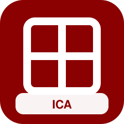

| Campo | Valor |
| --- | --- |
| Código corto | **ICA** |
| Estado | actual |
| Tipo | nacional |
| Competencia | dominante |
| Color | `#8B0000` / `#FFFFFF` |
| Sede | Hannover |
| Lands | Berlín, Brandeburgo, Mecklemburgo-Pomerania Occidental, Schleswig-Holstein, Hamburgo, Baja Sajonia, Bremen, Renania del Norte-Westfalia, Hesse, Renania-Palatinado, Sarre, Baden-Wurtemberg, Baviera, Turingia, Sajonia, Sajonia-Anhalt |
| Servicios | `ld`, `ir`, `px` |
| Eslogan | ** |
| Logo | `assets/logos/icx.svg` |
| Flota | TGV Duplex (×21); Pendolino New CH (×37); ETR 500 Frecce (×43); Talgo IV/V (×54); Vectron BR 193 + coches (×70); KISS 200 (×31); VIRM (×37); Thalys TMST Izy (×48); Dosto 5ª gen IC Twindexx (5 coches) (×56); KISS 200 (6 coches) (×17); CAF Civity (3 coches) (×28); ICE 4 K4s (livrea azul) (×34); ICE 1 (livrea nocturna) (×45); TGV EuroDuplex (livrea azul) (×56); ETR 500 Frecce (livrea nocturna) (×17); Talgo IV/V (livrea nocturna) (×28); KISS 200 (livrea rojo) (×44); Pendolino New CH (Aeropuerto) (×55); M7 EMU (5 coches) (×11); VIRM (6 coches) (×22); Coradia Continental BR 1440.3 (3 coches) (×33); Z TER Z 21500 (5 coches) (×44) |

### Larga Distancia Libre (`flx`)

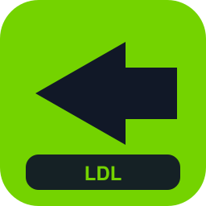

| Campo | Valor |
| --- | --- |
| Código corto | **LDL** |
| Estado | actual |
| Tipo | nacional |
| Competencia | competitiva |
| Color | `#74D300` / `#111827` |
| Sede | Berlín |
| Lands | Berlín, Hamburgo, Renania del Norte-Westfalia, Baviera, Baden-Wurtemberg, Sajonia |
| Servicios | `ld`, `px` |
| Eslogan | ** |
| Logo | `assets/logos/flx.svg` |
| Flota | Eurostar e300 (×22); Alvia S-120/121 (×33); Viaggio Twin (×44); Loc BR 101 + coches (×55); Dosto 5ª gen IC Twindexx (×66); Thalys TMST Izy (×27); Dosto 5ª gen IC Twindexx (5 coches) (×30); KISS 200 (6 coches) (×41); CAF Civity (3 coches) (×52); ICE 4 K4s (livrea azul) (×13); ICE 1 (livrea nocturna) (×24); TGV EuroDuplex (livrea azul) (×35); ETR 500 Frecce (livrea nocturna) (×46); Talgo IV/V (livrea nocturna) (×57); KISS 200 (livrea rojo) (×18); Pendolino New CH (Aeropuerto) (×34); ICE 3 Velaro D (livrea nocturna) (×40); AVE S-103 Velaro E (Aeropuerto) (×51); VIRM (Aeropuerto) (×12); MI79 (Aeropuerto) (×23); Desiro ML 4746 (Aeropuerto) (×34); Coradia Nordic (Aeropuerto) (×45) |

### Puente Europeo Central (`eur`)

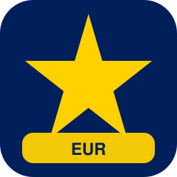

| Campo | Valor |
| --- | --- |
| Código corto | **PEC** |
| Estado | actual |
| Tipo | internacional |
| Competencia | nicho |
| Color | `#003399` / `#FFFFFF` |
| Sede | Colonia |
| Lands | Renania del Norte-Westfalia, Renania-Palatinado, Baden-Wurtemberg, Baviera, Sarre |
| Servicios | `av`, `ld` |
| Eslogan | ** |
| Logo | `assets/logos/eur.svg` |
| Flota | AVE S-102 (×23); ICE TD (×34); ETR 600 Pendolino (×45); EW IV (×56); Vectron E 193 + coches (×67); Regio 2N Omneo Premium (×28); ICE 4 K4s (livrea nocturna) (×36); ICE 1 (livrea azul) (×47); TGV Réseau (livrea nocturna) (×58); Stadler Giruno (livrea azul) (×19); AVE S-112 (livrea nocturna) (×30); ETR1000 Frecciarossa (livrea azul) (×36); ETR1000 Frecciarossa (Aeropuerto) (×47); Twindexx Swiss Express (3 coches) (×58); KISS 200 Austria (5 coches) (×19); CAF Civity (6 coches) (×30) |

### Nocturno Alemán (`noc`)

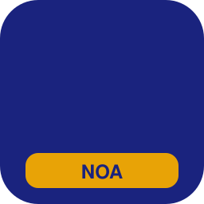

| Campo | Valor |
| --- | --- |
| Código corto | **NOA** |
| Estado | actual |
| Tipo | especializado |
| Competencia | nicho |
| Color | `#1A237E` / `#F2A900` |
| Sede | Múnich |
| Lands | Berlín, Brandeburgo, Mecklemburgo-Pomerania Occidental, Schleswig-Holstein, Hamburgo, Baja Sajonia, Bremen, Renania del Norte-Westfalia, Hesse, Renania-Palatinado, Sarre, Baden-Wurtemberg, Baviera, Turingia, Sajonia, Sajonia-Anhalt |
| Servicios | `n` |
| Eslogan | ** |
| Logo | `assets/logos/noc.svg` |
| Flota | Talgo IV/V (livrea nocturna) (×16); Talgo IV/V (×35); Talgo VI (livrea nocturna) (×38); Talgo VI (×57); Railjet Viaggio Comfort (livrea nocturna) (×60); Railjet Viaggio Comfort (×29); Nocturno Viaggio (×40); Railjet Viaggio Comfort (Aeropuerto) (×43); Vectron BR 193 + coches (×62); Nocturno Viaggio (livrea nocturna) (×15); Loc BR 101 + coches (×34); UIC-Z1 (livrea nocturna) (×37) |

### AeroEnlace Fráncfort (`aef`)

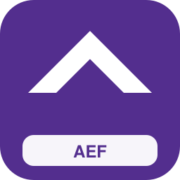

| Campo | Valor |
| --- | --- |
| Código corto | **AEF** |
| Estado | actual |
| Tipo | especializado |
| Competencia | nicho |
| Color | `#532E8E` / `#FFFFFF` |
| Sede | Fráncfort Aeropuerto |
| Lands | Hesse, Renania-Palatinado |
| Servicios | `ae`, `px` |
| Eslogan | ** |
| Logo | `assets/logos/aef.svg` |
| Flota | Thalys TMST Izy (Aeropuerto) (×22); Vectron E 193 + coches (Aeropuerto) (×33); VIRM (Aeropuerto) (×44); MI79 (Aeropuerto) (×55); Desiro ML 4746 (Aeropuerto) (×16); Coradia Nordic (Aeropuerto) (×27); AVE S-103 Velaro E (livrea azul) (×33); ICE 4 K1n (×52); Alvia S-730 (×63); MS70/AM70 Airport (6 coches) (×16); BR 490 S-Bahn HH (livrea rojo) (×27) |

### AeroEnlace Múnich (`aem`)

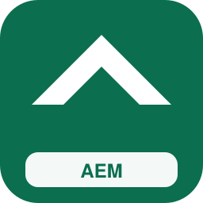

| Campo | Valor |
| --- | --- |
| Código corto | **AEM** |
| Estado | actual |
| Tipo | especializado |
| Competencia | nicho |
| Color | `#0B6E4F` / `#FFFFFF` |
| Sede | Múnich Aeropuerto |
| Lands | Baviera |
| Servicios | `ae`, `s` |
| Eslogan | ** |
| Logo | `assets/logos/aem.svg` |
| Flota | BR 423 S-Bahn (×26); BR 474 S-Bahn HH (×37); Aventra Class 710 (×48); MS70/AM70 Airport (livrea rojo) (×56); ICE 4 K3s (Aeropuerto) (×12); ETR 600 Pendolino (Aeropuerto) (×23); KISS 200 (Aeropuerto) (×39); MI2N Altéo (Aeropuerto) (×50); FLIRT 4 (Aeropuerto) (×61); Coradia Continental BR 440 (Aeropuerto) (×22); Dosto 4ª gen (3 coches) (×28); KISS 200 (5 coches) (×39) |

### AeroEnlace Brandeburgo (`aeb`)

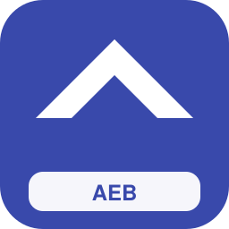

| Campo | Valor |
| --- | --- |
| Código corto | **AEB** |
| Estado | actual |
| Tipo | especializado |
| Competencia | nicho |
| Color | `#3949AB` / `#FFFFFF` |
| Sede | Berlín Brandeburgo |
| Lands | Berlín, Brandeburgo |
| Servicios | `ae`, `s`, `re` |
| Eslogan | ** |
| Logo | `assets/logos/aeb.svg` |
| Flota | BR 430 S-Bahn (×27); BR 490.3 S-Bahn HH (×38); Regio 2N Omneo Premium (×49); FLIRT ETR 155/170 (×60); MD S-599 (×21); Z TER Z 21500 (×32); MS70/AM70 Airport (3 coches) (×40); MS70/AM70 Airport (livrea azul) (×51); ICE 3 Velaro D (Aeropuerto) (×57); ETR1000 Frecciarossa (Aeropuerto) (×18); KISS 160 (Aeropuerto) (×39); MI2N Eole (Aeropuerto) (×45) |

### Regio Baviera (`rby`)

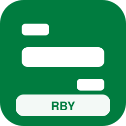

| Campo | Valor |
| --- | --- |
| Código corto | **RBY** |
| Estado | actual |
| Tipo | regional |
| Competencia | dominante |
| Color | `#007C3F` / `#FFFFFF` |
| Sede | Múnich |
| Lands | Baviera |
| Servicios | `re`, `rb`, `rl`, `s` |
| Eslogan | ** |
| Logo | `assets/logos/rby.svg` |
| Flota | X TER X 72500 (×33); Series 2200 LU (×44); GTW Diésel AT (×55); Talent BR 644 (×66); Cercanías Civia (×27); Z2N (×33); Francilien Z 50000 (×44); BR 472 S-Bahn HH (×55); BR 490.3 S-Bahn HH (×66); Dosto 5ª gen IC Twindexx (5 coches) (×19); Twindexx Swiss Express (6 coches) (×30); KISS 200 Austria (3 coches) (×41); KISS 160 Luxemburgo (5 coches) (×57); Regio 2N Omneo Premium (6 coches) (×13) |

### Regio Renania-Westfalia (`rnw`)

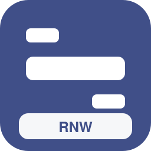

| Campo | Valor |
| --- | --- |
| Código corto | **RNW** |
| Estado | actual |
| Tipo | regional |
| Competencia | dominante |
| Color | `#404F88` / `#FFFFFF` |
| Sede | Düsseldorf |
| Lands | Renania del Norte-Westfalia |
| Servicios | `re`, `rb`, `rl`, `s`, `ir` |
| Eslogan | ** |
| Logo | `assets/logos/rnw.svg` |
| Flota | ETR 103 POP (×34); GTW Diésel NL (×45); Talent 4024 (×56); LINT 27 BR 640 (×67); Rh 4020 (×28); MI79 (×34); BR 424 S-Bahn (×45); BR 485 S-Bahn BE (×56); ICN (×67); Loc BR 101 + coches (×28); M7 EMU (6 coches) (×41); Twindexx Swiss Express (3 coches) (×47); KISS 200 (5 coches) (×63); KISS 160 (6 coches) (×19) |

### Regio Hesse (`rhe`)

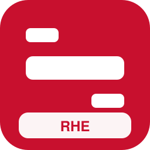

| Campo | Valor |
| --- | --- |
| Código corto | **RHE** |
| Estado | actual |
| Tipo | regional |
| Competencia | dominante |
| Color | `#C8102E` / `#FFFFFF` |
| Sede | Fráncfort |
| Lands | Hesse, Renania-Palatinado |
| Servicios | `re`, `rb`, `s`, `rl` |
| Eslogan | ** |
| Logo | `assets/logos/rhe.svg` |
| Flota | FLIRT WINK (×35); Desiro Classic BR 642 (×46); LINT 41 BR 648 (×57); Rh 5147 (×68); MI2N Eole (×24); BR 423 S-Bahn (×35); BR 481 S-Bahn BE (×46); M7 EMU (3 coches) (×54); Dosto 4ª gen (5 coches) (×65); Twindexx Vario BR 445 (6 coches) (×26); KISS 160 (3 coches) (×37); VIRM (5 coches) (×48); Regio 2N Regional (6 coches) (×59); FLIRT 3 (2 puertas) (3 coches) (×25) |

### Regio Baden-Wurtemberg (`rbw`)

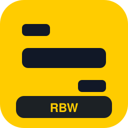

| Campo | Valor |
| --- | --- |
| Código corto | **RBW** |
| Estado | actual |
| Tipo | regional |
| Competencia | dominante |
| Color | `#FFCC00` / `#111827` |
| Sede | Stuttgart |
| Lands | Baden-Wurtemberg |
| Servicios | `re`, `rb`, `rl`, `s`, `tt` |
| Eslogan | ** |
| Logo | `assets/logos/rbw.svg` |
| Flota | GTW RABe 520 (×36); Regio-Shuttle BR 650 (×47); AGC X 76500 (×58); Z 24500 2N NG (×64); DPZ/HVZ (×25); BR 474 S-Bahn HH (×36); S-tog SA/SE (×47); Flexity M5000 (×58); Dosto 4ª gen (3 coches) (×16); Twindexx Vario BR 445 (5 coches) (×27); KISS 200 Austria (6 coches) (×33); VIRM (3 coches) (×49); Regio 2N Regional (5 coches) (×60); FLIRT 4 (6 coches) (×26) |

### Regio Sajonia (`rsn`)

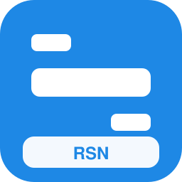

| Campo | Valor |
| --- | --- |
| Código corto | **RSN** |
| Estado | actual |
| Tipo | regional |
| Competencia | dominante |
| Color | `#1E88E5` / `#FFFFFF` |
| Sede | Leipzig |
| Lands | Sajonia, Sajonia-Anhalt, Turingia |
| Servicios | `re`, `rb`, `rl`, `s` |
| Eslogan | ** |
| Logo | `assets/logos/rsn.svg` |
| Flota | Talent BR 643 (×37); Coradia A TER BR 641 (×48); BR 426 (×59); MI84 (×65); BR 430 S-Bahn (×26); BR 490 S-Bahn HH (×37); Dosto 5ª gen IC Twindexx (3 coches) (×40); Twindexx Swiss Express (5 coches) (×51); KISS 200 (6 coches) (×17); KISS 160 Luxemburgo (3 coches) (×28); Regio 2N Omneo Premium (5 coches) (×34); Regio 2N Gran Capacidad (6 coches) (×50); FLIRT 3 (1 puerta) (3 coches) (×61); FLIRT 3 BR 1428 (5 coches) (×22) |

### Regio Brandeburgo (`rbb`)

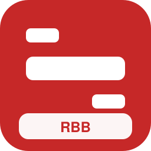

| Campo | Valor |
| --- | --- |
| Código corto | **RBB** |
| Estado | actual |
| Tipo | regional |
| Competencia | dominante |
| Color | `#C62828` / `#FFFFFF` |
| Sede | Potsdam |
| Lands | Brandeburgo, Berlín, Mecklemburgo-Pomerania Occidental |
| Servicios | `re`, `rb`, `rl`, `s` |
| Eslogan | ** |
| Logo | `assets/logos/rbb.svg` |
| Flota | LINT 41 BR 623 (×38); Rh 5047 (×49); MI09 (×55); BR 422 S-Bahn (×66); BR 483/484 S-Bahn BE (×27); M7 EMU (5 coches) (×35); Dosto 4ª gen (6 coches) (×46); KISS 200 (3 coches) (×57); KISS 160 (5 coches) (×18); VIRM (6 coches) (×29); Regio 2N Gran Capacidad (3 coches) (×40); FLIRT 3 (2 puertas) (5 coches) (×56); FLIRT 3 XL BR 3427 (6 coches) (×62); FLIRT RABe 524 (3 coches) (×23) |

### Regio Baja Sajonia (`rni`)

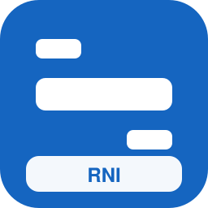

| Campo | Valor |
| --- | --- |
| Código corto | **RNI** |
| Estado | actual |
| Tipo | regional |
| Competencia | dominante |
| Color | `#1565C0` / `#FFFFFF` |
| Sede | Hannover |
| Lands | Baja Sajonia, Bremen, Hamburgo |
| Servicios | `re`, `rb`, `rl`, `s` |
| Eslogan | ** |
| Logo | `assets/logos/rni.svg` |
| Flota | A TER X 73500 (×39); MI2N Altéo (×45); MS70/AM70 Airport (×56); BR 480 S-Bahn BE (×67); Aventra Class 710 (×28); Dosto 4ª gen (3 coches) (×36); Twindexx Vario BR 445 (5 coches) (×47); KISS 200 Austria (6 coches) (×53); VIRM (3 coches) (×19); Regio 2N Regional (5 coches) (×30); FLIRT 4 (6 coches) (×46); FLIRT 3 XL BR 3427 (3 coches) (×52); FLIRT BR 429 (5 coches) (×63); FLIRT RABe 522/523 (6 coches) (×24) |

### Regio Schleswig-Holstein (`rsh`)

| Campo | Valor |
| --- | --- |
| Código corto | **RSH** |
| Estado | actual |
| Tipo | regional |
| Competencia | dominante |
| Color | `#0277BD` / `#FFFFFF` |
| Sede | Kiel |
| Lands | Schleswig-Holstein, Hamburgo |
| Servicios | `re`, `rb`, `rl` |
| Eslogan | ** |
| Logo | `assets/logos/rsh.svg` |
| Flota | M7 EMU (3 coches) (×27); Dosto 4ª gen (5 coches) (×38); Twindexx Vario BR 445 (6 coches) (×49); KISS 160 (3 coches) (×60); VIRM (5 coches) (×21); Regio 2N Regional (6 coches) (×37); FLIRT 3 (2 puertas) (3 coches) (×48); FLIRT 3 XL BR 3427 (5 coches) (×54); FLIRT BR 429 (6 coches) (×20); FLIRT ETR 155/170 (3 coches) (×31); Desiro ML 4746 (5 coches) (×42); Desiro Doble Piso (6 coches) (×48); LINT 54/81 BR 620/622 (3 coches) (×64); Coradia Continental BR 1440.0 (5 coches) (×25) |

### Regio Báltico (`rmv`)

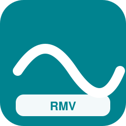

| Campo | Valor |
| --- | --- |
| Código corto | **RMV** |
| Estado | actual |
| Tipo | regional |
| Competencia | dominante |
| Color | `#00838F` / `#FFFFFF` |
| Sede | Rostock |
| Lands | Mecklemburgo-Pomerania Occidental, Brandeburgo, Schleswig-Holstein |
| Servicios | `re`, `rb`, `rl`, `tur` |
| Eslogan | ** |
| Logo | `assets/logos/rmv.svg` |
| Flota | M7 EMU (3 coches) (×28); Dosto 4ª gen (5 coches) (×39); Twindexx Vario BR 445 (6 coches) (×50); KISS 160 (3 coches) (×11); VIRM (5 coches) (×22); Regio 2N Regional (6 coches) (×38); FLIRT 3 (2 puertas) (3 coches) (×49); FLIRT 3 XL BR 3427 (5 coches) (×55); FLIRT BR 429 (6 coches) (×21); FLIRT ETR 155/170 (3 coches) (×32); Desiro ML 4746 (5 coches) (×43); Desiro Doble Piso (6 coches) (×49); LINT 54/81 BR 620/622 (3 coches) (×65); Coradia Continental BR 1440.0 (5 coches) (×26) |

### Regio Turingia (`rth`)

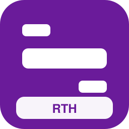

| Campo | Valor |
| --- | --- |
| Código corto | **RTH** |
| Estado | actual |
| Tipo | regional |
| Competencia | dominante |
| Color | `#6A1B9A` / `#FFFFFF` |
| Sede | Erfurt |
| Lands | Turingia, Sajonia, Sajonia-Anhalt, Baviera |
| Servicios | `re`, `rb`, `rl` |
| Eslogan | ** |
| Logo | `assets/logos/rth.svg` |
| Flota | Twindexx Swiss Express (5 coches) (×29); KISS 200 (6 coches) (×40); KISS 160 Luxemburgo (3 coches) (×51); Regio 2N Omneo Premium (5 coches) (×12); Regio 2N Gran Capacidad (6 coches) (×23); FLIRT 3 (1 puerta) (3 coches) (×39); FLIRT 3 BR 1428 (5 coches) (×50); FLIRT RABe 524 (6 coches) (×61); GTW RABe 526.2 (3 coches) (×22); Desiro ML 4744 (5 coches) (×33); Talent 2 BR 442 (6 coches) (×44); Coradia Continental BR 440 (3 coches) (×55); Coradia Continental BR 1440.1 (5 coches) (×16); Coradia Continental BR 1440.3 (6 coches) (×22) |

### Regio Palatinado-Sarre (`rrp`)

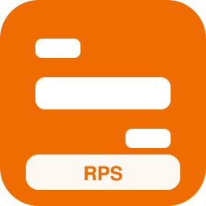

| Campo | Valor |
| --- | --- |
| Código corto | **RPS** |
| Estado | actual |
| Tipo | regional |
| Competencia | dominante |
| Color | `#EF6C00` / `#FFFFFF` |
| Sede | Maguncia |
| Lands | Renania-Palatinado, Sarre, Baden-Wurtemberg |
| Servicios | `re`, `rb`, `rl`, `tt` |
| Eslogan | ** |
| Logo | `assets/logos/rrp.svg` |
| Flota | Twindexx Swiss Express (3 coches) (×30); KISS 200 (5 coches) (×41); KISS 160 (6 coches) (×52); Regio 2N Omneo Premium (3 coches) (×13); Regio 2N Gran Capacidad (5 coches) (×24); FLIRT 3 (2 puertas) (6 coches) (×40); FLIRT 3 BR 1428 (3 coches) (×51); FLIRT RABe 524 (5 coches) (×62); FLIRT ETR 155/170 (6 coches) (×23); Desiro ML 4744 (3 coches) (×34); Talent 2 BR 442 (5 coches) (×45); LINT 54/81 BR 620/622 (6 coches) (×56); Coradia Continental BR 1440.1 (3 coches) (×17); Coradia Continental BR 1440.3 (5 coches) (×23) |

### Cercanías Berlín (`sbe`)

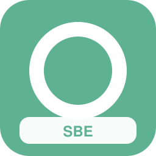

| Campo | Valor |
| --- | --- |
| Código corto | **SBE** |
| Estado | actual |
| Tipo | metropolitano |
| Competencia | dominante |
| Color | `#5EB193` / `#FFFFFF` |
| Sede | Berlín |
| Lands | Berlín, Brandeburgo |
| Servicios | `s`, `or`, `mc` |
| Eslogan | ** |
| Logo | `assets/logos/sbe.svg` |
| Flota | DPZ/HVZ (6 coches) (×31); FLIRT 3 XL BR 3427 (3 coches) (×42); Desiro Doble Piso (5 coches) (×53); Mireo BR 463 (6 coches) (×14); Coradia Continental BR 1440.2 (3 coches) (×25); Cercanías Civia (5 coches) (×36); Régiolis Léman Express (6 coches) (×47); MS70/AM70 Airport (3 coches) (×58); BR 422 S-Bahn (5 coches) (×19); BR 425 Regional/S (6 coches) (×30); BR 472 S-Bahn HH (3 coches) (×41); BR 480 S-Bahn BE (5 coches) (×52); BR 483/484 S-Bahn BE (6 coches) (×23); BR 490.3 S-Bahn HH (3 coches) (×29); Aventra Class 710 (5 coches) (×45); KISS 160 (livrea azul) (×46) |

### Cercanías Hamburgo (`shh`)

| Campo | Valor |
| --- | --- |
| Código corto | **SHH** |
| Estado | actual |
| Tipo | metropolitano |
| Competencia | dominante |
| Color | `#8AB96E` / `#FFFFFF` |
| Sede | Hamburgo |
| Lands | Hamburgo, Schleswig-Holstein, Baja Sajonia |
| Servicios | `s`, `or`, `mc` |
| Eslogan | ** |
| Logo | `assets/logos/shh.svg` |
| Flota | FLIRT 3 (2 puertas) (5 coches) (×32); Desiro ML 4746 (6 coches) (×43); Mireo BR 463 (3 coches) (×54); Coradia Continental BR 1440.1 (5 coches) (×15); Coradia Nordic (6 coches) (×26); Régiolis Léman Express (3 coches) (×37); Series 2200 LU (5 coches) (×48); BR 423 S-Bahn (6 coches) (×64); BR 425 Regional/S (3 coches) (×20); BR 430 S-Bahn (5 coches) (×36); BR 474 S-Bahn HH (6 coches) (×42); BR 483/484 S-Bahn BE (3 coches) (×63); BR 490 S-Bahn HH (5 coches) (×14); S-tog SA/SE (6 coches) (×30); KISS 200 (livrea rojo) (×36); VIRM (livrea rojo) (×47) |

### Cercanías Múnich (`smu`)

| Campo | Valor |
| --- | --- |
| Código corto | **SMU** |
| Estado | actual |
| Tipo | metropolitano |
| Competencia | dominante |
| Color | `#0077C8` / `#FFFFFF` |
| Sede | Múnich |
| Lands | Baviera |
| Servicios | `s`, `or`, `mc` |
| Eslogan | ** |
| Logo | `assets/logos/smu.svg` |
| Flota | Desiro ML 4746 (3 coches) (×33); Talent 2 BR 442 (5 coches) (×44); Coradia Continental BR 440 (6 coches) (×55); Coradia Nordic (3 coches) (×16); Régiolis Suburban (5 coches) (×27); Rh 4020 (6 coches) (×38); BR 423 S-Bahn (3 coches) (×54); BR 424 S-Bahn (5 coches) (×60); BR 426 (6 coches) (×21); BR 474 S-Bahn HH (3 coches) (×32); BR 481 S-Bahn BE (5 coches) (×48); BR 485 S-Bahn BE (6 coches) (×54); S-tog SA/SE (3 coches) (×20); Dosto 4ª gen (livrea rojo) (×26); KISS 160 Luxemburgo (livrea azul) (×37); Z 24500 2N NG (livrea metropolitana) (×48) |

### Cercanías Rin-Ruhr (`srr`)

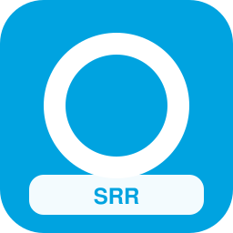

| Campo | Valor |
| --- | --- |
| Código corto | **SRR** |
| Estado | actual |
| Tipo | metropolitano |
| Competencia | dominante |
| Color | `#00A3E0` / `#FFFFFF` |
| Sede | Essen |
| Lands | Renania del Norte-Westfalia |
| Servicios | `s`, `or`, `mc`, `re` |
| Eslogan | ** |
| Logo | `assets/logos/srr.svg` |
| Flota | MI2N Eole (3 coches) (×34); MI79 (5 coches) (×45); Francilien Z 50000 (6 coches) (×61); FLIRT 3 (2 puertas) (3 coches) (×22); Desiro ML 4746 (5 coches) (×33); Talent 2 BR 442 (6 coches) (×44); Coradia Continental BR 1440.1 (3 coches) (×55); Coradia Nordic (5 coches) (×16); Régiolis Suburban (6 coches) (×27); Series 2200 LU (3 coches) (×38); BR 423 S-Bahn (5 coches) (×49); BR 424 S-Bahn (6 coches) (×55); BR 430 S-Bahn (3 coches) (×21); BR 474 S-Bahn HH (5 coches) (×27); BR 481 S-Bahn BE (6 coches) (×43); BR 490 S-Bahn HH (3 coches) (×49) |

### Cercanías Fráncfort-Rin-Meno (`sfr`)

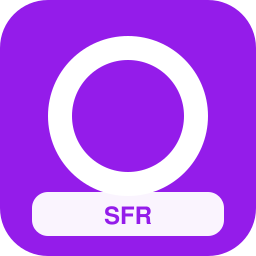

| Campo | Valor |
| --- | --- |
| Código corto | **SFR** |
| Estado | actual |
| Tipo | metropolitano |
| Competencia | dominante |
| Color | `#941CEA` / `#FFFFFF` |
| Sede | Fráncfort |
| Lands | Hesse, Renania-Palatinado |
| Servicios | `s`, `or`, `mc`, `ae` |
| Eslogan | ** |
| Logo | `assets/logos/sfr.svg` |
| Flota | Mireo BR 463 (5 coches) (×35); Coradia Continental BR 1440.1 (6 coches) (×46); Cercanías Civia (3 coches) (×57); Régiolis Léman Express (5 coches) (×18); Series 2200 LU (6 coches) (×29); BR 422 S-Bahn (3 coches) (×40); BR 425 Regional/S (5 coches) (×51); BR 430 S-Bahn (6 coches) (×17); BR 480 S-Bahn BE (3 coches) (×23); BR 483/484 S-Bahn BE (5 coches) (×44); BR 490 S-Bahn HH (6 coches) (×50); Aventra Class 710 (3 coches) (×66); KISS 160 (livrea rojo) (×17); Regio 2N Gran Capacidad (livrea rojo) (×28); MI2N Altéo (livrea metropolitana) (×44); MI79 (livrea rojo) (×50) |

### Cercanías Stuttgart (`sst`)

| Campo | Valor |
| --- | --- |
| Código corto | **SST** |
| Estado | actual |
| Tipo | metropolitano |
| Competencia | dominante |
| Color | `#F5A700` / `#111827` |
| Sede | Stuttgart |
| Lands | Baden-Wurtemberg |
| Servicios | `s`, `or`, `mc` |
| Eslogan | ** |
| Logo | `assets/logos/sst.svg` |
| Flota | Coradia Continental BR 1440.1 (3 coches) (×36); Coradia Nordic (5 coches) (×47); Régiolis Suburban (6 coches) (×58); Series 2200 LU (3 coches) (×19); BR 423 S-Bahn (5 coches) (×35); BR 424 S-Bahn (6 coches) (×41); BR 430 S-Bahn (3 coches) (×57); BR 474 S-Bahn HH (5 coches) (×13); BR 481 S-Bahn BE (6 coches) (×29); BR 490 S-Bahn HH (3 coches) (×35); S-tog SA/SE (5 coches) (×51); Twindexx Vario BR 445 (livrea rojo) (×57); KISS 160 Luxemburgo (livrea metropolitana) (×18); MI2N Altéo (livrea rojo) (×34); MI09 (livrea azul) (×40); MI84 (livrea metropolitana) (×51) |

### Cercanías Hannover (`sha`)

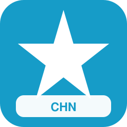

| Campo | Valor |
| --- | --- |
| Código corto | **SHA** |
| Estado | actual |
| Tipo | metropolitano |
| Competencia | dominante |
| Color | `#D5002B` / `#FFFFFF` |
| Sede | Hannover |
| Lands | Baja Sajonia |
| Servicios | `s`, `re`, `mc` |
| Eslogan | ** |
| Logo | `assets/logos/sha.svg` |
| Flota | DPZ/HVZ (3 coches) (×37); FLIRT 3 (2 puertas) (5 coches) (×53); Desiro ML 4746 (6 coches) (×64); Mireo BR 463 (3 coches) (×25); Coradia Continental BR 1440.1 (5 coches) (×36); Coradia Nordic (6 coches) (×47); Régiolis Léman Express (3 coches) (×58); Series 2200 LU (5 coches) (×19); BR 423 S-Bahn (6 coches) (×25); BR 425 Regional/S (3 coches) (×41); BR 430 S-Bahn (5 coches) (×47); BR 474 S-Bahn HH (6 coches) (×58); BR 483/484 S-Bahn BE (3 coches) (×24); BR 490 S-Bahn HH (5 coches) (×30); S-tog SA/SE (6 coches) (×41); KISS 200 (livrea rojo) (×57) |

### Cercanías Leipzig-Halle (`sle`)

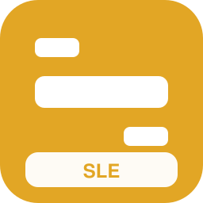

| Campo | Valor |
| --- | --- |
| Código corto | **SLE** |
| Estado | actual |
| Tipo | metropolitano |
| Competencia | dominante |
| Color | `#E2A625` / `#FFFFFF` |
| Sede | Leipzig |
| Lands | Sajonia, Sajonia-Anhalt |
| Servicios | `s`, `mc`, `re` |
| Eslogan | ** |
| Logo | `assets/logos/sle.svg` |
| Flota | FLIRT 4 (6 coches) (×43); Desiro ML 4746 (3 coches) (×54); Talent 2 BR 442 (5 coches) (×65); Coradia Continental BR 440 (6 coches) (×26); Coradia Nordic (3 coches) (×37); Régiolis Suburban (5 coches) (×48); Rh 4020 (6 coches) (×54); BR 423 S-Bahn (3 coches) (×15); BR 424 S-Bahn (5 coches) (×26); BR 426 (6 coches) (×37); BR 474 S-Bahn HH (3 coches) (×48); BR 481 S-Bahn BE (5 coches) (×59); BR 485 S-Bahn BE (6 coches) (×20); S-tog SA/SE (3 coches) (×31); Dosto 4ª gen (livrea rojo) (×47); KISS 160 Luxemburgo (livrea azul) (×58) |

### Metro Berlín (`ube`)

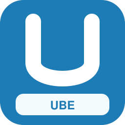

| Campo | Valor |
| --- | --- |
| Código corto | **UBE** |
| Estado | actual |
| Tipo | urbano |
| Competencia | dominante |
| Color | `#1D7CB5` / `#FFFFFF` |
| Sede | Berlín |
| Lands | Berlín |
| Servicios | `u` |
| Eslogan | ** |
| Logo | `assets/logos/ube.svg` |
| Flota | Metro MP89 (livrea metropolitana) (×39); Metro MP89 (×58); MI09 (livrea azul) (×11); MI09 (Aeropuerto) (×22); MI09 (3 coches) (×33); Metro MIVB Mx (livrea metropolitana) (×44); Metro MIVB Mx (×63); MI09 (livrea rojo) (×16); Metro MF01 (livrea metropolitana) (×27); Metro MF01 (×46) |

### Metro Hamburgo (`uhh`)

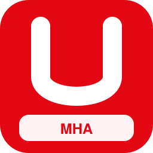

| Campo | Valor |
| --- | --- |
| Código corto | **UHH** |
| Estado | actual |
| Tipo | urbano |
| Competencia | dominante |
| Color | `#3BDEC0` / `#FFFFFF` |
| Sede | Hamburgo |
| Lands | Hamburgo |
| Servicios | `u` |
| Eslogan | ** |
| Logo | `assets/logos/uhh.svg` |
| Flota | Metro MX3000 (×48); MI09 (6 coches) (×51); Metro MP05 (livrea metropolitana) (×12); Metro MP05 (×31); MI09 (livrea metropolitana) (×34); MI09 (×53); MI09 (5 coches) (×56); Metro MP89 (livrea metropolitana) (×17); Metro MP89 (×36); MI09 (livrea azul) (×39) |

### Metro Múnich (`umu`)

| Campo | Valor |
| --- | --- |
| Código corto | **UMU** |
| Estado | actual |
| Tipo | urbano |
| Competencia | dominante |
| Color | `#005AA0` / `#FFFFFF` |
| Sede | Múnich |
| Lands | Baviera |
| Servicios | `u` |
| Eslogan | ** |
| Logo | `assets/logos/umu.svg` |
| Flota | MI09 (3 coches) (×41); Metro MIVB Mx (livrea metropolitana) (×52); Metro MIVB Mx (×21); MI09 (livrea rojo) (×24); Metro MF01 (livrea metropolitana) (×35); Metro MF01 (×54); Metro MX3000 (livrea metropolitana) (×57); Metro MX3000 (×26); MI09 (6 coches) (×29); Metro MP05 (livrea metropolitana) (×40) |

### Metro Núremberg (`unu`)

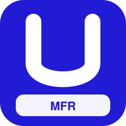

| Campo | Valor |
| --- | --- |
| Código corto | **UNU** |
| Estado | actual |
| Tipo | urbano |
| Competencia | dominante |
| Color | `#4C14B6` / `#FFFFFF` |
| Sede | Núremberg |
| Lands | Baviera |
| Servicios | `u` |
| Eslogan | ** |
| Logo | `assets/logos/unu.svg` |
| Flota | MI09 (livrea metropolitana) (×42); MI09 (×61); MI09 (5 coches) (×14); Metro MP89 (livrea metropolitana) (×25); Metro MP89 (×44); MI09 (livrea azul) (×47); MI09 (Aeropuerto) (×58); MI09 (3 coches) (×19); Metro MIVB Mx (livrea metropolitana) (×30); Metro MIVB Mx (×49) |

### Tranvías Berlín (`tbe`)

| Campo | Valor |
| --- | --- |
| Código corto | **TBE** |
| Estado | actual |
| Tipo | urbano |
| Competencia | dominante |
| Color | `#EE3124` / `#FFFFFF` |
| Sede | Berlín |
| Lands | Berlín |
| Servicios | `t` |
| Eslogan | ** |
| Logo | `assets/logos/tbe.svg` |
| Flota | Flexity (livrea metropolitana) (×43); PCC 7900 (livrea metropolitana) (×54); Flexity Classic NGT6 (×23); TEC LRV 6100 (×34); Stadler Tram-Train 398 (3 coches) (×37); Flexity Classic NGT6 (livrea metropolitana) (×48); TEC LRV 6100 (livrea metropolitana) (×59); Flexity Swift A32 (×28); AVG ET 2010 (×39); Stadler Tram-Train 398 (5 coches) (×42) |

### Tranvías Múnich (`tmu`)

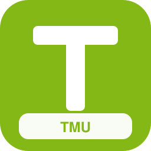

| Campo | Valor |
| --- | --- |
| Código corto | **TMU** |
| Estado | actual |
| Tipo | urbano |
| Competencia | dominante |
| Color | `#84B817` / `#FFFFFF` |
| Sede | Múnich |
| Lands | Baviera |
| Servicios | `t` |
| Eslogan | ** |
| Logo | `assets/logos/tmu.svg` |
| Flota | Tram Hermelijn (livrea metropolitana) (×44); Citadis 502 (×63); PCC 7700 (×24); AVG ET 2010 (5 coches) (×27); Citadis 502 (livrea metropolitana) (×38); PCC 7700 (livrea metropolitana) (×49); Flexity (×68); PCC 7900 (×29); AVG ET 2010 (6 coches) (×32); Flexity (livrea metropolitana) (×43) |

### Tranvías Colonia (`tko`)

| Campo | Valor |
| --- | --- |
| Código corto | **TKO** |
| Estado | actual |
| Tipo | urbano |
| Competencia | dominante |
| Color | `#8C3F20` / `#FFFFFF` |
| Sede | Colonia |
| Lands | Renania del Norte-Westfalia |
| Servicios | `t`, `tt`, `u` |
| Eslogan | ** |
| Logo | `assets/logos/tko.svg` |
| Flota | MI09 (livrea metropolitana) (×45); Citadis 401 (×64); Tram Albatros (×25); Flexity M5000 (×41); Metro MF01 (×47); Citadis 401 (livrea metropolitana) (×50); Tram Albatros (livrea metropolitana) (×11); Talent 4024 (5 coches) (×22); MI09 (6 coches) (×33); Metro MP05 (livrea metropolitana) (×44) |

### Tranvías Düsseldorf (`tdu`)

| Campo | Valor |
| --- | --- |
| Código corto | **TDU** |
| Estado | actual |
| Tipo | urbano |
| Competencia | dominante |
| Color | `#967E9C` / `#FFFFFF` |
| Sede | Düsseldorf |
| Lands | Renania del Norte-Westfalia |
| Servicios | `t`, `tt`, `u` |
| Eslogan | ** |
| Logo | `assets/logos/tdu.svg` |
| Flota | Metro MF01 (livrea metropolitana) (×46); Flexity Swift A32 (×70); AVG ET 2010 (×31); Metro MP89 (×37); Stadler Tram-Train 398 (5 coches) (×45); Flexity Swift A32 (livrea metropolitana) (×56); Flexity M5000 (livrea metropolitana) (×17); MI09 (3 coches) (×23); Metro MIVB Mx (livrea metropolitana) (×34); Citadis 502 (×53) |

### Tranvías Stuttgart (`tst`)

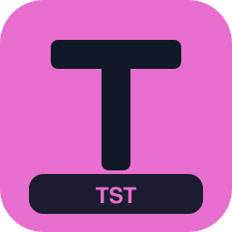

| Campo | Valor |
| --- | --- |
| Código corto | **TST** |
| Estado | actual |
| Tipo | urbano |
| Competencia | dominante |
| Color | `#E86ECF` / `#111827` |
| Sede | Stuttgart |
| Lands | Baden-Wurtemberg |
| Servicios | `t`, `tt`, `u` |
| Eslogan | ** |
| Logo | `assets/logos/tst.svg` |
| Flota | Flexity (×60); PCC 7900 (×66); Metro MX3000 (×27); AVG ET 2010 (6 coches) (×35); Flexity (livrea metropolitana) (×46); PCC 7900 (livrea metropolitana) (×52); Talent 4024 (livrea azul) (×13); MI09 (livrea metropolitana) (×24); Citadis 401 (×43); Tram Albatros (×54) |

### Tranvías Leipzig (`tle`)

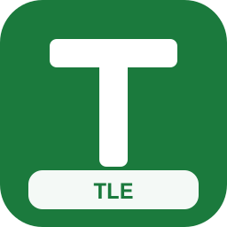

| Campo | Valor |
| --- | --- |
| Código corto | **TLE** |
| Estado | actual |
| Tipo | urbano |
| Competencia | dominante |
| Color | `#1B7A3D` / `#FFFFFF` |
| Sede | Leipzig |
| Lands | Sajonia |
| Servicios | `t` |
| Eslogan | ** |
| Logo | `assets/logos/tle.svg` |
| Flota | AVG ET 2010 (3 coches) (×48); Citadis 402 (livrea metropolitana) (×59); Tram Hermelijn (livrea metropolitana) (×20); Citadis 502 (×39); PCC 7700 (×50); AVG ET 2010 (5 coches) (×53); Citadis 502 (livrea metropolitana) (×14); PCC 7700 (livrea metropolitana) (×25); Flexity (×44); PCC 7900 (×55) |

### Tranvías Dresde (`tdr`)

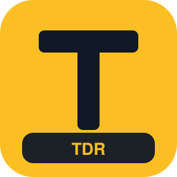

| Campo | Valor |
| --- | --- |
| Código corto | **TDR** |
| Estado | actual |
| Tipo | urbano |
| Competencia | dominante |
| Color | `#E87722` / `#FFFFFF` |
| Sede | Dresde |
| Lands | Sajonia |
| Servicios | `t` |
| Eslogan | ** |
| Logo | `assets/logos/tdr.svg` |
| Flota | Stadler Tram-Train 398 (6 coches) (×49); CAF Urbos A35/A36 (livrea metropolitana) (×60); Citadis 401 (×29); Tram Albatros (×40); Flexity M5000 (×51); Citadis 401 (livrea metropolitana) (×54); Tram Albatros (livrea metropolitana) (×15); Citadis 402 (×34); Tram Hermelijn (×45); AVG ET 2010 (3 coches) (×48) |

### Tranvía-Tren Karlsruhe (`tka`)

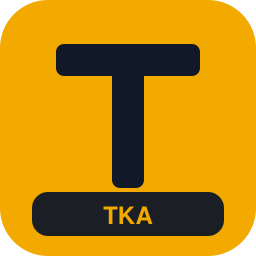

| Campo | Valor |
| --- | --- |
| Código corto | **TKA** |
| Estado | actual |
| Tipo | urbano |
| Competencia | dominante |
| Color | `#F2A900` / `#111827` |
| Sede | Karlsruhe |
| Lands | Baden-Wurtemberg, Renania-Palatinado |
| Servicios | `tt`, `t`, `re` |
| Eslogan | ** |
| Logo | `assets/logos/tka.svg` |
| Flota | Coradia Continental BR 1440.3 (5 coches) (×50); CAF Civity (6 coches) (×11); Régiolis Regional (3 coches) (×22); Régiolis Suburban (5 coches) (×33); AGC B 82500 (6 coches) (×44); Z TER Z 21500 (3 coches) (×55); NPZ Domino (5 coches) (×16); ETR 103 POP (6 coches) (×27); BR 425 Regional/S (3 coches) (×38); Twindexx Vario BR 445 (livrea rojo) (×49) |

### Tranvías Fráncfort (`tfr`)

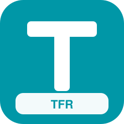

| Campo | Valor |
| --- | --- |
| Código corto | **TFR** |
| Estado | actual |
| Tipo | urbano |
| Competencia | dominante |
| Color | `#0097A7` / `#FFFFFF` |
| Sede | Fráncfort |
| Lands | Hesse |
| Servicios | `t`, `u` |
| Eslogan | ** |
| Logo | `assets/logos/tfr.svg` |
| Flota | MI09 (livrea azul) (×51); MI09 (Aeropuerto) (×12); CAF Urbos A35/A36 (×31); Stadler Tram-Train 398 (×42); Metro MF01 (×53); Citadis 401 (livrea metropolitana) (×56); Tram Albatros (livrea metropolitana) (×17); MI09 (5 coches) (×28); Metro MP89 (livrea metropolitana) (×39); Flexity (×58) |

### Tranvías Hannover (`tha`)

| Campo | Valor |
| --- | --- |
| Código corto | **THA** |
| Estado | actual |
| Tipo | urbano |
| Competencia | dominante |
| Color | `#C45C26` / `#FFFFFF` |
| Sede | Hannover |
| Lands | Baja Sajonia |
| Servicios | `t`, `u` |
| Eslogan | ** |
| Logo | `assets/logos/tha.svg` |
| Flota | Metro MP05 (livrea metropolitana) (×52); Flexity Classic NGT6 (×21); TEC LRV 6100 (×32); Metro MP89 (×43); Stadler Tram-Train 398 (5 coches) (×46); Flexity Swift A32 (livrea metropolitana) (×57); Flexity M5000 (livrea metropolitana) (×18); Metro MX3000 (livrea metropolitana) (×29); Citadis 402 (×48); Tram Hermelijn (×59) |

### Tranvías Bremen (`tbr`)

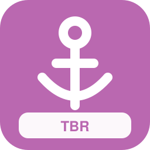

| Campo | Valor |
| --- | --- |
| Código corto | **TBR** |
| Estado | actual |
| Tipo | urbano |
| Competencia | dominante |
| Color | `#E31C3D` / `#FFFFFF` |
| Sede | Bremen |
| Lands | Bremen, Baja Sajonia |
| Servicios | `t` |
| Eslogan | ** |
| Logo | `assets/logos/tbr.svg` |
| Flota | CAF Urbos A35/A36 (×61); Stadler Tram-Train 398 (×22); Stadler Tram-Train 398 (6 coches) (×25); CAF Urbos A35/A36 (livrea metropolitana) (×36); Citadis 401 (×55); Tram Albatros (×66); Flexity M5000 (×27); Citadis 401 (livrea metropolitana) (×30); Tram Albatros (livrea metropolitana) (×41); Citadis 402 (×60) |

### Deutschlandtakt FerroAlemania (`dfa`)

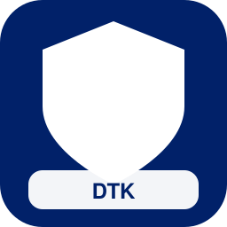

| Campo | Valor |
| --- | --- |
| Código corto | **DTK** |
| Estado | futuro |
| Tipo | nacional |
| Competencia | dominante |
| Color | `#012169` / `#FFFFFF` |
| Sede | Berlín |
| Lands | Berlín, Brandeburgo, Mecklemburgo-Pomerania Occidental, Schleswig-Holstein, Hamburgo, Baja Sajonia, Bremen, Renania del Norte-Westfalia, Hesse, Renania-Palatinado, Sarre, Baden-Wurtemberg, Baviera, Turingia, Sajonia, Sajonia-Anhalt |
| Servicios | `av`, `ld`, `ir`, `re`, `px` |
| Eslogan | *Horario nacional cadenciado* |
| Logo | `assets/logos/dfa.svg` |
| Flota | Régiolis Intercity (3 coches) (×59); Dosto 4ª gen (livrea rojo) (×20); FLIRT 3 XL BR 3427 (livrea verde) (×31); Z TER Z 21500 (livrea rojo) (×42); FLIRT 3 XL BR 3427 (Aeropuerto) (×58); KISS 160 Luxemburgo (3 coches) (×59); Regio 2N Gran Capacidad (5 coches) (×20); FLIRT 3 (1 puerta) (6 coches) (×31); FLIRT RABe 524 (3 coches) (×42); FLIRT ETR 155/170 (5 coches) (×53); Desiro ML 4746 (6 coches) (×14); Talent 2 BR 442 (3 coches) (×25); LINT 54/81 BR 620/622 (5 coches) (×36); Coradia Continental BR 1440.0 (6 coches) (×47); Coradia Nordic (3 coches) (×58); MD S-449 (5 coches) (×19); Régiolis Suburban (6 coches) (×30); AGC Z 27500 (3 coches) (×41); Z2 Z 11500 (5 coches) (×52); NPZ Colibri (6 coches) (×13); Series 2200 LU (3 coches) (×24); AVG ET 2010 (5 coches) (×35) |

### Alta Velocidad Maguncia-Múnich (`hsa`)

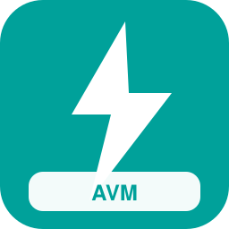

| Campo | Valor |
| --- | --- |
| Código corto | **AVM** |
| Estado | futuro |
| Tipo | nacional |
| Competencia | nicho |
| Color | `#00A19A` / `#FFFFFF` |
| Sede | Stuttgart |
| Lands | Hesse, Baden-Wurtemberg, Baviera |
| Servicios | `av`, `px` |
| Eslogan | ** |
| Logo | `assets/logos/hsa.svg` |
| Flota | FLIRT 3 (2 puertas) (Aeropuerto) (×55); Coradia Continental BR 1440.1 (Aeropuerto) (×16); ICE 3 Velaro D (×40); TGV EuroDuplex (×46); Stadler Giruno (×57); ETR1000 Frecciarossa (×73); ICE 4 K1n (livrea azul) (×26); ICE 3 (livrea nocturna) (×32); TGV Sud-Est (livrea azul) (×43); TGV Duplex (livrea nocturna) (×54); AVE S-103 Velaro E (livrea azul) (×20); AVE S-100 (livrea nocturna) (×26); ICE 4 K1n (Aeropuerto) (×42); ICE T (Aeropuerto) (×48); Dosto 4ª gen (Aeropuerto) (×59); Z2N (Aeropuerto) (×20); Francilien Z 50000 (Aeropuerto) (×31); Talent 2 BR 442 (Aeropuerto) (×42); ICE 4 K3s (×66); TGV Atlantique (×22); Thalys TMST Izy (×38); AVE S-100 (×44) |

### Alta Velocidad Norte (`hsn`)

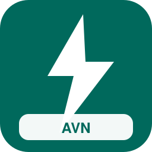

| Campo | Valor |
| --- | --- |
| Código corto | **AVN** |
| Estado | futuro |
| Tipo | nacional |
| Competencia | dominante |
| Color | `#00695C` / `#FFFFFF` |
| Sede | Hamburgo |
| Lands | Hamburgo, Baja Sajonia, Berlín, Renania del Norte-Westfalia |
| Servicios | `av`, `ld` |
| Eslogan | ** |
| Logo | `assets/logos/hsn.svg` |
| Flota | TGV Duplex (livrea azul) (×61); Stadler Giruno (livrea nocturna) (×22); AVE S-100 (livrea azul) (×28); ETR1000 Frecciarossa (livrea nocturna) (×39); Viaggio Twin (3 coches) (×50); Twindexx Swiss Express (5 coches) (×11); KISS 200 Austria (6 coches) (×22); IC4 Litra MG (livrea nocturna) (×33); UIC-Z1 (livrea nocturna) (×44); CAF Civity (livrea azul) (×55); KISS 200 (Aeropuerto) (×16); ICE 1 (×40); Thalys PBKA (×51); AVE S-102 (×57); ICE TD (×68); ETR 600 Pendolino (×29); EW IV (×40); Vectron E 193 + coches (×51); Regio 2N Omneo Premium (×62); ICE 4 K4s (livrea nocturna) (×20); ICE 1 (livrea azul) (×31); TGV Réseau (livrea nocturna) (×42) |

### Metro Rin-Ruhr Unificado (`mrr`)

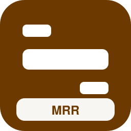

| Campo | Valor |
| --- | --- |
| Código corto | **MRR** |
| Estado | futuro |
| Tipo | metropolitano |
| Competencia | dominante |
| Color | `#6C3A00` / `#FFFFFF` |
| Sede | Dortmund |
| Lands | Renania del Norte-Westfalia |
| Servicios | `s`, `u`, `t`, `tt`, `mc` |
| Eslogan | *Integración metropolitana RR* |
| Logo | `assets/logos/mrr.svg` |
| Flota | KISS 160 Luxemburgo (livrea metropolitana) (×57); MI2N Altéo (livrea rojo) (×18); MI09 (livrea azul) (×34); MI84 (livrea metropolitana) (×40); FLIRT 4 (livrea rojo) (×51); FLIRT 3 XL BR 3427 (livrea azul) (×12); Desiro Doble Piso (livrea metropolitana) (×23); Coradia Continental BR 440 (livrea rojo) (×34); Coradia Continental BR 1440.2 (livrea azul) (×45); Cercanías Civia (livrea metropolitana) (×56); Rh 4020 (livrea rojo) (×17); MS70/AM70 Airport (livrea azul) (×28); BR 422 S-Bahn (livrea metropolitana) (×39); BR 426 (livrea rojo) (×50); BR 472 S-Bahn HH (livrea azul) (×11); BR 480 S-Bahn BE (livrea metropolitana) (×22) |

### Cercanías Berlín 2035 (`sbe2`)

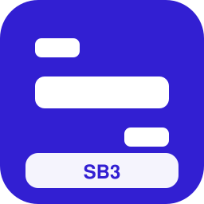

| Campo | Valor |
| --- | --- |
| Código corto | **SB3** |
| Estado | futuro |
| Tipo | metropolitano |
| Competencia | dominante |
| Color | `#321FD2` / `#FFFFFF` |
| Sede | Berlín |
| Lands | Berlín, Brandeburgo |
| Servicios | `s`, `or`, `mc`, `u` |
| Eslogan | ** |
| Logo | `assets/logos/sbe2.svg` |
| Flota | MI84 (livrea metropolitana) (×58); FLIRT 4 (livrea rojo) (×19); FLIRT 3 XL BR 3427 (livrea azul) (×30); Desiro Doble Piso (livrea metropolitana) (×41); Coradia Continental BR 440 (livrea rojo) (×52); Coradia Continental BR 1440.2 (livrea azul) (×13); Cercanías Civia (livrea metropolitana) (×24); Rh 4020 (livrea rojo) (×35); MS70/AM70 Airport (livrea azul) (×46); BR 422 S-Bahn (livrea metropolitana) (×57); BR 426 (livrea rojo) (×18); BR 472 S-Bahn HH (livrea azul) (×29); BR 480 S-Bahn BE (livrea metropolitana) (×40); BR 485 S-Bahn BE (livrea rojo) (×51); BR 490.3 S-Bahn HH (livrea azul) (×17); Aventra Class 710 (livrea metropolitana) (×33) |

### Corredor Este Rápido (`ost`)

| Campo | Valor |
| --- | --- |
| Código corto | **CER** |
| Estado | futuro |
| Tipo | regional |
| Competencia | dominante |
| Color | `#4A148C` / `#FFFFFF` |
| Sede | Leipzig |
| Lands | Berlín, Brandeburgo, Sajonia, Sajonia-Anhalt, Turingia |
| Servicios | `re`, `ir`, `ld`, `av` |
| Eslogan | ** |
| Logo | `assets/logos/ost.svg` |
| Flota | X TER X 72500 (6 coches) (×59); NPZ Domino (3 coches) (×20); ETR 103 POP (5 coches) (×31); Series 2200 LU (6 coches) (×42); M7 EMU (livrea rojo) (×58); KISS 160 (livrea rojo) (×14); Regio 2N Omneo Premium (livrea rojo) (×35); FLIRT 3 (2 puertas) (livrea azul) (×36); FLIRT 3 XL BR 3427 (livrea verde) (×52); FLIRT RABe 524 (livrea rojo) (×58); FLIRT ETR 155/170 (livrea azul) (×19); Desiro ML 4744 (livrea azul) (×30); Talent 2 BR 442 (livrea verde) (×41); Coradia Continental BR 440 (livrea verde) (×52) |

### Sur Abierto Alemania (`sud`)

| Campo | Valor |
| --- | --- |
| Código corto | **SUA** |
| Estado | futuro |
| Tipo | nacional |
| Competencia | competitiva |
| Color | `#BF360C` / `#FFFFFF` |
| Sede | Múnich |
| Lands | Baviera, Baden-Wurtemberg, Hesse |
| Servicios | `ld`, `px` |
| Eslogan | ** |
| Logo | `assets/logos/sud.svg` |
| Flota | ICE 2 (livrea azul) (×60); TGV Réseau (livrea nocturna) (×21); AVE S-112 (livrea azul) (×32); Railjet Viaggio Comfort (livrea nocturna) (×48); IC 901 (livrea nocturna) (×54); ICE 4 K1n (Aeropuerto) (×20); Vectron E 193 + coches (Aeropuerto) (×31); ETR1000 Frecciarossa (livrea nocturna) (×37); Twindexx Vario BR 445 (Aeropuerto) (×48); MI2N Altéo (Aeropuerto) (×59); FLIRT 4 (Aeropuerto) (×20); Coradia Continental BR 440 (Aeropuerto) (×31); ICE 3 (×50); TGV Duplex (×61); Pendolino New CH (×27); ETR 500 Frecce (×33); Talgo IV/V (×44); Vectron BR 193 + coches (×55); KISS 200 (×66); ETR1000 Frecciarossa (×27); Twindexx Swiss Express (3 coches) (×30); KISS 200 Austria (5 coches) (×41) |

### Norte Abierto Alemania (`nor`)

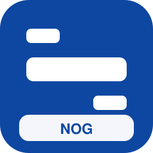

| Campo | Valor |
| --- | --- |
| Código corto | **NOG** |
| Estado | futuro |
| Tipo | nacional |
| Competencia | competitiva |
| Color | `#0D47A1` / `#FFFFFF` |
| Sede | Hamburgo |
| Lands | Hamburgo, Schleswig-Holstein, Baja Sajonia, Mecklemburgo-Pomerania Occidental, Berlín |
| Servicios | `ld`, `px` |
| Eslogan | ** |
| Logo | `assets/logos/nor.svg` |
| Flota | TGV Atlantique (livrea nocturna) (×11); Stadler Giruno (livrea azul) (×22); ETR 700 Frecce (livrea nocturna) (×33); EW IV (livrea nocturna) (×44); Regio 2N Omneo Premium (livrea rojo) (×55); ETR 600 Pendolino (Aeropuerto) (×21); AVE S-103 Velaro E (livrea nocturna) (×27); M7 EMU (Aeropuerto) (×38); Z2N (Aeropuerto) (×49); Francilien Z 50000 (Aeropuerto) (×60); Talent 2 BR 442 (Aeropuerto) (×21); ICE 4 K3s (×45); TGV Atlantique (×51); Eurostar e300 (×62); Alvia S-120/121 (×23); Viaggio Twin (×34); Loc BR 101 + coches (×45); Dosto 5ª gen IC Twindexx (×56); Thalys TMST Izy (×67); Dosto 5ª gen IC Twindexx (5 coches) (×20); KISS 200 (6 coches) (×31); CAF Civity (3 coches) (×42) |

### Alpes Bávaros Express (`alp`)

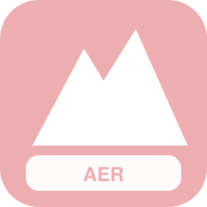

| Campo | Valor |
| --- | --- |
| Código corto | **ABX** |
| Estado | futuro |
| Tipo | regional |
| Competencia | dominante |
| Color | `#1B5E20` / `#FFFFFF` |
| Sede | Garmisch |
| Lands | Baviera |
| Servicios | `re`, `tur`, `rl`, `av` |
| Eslogan | ** |
| Logo | `assets/logos/alp.svg` |
| Flota | ETR 103 POP (3 coches) (×12); Series 2200 LU (5 coches) (×23); AVG ET 2010 (6 coches) (×34); KISS 200 Austria (livrea rojo) (×45); VIRM (livrea rojo) (×56); FLIRT 3 (2 puertas) (livrea rojo) (×17); FLIRT 3 XL BR 3427 (livrea azul) (×28); FLIRT BR 429 (livrea verde) (×39); FLIRT ETR 155/170 (livrea rojo) (×50); Desiro ML 4744 (livrea rojo) (×11); Talent 2 BR 442 (livrea azul) (×22); Coradia Continental BR 440 (livrea azul) (×33); Coradia Continental BR 1440.1 (livrea verde) (×44); Coradia Nordic (livrea rojo) (×55) |

### Rin Valle Futuro (`rhv`)

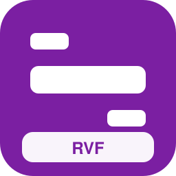

| Campo | Valor |
| --- | --- |
| Código corto | **RVF** |
| Estado | futuro |
| Tipo | regional |
| Competencia | dominante |
| Color | `#7B1FA2` / `#FFFFFF` |
| Sede | Maguncia |
| Lands | Renania del Norte-Westfalia, Renania-Palatinado, Hesse, Baden-Wurtemberg |
| Servicios | `re`, `tt`, `ir`, `ld` |
| Eslogan | ** |
| Logo | `assets/logos/rhv.svg` |
| Flota | Series 2200 LU (6 coches) (×13); M7 EMU (livrea rojo) (×29); KISS 160 (livrea rojo) (×35); Regio 2N Omneo Premium (livrea rojo) (×56); FLIRT 3 (2 puertas) (livrea azul) (×57); FLIRT 3 XL BR 3427 (livrea verde) (×23); FLIRT RABe 524 (livrea rojo) (×29); FLIRT ETR 155/170 (livrea azul) (×40); Desiro ML 4744 (livrea azul) (×51); Talent 2 BR 442 (livrea verde) (×12); Coradia Continental BR 440 (livrea verde) (×23); Coradia Continental BR 1440.2 (livrea rojo) (×34); Coradia Nordic (livrea azul) (×45); Régiolis Regional (livrea rojo) (×56) |

### Rápidos del Spree (`raf`)

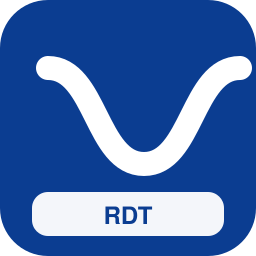

| Campo | Valor |
| --- | --- |
| Código corto | **RDS** |
| Estado | inventado |
| Tipo | nacional |
| Competencia | competitiva |
| Color | `#0B3D91` / `#FFFFFF` |
| Sede | Berlín |
| Lands | Berlín, Brandeburgo, Sajonia, Sajonia-Anhalt |
| Servicios | `av`, `ld`, `px` |
| Eslogan | ** |
| Logo | `assets/logos/raf.svg` |
| Flota | AVE S-112 (livrea nocturna) (×19); ETR1000 Frecciarossa (livrea azul) (×30); ETR1000 Frecciarossa (Aeropuerto) (×41); Twindexx Swiss Express (3 coches) (×47); KISS 200 Austria (5 coches) (×58); CAF Civity (6 coches) (×19); EW IV (livrea nocturna) (×30); Regio 2N Omneo Premium (livrea rojo) (×41); Vectron E 193 + coches (Aeropuerto) (×57); VIRM (Aeropuerto) (×13); MI79 (Aeropuerto) (×24); Desiro ML 4746 (Aeropuerto) (×35); Coradia Nordic (Aeropuerto) (×46); ICE 1 (×70); Thalys PBKA (×31); AVE S-102 (×37); ICE TD (×48); ETR 600 Pendolino (×64); EW IV (×20); Vectron E 193 + coches (×36); Regio 2N Omneo Premium (×42); ICE 4 K4s (livrea nocturna) (×50) |

### Expreso Nórdico Alemán (`exn`)

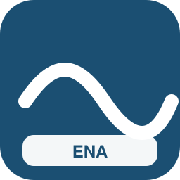

| Campo | Valor |
| --- | --- |
| Código corto | **ENA** |
| Estado | inventado |
| Tipo | nacional |
| Competencia | competitiva |
| Color | `#1B4F72` / `#FFFFFF` |
| Sede | Hamburgo |
| Lands | Hamburgo, Schleswig-Holstein, Baja Sajonia, Mecklemburgo-Pomerania Occidental, Berlín |
| Servicios | `ld`, `px`, `n` |
| Eslogan | ** |
| Logo | `assets/logos/exn.svg` |
| Flota | ETR 700 Frecce (livrea nocturna) (×15); EW IV (livrea nocturna) (×26); Regio 2N Omneo Premium (livrea rojo) (×37); ETR 600 Pendolino (Aeropuerto) (×53); AVE S-103 Velaro E (livrea nocturna) (×59); M7 EMU (Aeropuerto) (×20); Z2N (Aeropuerto) (×31); Francilien Z 50000 (Aeropuerto) (×42); Talent 2 BR 442 (Aeropuerto) (×53); Nocturno Viaggio (livrea nocturna) (×14); ICE T (×38); Thalys PBA (×44); Alvia S-730 (×60); IC4 Litra MG (×66); UIC-Z1 (×32); HLE 18 + coches (×38); CAF Civity (×49); Viaggio Twin (3 coches) (×52); Twindexx Swiss Express (5 coches) (×13); KISS 200 Austria (6 coches) (×24); ICE 4 K1n (livrea azul) (×40); ICE 3 (livrea nocturna) (×46) |

### Corredores del Ruhr (`cdn`)

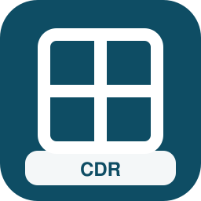

| Campo | Valor |
| --- | --- |
| Código corto | **CDR** |
| Estado | inventado |
| Tipo | nacional |
| Competencia | competitiva |
| Color | `#0E4D64` / `#FFFFFF` |
| Sede | Essen |
| Lands | Renania del Norte-Westfalia, Hesse, Baja Sajonia |
| Servicios | `ld`, `ir`, `px` |
| Eslogan | ** |
| Logo | `assets/logos/cdn.svg` |
| Flota | ETR1000 Frecciarossa (×24); Twindexx Swiss Express (3 coches) (×32); KISS 200 Austria (5 coches) (×43); CAF Civity (6 coches) (×54); ICE 3 (livrea azul) (×60); TGV Atlantique (livrea nocturna) (×21); Stadler Giruno (livrea azul) (×32); ETR 700 Frecce (livrea nocturna) (×43); EW IV (livrea nocturna) (×59); Regio 2N Omneo Premium (livrea rojo) (×20); ETR 600 Pendolino (Aeropuerto) (×31); Dosto 4ª gen (3 coches) (×37); FLIRT 4 (5 coches) (×48); Coradia Continental BR 1440.3 (6 coches) (×59); M7 EMU (livrea rojo) (×20); FLIRT 3 XL BR 3427 (livrea azul) (×31); Régiolis Intercity (livrea verde) (×42); FLIRT 4 (Aeropuerto) (×58); ETR1000 Frecciarossa (livrea nocturna) (×14); KISS 160 Luxemburgo (Aeropuerto) (×25); MI79 (Aeropuerto) (×36); Talent 2 BR 442 (Aeropuerto) (×47) |

### VeloRápido Alemán (`vrp`)

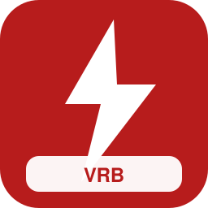

| Campo | Valor |
| --- | --- |
| Código corto | **VRA** |
| Estado | inventado |
| Tipo | nacional |
| Competencia | nicho |
| Color | `#B71C1C` / `#FFFFFF` |
| Sede | Fráncfort |
| Lands | Berlín, Hesse, Baden-Wurtemberg, Baviera |
| Servicios | `av`, `px` |
| Eslogan | ** |
| Logo | `assets/logos/vrp.svg` |
| Flota | TGV Réseau (livrea azul) (×17); TGV POS (livrea nocturna) (×28); AVE S-112 (livrea azul) (×39); ETR 700 Frecce (livrea nocturna) (×50); AVE S-103 Velaro E (Aeropuerto) (×16); Railjet Viaggio Comfort (Aeropuerto) (×22); KISS 160 Luxemburgo (Aeropuerto) (×33); MI09 (Aeropuerto) (×44); FLIRT 3 XL BR 3427 (Aeropuerto) (×55); Coradia Continental BR 1440.2 (Aeropuerto) (×16); ICE 2 (×35); TGV POS (×46); AVE S-103 Velaro E (×62); ICE T (×68); ICE 4 K1n (livrea nocturna) (×26); ICE 3 Velaro D (livrea azul) (×37); TGV Sud-Est (livrea nocturna) (×43); TGV EuroDuplex (livrea azul) (×54); AVE S-103 Velaro E (livrea nocturna) (×20); ETR 500 Frecce (livrea azul) (×26); ICE 4 K3s (Aeropuerto) (×42); Pendolino New CH (Aeropuerto) (×48) |

### Líneas Maestras Alemania (`lma`)

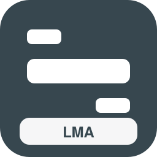

| Campo | Valor |
| --- | --- |
| Código corto | **LMA** |
| Estado | inventado |
| Tipo | nacional |
| Competencia | competitiva |
| Color | `#37474F` / `#FFFFFF` |
| Sede | Hannover |
| Lands | Berlín, Brandeburgo, Mecklemburgo-Pomerania Occidental, Schleswig-Holstein, Hamburgo, Baja Sajonia, Bremen, Renania del Norte-Westfalia, Hesse, Renania-Palatinado, Sarre, Baden-Wurtemberg, Baviera, Turingia, Sajonia, Sajonia-Anhalt |
| Servicios | `ld`, `ir` |
| Eslogan | ** |
| Logo | `assets/logos/lma.svg` |
| Flota | IC4 Litra MG (livrea nocturna) (×23); UIC-Z1 (livrea nocturna) (×29); CAF Civity (livrea azul) (×45); Railjet Viaggio Comfort (Aeropuerto) (×51); Dosto 4ª gen (5 coches) (×12); FLIRT 4 (6 coches) (×23); Régiolis Intercity (3 coches) (×34); Dosto 4ª gen (livrea rojo) (×45); FLIRT 3 XL BR 3427 (livrea verde) (×56); Z TER Z 21500 (livrea rojo) (×17); FLIRT 3 XL BR 3427 (Aeropuerto) (×28); ICE T (×52); Thalys PBA (×58); Alvia S-730 (×19); IC4 Litra MG (×35); UIC-Z1 (×41); HLE 18 + coches (×57); CAF Civity (×68); Coradia Continental BR 1440.3 (×24); Dosto 5ª gen IC Twindexx (5 coches) (×32); KISS 200 (6 coches) (×43); CAF Civity (3 coches) (×54) |

### Líneas Libres Alemania (`lib`)

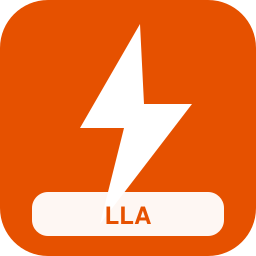

| Campo | Valor |
| --- | --- |
| Código corto | **LLA** |
| Estado | inventado |
| Tipo | nacional |
| Competencia | competitiva |
| Color | `#E65100` / `#FFFFFF` |
| Sede | Colonia |
| Lands | Berlín, Brandeburgo, Mecklemburgo-Pomerania Occidental, Schleswig-Holstein, Hamburgo, Baja Sajonia, Bremen, Renania del Norte-Westfalia, Hesse, Renania-Palatinado, Sarre, Baden-Wurtemberg, Baviera, Turingia, Sajonia, Sajonia-Anhalt |
| Servicios | `ld`, `px`, `ir` |
| Eslogan | ** |
| Logo | `assets/logos/lib.svg` |
| Flota | KISS 200 Austria (6 coches) (×24); ICE 4 K1n (livrea azul) (×35); ICE 3 (livrea nocturna) (×41); TGV Réseau (livrea azul) (×52); Stadler Giruno (livrea nocturna) (×13); IC4 Litra MG (livrea nocturna) (×29); UIC-Z1 (livrea nocturna) (×35); CAF Civity (livrea azul) (×51); Railjet Viaggio Comfort (Aeropuerto) (×62); ETR1000 Frecciarossa (livrea azul) (×18); Dosto 4ª gen (Aeropuerto) (×34); Z 24500 2N NG (Aeropuerto) (×40); DPZ/HVZ (Aeropuerto) (×51); Mireo BR 463 (Aeropuerto) (×12); M7 EMU (6 coches) (×23); FLIRT 4 (3 coches) (×34); Coradia Continental BR 1440.3 (5 coches) (×45); Z TER Z 21500 (6 coches) (×56); FLIRT 3 XL BR 3427 (livrea rojo) (×17); Régiolis Intercity (livrea azul) (×28); ICE 4 K4s (×47); TGV Réseau (×58) |

### Nexo Ciudades Alemanas (`nex`)

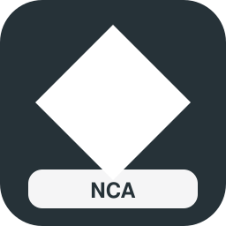

| Campo | Valor |
| --- | --- |
| Código corto | **NCA** |
| Estado | inventado |
| Tipo | nacional |
| Competencia | competitiva |
| Color | `#263238` / `#FFFFFF` |
| Sede | Leipzig |
| Lands | Berlín, Hamburgo, Renania del Norte-Westfalia, Baviera, Baden-Wurtemberg, Sajonia |
| Servicios | `px`, `ld`, `ae` |
| Eslogan | ** |
| Logo | `assets/logos/nex.svg` |
| Flota | KISS 200 Austria (3 coches) (×20); CAF Civity (5 coches) (×31); ICE 2 (livrea nocturna) (×42); TGV Duplex (livrea azul) (×53); AVE S-112 (livrea nocturna) (×14); Talgo VI (livrea nocturna) (×25); Twindexx Swiss Express (livrea rojo) (×36); MS70/AM70 Airport (6 coches) (×47); BR 490 S-Bahn HH (livrea rojo) (×58); Thalys TMST Izy (×27); Vectron E 193 + coches (×43); TGV Réseau (×49); Stadler Giruno (×60); ETR 700 Frecce (×21); UIC-Z1 (×32); HLE 13 + coches (×43); MS70/AM70 Airport (×54); ICE 3 Velaro D (livrea nocturna) (×57); ICE 4 K3s (Aeropuerto) (×28); ETR 600 Pendolino (Aeropuerto) (×39); KISS 200 (Aeropuerto) (×50); MI2N Altéo (Aeropuerto) (×56) |

### Puente Alpes-Mar del Norte (`peu`)

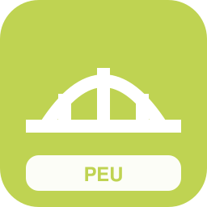

| Campo | Valor |
| --- | --- |
| Código corto | **PAM** |
| Estado | inventado |
| Tipo | internacional |
| Competencia | nicho |
| Color | `#529699` / `#FFFFFF` |
| Sede | Múnich |
| Lands | Baviera, Baden-Wurtemberg, Renania del Norte-Westfalia, Hamburgo |
| Servicios | `av`, `ld` |
| Eslogan | ** |
| Logo | `assets/logos/peu.svg` |
| Flota | ICE 3 Velaro D (×29); TGV EuroDuplex (×45); Stadler Giruno (×56); ETR1000 Frecciarossa (×62); Alvia S-120/121 (×23); Talgo IV/V (×34); Vectron BR 193 + coches (×45); KISS 200 (×56); ICE 4 K3s (livrea nocturna) (×64); ICE 2 (livrea azul) (×25); TGV Atlantique (livrea nocturna) (×36); TGV POS (livrea azul) (×42); AVE S-102 (livrea nocturna) (×53); ETR 700 Frecce (livrea azul) (×19); Thalys TMST Izy (Aeropuerto) (×25); Dosto 5ª gen IC Twindexx (5 coches) (×36) |

### Panorámicos Alemanes (`pan`)

| Campo | Valor |
| --- | --- |
| Código corto | **PAG** |
| Estado | inventado |
| Tipo | especializado |
| Competencia | nicho |
| Color | `#33691E` / `#FFFFFF` |
| Sede | Friburgo |
| Lands | Baviera, Baden-Wurtemberg, Schleswig-Holstein, Mecklemburgo-Pomerania Occidental, Sajonia |
| Servicios | `tur`, `rl` |
| Eslogan | ** |
| Logo | `assets/logos/pan.svg` |
| Flota | GTW Diésel AT (5 coches) (×22); Desiro Classic AT (6 coches) (×33); Talent 4024 (3 coches) (×44); Talent BR 644 (5 coches) (×55); LINT 41H (6 coches) (×16); LINT 27 BR 640 (3 coches) (×27); AGC X 76500 (5 coches) (×38); Rh 5147 (6 coches) (×49); GTW RABe 520 (livrea verde) (×60); Desiro Classic DK (livrea rojo) (×21); Talent BR 643 (livrea azul) (×32); LINT 41 BR 648 (livrea verde) (×43) |

### Universidad Express Alemania (`uni`)

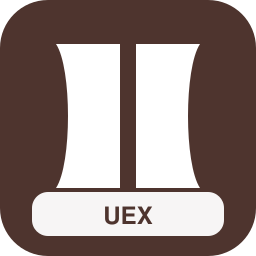

| Campo | Valor |
| --- | --- |
| Código corto | **UEA** |
| Estado | inventado |
| Tipo | especializado |
| Competencia | nicho |
| Color | `#4E342E` / `#FFFFFF` |
| Sede | Heidelberg |
| Lands | Berlín, Baviera, Baden-Wurtemberg, Hesse, Sajonia, Baja Sajonia |
| Servicios | `re`, `ir`, `mc` |
| Eslogan | ** |
| Logo | `assets/logos/uni.svg` |
| Flota | Coradia Nordic (livrea azul) (×23); Régiolis Regional (livrea rojo) (×34); Régiolis Suburban (livrea azul) (×45); AGC B 82500 (livrea verde) (×56); Z TER Z 21500 (livrea verde) (×22); NPZ Colibri (livrea rojo) (×28); Series 2000 LU (livrea azul) (×39); BR 425 Regional/S (livrea metropolitana) (×50); VIRM (Aeropuerto) (×16); Talent 2 BR 442 (Aeropuerto) (×22); Viaggio Twin (5 coches) (×33); BR 483/484 S-Bahn BE (5 coches) (×44) |

### Feria y Congresos Rail (`fer`)

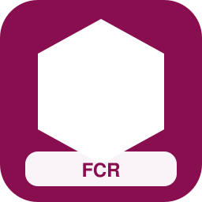

| Campo | Valor |
| --- | --- |
| Código corto | **FCR** |
| Estado | inventado |
| Tipo | especializado |
| Competencia | nicho |
| Color | `#880E4F` / `#FFFFFF` |
| Sede | Fráncfort |
| Lands | Hesse, Renania del Norte-Westfalia, Baviera, Berlín, Sajonia |
| Servicios | `px`, `ae`, `ld` |
| Eslogan | ** |
| Logo | `assets/logos/fer.svg` |
| Flota | CAF Civity (6 coches) (×24); ICE 1 (livrea azul) (×35); TGV Duplex (livrea nocturna) (×46); ETR 500 Frecce (livrea azul) (×57); Talgo IV/V (livrea nocturna) (×18); KISS 200 (livrea rojo) (×29); ICE T (×53); Railjet Viaggio Comfort (×64); ICE 1 (×20); Thalys PBA (×31); Alvia S-120/121 (×42); Talgo IV/V (×53) |

### Costa a Costa Alemana (`cos`)

| Campo | Valor |
| --- | --- |
| Código corto | **CCA** |
| Estado | inventado |
| Tipo | especializado |
| Competencia | nicho |
| Color | `#006064` / `#FFFFFF` |
| Sede | Rostock |
| Lands | Schleswig-Holstein, Mecklemburgo-Pomerania Occidental, Baja Sajonia, Hamburgo |
| Servicios | `tur`, `ir`, `ld` |
| Eslogan | ** |
| Logo | `assets/logos/cos.svg` |
| Flota | FLIRT 3 XL BR 3427 (livrea verde) (×25); Régiolis Intercity (livrea verde) (×36); KISS 200 (Aeropuerto) (×52); ICE 4 K3s (livrea nocturna) (×58); ICE 1 (livrea azul) (×19); TGV Duplex (livrea nocturna) (×30); ETR 500 Frecce (livrea azul) (×41); UIC-Z1 (livrea nocturna) (×52); Railjet Viaggio Comfort (Aeropuerto) (×13); AutoShuttle CH (×32); IC4 Litra MG (×48); HLE 18 + coches (×59) |

### Riberas del Elba (`riv`)

| Campo | Valor |
| --- | --- |
| Código corto | **RDE** |
| Estado | inventado |
| Tipo | especializado |
| Competencia | nicho |
| Color | `#77CB1E` / `#FFFFFF` |
| Sede | Magdeburgo |
| Lands | Hamburgo, Baja Sajonia, Sajonia-Anhalt, Sajonia |
| Servicios | `tur`, `re` |
| Eslogan | ** |
| Logo | `assets/logos/riv.svg` |
| Flota | Régiolis Léman Express (livrea azul) (×26); AGC Z 27500 (livrea verde) (×37); Z2 Z 11500 (livrea verde) (×48); ETR 103 POP (livrea rojo) (×59); Series 2200 LU (livrea azul) (×20); Twindexx Vario BR 445 (Aeropuerto) (×31); FLIRT 3 (2 puertas) (Aeropuerto) (×42); Coradia Continental BR 1440.1 (Aeropuerto) (×53); Composición panorámica (×22); Twindexx Vario BR 445 (×33); Regio 2N Regional (×44); FLIRT BR 429 (×55) |

### Selva Negra Vías (`sel`)

| Campo | Valor |
| --- | --- |
| Código corto | **SNV** |
| Estado | inventado |
| Tipo | especializado |
| Competencia | nicho |
| Color | `#A21DBB` / `#FFFFFF` |
| Sede | Offenburg |
| Lands | Baden-Wurtemberg |
| Servicios | `tur`, `rl`, `rb` |
| Eslogan | ** |
| Logo | `assets/logos/sel.svg` |
| Flota | AGC Z 27500 (livrea rojo) (×27); NPZ Domino (livrea rojo) (×38); Rh 4020 (livrea azul) (×49); Series 2000 LU (livrea verde) (×60); FLIRT 4 (Aeropuerto) (×21); Coradia Nordic (Aeropuerto) (×32); FLIRT WINK (×56); Desiro Classic DK (×67); LINT 41 BR 623 (×28); Regio 2N Regional (×34); FLIRT RABe 522/523 (×45); LINT 54/81 BR 620/622 (×56) |

### Mosela Romántico Rail (`mos`)

| Campo | Valor |
| --- | --- |
| Código corto | **MRR2** |
| Estado | inventado |
| Tipo | especializado |
| Competencia | nicho |
| Color | `#3AEBBA` / `#FFFFFF` |
| Sede | Coblenza |
| Lands | Renania-Palatinado, Sarre |
| Servicios | `tur`, `rb`, `re` |
| Eslogan | ** |
| Logo | `assets/logos/mos.svg` |
| Flota | Coradia Nordic (livrea metropolitana) (×33); MD S-449 (livrea azul) (×44); AGC B 82500 (livrea verde) (×55); Z2 Z 11500 (livrea azul) (×16); NPZ Colibri (livrea azul) (×27); ETR 103 POP (livrea rojo) (×38); BR 425 Regional/S (livrea azul) (×49); Desiro ML 4746 (Aeropuerto) (×60); M7 EMU (5 coches) (×16); Dosto 4ª gen (6 coches) (×27); KISS 200 (3 coches) (×38); KISS 160 (5 coches) (×49) |

### Vía Abierta Central (`via`)

| Campo | Valor |
| --- | --- |
| Código corto | **VAC** |
| Estado | inventado |
| Tipo | regional |
| Competencia | competitiva |
| Color | `#5D4037` / `#FFFFFF` |
| Sede | Erfurt |
| Lands | Turingia, Sajonia-Anhalt, Sajonia, Hesse |
| Servicios | `re`, `rb`, `ir` |
| Eslogan | ** |
| Logo | `assets/logos/via.svg` |
| Flota | Régiolis Regional (livrea rojo) (×34); Régiolis Suburban (livrea azul) (×40); AGC B 82500 (livrea verde) (×56); Z TER Z 21500 (livrea verde) (×17); NPZ Colibri (livrea rojo) (×28); Series 2000 LU (livrea azul) (×39); BR 425 Regional/S (livrea metropolitana) (×50); VIRM (Aeropuerto) (×61); Talent 2 BR 442 (Aeropuerto) (×22); FLIRT WINK (5 coches) (×28); GTW Diésel NL (6 coches) (×39); GTW RABe 520 (3 coches) (×50); Desiro Classic BR 642 (5 coches) (×11); Talent 4024 (6 coches) (×22) |

### Mediodía Bávaro (`mid`)

| Campo | Valor |
| --- | --- |
| Código corto | **MDB** |
| Estado | inventado |
| Tipo | regional |
| Competencia | competitiva |
| Color | `#B45F8D` / `#FFFFFF` |
| Sede | Augsburgo |
| Lands | Baviera |
| Servicios | `re`, `rb`, `ir`, `ld` |
| Eslogan | ** |
| Logo | `assets/logos/mid.svg` |
| Flota | LINT 54/81 BR 620/622 (livrea verde) (×35); Coradia Continental BR 1440.1 (livrea rojo) (×46); Coradia Continental BR 1440.3 (livrea azul) (×57); MD S-449 (livrea rojo) (×18); Régiolis Intercity (livrea azul) (×29); Régiolis Léman Express (livrea metropolitana) (×35); X TER X 72500 (livrea verde) (×51); NPZ Domino (livrea rojo) (×62); ETR 103 POP (livrea azul) (×23); Series 2200 LU (livrea verde) (×29); KISS 200 (Aeropuerto) (×50); FLIRT 3 XL BR 3427 (Aeropuerto) (×56); Coradia Continental BR 1440.2 (Aeropuerto) (×12); GTW Eléctrico NL (6 coches) (×23) |

### Anglia Sajona Conecta (`ang`)

| Campo | Valor |
| --- | --- |
| Código corto | **ASC** |
| Estado | inventado |
| Tipo | regional |
| Competencia | competitiva |
| Color | `#AD1457` / `#FFFFFF` |
| Sede | Dresde |
| Lands | Sajonia, Brandeburgo, Berlín |
| Servicios | `re`, `rb`, `rl` |
| Eslogan | ** |
| Logo | `assets/logos/ang.svg` |
| Flota | Z2 Z 11500 (livrea verde) (×36); ETR 103 POP (livrea rojo) (×47); Series 2200 LU (livrea azul) (×53); Twindexx Vario BR 445 (Aeropuerto) (×14); FLIRT 3 (2 puertas) (Aeropuerto) (×30); Coradia Continental BR 1440.1 (Aeropuerto) (×41); GTW Eléctrico NL (5 coches) (×52); GTW Eléctrico AT (6 coches) (×63); Desiro Classic AT (3 coches) (×24); Desiro Classic DK (5 coches) (×35); Talent BR 643 (6 coches) (×46); LINT 41H (3 coches) (×57); LINT 41 BR 623 (5 coches) (×18); Coradia A TER BR 641 (6 coches) (×29) |

### Kiel Rápido (`ken`)

| Campo | Valor |
| --- | --- |
| Código corto | **KIR** |
| Estado | inventado |
| Tipo | regional |
| Competencia | competitiva |
| Color | `#1CD5C3` / `#FFFFFF` |
| Sede | Kiel |
| Lands | Schleswig-Holstein, Hamburgo |
| Servicios | `re`, `rb` |
| Eslogan | ** |
| Logo | `assets/logos/ken.svg` |
| Flota | NPZ Colibri (livrea azul) (×37); Series 2000 LU (livrea verde) (×48); M7 EMU (Aeropuerto) (×54); Regio 2N Gran Capacidad (Aeropuerto) (×15); Mireo BR 463 (Aeropuerto) (×31); FLIRT WINK (6 coches) (×37); GTW Eléctrico AT (3 coches) (×48); GTW RABe 520 (5 coches) (×59); Desiro Classic BR 642 (6 coches) (×20); Talent BR 643 (3 coches) (×31); Regio-Shuttle BR 650 (5 coches) (×42); LINT 41 BR 648 (6 coches) (×53); Coradia A TER BR 641 (3 coches) (×14); AGC X 76500 (5 coches) (×25) |

### Weser y Aller Rail (`dev`)

| Campo | Valor |
| --- | --- |
| Código corto | **WAR** |
| Estado | inventado |
| Tipo | regional |
| Competencia | dominante |
| Color | `#2E7D32` / `#FFFFFF` |
| Sede | Bremen |
| Lands | Baja Sajonia, Bremen |
| Servicios | `re`, `rb`, `rl`, `tur` |
| Eslogan | ** |
| Logo | `assets/logos/dev.svg` |
| Flota | NPZ Colibri (livrea azul) (×38); Series 2000 LU (livrea verde) (×49); M7 EMU (Aeropuerto) (×55); Regio 2N Gran Capacidad (Aeropuerto) (×16); Mireo BR 463 (Aeropuerto) (×32); FLIRT WINK (6 coches) (×43); GTW Eléctrico AT (3 coches) (×54); GTW RABe 520 (5 coches) (×65); Desiro Classic BR 642 (6 coches) (×26); Talent BR 643 (3 coches) (×37); Regio-Shuttle BR 650 (5 coches) (×48); LINT 41 BR 648 (6 coches) (×59); Coradia A TER BR 641 (3 coches) (×20); AGC X 76500 (5 coches) (×31) |

### Harz Líneas Verdes (`cot`)

| Campo | Valor |
| --- | --- |
| Código corto | **HLV** |
| Estado | inventado |
| Tipo | regional |
| Competencia | dominante |
| Color | `#558B2F` / `#FFFFFF` |
| Sede | Wernigerode |
| Lands | Sajonia-Anhalt, Baja Sajonia, Turingia |
| Servicios | `re`, `rb`, `tur`, `rl` |
| Eslogan | ** |
| Logo | `assets/logos/cot.svg` |
| Flota | Series 2000 LU (livrea rojo) (×39); BR 425 Regional/S (livrea azul) (×50); KISS 160 Luxemburgo (Aeropuerto) (×56); Desiro Doble Piso (Aeropuerto) (×17); FLIRT WINK (3 coches) (×33); GTW Diésel NL (5 coches) (×49); GTW Diésel AT (6 coches) (×55); Desiro Classic BR 642 (3 coches) (×16); Talent 4024 (5 coches) (×27); Talent BR 644 (6 coches) (×38); LINT 41 BR 648 (3 coches) (×49); LINT 27 BR 640 (5 coches) (×60); Cercanías Civia (6 coches) (×16); Rh 5147 (3 coches) (×32) |

### Eifel Express (`pen`)

| Campo | Valor |
| --- | --- |
| Código corto | **EEX** |
| Estado | inventado |
| Tipo | regional |
| Competencia | competitiva |
| Color | `#4527A0` / `#FFFFFF` |
| Sede | Aquisgrán |
| Lands | Renania del Norte-Westfalia, Renania-Palatinado |
| Servicios | `re`, `ir`, `rb` |
| Eslogan | ** |
| Logo | `assets/logos/pen.svg` |
| Flota | NPZ Colibri (livrea verde) (×40); Series 2200 LU (livrea rojo) (×46); Dosto 4ª gen (Aeropuerto) (×62); FLIRT 4 (Aeropuerto) (×28); Coradia Continental BR 440 (Aeropuerto) (×34); IC4 Litra MG (livrea nocturna) (×40); GTW Eléctrico NL (3 coches) (×51); GTW Eléctrico AT (5 coches) (×12); GTW RABe 520 (6 coches) (×23); Desiro Classic DK (3 coches) (×34); Talent BR 643 (5 coches) (×45); Regio-Shuttle BR 650 (6 coches) (×56); LINT 41 BR 623 (3 coches) (×17); Coradia A TER BR 641 (5 coches) (×28) |

### Borde Checo-Sajón (`bor`)

| Campo | Valor |
| --- | --- |
| Código corto | **BCS** |
| Estado | inventado |
| Tipo | regional |
| Competencia | competitiva |
| Color | `#3F20C3` / `#FFFFFF` |
| Sede | Chemnitz |
| Lands | Sajonia, Baviera |
| Servicios | `re`, `rb`, `ld` |
| Eslogan | ** |
| Logo | `assets/logos/bor.svg` |
| Flota | Régiolis Suburban (livrea rojo) (×36); AGC B 82500 (livrea azul) (×52); Z TER Z 21500 (livrea azul) (×58); NPZ Domino (livrea verde) (×24); Series 2000 LU (livrea rojo) (×35); BR 425 Regional/S (livrea azul) (×46); KISS 160 Luxemburgo (Aeropuerto) (×52); Desiro Doble Piso (Aeropuerto) (×13); FLIRT WINK (3 coches) (×24); GTW Diésel NL (5 coches) (×35); GTW Diésel AT (6 coches) (×46); Desiro Classic BR 642 (3 coches) (×57); Talent 4024 (5 coches) (×18); Talent BR 644 (6 coches) (×29) |

### Altos Alpes Bávaros (`hig`)

| Campo | Valor |
| --- | --- |
| Código corto | **AAB** |
| Estado | inventado |
| Tipo | regional |
| Competencia | dominante |
| Color | `#7F4AE8` / `#FFFFFF` |
| Sede | Innsbruck Gate |
| Lands | Baviera |
| Servicios | `rl`, `rb`, `tur`, `re` |
| Eslogan | ** |
| Logo | `assets/logos/hig.svg` |
| Flota | Desiro ML 4746 (Aeropuerto) (×42); Glacier Express coaches (livrea verde) (×48); Dosto 5ª gen IC Twindexx (5 coches) (×59); Twindexx Swiss Express (6 coches) (×20); KISS 200 Austria (3 coches) (×31); KISS 160 Luxemburgo (5 coches) (×42); Regio 2N Omneo Premium (6 coches) (×53); Desiro Doble Piso (3 coches) (×14); Coradia Continental BR 1440.3 (5 coches) (×25); Régiolis Intercity (6 coches) (×36); Z TER Z 21500 (3 coches) (×47); AVG ET 2010 (5 coches) (×58); KISS 200 (livrea rojo) (×19); KISS 160 Luxemburgo (livrea metropolitana) (×30) |

### Bosque Bávaro Rail (`wal`)

| Campo | Valor |
| --- | --- |
| Código corto | **BBR** |
| Estado | inventado |
| Tipo | regional |
| Competencia | dominante |
| Color | `#5A35A4` / `#FFFFFF` |
| Sede | Passau |
| Lands | Baviera |
| Servicios | `re`, `rb`, `tur` |
| Eslogan | ** |
| Logo | `assets/logos/wal.svg` |
| Flota | Desiro ML 4746 (Aeropuerto) (×43); Coradia Nordic (Aeropuerto) (×54); GTW Diésel NL (3 coches) (×65); GTW Diésel AT (5 coches) (×21); Desiro Classic AT (6 coches) (×32); Talent 4024 (3 coches) (×43); Talent BR 644 (5 coches) (×54); LINT 41H (6 coches) (×15); LINT 27 BR 640 (3 coches) (×26); Cercanías Civia (5 coches) (×37); A TER X 73500 (6 coches) (×48); Rh 4020 (3 coches) (×59); GTW Diésel NL (livrea verde) (×25); Desiro Classic BR 642 (livrea rojo) (×31) |

### Suabia Conexión (`sur`)

| Campo | Valor |
| --- | --- |
| Código corto | **SUC** |
| Estado | inventado |
| Tipo | regional |
| Competencia | competitiva |
| Color | `#27E1DD` / `#FFFFFF` |
| Sede | Ulm |
| Lands | Baden-Wurtemberg, Baviera |
| Servicios | `re`, `rb`, `s` |
| Eslogan | ** |
| Logo | `assets/logos/sur.svg` |
| Flota | BR 425 Regional/S (livrea rojo) (×49); KISS 160 (Aeropuerto) (×55); Desiro ML 4746 (Aeropuerto) (×21); Coradia Nordic (Aeropuerto) (×32); GTW Diésel NL (3 coches) (×33); GTW Diésel AT (5 coches) (×44); Desiro Classic AT (6 coches) (×55); Talent 4024 (3 coches) (×16); Talent BR 644 (5 coches) (×27); LINT 41H (6 coches) (×38); LINT 27 BR 640 (3 coches) (×49); Cercanías Civia (5 coches) (×65); A TER X 73500 (6 coches) (×21); Rh 4020 (3 coches) (×37) |

### Helgoland Costero (`ham`)

| Campo | Valor |
| --- | --- |
| Código corto | **HEC** |
| Estado | inventado |
| Tipo | regional |
| Competencia | dominante |
| Color | `#D52614` / `#FFFFFF` |
| Sede | Cuxhaven |
| Lands | Schleswig-Holstein, Baja Sajonia, Hamburgo |
| Servicios | `re`, `rb`, `tur` |
| Eslogan | ** |
| Logo | `assets/logos/ham.svg` |
| Flota | FLIRT WINK (6 coches) (×40); GTW Eléctrico AT (3 coches) (×51); GTW RABe 520 (5 coches) (×12); Desiro Classic BR 642 (6 coches) (×23); Talent BR 643 (3 coches) (×34); Regio-Shuttle BR 650 (5 coches) (×45); LINT 41 BR 648 (6 coches) (×56); Coradia A TER BR 641 (3 coches) (×17); AGC X 76500 (5 coches) (×28); Rh 5147 (6 coches) (×39); BR 426 (3 coches) (×50); GTW RABe 520 (livrea verde) (×11); Desiro Classic DK (livrea rojo) (×22); Talent BR 643 (livrea azul) (×33) |

### Llanura Magdeburgo (`lin`)

| Campo | Valor |
| --- | --- |
| Código corto | **LLM** |
| Estado | inventado |
| Tipo | regional |
| Competencia | dominante |
| Color | `#6D4C41` / `#FFFFFF` |
| Sede | Magdeburgo |
| Lands | Sajonia-Anhalt, Brandeburgo, Baja Sajonia |
| Servicios | `re`, `rb`, `rl` |
| Eslogan | ** |
| Logo | `assets/logos/lin.svg` |
| Flota | GTW Diésel AT (3 coches) (×46); Desiro Classic AT (5 coches) (×57); Desiro Classic DK (6 coches) (×18); Talent BR 644 (3 coches) (×29); LINT 41H (5 coches) (×40); LINT 41 BR 623 (6 coches) (×51); Cercanías Civia (3 coches) (×57); A TER X 73500 (5 coches) (×23); Rh 5047 (6 coches) (×34); GTW Eléctrico NL (livrea verde) (×45); Desiro Classic AT (livrea verde) (×56); Talent 4024 (livrea rojo) (×17); Talent BR 644 (livrea azul) (×28); Coradia A TER BR 641 (livrea verde) (×39) |

### Lago Constanza Rail (`cum`)

| Campo | Valor |
| --- | --- |
| Código corto | **LCR** |
| Estado | inventado |
| Tipo | regional |
| Competencia | dominante |
| Color | `#1C4D14` / `#FFFFFF` |
| Sede | Constanza |
| Lands | Baden-Wurtemberg, Baviera |
| Servicios | `rb`, `rl`, `tur` |
| Eslogan | ** |
| Logo | `assets/logos/cum.svg` |
| Flota | MD S-449 (×50); A TER X 73500 (×66); Series 2000 LU (×22); AutoShuttle CH (×33); FLIRT 3 (2 puertas) (3 coches) (×36); FLIRT 3 BR 1428 (5 coches) (×47); FLIRT RABe 524 (6 coches) (×58); FLIRT WINK (3 coches) (×24); GTW Diésel NL (5 coches) (×40); GTW Diésel AT (6 coches) (×46); Desiro ML 4746 (3 coches) (×52); Desiro Classic AT (5 coches) (×18); Desiro Classic DK (6 coches) (×29); Talent BR 644 (3 coches) (×40) |

### Teutoburgo Express (`tyn`)

| Campo | Valor |
| --- | --- |
| Código corto | **TEX** |
| Estado | inventado |
| Tipo | regional |
| Competencia | competitiva |
| Color | `#F57F17` / `#111827` |
| Sede | Bielefeld |
| Lands | Renania del Norte-Westfalia, Baja Sajonia |
| Servicios | `re`, `rb`, `s` |
| Eslogan | ** |
| Logo | `assets/logos/tyn.svg` |
| Flota | Coradia Continental BR 1440.2 (Aeropuerto) (×48); GTW Eléctrico NL (6 coches) (×54); GTW Diésel AT (3 coches) (×15); Desiro Classic AT (5 coches) (×26); Desiro Classic DK (6 coches) (×37); Talent BR 644 (3 coches) (×48); LINT 41H (5 coches) (×59); LINT 41 BR 623 (6 coches) (×20); Cercanías Civia (3 coches) (×36); A TER X 73500 (5 coches) (×42); Rh 5047 (6 coches) (×53); GTW Eléctrico NL (livrea verde) (×14); Desiro Classic AT (livrea verde) (×25); Talent 4024 (livrea rojo) (×36) |

### Occidente Atlántico Rin (`occ`)

| Campo | Valor |
| --- | --- |
| Código corto | **OAR** |
| Estado | inventado |
| Tipo | regional |
| Competencia | competitiva |
| Color | `#4E60BA` / `#FFFFFF` |
| Sede | Colonia |
| Lands | Renania del Norte-Westfalia, Renania-Palatinado, Sarre |
| Servicios | `re`, `ir`, `ld` |
| Eslogan | ** |
| Logo | `assets/logos/occ.svg` |
| Flota | ICE 4 K3s (livrea azul) (×44); ICE 2 (livrea nocturna) (×55); TGV Duplex (livrea azul) (×16); AVE S-112 (livrea nocturna) (×27); Talgo IV/V (livrea nocturna) (×38); Alvia S-730 (Aeropuerto) (×49); Dosto 4ª gen (×73); VIRM (×34); FLIRT 3 XL BR 3427 (×45); Desiro ML 4746 (×51); Coradia Continental BR 1440.0 (×62); MD S-449 (×23); X TER X 72500 (×34); Series 2200 LU (×45) |

### Oder Frontera Rail (`est`)

| Campo | Valor |
| --- | --- |
| Código corto | **OFR** |
| Estado | inventado |
| Tipo | especializado |
| Competencia | nicho |
| Color | `#416A96` / `#FFFFFF` |
| Sede | Fráncfort del Óder |
| Lands | Brandeburgo, Sajonia |
| Servicios | `re`, `ld`, `ir` |
| Eslogan | ** |
| Logo | `assets/logos/est.svg` |
| Flota | ICE 1 (livrea nocturna) (×45); TGV EuroDuplex (livrea azul) (×56); ETR 500 Frecce (livrea nocturna) (×17); Talgo IV/V (livrea nocturna) (×28); ICE T (Aeropuerto) (×44); M7 EMU (×63); KISS 160 (×19); FLIRT 3 (2 puertas) (×30); FLIRT ETR 155/170 (×41); LINT 54/81 BR 620/622 (×52); CAF Civity (×73); AGC B 82500 (×24) |

### Orbital Capital Berlín (`orb`)

| Campo | Valor |
| --- | --- |
| Código corto | **OCB** |
| Estado | inventado |
| Tipo | metropolitano |
| Competencia | dominante |
| Color | `#75AB27` / `#FFFFFF` |
| Sede | Berlín |
| Lands | Berlín, Brandeburgo |
| Servicios | `s`, `or`, `mc`, `u` |
| Eslogan | ** |
| Logo | `assets/logos/orb.svg` |
| Flota | Metro MIVB Mx (×54); Dosto 4ª gen (3 coches) (×57); KISS 200 (5 coches) (×18); KISS 160 Luxemburgo (6 coches) (×29); Z2N (3 coches) (×40); MI2N Altéo (5 coches) (×56); MI09 (6 coches) (×17); Francilien Z 50000 (3 coches) (×28); FLIRT 4 (5 coches) (×34); FLIRT 3 XL BR 3427 (6 coches) (×45); Talent 2 BR 442 (3 coches) (×56); Coradia Continental BR 440 (5 coches) (×17); Coradia Continental BR 1440.2 (6 coches) (×28); Régiolis Suburban (3 coches) (×39); Rh 4020 (5 coches) (×50); MS70/AM70 Airport (6 coches) (×11) |

### Anillo Capital Plus (`loy`)

| Campo | Valor |
| --- | --- |
| Código corto | **ACP** |
| Estado | inventado |
| Tipo | metropolitano |
| Competencia | competitiva |
| Color | `#3ED31E` / `#FFFFFF` |
| Sede | Berlín |
| Lands | Berlín |
| Servicios | `s`, `or`, `mc`, `u` |
| Eslogan | ** |
| Logo | `assets/logos/loy.svg` |
| Flota | M7 EMU (5 coches) (×47); Twindexx Vario BR 445 (6 coches) (×58); KISS 160 Luxemburgo (3 coches) (×19); Regio 2N Gran Capacidad (5 coches) (×30); Z 24500 2N NG (6 coches) (×41); MI09 (3 coches) (×57); MI84 (5 coches) (×13); DPZ/HVZ (6 coches) (×24); FLIRT 3 XL BR 3427 (3 coches) (×35); Desiro Doble Piso (5 coches) (×46); Mireo BR 463 (6 coches) (×57); Coradia Continental BR 1440.2 (3 coches) (×18); Cercanías Civia (5 coches) (×29); Régiolis Léman Express (6 coches) (×40); MS70/AM70 Airport (3 coches) (×51); BR 422 S-Bahn (5 coches) (×12) |

### Ruhr Orbital (`man`)

| Campo | Valor |
| --- | --- |
| Código corto | **RUO** |
| Estado | inventado |
| Tipo | metropolitano |
| Competencia | dominante |
| Color | `#F9A825` / `#111827` |
| Sede | Dortmund |
| Lands | Renania del Norte-Westfalia |
| Servicios | `s`, `or`, `mc`, `tt` |
| Eslogan | ** |
| Logo | `assets/logos/man.svg` |
| Flota | BR 490 S-Bahn HH (×56); Flexity Swift A32 (×67); M7 EMU (6 coches) (×20); KISS 200 (3 coches) (×31); KISS 160 Luxemburgo (5 coches) (×42); Regio 2N Gran Capacidad (6 coches) (×53); MI2N Altéo (3 coches) (×19); MI09 (5 coches) (×25); MI84 (6 coches) (×36); FLIRT 4 (3 coches) (×47); FLIRT 3 XL BR 3427 (5 coches) (×58); Desiro Doble Piso (6 coches) (×19); Coradia Continental BR 440 (3 coches) (×30); Coradia Continental BR 1440.2 (5 coches) (×41); Cercanías Civia (6 coches) (×52); Rh 4020 (3 coches) (×13) |

### Múnich Cruzado (`brm`)

| Campo | Valor |
| --- | --- |
| Código corto | **MCX** |
| Estado | inventado |
| Tipo | metropolitano |
| Competencia | dominante |
| Color | `#E87DC1` / `#FFFFFF` |
| Sede | Múnich |
| Lands | Baviera |
| Servicios | `s`, `mc`, `tt`, `u` |
| Eslogan | ** |
| Logo | `assets/logos/brm.svg` |
| Flota | BR 474 S-Bahn HH (×57); S-tog SA/SE (×68); AVG ET 2010 (×29); Metro MF01 (×40); Twindexx Vario BR 445 (3 coches) (×43); KISS 160 (5 coches) (×54); VIRM (6 coches) (×15); Z 24500 2N NG (3 coches) (×26); MI2N Eole (5 coches) (×37); MI79 (6 coches) (×48); DPZ/HVZ (3 coches) (×59); FLIRT 3 (2 puertas) (5 coches) (×20); Desiro ML 4746 (6 coches) (×31); Mireo BR 463 (3 coches) (×42); Coradia Continental BR 1440.1 (5 coches) (×53); Coradia Nordic (6 coches) (×14) |

### Leipzig Distrito Rail (`lee`)

| Campo | Valor |
| --- | --- |
| Código corto | **LDR** |
| Estado | inventado |
| Tipo | metropolitano |
| Competencia | dominante |
| Color | `#4CC378` / `#FFFFFF` |
| Sede | Leipzig |
| Lands | Sajonia, Sajonia-Anhalt |
| Servicios | `s`, `re`, `mc` |
| Eslogan | ** |
| Logo | `assets/logos/lee.svg` |
| Flota | CAF Civity (5 coches) (×50); MD S-449 (6 coches) (×11); AGC B 82500 (3 coches) (×22); X TER X 72500 (5 coches) (×33); Z2 Z 11500 (6 coches) (×44); ETR 103 POP (3 coches) (×55); AVG ET 2010 (5 coches) (×16); FLIRT 3 (1 puerta) (livrea rojo) (×27); FLIRT BR 429 (livrea azul) (×38); FLIRT RABe 522/523 (livrea verde) (×49); Desiro ML 4744 (livrea verde) (×60); Coradia Continental BR 1440.3 (livrea verde) (×21); Régiolis Regional (livrea azul) (×32); AGC B 82500 (livrea verde) (×43); Z TER Z 21500 (livrea verde) (×54); NPZ Colibri (livrea rojo) (×15) |

### Hamburgo Bahía Rail (`bri`)

| Campo | Valor |
| --- | --- |
| Código corto | **HBR** |
| Estado | inventado |
| Tipo | metropolitano |
| Competencia | dominante |
| Color | `#43225A` / `#FFFFFF` |
| Sede | Hamburgo |
| Lands | Hamburgo, Schleswig-Holstein |
| Servicios | `s`, `re`, `tt` |
| Eslogan | ** |
| Logo | `assets/logos/bri.svg` |
| Flota | Coradia Continental BR 1440.3 (6 coches) (×51); MD S-449 (3 coches) (×12); Régiolis Intercity (5 coches) (×23); AGC Z 27500 (6 coches) (×34); Z2 Z 11500 (3 coches) (×45); NPZ Colibri (5 coches) (×56); Series 2000 LU (6 coches) (×17); Regio 2N Omneo Premium (livrea rojo) (×28); FLIRT 3 BR 1428 (livrea verde) (×39); FLIRT RABe 522/523 (livrea rojo) (×50); Desiro ML 4744 (livrea rojo) (×11); Coradia Continental BR 1440.3 (livrea rojo) (×22); MD S-449 (livrea verde) (×33); AGC B 82500 (livrea rojo) (×44); Z TER Z 21500 (livrea rojo) (×55); NPZ Domino (livrea azul) (×16) |

### Colonia Bahía Express (`car`)

| Campo | Valor |
| --- | --- |
| Código corto | **CBX** |
| Estado | inventado |
| Tipo | metropolitano |
| Competencia | dominante |
| Color | `#52D854` / `#FFFFFF` |
| Sede | Colonia |
| Lands | Renania del Norte-Westfalia |
| Servicios | `s`, `t`, `re`, `u` |
| Eslogan | ** |
| Logo | `assets/logos/car.svg` |
| Flota | FLIRT BR 429 (3 coches) (×52); FLIRT RABe 522/523 (5 coches) (×13); GTW RABe 526.2 (6 coches) (×24); Coradia Continental BR 1440.0 (3 coches) (×35); CAF Civity (5 coches) (×46); MD S-449 (6 coches) (×57); AGC B 82500 (3 coches) (×18); X TER X 72500 (5 coches) (×29); Z2 Z 11500 (6 coches) (×40); ETR 103 POP (3 coches) (×51); Twindexx Swiss Express (livrea rojo) (×12); FLIRT 3 BR 1428 (livrea rojo) (×23); FLIRT RABe 524 (livrea azul) (×34); FLIRT ETR 155/170 (livrea verde) (×45); Coradia Continental BR 1440.0 (livrea azul) (×56); MD S-449 (livrea rojo) (×17) |

### Brandeburgo Orbital (`eas`)

| Campo | Valor |
| --- | --- |
| Código corto | **BRO** |
| Estado | inventado |
| Tipo | metropolitano |
| Competencia | dominante |
| Color | `#D84315` / `#FFFFFF` |
| Sede | Potsdam |
| Lands | Brandeburgo, Berlín |
| Servicios | `s`, `re`, `mc` |
| Eslogan | ** |
| Logo | `assets/logos/eas.svg` |
| Flota | AGC B 82500 (5 coches) (×53); X TER X 72500 (6 coches) (×14); NPZ Domino (3 coches) (×25); ETR 103 POP (5 coches) (×36); AVG ET 2010 (6 coches) (×47); FLIRT 3 (1 puerta) (livrea azul) (×58); FLIRT BR 429 (livrea verde) (×19); FLIRT ETR 155/170 (livrea rojo) (×30); LINT 54/81 BR 620/622 (livrea verde) (×41); CAF Civity (livrea azul) (×52); Régiolis Regional (livrea verde) (×13); AGC Z 27500 (livrea rojo) (×24); Z2 Z 11500 (livrea rojo) (×35); NPZ Colibri (livrea azul) (×46); Series 2000 LU (livrea verde) (×57); VIRM (×31) |

### Neckar Urbano (`sol`)

| Campo | Valor |
| --- | --- |
| Código corto | **NEU** |
| Estado | inventado |
| Tipo | metropolitano |
| Competencia | dominante |
| Color | `#8D8C40` / `#FFFFFF` |
| Sede | Heilbronn |
| Lands | Baden-Wurtemberg |
| Servicios | `s`, `re`, `tt` |
| Eslogan | ** |
| Logo | `assets/logos/sol.svg` |
| Flota | Régiolis Intercity (6 coches) (×54); X TER X 72500 (3 coches) (×15); Z2 Z 11500 (5 coches) (×26); NPZ Colibri (6 coches) (×37); AVG ET 2010 (3 coches) (×53); Regio 2N Regional (livrea rojo) (×59); FLIRT BR 429 (livrea rojo) (×20); FLIRT RABe 522/523 (livrea azul) (×31); Desiro ML 4744 (livrea azul) (×42); Coradia Continental BR 1440.3 (livrea azul) (×53); Régiolis Regional (livrea rojo) (×14); AGC B 82500 (livrea azul) (×25); Z TER Z 21500 (livrea azul) (×36); NPZ Domino (livrea verde) (×47); Series 2000 LU (livrea rojo) (×58); Stadler Tram-Train 398 (5 coches) (×19) |

### Metro Capital Plus (`met`)

| Campo | Valor |
| --- | --- |
| Código corto | **MCP** |
| Estado | inventado |
| Tipo | urbano |
| Competencia | competitiva |
| Color | `#CFE637` / `#111827` |
| Sede | Berlín |
| Lands | Berlín |
| Servicios | `u`, `t` |
| Eslogan | ** |
| Logo | `assets/logos/met.svg` |
| Flota | Metro MIVB Mx (×63); Flexity (×24); PCC 7900 (×35); MI09 (6 coches) (×38); Metro MP05 (livrea metropolitana) (×49); Stadler Tram-Train 398 (5 coches) (×60); Flexity Swift A32 (livrea metropolitana) (×21); Flexity M5000 (livrea metropolitana) (×32); Citadis 401 (×51); Tram Albatros (×62) |

### Tranvías de Alemania (`trl`)

| Campo | Valor |
| --- | --- |
| Código corto | **TDA** |
| Estado | inventado |
| Tipo | urbano |
| Competencia | competitiva |
| Color | `#C2185B` / `#FFFFFF` |
| Sede | Colonia |
| Lands | Berlín, Renania del Norte-Westfalia, Baviera, Baden-Wurtemberg, Sajonia, Baja Sajonia, Hesse |
| Servicios | `t`, `tt` |
| Eslogan | ** |
| Logo | `assets/logos/trl.svg` |
| Flota | Citadis 502 (livrea metropolitana) (×56); PCC 7700 (livrea metropolitana) (×17); Talent 4024 (livrea rojo) (×28); Flexity Classic NGT6 (×47); TEC LRV 6100 (×63); AVG ET 2010 (6 coches) (×16); Flexity (livrea metropolitana) (×27); PCC 7900 (livrea metropolitana) (×33); Talent 4024 (livrea azul) (×44); Flexity Swift A32 (×68) |

### Bremen Rápidos (`bel`)

| Campo | Valor |
| --- | --- |
| Código corto | **BER** |
| Estado | inventado |
| Tipo | regional |
| Competencia | competitiva |
| Color | `#ECD857` / `#FFFFFF` |
| Sede | Bremen |
| Lands | Bremen, Baja Sajonia |
| Servicios | `re`, `rb`, `s` |
| Eslogan | ** |
| Logo | `assets/logos/bel.svg` |
| Flota | Rh 5047 (6 coches) (×57); GTW Eléctrico NL (livrea verde) (×18); Desiro Classic AT (livrea verde) (×29); Talent 4024 (livrea rojo) (×40); Talent BR 644 (livrea azul) (×51); Coradia A TER BR 641 (livrea verde) (×12); Rh 5047 (livrea verde) (×23); Z2N (3 coches) (×34); MI2N Altéo (5 coches) (×45); MI09 (6 coches) (×56); Francilien Z 50000 (3 coches) (×17); MS70/AM70 Airport (5 coches) (×28); BR 422 S-Bahn (6 coches) (×39); BR 472 S-Bahn HH (3 coches) (×50) |

### Norte Abierto Regional (`nor2`)

| Campo | Valor |
| --- | --- |
| Código corto | **NAR** |
| Estado | inventado |
| Tipo | regional |
| Competencia | competitiva |
| Color | `#283593` / `#FFFFFF` |
| Sede | Lübeck |
| Lands | Hamburgo, Schleswig-Holstein, Baja Sajonia, Mecklemburgo-Pomerania Occidental |
| Servicios | `re`, `rb`, `ir` |
| Eslogan | ** |
| Logo | `assets/logos/nor2.svg` |
| Flota | Desiro Classic BR 642 (livrea rojo) (×58); Talent 4024 (livrea azul) (×19); Talent BR 644 (livrea verde) (×30); Cercanías Civia (livrea rojo) (×41); Rh 4020 (livrea rojo) (×52); Viaggio Twin (5 coches) (×13); M7 EMU (×37); KISS 160 (×43); FLIRT 3 (2 puertas) (×59); FLIRT ETR 155/170 (×70); LINT 54/81 BR 620/622 (×31); CAF Civity (×42); AGC B 82500 (×53); ETR 103 POP (×64) |

### Valles Verdes Alemania (`val`)

| Campo | Valor |
| --- | --- |
| Código corto | **VVA** |
| Estado | inventado |
| Tipo | regional |
| Competencia | nicho |
| Color | `#3B2A18` / `#FFFFFF` |
| Sede | Friburgo |
| Lands | Baden-Wurtemberg, Baviera, Renania-Palatinado, Turingia |
| Servicios | `rl`, `rb`, `tur` |
| Eslogan | ** |
| Logo | `assets/logos/val.svg` |
| Flota | Rh 5047 (3 coches) (×64); GTW RABe 520 (livrea verde) (×25); Desiro Classic DK (livrea rojo) (×36); Talent BR 643 (livrea azul) (×47); LINT 41 BR 648 (livrea verde) (×58); Rh 5047 (livrea verde) (×19); FLIRT 3 (2 puertas) (3 coches) (×25); FLIRT 3 BR 1428 (5 coches) (×36); FLIRT RABe 524 (6 coches) (×47); GTW RABe 526.2 (3 coches) (×58); Desiro ML 4744 (5 coches) (×19); Mireo BR 463 (6 coches) (×30); Coradia Continental BR 1440.0 (3 coches) (×41); Coradia Nordic (5 coches) (×52) |

### Tranvías Dortmund (`tdo`)

| Campo | Valor |
| --- | --- |
| Código corto | **TDO** |
| Estado | actual |
| Tipo | urbano |
| Competencia | dominante |
| Color | `#2D5D7F` / `#FFFFFF` |
| Sede | Dortmund |
| Lands | Renania del Norte-Westfalia |
| Servicios | `t`, `u` |
| Eslogan | ** |
| Logo | `assets/logos/tdo.svg` |
| Flota | Citadis 401 (livrea metropolitana) (×60); Tram Albatros (livrea metropolitana) (×21); MI09 (5 coches) (×32); Metro MP89 (livrea metropolitana) (×43); Flexity (×62); PCC 7900 (×23); Metro MIVB Mx (×34); Stadler Tram-Train 398 (3 coches) (×37); Flexity Classic NGT6 (livrea metropolitana) (×48); TEC LRV 6100 (livrea metropolitana) (×59) |

### Tranvías Magdeburgo (`tmg`)

| Campo | Valor |
| --- | --- |
| Código corto | **TMG** |
| Estado | inventado |
| Tipo | urbano |
| Competencia | dominante |
| Color | `#5C6BC0` / `#FFFFFF` |
| Sede | Magdeburgo |
| Lands | Sajonia-Anhalt |
| Servicios | `t` |
| Eslogan | ** |
| Logo | `assets/logos/tmg.svg` |
| Flota | Flexity (livrea metropolitana) (×11); PCC 7900 (livrea metropolitana) (×22); Flexity Classic NGT6 (×41); TEC LRV 6100 (×52); Stadler Tram-Train 398 (3 coches) (×55); Flexity Classic NGT6 (livrea metropolitana) (×16); TEC LRV 6100 (livrea metropolitana) (×27); Flexity Swift A32 (×46); AVG ET 2010 (×57); Stadler Tram-Train 398 (5 coches) (×60) |

### Regionales Berlín (`reg-be`)

| Campo | Valor |
| --- | --- |
| Código corto | **RBE** |
| Estado | inventado |
| Tipo | regional |
| Competencia | competitiva |
| Color | `#004D40` / `#FFFFFF` |
| Sede | Berlín |
| Lands | Berlín |
| Servicios | `re`, `rb`, `rl`, `s` |
| Eslogan | ** |
| Logo | `assets/logos/reg-be.svg` |
| Flota | Talent BR 643 (livrea azul) (×17); LINT 41 BR 648 (livrea verde) (×28); AGC X 76500 (livrea verde) (×39); BR 426 (livrea rojo) (×50); Z 24500 2N NG (5 coches) (×56); MI2N Eole (6 coches) (×17); MI84 (3 coches) (×28); DPZ/HVZ (5 coches) (×39); BR 423 S-Bahn (6 coches) (×50); BR 430 S-Bahn (3 coches) (×11); BR 474 S-Bahn HH (5 coches) (×22); BR 481 S-Bahn BE (6 coches) (×33); BR 490 S-Bahn HH (3 coches) (×44); S-tog SA/SE (5 coches) (×55) |

### Exprés Berlín (`exp-be`)

| Campo | Valor |
| --- | --- |
| Código corto | **EBE** |
| Estado | inventado |
| Tipo | regional |
| Competencia | competitiva |
| Color | `#D93D53` / `#FFFFFF` |
| Sede | Berlín |
| Lands | Berlín |
| Servicios | `re`, `ir`, `ld` |
| Eslogan | ** |
| Logo | `assets/logos/exp-be.svg` |
| Flota | ICE TD (×26); EW IV (×37); ICE 4 K3s (×43); TGV Duplex (×54); Pendolino New CH (×65); Talgo VI (×26); M7 EMU (3 coches) (×34); Dosto 4ª gen (5 coches) (×45); Twindexx Vario BR 445 (6 coches) (×51); KISS 160 (3 coches) (×12); VIRM (5 coches) (×28); Regio 2N Regional (6 coches) (×34); FLIRT 3 (2 puertas) (3 coches) (×45); FLIRT 3 XL BR 3427 (5 coches) (×61) |

### Ramales Berlín (`ram-be`)

| Campo | Valor |
| --- | --- |
| Código corto | **LBE** |
| Estado | inventado |
| Tipo | regional |
| Competencia | nicho |
| Color | `#409860` / `#FFFFFF` |
| Sede | Berlín |
| Lands | Berlín |
| Servicios | `rl`, `rb`, `tur` |
| Eslogan | ** |
| Logo | `assets/logos/ram-be.svg` |
| Flota | Talent BR 644 (livrea verde) (×19); AGC X 76500 (livrea verde) (×30); FLIRT 4 (3 coches) (×36); FLIRT 3 (1 puerta) (5 coches) (×47); FLIRT BR 429 (6 coches) (×58); FLIRT ETR 155/170 (3 coches) (×19); Desiro ML 4746 (5 coches) (×30); Talent 2 BR 442 (6 coches) (×41); Coradia Continental BR 440 (3 coches) (×52); Coradia Continental BR 1440.1 (5 coches) (×13); Cercanías Civia (6 coches) (×24); Régiolis Regional (3 coches) (×35); AGC Z 27500 (5 coches) (×46); Z2 Z 11500 (6 coches) (×57) |

### Regionales Brandeburgo (`reg-bb`)

| Campo | Valor |
| --- | --- |
| Código corto | **RBB10** |
| Estado | inventado |
| Tipo | regional |
| Competencia | competitiva |
| Color | `#6F2B6D` / `#FFFFFF` |
| Sede | Potsdam |
| Lands | Brandeburgo |
| Servicios | `re`, `rb`, `rl`, `s` |
| Eslogan | ** |
| Logo | `assets/logos/reg-bb.svg` |
| Flota | A TER X 73500 (livrea verde) (×20); BR 426 (livrea azul) (×31); Z 24500 2N NG (6 coches) (×37); MI09 (3 coches) (×48); MI84 (5 coches) (×59); DPZ/HVZ (6 coches) (×20); BR 422 S-Bahn (3 coches) (×31); BR 430 S-Bahn (5 coches) (×42); BR 474 S-Bahn HH (6 coches) (×53); BR 483/484 S-Bahn BE (3 coches) (×14); BR 490 S-Bahn HH (5 coches) (×25); S-tog SA/SE (6 coches) (×36); Z 24500 2N NG (livrea metropolitana) (×47); MI09 (livrea rojo) (×58) |

### Exprés Brandeburgo (`exp-bb`)

| Campo | Valor |
| --- | --- |
| Código corto | **EBB** |
| Estado | inventado |
| Tipo | regional |
| Competencia | competitiva |
| Color | `#9E867A` / `#FFFFFF` |
| Sede | Potsdam |
| Lands | Brandeburgo |
| Servicios | `re`, `ir`, `ld` |
| Eslogan | ** |
| Logo | `assets/logos/exp-bb.svg` |
| Flota | ICE 4 K4s (×24); TGV EuroDuplex (×35); AVE S-112 (×46); Talgo IV/V (×57); M7 EMU (5 coches) (×65); Dosto 4ª gen (6 coches) (×26); KISS 200 (3 coches) (×42); KISS 160 (5 coches) (×43); VIRM (6 coches) (×59); Regio 2N Gran Capacidad (3 coches) (×15); FLIRT 3 (2 puertas) (5 coches) (×26); FLIRT 3 XL BR 3427 (6 coches) (×42); FLIRT RABe 524 (3 coches) (×48); FLIRT ETR 155/170 (5 coches) (×59) |

### Ramales Brandeburgo (`ram-bb`)

| Campo | Valor |
| --- | --- |
| Código corto | **LBB** |
| Estado | inventado |
| Tipo | regional |
| Competencia | nicho |
| Color | `#CD1987` / `#FFFFFF` |
| Sede | Potsdam |
| Lands | Brandeburgo |
| Servicios | `rl`, `rb`, `tur` |
| Eslogan | ** |
| Logo | `assets/logos/ram-bb.svg` |
| Flota | FLIRT 4 (5 coches) (×17); FLIRT 3 (1 puerta) (6 coches) (×28); FLIRT RABe 524 (3 coches) (×39); FLIRT ETR 155/170 (5 coches) (×50); Desiro ML 4746 (6 coches) (×11); Mireo BR 463 (3 coches) (×22); Coradia Continental BR 440 (5 coches) (×33); Coradia Continental BR 1440.1 (6 coches) (×44); MD S-599 (3 coches) (×55); Régiolis Regional (5 coches) (×16); AGC Z 27500 (6 coches) (×27); NPZ Domino (3 coches) (×38); Rh 4020 (5 coches) (×49); Series 2000 LU (6 coches) (×60) |

### Regionales Mecklemburgo-Pomerania Occidental (`reg-mv`)

| Campo | Valor |
| --- | --- |
| Código corto | **RMV11** |
| Estado | inventado |
| Tipo | regional |
| Competencia | competitiva |
| Color | `#347494` / `#FFFFFF` |
| Sede | Schwerin |
| Lands | Mecklemburgo-Pomerania Occidental |
| Servicios | `re`, `rb`, `rl`, `s` |
| Eslogan | ** |
| Logo | `assets/logos/reg-mv.svg` |
| Flota | MI2N Altéo (3 coches) (×18); MI09 (5 coches) (×29); MI84 (6 coches) (×40); MS70/AM70 Airport (3 coches) (×51); BR 422 S-Bahn (5 coches) (×12); BR 430 S-Bahn (6 coches) (×23); BR 480 S-Bahn BE (3 coches) (×34); BR 483/484 S-Bahn BE (5 coches) (×45); BR 490 S-Bahn HH (6 coches) (×56); Aventra Class 710 (3 coches) (×17); MI2N Altéo (livrea rojo) (×28); MI09 (livrea azul) (×39); MI84 (livrea metropolitana) (×50); MS70/AM70 Airport (livrea rojo) (×11) |

### Exprés Mecklemburgo-Pomerania Occidental (`exp-mv`)

| Campo | Valor |
| --- | --- |
| Código corto | **EMV** |
| Estado | inventado |
| Tipo | regional |
| Competencia | competitiva |
| Color | `#63CFA1` / `#FFFFFF` |
| Sede | Schwerin |
| Lands | Mecklemburgo-Pomerania Occidental |
| Servicios | `re`, `ir`, `ld` |
| Eslogan | ** |
| Logo | `assets/logos/exp-mv.svg` |
| Flota | Alvia S-730 (×27); TEE PBA (×38); M7 EMU (6 coches) (×46); Twindexx Swiss Express (3 coches) (×62); KISS 200 (5 coches) (×23); KISS 160 (6 coches) (×24); Regio 2N Omneo Premium (3 coches) (×45); Regio 2N Gran Capacidad (5 coches) (×46); FLIRT 3 (2 puertas) (6 coches) (×57); FLIRT 3 BR 1428 (3 coches) (×18); FLIRT RABe 524 (5 coches) (×29); FLIRT ETR 155/170 (6 coches) (×40); Desiro ML 4744 (3 coches) (×51); Talent 2 BR 442 (5 coches) (×12) |

### Ramales Mecklemburgo-Pomerania Occidental (`ram-mv`)

| Campo | Valor |
| --- | --- |
| Código corto | **LMV** |
| Estado | inventado |
| Tipo | regional |
| Competencia | nicho |
| Color | `#9262AE` / `#FFFFFF` |
| Sede | Schwerin |
| Lands | Mecklemburgo-Pomerania Occidental |
| Servicios | `rl`, `rb`, `tur` |
| Eslogan | ** |
| Logo | `assets/logos/ram-mv.svg` |
| Flota | FLIRT RABe 524 (5 coches) (×20); FLIRT ETR 155/170 (6 coches) (×31); Desiro ML 4744 (3 coches) (×42); Mireo BR 463 (5 coches) (×53); Coradia Continental BR 440 (6 coches) (×14); Coradia Nordic (3 coches) (×25); MD S-599 (5 coches) (×36); Régiolis Regional (6 coches) (×47); X TER X 72500 (3 coches) (×58); NPZ Domino (5 coches) (×19); Rh 4020 (6 coches) (×30); BR 425 Regional/S (3 coches) (×41); FLIRT 4 (livrea rojo) (×52); FLIRT 3 (1 puerta) (livrea azul) (×13) |

### Regionales Schleswig-Holstein (`reg-sh`)

| Campo | Valor |
| --- | --- |
| Código corto | **RSH12** |
| Estado | inventado |
| Tipo | regional |
| Competencia | competitiva |
| Color | `#C1BDBB` / `#FFFFFF` |
| Sede | Kiel |
| Lands | Schleswig-Holstein |
| Servicios | `re`, `rb`, `rl`, `s` |
| Eslogan | ** |
| Logo | `assets/logos/reg-sh.svg` |
| Flota | Francilien Z 50000 (3 coches) (×21); MS70/AM70 Airport (5 coches) (×32); BR 422 S-Bahn (6 coches) (×43); BR 472 S-Bahn HH (3 coches) (×54); BR 480 S-Bahn BE (5 coches) (×15); BR 483/484 S-Bahn BE (6 coches) (×26); BR 490.3 S-Bahn HH (3 coches) (×37); Aventra Class 710 (5 coches) (×48); MI2N Altéo (livrea azul) (×59); MI09 (livrea metropolitana) (×20); Francilien Z 50000 (livrea rojo) (×31); MS70/AM70 Airport (livrea azul) (×42); BR 422 S-Bahn (livrea metropolitana) (×53); BR 472 S-Bahn HH (livrea rojo) (×14) |

### Exprés Schleswig-Holstein (`exp-sh`)

| Campo | Valor |
| --- | --- |
| Código corto | **ESH** |
| Estado | inventado |
| Tipo | regional |
| Competencia | competitiva |
| Color | `#2850C8` / `#FFFFFF` |
| Sede | Kiel |
| Lands | Schleswig-Holstein |
| Servicios | `re`, `ir`, `ld` |
| Eslogan | ** |
| Logo | `assets/logos/exp-sh.svg` |
| Flota | Dosto 5ª gen IC Twindexx (3 coches) (×32); Twindexx Swiss Express (5 coches) (×43); KISS 200 (6 coches) (×54); KISS 160 Luxemburgo (3 coches) (×55); Regio 2N Omneo Premium (5 coches) (×26); Regio 2N Gran Capacidad (6 coches) (×27); FLIRT 3 (1 puerta) (3 coches) (×38); FLIRT 3 BR 1428 (5 coches) (×49); FLIRT RABe 524 (6 coches) (×60); GTW RABe 526.2 (3 coches) (×21); Desiro ML 4744 (5 coches) (×32); Talent 2 BR 442 (6 coches) (×43); Coradia Continental BR 440 (3 coches) (×54); Coradia Continental BR 1440.1 (5 coches) (×15) |

### Ramales Schleswig-Holstein (`ram-sh`)

| Campo | Valor |
| --- | --- |
| Código corto | **LSH** |
| Estado | inventado |
| Tipo | regional |
| Competencia | nicho |
| Color | `#57ABD5` / `#FFFFFF` |
| Sede | Kiel |
| Lands | Schleswig-Holstein |
| Servicios | `rl`, `rb`, `tur` |
| Eslogan | ** |
| Logo | `assets/logos/ram-sh.svg` |
| Flota | Desiro ML 4744 (5 coches) (×23); Mireo BR 463 (6 coches) (×34); Coradia Continental BR 1440.0 (3 coches) (×45); Coradia Nordic (5 coches) (×56); MD S-599 (6 coches) (×17); AGC B 82500 (3 coches) (×28); X TER X 72500 (5 coches) (×39); NPZ Domino (6 coches) (×50); ETR 103 POP (3 coches) (×11); BR 425 Regional/S (5 coches) (×22); FLIRT 4 (livrea azul) (×33); FLIRT 3 (1 puerta) (livrea verde) (×44); FLIRT RABe 524 (livrea rojo) (×55); FLIRT ETR 155/170 (livrea azul) (×16) |

### Regionales Hamburgo (`reg-hh`)

| Campo | Valor |
| --- | --- |
| Código corto | **RHH** |
| Estado | inventado |
| Tipo | regional |
| Competencia | competitiva |
| Color | `#863E1A` / `#FFFFFF` |
| Sede | Hamburgo |
| Lands | Hamburgo |
| Servicios | `re`, `rb`, `rl`, `s` |
| Eslogan | ** |
| Logo | `assets/logos/reg-hh.svg` |
| Flota | BR 424 S-Bahn (3 coches) (×24); BR 472 S-Bahn HH (5 coches) (×35); BR 480 S-Bahn BE (6 coches) (×46); BR 485 S-Bahn BE (3 coches) (×57); BR 490.3 S-Bahn HH (5 coches) (×18); Aventra Class 710 (6 coches) (×29); MI2N Altéo (livrea metropolitana) (×40); MI79 (livrea rojo) (×51); Francilien Z 50000 (livrea azul) (×12); MS70/AM70 Airport (livrea metropolitana) (×23); BR 424 S-Bahn (livrea rojo) (×34); BR 472 S-Bahn HH (livrea azul) (×45); BR 480 S-Bahn BE (livrea metropolitana) (×56); BR 485 S-Bahn BE (livrea rojo) (×17) |

### Exprés Hamburgo (`exp-hh`)

| Campo | Valor |
| --- | --- |
| Código corto | **EHH** |
| Estado | inventado |
| Tipo | regional |
| Competencia | competitiva |
| Color | `#B59927` / `#FFFFFF` |
| Sede | Hamburgo |
| Lands | Hamburgo |
| Servicios | `re`, `ir`, `ld` |
| Eslogan | ** |
| Logo | `assets/logos/exp-hh.svg` |
| Flota | KISS 200 Austria (3 coches) (×35); KISS 160 Luxemburgo (5 coches) (×36); Regio 2N Omneo Premium (6 coches) (×57); FLIRT 4 (3 coches) (×63); FLIRT 3 (1 puerta) (5 coches) (×19); FLIRT 3 BR 1428 (6 coches) (×30); FLIRT RABe 522/523 (3 coches) (×41); GTW RABe 526.2 (5 coches) (×52); Desiro ML 4744 (6 coches) (×13); Mireo BR 463 (3 coches) (×24); Coradia Continental BR 440 (5 coches) (×35); Coradia Continental BR 1440.1 (6 coches) (×46); Coradia Nordic (3 coches) (×57); MD S-599 (5 coches) (×18) |

### Ramales Hamburgo (`ram-hh`)

| Campo | Valor |
| --- | --- |
| Código corto | **LHH** |
| Estado | inventado |
| Tipo | regional |
| Competencia | nicho |
| Color | `#1C2C34` / `#FFFFFF` |
| Sede | Hamburgo |
| Lands | Hamburgo |
| Servicios | `rl`, `rb`, `tur` |
| Eslogan | ** |
| Logo | `assets/logos/ram-hh.svg` |
| Flota | Coradia Continental BR 1440.0 (5 coches) (×26); Coradia Nordic (6 coches) (×37); MD S-449 (3 coches) (×48); AGC B 82500 (5 coches) (×59); X TER X 72500 (6 coches) (×20); NPZ Colibri (3 coches) (×31); ETR 103 POP (5 coches) (×42); BR 425 Regional/S (6 coches) (×53); FLIRT 4 (livrea verde) (×14); FLIRT 3 BR 1428 (livrea rojo) (×25); FLIRT RABe 524 (livrea azul) (×36); FLIRT ETR 155/170 (livrea verde) (×47); Desiro ML 4744 (livrea verde) (×58); LINT 54/81 BR 620/622 (livrea verde) (×19) |

### Regionales Baja Sajonia (`reg-ni`)

| Campo | Valor |
| --- | --- |
| Código corto | **RNI13** |
| Estado | inventado |
| Tipo | regional |
| Competencia | competitiva |
| Color | `#4B8741` / `#FFFFFF` |
| Sede | Hannover |
| Lands | Baja Sajonia |
| Servicios | `re`, `rb`, `rl`, `s` |
| Eslogan | ** |
| Logo | `assets/logos/reg-ni.svg` |
| Flota | BR 481 S-Bahn BE (3 coches) (×27); BR 485 S-Bahn BE (5 coches) (×38); BR 490.3 S-Bahn HH (6 coches) (×49); Z2N (livrea rojo) (×60); MI2N Eole (livrea rojo) (×21); MI79 (livrea azul) (×32); Francilien Z 50000 (livrea metropolitana) (×43); BR 423 S-Bahn (livrea rojo) (×54); BR 424 S-Bahn (livrea azul) (×15); BR 472 S-Bahn HH (livrea metropolitana) (×26); BR 481 S-Bahn BE (livrea rojo) (×37); BR 485 S-Bahn BE (livrea azul) (×48); BR 490.3 S-Bahn HH (livrea metropolitana) (×59); Z2N (Aeropuerto) (×20) |

### Exprés Baja Sajonia (`exp-ni`)

| Campo | Valor |
| --- | --- |
| Código corto | **ENI** |
| Estado | inventado |
| Tipo | regional |
| Competencia | competitiva |
| Color | `#7A1A4E` / `#FFFFFF` |
| Sede | Hannover |
| Lands | Baja Sajonia |
| Servicios | `re`, `ir`, `ld` |
| Eslogan | ** |
| Logo | `assets/logos/exp-ni.svg` |
| Flota | Regio 2N Regional (3 coches) (×28); FLIRT 4 (5 coches) (×44); FLIRT 3 (1 puerta) (6 coches) (×50); FLIRT BR 429 (3 coches) (×11); FLIRT RABe 522/523 (5 coches) (×22); GTW RABe 526.2 (6 coches) (×33); Desiro Doble Piso (3 coches) (×44); Mireo BR 463 (5 coches) (×55); Coradia Continental BR 440 (6 coches) (×16); Coradia Continental BR 1440.2 (3 coches) (×27); Coradia Nordic (5 coches) (×38); MD S-599 (6 coches) (×49); Régiolis Intercity (3 coches) (×65); Régiolis Léman Express (5 coches) (×21) |

### Ramales Baja Sajonia (`ram-ni`)

| Campo | Valor |
| --- | --- |
| Código corto | **LNI** |
| Estado | inventado |
| Tipo | regional |
| Competencia | nicho |
| Color | `#A9755B` / `#FFFFFF` |
| Sede | Hannover |
| Lands | Baja Sajonia |
| Servicios | `rl`, `rb`, `tur` |
| Eslogan | ** |
| Logo | `assets/logos/ram-ni.svg` |
| Flota | MD S-449 (5 coches) (×29); AGC B 82500 (6 coches) (×40); Z2 Z 11500 (3 coches) (×51); NPZ Colibri (5 coches) (×12); ETR 103 POP (6 coches) (×23); BR 426 (3 coches) (×34); FLIRT 3 (2 puertas) (livrea rojo) (×45); FLIRT 3 BR 1428 (livrea azul) (×56); FLIRT RABe 524 (livrea verde) (×17); GTW RABe 526.2 (livrea verde) (×28); Talent 2 BR 442 (livrea rojo) (×39); Coradia Continental BR 440 (livrea rojo) (×50); Coradia Continental BR 1440.1 (livrea azul) (×11); Cercanías Civia (livrea metropolitana) (×22) |

### Regionales Bremen (`reg-hb`)

| Campo | Valor |
| --- | --- |
| Código corto | **RHB** |
| Estado | inventado |
| Tipo | regional |
| Competencia | competitiva |
| Color | `#D8D068` / `#FFFFFF` |
| Sede | Bremen |
| Lands | Bremen |
| Servicios | `re`, `rb`, `rl`, `s` |
| Eslogan | ** |
| Logo | `assets/logos/reg-hb.svg` |
| Flota | S-tog SA/SE (3 coches) (×30); Z 24500 2N NG (livrea rojo) (×41); MI2N Eole (livrea azul) (×52); MI79 (livrea metropolitana) (×13); DPZ/HVZ (livrea rojo) (×24); BR 423 S-Bahn (livrea azul) (×35); BR 424 S-Bahn (livrea metropolitana) (×46); BR 474 S-Bahn HH (livrea rojo) (×57); BR 481 S-Bahn BE (livrea azul) (×18); BR 485 S-Bahn BE (livrea metropolitana) (×29); S-tog SA/SE (livrea rojo) (×40); Z 24500 2N NG (Aeropuerto) (×51); DPZ/HVZ (Aeropuerto) (×12); KISS 200 (×36) |

### Exprés Bremen (`exp-hb`)

| Campo | Valor |
| --- | --- |
| Código corto | **EHB** |
| Estado | inventado |
| Tipo | regional |
| Competencia | competitiva |
| Color | `#3F6375` / `#FFFFFF` |
| Sede | Bremen |
| Lands | Bremen |
| Servicios | `re`, `ir`, `ld` |
| Eslogan | ** |
| Logo | `assets/logos/exp-hb.svg` |
| Flota | FLIRT 3 XL BR 3427 (3 coches) (×36); FLIRT BR 429 (5 coches) (×42); FLIRT RABe 522/523 (6 coches) (×53); Desiro ML 4746 (3 coches) (×14); Desiro Doble Piso (5 coches) (×25); Mireo BR 463 (6 coches) (×36); Coradia Continental BR 1440.0 (3 coches) (×47); Coradia Continental BR 1440.2 (5 coches) (×58); Coradia Nordic (6 coches) (×19); MD S-449 (3 coches) (×30); Régiolis Intercity (5 coches) (×46); Régiolis Léman Express (6 coches) (×52); X TER X 72500 (3 coches) (×13); Z2 Z 11500 (5 coches) (×24) |

### Ramales Bremen (`ram-hb`)

| Campo | Valor |
| --- | --- |
| Código corto | **LHB** |
| Estado | inventado |
| Tipo | regional |
| Competencia | nicho |
| Color | `#6EBE82` / `#FFFFFF` |
| Sede | Bremen |
| Lands | Bremen |
| Servicios | `rl`, `rb`, `tur` |
| Eslogan | ** |
| Logo | `assets/logos/ram-hb.svg` |
| Flota | Z2 Z 11500 (5 coches) (×32); NPZ Colibri (6 coches) (×43); Series 2000 LU (3 coches) (×54); BR 426 (5 coches) (×15); FLIRT 3 (2 puertas) (livrea azul) (×26); FLIRT 3 BR 1428 (livrea verde) (×37); FLIRT RABe 522/523 (livrea rojo) (×48); Desiro ML 4746 (livrea rojo) (×59); Talent 2 BR 442 (livrea azul) (×20); Coradia Continental BR 440 (livrea azul) (×31); Coradia Continental BR 1440.1 (livrea verde) (×42); MD S-599 (livrea verde) (×53); AGC B 82500 (livrea rojo) (×14); Z2 Z 11500 (livrea rojo) (×25) |

### Regionales Renania del Norte-Westfalia (`reg-nw`)

| Campo | Valor |
| --- | --- |
| Código corto | **RNW14** |
| Estado | inventado |
| Tipo | regional |
| Competencia | competitiva |
| Color | `#9D518F` / `#FFFFFF` |
| Sede | Düsseldorf |
| Lands | Renania del Norte-Westfalia |
| Servicios | `re`, `rb`, `rl`, `s` |
| Eslogan | ** |
| Logo | `assets/logos/reg-nw.svg` |
| Flota | MI2N Eole (livrea metropolitana) (×33); MI84 (livrea rojo) (×44); DPZ/HVZ (livrea azul) (×55); BR 423 S-Bahn (livrea metropolitana) (×16); BR 430 S-Bahn (livrea rojo) (×27); BR 474 S-Bahn HH (livrea azul) (×38); BR 481 S-Bahn BE (livrea metropolitana) (×49); BR 490 S-Bahn HH (livrea rojo) (×60); S-tog SA/SE (livrea azul) (×21); MI2N Altéo (Aeropuerto) (×32); Traxx BR 147 + coches (×51); KISS 200 Austria (×62); FLIRT 4 (×33); FLIRT RABe 522/523 (×39) |

### Exprés Renania del Norte-Westfalia (`exp-nw`)

| Campo | Valor |
| --- | --- |
| Código corto | **ENW** |
| Estado | inventado |
| Tipo | regional |
| Competencia | competitiva |
| Color | `#CCAC9C` / `#FFFFFF` |
| Sede | Düsseldorf |
| Lands | Renania del Norte-Westfalia |
| Servicios | `re`, `ir`, `ld` |
| Eslogan | ** |
| Logo | `assets/logos/exp-nw.svg` |
| Flota | FLIRT ETR 155/170 (3 coches) (×34); Desiro ML 4746 (5 coches) (×45); Desiro Doble Piso (6 coches) (×56); LINT 54/81 BR 620/622 (3 coches) (×17); Coradia Continental BR 1440.0 (5 coches) (×28); Coradia Continental BR 1440.2 (6 coches) (×39); CAF Civity (3 coches) (×60); MD S-449 (5 coches) (×11); Régiolis Intercity (6 coches) (×27); AGC B 82500 (3 coches) (×33); X TER X 72500 (5 coches) (×44); Z2 Z 11500 (6 coches) (×55); ETR 103 POP (3 coches) (×16); Series 2200 LU (5 coches) (×27) |

### Ramales Renania del Norte-Westfalia (`ram-nw`)

| Campo | Valor |
| --- | --- |
| Código corto | **LNW** |
| Estado | inventado |
| Tipo | regional |
| Competencia | nicho |
| Color | `#333FA9` / `#FFFFFF` |
| Sede | Düsseldorf |
| Lands | Renania del Norte-Westfalia |
| Servicios | `rl`, `rb`, `tur` |
| Eslogan | ** |
| Logo | `assets/logos/ram-nw.svg` |
| Flota | Series 2000 LU (5 coches) (×35); BR 426 (6 coches) (×46); FLIRT 3 (2 puertas) (livrea verde) (×57); FLIRT BR 429 (livrea rojo) (×18); FLIRT RABe 522/523 (livrea azul) (×29); Desiro ML 4746 (livrea azul) (×40); Talent 2 BR 442 (livrea verde) (×51); Coradia Continental BR 440 (livrea verde) (×12); Coradia Nordic (livrea rojo) (×23); MD S-449 (livrea rojo) (×34); AGC B 82500 (livrea azul) (×45); Z2 Z 11500 (livrea azul) (×56); NPZ Colibri (livrea verde) (×17); Series 2000 LU (livrea rojo) (×28) |

### Regionales Hesse (`reg-he`)

| Campo | Valor |
| --- | --- |
| Código corto | **RHE15** |
| Estado | inventado |
| Tipo | regional |
| Competencia | competitiva |
| Color | `#629AB6` / `#FFFFFF` |
| Sede | Wiesbaden |
| Lands | Hesse |
| Servicios | `re`, `rb`, `rl`, `s` |
| Eslogan | ** |
| Logo | `assets/logos/reg-he.svg` |
| Flota | DPZ/HVZ (livrea metropolitana) (×36); BR 422 S-Bahn (livrea rojo) (×47); BR 430 S-Bahn (livrea azul) (×58); BR 474 S-Bahn HH (livrea metropolitana) (×19); BR 483/484 S-Bahn BE (livrea rojo) (×30); BR 490 S-Bahn HH (livrea azul) (×41); S-tog SA/SE (livrea metropolitana) (×52); MI2N Eole (Aeropuerto) (×13); M7 EMU (×37); KISS 160 (×48); FLIRT 3 (2 puertas) (×64); FLIRT ETR 155/170 (×70); LINT 54/81 BR 620/622 (×31); CAF Civity (×37) |

### Exprés Hesse (`exp-he`)

| Campo | Valor |
| --- | --- |
| Código corto | **EHE** |
| Estado | inventado |
| Tipo | regional |
| Competencia | competitiva |
| Color | `#912DC3` / `#FFFFFF` |
| Sede | Wiesbaden |
| Lands | Hesse |
| Servicios | `re`, `ir`, `ld` |
| Eslogan | ** |
| Logo | `assets/logos/exp-he.svg` |
| Flota | Talent 2 BR 442 (3 coches) (×37); LINT 54/81 BR 620/622 (5 coches) (×48); Coradia Continental BR 1440.0 (6 coches) (×59); Coradia Continental BR 1440.3 (3 coches) (×25); CAF Civity (5 coches) (×41); MD S-449 (6 coches) (×42); Régiolis Suburban (3 coches) (×53); AGC B 82500 (5 coches) (×14); X TER X 72500 (6 coches) (×25); NPZ Domino (3 coches) (×36); ETR 103 POP (5 coches) (×47); Series 2200 LU (6 coches) (×58); M7 EMU (livrea rojo) (×24); KISS 160 (livrea rojo) (×30) |

### Ramales Hesse (`ram-he`)

| Campo | Valor |
| --- | --- |
| Código corto | **LHE** |
| Estado | inventado |
| Tipo | regional |
| Competencia | nicho |
| Color | `#C088D0` / `#FFFFFF` |
| Sede | Wiesbaden |
| Lands | Hesse |
| Servicios | `rl`, `rb`, `tur` |
| Eslogan | ** |
| Logo | `assets/logos/ram-he.svg` |
| Flota | FLIRT 3 (1 puerta) (livrea rojo) (×38); FLIRT BR 429 (livrea azul) (×49); FLIRT RABe 522/523 (livrea verde) (×60); Desiro ML 4746 (livrea verde) (×21); Mireo BR 463 (livrea rojo) (×32); Coradia Continental BR 1440.0 (livrea rojo) (×43); Coradia Nordic (livrea azul) (×54); MD S-449 (livrea azul) (×15); AGC B 82500 (livrea verde) (×26); Z2 Z 11500 (livrea verde) (×37); Rh 4020 (livrea rojo) (×48); Series 2000 LU (livrea azul) (×59); BR 426 (livrea metropolitana) (×20); Coradia Continental BR 1440.1 (Aeropuerto) (×31) |

### Regionales Renania-Palatinado (`reg-rp`)

| Campo | Valor |
| --- | --- |
| Código corto | **RRP** |
| Estado | inventado |
| Tipo | regional |
| Competencia | competitiva |
| Color | `#271B15` / `#FFFFFF` |
| Sede | Maguncia |
| Lands | Renania-Palatinado |
| Servicios | `re`, `rb`, `rl`, `s` |
| Eslogan | ** |
| Logo | `assets/logos/reg-rp.svg` |
| Flota | BR 430 S-Bahn (livrea metropolitana) (×39); BR 480 S-Bahn BE (livrea rojo) (×50); BR 483/484 S-Bahn BE (livrea azul) (×11); BR 490 S-Bahn HH (livrea metropolitana) (×22); Aventra Class 710 (livrea rojo) (×33); MI09 (Aeropuerto) (×44); Dosto 5ª gen IC Twindexx (×63); KISS 160 Luxemburgo (×29); FLIRT 3 (1 puerta) (×40); GTW RABe 526.2 (×51); Coradia Continental BR 440 (×67); MD S-599 (×73); AGC Z 27500 (×34); Series 2000 LU (×45) |

### Exprés Renania-Palatinado (`exp-rp`)

| Campo | Valor |
| --- | --- |
| Código corto | **ERP** |
| Estado | inventado |
| Tipo | regional |
| Competencia | competitiva |
| Color | `#567622` / `#FFFFFF` |
| Sede | Maguncia |
| Lands | Renania-Palatinado |
| Servicios | `re`, `ir`, `ld` |
| Eslogan | ** |
| Logo | `assets/logos/exp-rp.svg` |
| Flota | Coradia Continental BR 1440.1 (3 coches) (×40); Coradia Continental BR 1440.3 (5 coches) (×56); CAF Civity (6 coches) (×22); Régiolis Regional (3 coches) (×23); Régiolis Suburban (5 coches) (×34); AGC B 82500 (6 coches) (×45); Z TER Z 21500 (3 coches) (×61); NPZ Domino (5 coches) (×17); ETR 103 POP (6 coches) (×28); BR 425 Regional/S (3 coches) (×39); Dosto 5ª gen IC Twindexx (livrea rojo) (×60); KISS 160 (livrea azul) (×11); Regio 2N Regional (livrea rojo) (×22); FLIRT 3 (2 puertas) (livrea verde) (×33) |

### Ramales Renania-Palatinado (`ram-rp`)

| Campo | Valor |
| --- | --- |
| Código corto | **LRP** |
| Estado | inventado |
| Tipo | regional |
| Competencia | nicho |
| Color | `#85D12F` / `#FFFFFF` |
| Sede | Maguncia |
| Lands | Renania-Palatinado |
| Servicios | `rl`, `rb`, `tur` |
| Eslogan | ** |
| Logo | `assets/logos/ram-rp.svg` |
| Flota | FLIRT ETR 155/170 (livrea rojo) (×41); Desiro ML 4744 (livrea rojo) (×52); Mireo BR 463 (livrea azul) (×13); Coradia Continental BR 1440.0 (livrea azul) (×24); Coradia Nordic (livrea metropolitana) (×35); MD S-449 (livrea verde) (×46); AGC Z 27500 (livrea rojo) (×57); NPZ Domino (livrea rojo) (×18); Rh 4020 (livrea azul) (×29); Series 2000 LU (livrea verde) (×40); FLIRT 4 (Aeropuerto) (×51); Coradia Nordic (Aeropuerto) (×12); GTW Diésel NL (×41); Talent 4024 (×47) |

### Regionales Sarre (`reg-sl`)

| Campo | Valor |
| --- | --- |
| Código corto | **RSL** |
| Estado | inventado |
| Tipo | regional |
| Competencia | competitiva |
| Color | `#B4643C` / `#FFFFFF` |
| Sede | Sarrebruck |
| Lands | Sarre |
| Servicios | `re`, `rb`, `rl`, `s` |
| Eslogan | ** |
| Logo | `assets/logos/reg-sl.svg` |
| Flota | BR 483/484 S-Bahn BE (livrea metropolitana) (×42); BR 490.3 S-Bahn HH (livrea rojo) (×53); Aventra Class 710 (livrea azul) (×14); MI79 (Aeropuerto) (×25); Dosto 4ª gen (×49); VIRM (×60); FLIRT 3 XL BR 3427 (×71); Desiro ML 4746 (×37); Coradia Continental BR 1440.0 (×43); MD S-449 (×54); X TER X 72500 (×65); Series 2200 LU (×26); GTW Diésel AT (×37); Talent BR 644 (×48) |

### Exprés Sarre (`exp-sl`)

| Campo | Valor |
| --- | --- |
| Código corto | **ESL** |
| Estado | inventado |
| Tipo | regional |
| Competencia | competitiva |
| Color | `#1BBF49` / `#FFFFFF` |
| Sede | Sarrebruck |
| Lands | Sarre |
| Servicios | `re`, `ir`, `ld` |
| Eslogan | ** |
| Logo | `assets/logos/exp-sl.svg` |
| Flota | MD S-599 (3 coches) (×43); Régiolis Regional (5 coches) (×54); Régiolis Suburban (6 coches) (×15); AGC Z 27500 (3 coches) (×26); Z TER Z 21500 (5 coches) (×42); NPZ Domino (6 coches) (×48); Series 2000 LU (3 coches) (×59); BR 425 Regional/S (5 coches) (×20); Dosto 4ª gen (livrea rojo) (×36); KISS 160 (livrea metropolitana) (×42); Regio 2N Gran Capacidad (livrea rojo) (×53); FLIRT 3 (1 puerta) (livrea rojo) (×14); FLIRT 3 BR 1428 (livrea azul) (×25); FLIRT RABe 524 (livrea verde) (×36) |

### Ramales Sarre (`ram-sl`)

| Campo | Valor |
| --- | --- |
| Código corto | **LSL** |
| Estado | inventado |
| Tipo | regional |
| Competencia | nicho |
| Color | `#4A5256` / `#FFFFFF` |
| Sede | Sarrebruck |
| Lands | Sarre |
| Servicios | `rl`, `rb`, `tur` |
| Eslogan | ** |
| Logo | `assets/logos/ram-sl.svg` |
| Flota | Mireo BR 463 (livrea verde) (×44); Coradia Continental BR 1440.0 (livrea verde) (×55); Cercanías Civia (livrea rojo) (×16); Régiolis Regional (livrea rojo) (×27); AGC Z 27500 (livrea azul) (×38); NPZ Domino (livrea azul) (×49); Rh 4020 (livrea metropolitana) (×60); BR 425 Regional/S (livrea rojo) (×21); FLIRT 3 (2 puertas) (Aeropuerto) (×32); TEE PBA (livrea nocturna) (×43); GTW Eléctrico AT (×67); Talent BR 643 (×28); Coradia A TER BR 641 (×39); FLIRT 3 (2 puertas) (×45) |

### Regionales Baden-Wurtemberg (`reg-bw`)

| Campo | Valor |
| --- | --- |
| Código corto | **RBW16** |
| Estado | inventado |
| Tipo | regional |
| Competencia | competitiva |
| Color | `#79AD63` / `#FFFFFF` |
| Sede | Stuttgart |
| Lands | Baden-Wurtemberg |
| Servicios | `re`, `rb`, `rl`, `s` |
| Eslogan | ** |
| Logo | `assets/logos/reg-bw.svg` |
| Flota | Aventra Class 710 (livrea metropolitana) (×45); MI84 (Aeropuerto) (×56); Twindexx Swiss Express (×25); Regio 2N Omneo Premium (×36); FLIRT 3 BR 1428 (×52); Desiro ML 4744 (×63); Coradia Continental BR 1440.1 (×29); Régiolis Regional (×35); Z TER Z 21500 (×41); BR 425 Regional/S (×62); GTW RABe 520 (×68); Regio-Shuttle BR 650 (×29); AGC X 76500 (×40); Z 24500 2N NG (×46) |

### Exprés Baden-Wurtemberg (`exp-bw`)

| Campo | Valor |
| --- | --- |
| Código corto | **EBW** |
| Estado | inventado |
| Tipo | regional |
| Competencia | competitiva |
| Color | `#A84070` / `#FFFFFF` |
| Sede | Stuttgart |
| Lands | Baden-Wurtemberg |
| Servicios | `re`, `ir`, `ld` |
| Eslogan | ** |
| Logo | `assets/logos/exp-bw.svg` |
| Flota | Régiolis Léman Express (3 coches) (×46); AGC Z 27500 (5 coches) (×57); Z TER Z 21500 (6 coches) (×23); NPZ Colibri (3 coches) (×29); Series 2000 LU (5 coches) (×40); BR 425 Regional/S (6 coches) (×51); Twindexx Swiss Express (livrea rojo) (×22); KISS 160 Luxemburgo (livrea rojo) (×23); FLIRT 4 (livrea rojo) (×39); FLIRT 3 (1 puerta) (livrea azul) (×45); FLIRT 3 BR 1428 (livrea verde) (×56); FLIRT RABe 522/523 (livrea rojo) (×17); Desiro ML 4746 (livrea rojo) (×28); Desiro Doble Piso (livrea azul) (×39) |

### Ramales Baden-Wurtemberg (`ram-bw`)

| Campo | Valor |
| --- | --- |
| Código corto | **LBW** |
| Estado | inventado |
| Tipo | regional |
| Competencia | nicho |
| Color | `#D79B7D` / `#FFFFFF` |
| Sede | Stuttgart |
| Lands | Baden-Wurtemberg |
| Servicios | `rl`, `rb`, `tur` |
| Eslogan | ** |
| Logo | `assets/logos/ram-bw.svg` |
| Flota | Cercanías Civia (livrea azul) (×47); Régiolis Regional (livrea azul) (×58); AGC Z 27500 (livrea verde) (×19); NPZ Domino (livrea verde) (×30); ETR 103 POP (livrea rojo) (×41); BR 425 Regional/S (livrea azul) (×52); Desiro ML 4746 (Aeropuerto) (×13); Glacier Express coaches (livrea verde) (×24); GTW Diésel AT (×48); Talent BR 644 (×59); AGC X 76500 (×70); FLIRT 3 (1 puerta) (×26); Desiro ML 4746 (×37); Coradia Continental BR 1440.1 (×48) |

### Regionales Baviera (`reg-by`)

| Campo | Valor |
| --- | --- |
| Código corto | **RBY17** |
| Estado | inventado |
| Tipo | regional |
| Competencia | competitiva |
| Color | `#3E2E8A` / `#FFFFFF` |
| Sede | Múnich |
| Lands | Baviera |
| Servicios | `re`, `rb`, `rl`, `s` |
| Eslogan | ** |
| Logo | `assets/logos/reg-by.svg` |
| Flota | Twindexx Vario BR 445 (×61); Regio 2N Regional (×72); FLIRT BR 429 (×33); Desiro Doble Piso (×44); Coradia Continental BR 1440.2 (×55); Régiolis Intercity (×61); Z2 Z 11500 (×27); AVG ET 2010 (×33); Desiro Classic AT (×49); LINT 41H (×60); A TER X 73500 (×71); MI2N Altéo (×27); MS70/AM70 Airport (×38); BR 480 S-Bahn BE (×49) |

### Exprés Baviera (`exp-by`)

| Campo | Valor |
| --- | --- |
| Código corto | **EBY** |
| Estado | inventado |
| Tipo | regional |
| Competencia | competitiva |
| Color | `#6D8997` / `#FFFFFF` |
| Sede | Múnich |
| Lands | Baviera |
| Servicios | `re`, `ir`, `ld` |
| Eslogan | ** |
| Logo | `assets/logos/exp-by.svg` |
| Flota | Z2 Z 11500 (3 coches) (×49); NPZ Colibri (5 coches) (×60); Series 2000 LU (6 coches) (×21); AVG ET 2010 (3 coches) (×32); Twindexx Vario BR 445 (livrea rojo) (×43); KISS 160 Luxemburgo (livrea azul) (×54); FLIRT 4 (livrea azul) (×20); FLIRT 3 (1 puerta) (livrea verde) (×26); FLIRT BR 429 (livrea rojo) (×37); FLIRT RABe 522/523 (livrea azul) (×48); Desiro ML 4746 (livrea azul) (×59); Desiro Doble Piso (livrea metropolitana) (×20); LINT 54/81 BR 620/622 (livrea verde) (×31); Coradia Continental BR 1440.1 (livrea rojo) (×42) |

### Ramales Baviera (`ram-by`)

| Campo | Valor |
| --- | --- |
| Código corto | **LBY** |
| Estado | inventado |
| Tipo | regional |
| Competencia | nicho |
| Color | `#9C1CA4` / `#FFFFFF` |
| Sede | Múnich |
| Lands | Baviera |
| Servicios | `rl`, `rb`, `tur` |
| Eslogan | ** |
| Logo | `assets/logos/ram-by.svg` |
| Flota | X TER X 72500 (livrea verde) (×50); NPZ Colibri (livrea rojo) (×11); ETR 103 POP (livrea azul) (×22); BR 425 Regional/S (livrea metropolitana) (×33); Talent 2 BR 442 (Aeropuerto) (×44); Composición panorámica (livrea verde) (×55); GTW RABe 520 (×29); Regio-Shuttle BR 650 (×40); A TER X 73500 (×51); FLIRT 3 BR 1428 (×57); Desiro ML 4744 (×68); Coradia Nordic (×29); X TER X 72500 (×40); BR 425 Regional/S (×51) |

### Regionales Turingia (`reg-th`)

| Campo | Valor |
| --- | --- |
| Código corto | **RTH18** |
| Estado | inventado |
| Tipo | regional |
| Competencia | competitiva |
| Color | `#CB77B1` / `#FFFFFF` |
| Sede | Erfurt |
| Lands | Turingia |
| Servicios | `re`, `rb`, `rl`, `s` |
| Eslogan | ** |
| Logo | `assets/logos/reg-th.svg` |
| Flota | FLIRT RABe 524 (×64); Talent 2 BR 442 (×30); Coradia Continental BR 1440.3 (×31); Régiolis Suburban (×47); NPZ Domino (×58); FLIRT WINK (×69); Desiro Classic BR 642 (×30); LINT 41 BR 648 (×41); Rh 5147 (×52); MI2N Eole (×58); BR 423 S-Bahn (×19); BR 481 S-Bahn BE (×30); M7 EMU (3 coches) (×38); Dosto 4ª gen (5 coches) (×49) |

### Exprés Turingia (`exp-th`)

| Campo | Valor |
| --- | --- |
| Código corto | **ETH** |
| Estado | inventado |
| Tipo | regional |
| Competencia | competitiva |
| Color | `#32D2BE` / `#FFFFFF` |
| Sede | Erfurt |
| Lands | Turingia |
| Servicios | `re`, `ir`, `ld` |
| Eslogan | ** |
| Logo | `assets/logos/exp-th.svg` |
| Flota | Series 2200 LU (3 coches) (×52); AVG ET 2010 (5 coches) (×13); KISS 200 (livrea rojo) (×34); KISS 160 Luxemburgo (livrea metropolitana) (×35); FLIRT 4 (livrea verde) (×51); FLIRT 3 XL BR 3427 (livrea rojo) (×62); FLIRT BR 429 (livrea azul) (×18); FLIRT RABe 522/523 (livrea verde) (×29); Desiro ML 4746 (livrea verde) (×40); Talent 2 BR 442 (livrea rojo) (×51); Coradia Continental BR 440 (livrea rojo) (×12); Coradia Continental BR 1440.1 (livrea azul) (×23); Coradia Continental BR 1440.3 (livrea verde) (×39); MD S-449 (livrea azul) (×45) |

### Ramales Turingia (`ram-th`)

| Campo | Valor |
| --- | --- |
| Código corto | **LTH** |
| Estado | inventado |
| Tipo | regional |
| Competencia | nicho |
| Color | `#6165CB` / `#FFFFFF` |
| Sede | Erfurt |
| Lands | Turingia |
| Servicios | `rl`, `rb`, `tur` |
| Eslogan | ** |
| Logo | `assets/logos/ram-th.svg` |
| Flota | ETR 103 POP (livrea verde) (×53); BR 426 (livrea rojo) (×14); Mireo BR 463 (Aeropuerto) (×25); AutoShuttle CH (livrea verde) (×36); Desiro Classic AT (×60); LINT 41H (×71); Rh 5147 (×32); FLIRT BR 429 (×38); Talent 2 BR 442 (×49); Cercanías Civia (×60); Z2 Z 11500 (×21); BR 426 (×32); FLIRT WINK (5 coches) (×40); GTW Diésel NL (6 coches) (×56) |

### Regionales Sajonia (`reg-sn`)

| Campo | Valor |
| --- | --- |
| Código corto | **RSN19** |
| Estado | inventado |
| Tipo | regional |
| Competencia | competitiva |
| Color | `#90C0D8` / `#FFFFFF` |
| Sede | Dresde |
| Lands | Sajonia |
| Servicios | `re`, `rb`, `rl`, `s` |
| Eslogan | ** |
| Logo | `assets/logos/reg-sn.svg` |
| Flota | Coradia Nordic (×72); Régiolis Léman Express (×28); NPZ Colibri (×39); GTW Eléctrico NL (×50); Desiro Classic DK (×61); LINT 41 BR 623 (×72); Rh 5047 (×33); MI09 (×39); BR 422 S-Bahn (×50); BR 483/484 S-Bahn BE (×61); M7 EMU (5 coches) (×19); Dosto 4ª gen (6 coches) (×30); KISS 200 (3 coches) (×41); KISS 160 (5 coches) (×52) |

### Exprés Sajonia (`exp-sn`)

| Campo | Valor |
| --- | --- |
| Código corto | **ESN** |
| Estado | inventado |
| Tipo | regional |
| Competencia | competitiva |
| Color | `#BF531D` / `#FFFFFF` |
| Sede | Dresde |
| Lands | Sajonia |
| Servicios | `re`, `ir`, `ld` |
| Eslogan | ** |
| Logo | `assets/logos/exp-sn.svg` |
| Flota | KISS 200 Austria (livrea rojo) (×65); VIRM (livrea rojo) (×21); FLIRT 3 (2 puertas) (livrea rojo) (×27); FLIRT 3 XL BR 3427 (livrea azul) (×43); FLIRT BR 429 (livrea verde) (×49); FLIRT ETR 155/170 (livrea rojo) (×60); Desiro ML 4744 (livrea rojo) (×21); Talent 2 BR 442 (livrea azul) (×32); Coradia Continental BR 440 (livrea azul) (×43); Coradia Continental BR 1440.1 (livrea verde) (×54); Coradia Nordic (livrea rojo) (×15); MD S-449 (livrea verde) (×26); Régiolis Suburban (livrea rojo) (×37); AGC B 82500 (livrea azul) (×48) |

### Ramales Sajonia (`ram-sn`)

| Campo | Valor |
| --- | --- |
| Código corto | **LSN** |
| Estado | inventado |
| Tipo | regional |
| Competencia | nicho |
| Color | `#26AE2A` / `#FFFFFF` |
| Sede | Dresde |
| Lands | Sajonia |
| Servicios | `rl`, `rb`, `tur` |
| Eslogan | ** |
| Logo | `assets/logos/ram-sn.svg` |
| Flota | Coradia Continental BR 440 (Aeropuerto) (×56); FLIRT WINK (×30); Desiro Classic BR 642 (×41); LINT 41 BR 648 (×52); Rh 5047 (×63); FLIRT RABe 524 (×19); Mireo BR 463 (×30); MD S-599 (×41); NPZ Domino (×52); TEE PBA (×63); FLIRT WINK (6 coches) (×21); GTW Eléctrico AT (3 coches) (×32); GTW RABe 520 (5 coches) (×43); Desiro Classic BR 642 (6 coches) (×54) |

### Regionales Sajonia-Anhalt (`reg-st`)

| Campo | Valor |
| --- | --- |
| Código corto | **RST** |
| Estado | inventado |
| Tipo | regional |
| Competencia | competitiva |
| Color | `#554137` / `#FFFFFF` |
| Sede | Magdeburgo |
| Lands | Sajonia-Anhalt |
| Servicios | `re`, `rb`, `rl`, `s` |
| Eslogan | ** |
| Logo | `assets/logos/reg-st.svg` |
| Flota | ETR 103 POP (×70); GTW Diésel NL (×31); Talent 4024 (×42); LINT 27 BR 640 (×53); Rh 4020 (×64); MI79 (×20); BR 424 S-Bahn (×31); BR 485 S-Bahn BE (×42); M7 EMU (6 coches) (×50); Twindexx Swiss Express (3 coches) (×56); KISS 200 (5 coches) (×22); KISS 160 (6 coches) (×33); Regio 2N Omneo Premium (3 coches) (×39); Regio 2N Gran Capacidad (5 coches) (×55) |

### Exprés Sajonia-Anhalt (`exp-st`)

| Campo | Valor |
| --- | --- |
| Código corto | **EST** |
| Estado | inventado |
| Tipo | regional |
| Competencia | competitiva |
| Color | `#849C44` / `#FFFFFF` |
| Sede | Magdeburgo |
| Lands | Sajonia-Anhalt |
| Servicios | `re`, `ir`, `ld` |
| Eslogan | ** |
| Logo | `assets/logos/exp-st.svg` |
| Flota | FLIRT 3 (2 puertas) (livrea azul) (×58); FLIRT 3 XL BR 3427 (livrea verde) (×24); FLIRT RABe 524 (livrea rojo) (×30); FLIRT ETR 155/170 (livrea azul) (×41); Desiro ML 4744 (livrea azul) (×52); Talent 2 BR 442 (livrea verde) (×13); Coradia Continental BR 440 (livrea verde) (×24); Coradia Continental BR 1440.2 (livrea rojo) (×35); Coradia Nordic (livrea azul) (×46); Régiolis Regional (livrea rojo) (×57); Régiolis Suburban (livrea azul) (×18); AGC B 82500 (livrea verde) (×29); Z TER Z 21500 (livrea verde) (×45); NPZ Colibri (livrea rojo) (×51) |

### Ramales Sajonia-Anhalt (`ram-st`)

| Campo | Valor |
| --- | --- |
| Código corto | **LST** |
| Estado | inventado |
| Tipo | regional |
| Competencia | nicho |
| Color | `#B32F51` / `#FFFFFF` |
| Sede | Magdeburgo |
| Lands | Sajonia-Anhalt |
| Servicios | `rl`, `rb`, `tur` |
| Eslogan | ** |
| Logo | `assets/logos/ram-st.svg` |
| Flota | Desiro Classic DK (×72); LINT 41 BR 623 (×33); Regio 2N Regional (×39); FLIRT RABe 522/523 (×50); LINT 54/81 BR 620/622 (×61); MD S-449 (×22); NPZ Colibri (×33); Loc BR 103.1 + coches (×44); GTW Eléctrico NL (3 coches) (×52); GTW Eléctrico AT (5 coches) (×63); GTW RABe 520 (6 coches) (×24); Desiro Classic DK (3 coches) (×35); Talent BR 643 (5 coches) (×46); Regio-Shuttle BR 650 (6 coches) (×57) |

### Metro Berlín (`mu-berlin`)

| Campo | Valor |
| --- | --- |
| Código corto | **MUBER** |
| Estado | inventado |
| Tipo | urbano |
| Competencia | dominante |
| Color | `#1A8A5E` / `#FFFFFF` |
| Sede | Berlín |
| Lands | Berlín |
| Servicios | `u` |
| Eslogan | ** |
| Logo | `assets/logos/mu-berlin.svg` |
| Flota | MI09 (5 coches) (×60); Metro MP89 (livrea metropolitana) (×21); Metro MP89 (×40); MI09 (livrea azul) (×43); MI09 (Aeropuerto) (×54); MI09 (3 coches) (×15); Metro MIVB Mx (livrea metropolitana) (×26); Metro MIVB Mx (×45); MI09 (livrea rojo) (×48); Metro MF01 (livrea metropolitana) (×59) |

### Tranvías Berlín (`tr-berlin`)

| Campo | Valor |
| --- | --- |
| Código corto | **TRBER** |
| Estado | inventado |
| Tipo | urbano |
| Competencia | competitiva |
| Color | `#491D6B` / `#FFFFFF` |
| Sede | Berlín |
| Lands | Berlín |
| Servicios | `u`, `t` |
| Eslogan | ** |
| Logo | `assets/logos/tr-berlin.svg` |
| Flota | MI09 (5 coches) (×11); Metro MP89 (livrea metropolitana) (×22); Stadler Tram-Train 398 (3 coches) (×33); Flexity Classic NGT6 (livrea metropolitana) (×44); TEC LRV 6100 (livrea metropolitana) (×55); Metro MF01 (×24); CAF Urbos A35/A36 (×35); Stadler Tram-Train 398 (×46); MI09 (livrea metropolitana) (×49); AVG ET 2010 (3 coches) (×60) |

### Cercanías Berlín (`sb-berlin`)

| Campo | Valor |
| --- | --- |
| Código corto | **SBBER** |
| Estado | inventado |
| Tipo | metropolitano |
| Competencia | competitiva |
| Color | `#787878` / `#FFFFFF` |
| Sede | Berlín |
| Lands | Berlín |
| Servicios | `s`, `or`, `mc`, `re` |
| Eslogan | ** |
| Logo | `assets/logos/sb-berlin.svg` |
| Flota | BR 426 (3 coches) (×12); BR 472 S-Bahn HH (5 coches) (×23); BR 480 S-Bahn BE (6 coches) (×34); BR 485 S-Bahn BE (3 coches) (×45); BR 490.3 S-Bahn HH (5 coches) (×61); Aventra Class 710 (6 coches) (×27); KISS 160 (livrea metropolitana) (×33); Z 24500 2N NG (livrea rojo) (×39); MI2N Eole (livrea azul) (×50); MI79 (livrea metropolitana) (×11); DPZ/HVZ (livrea rojo) (×22); FLIRT 3 (2 puertas) (livrea azul) (×38); Desiro ML 4746 (livrea verde) (×49); Mireo BR 463 (livrea rojo) (×60); Coradia Continental BR 1440.1 (livrea azul) (×21); Coradia Nordic (livrea metropolitana) (×32) |

### Metro Hamburgo (`mu-hamburg`)

| Campo | Valor |
| --- | --- |
| Código corto | **MUHAM** |
| Estado | actual |
| Tipo | urbano |
| Competencia | dominante |
| Color | `#A7D385` / `#FFFFFF` |
| Sede | Hamburgo |
| Lands | Hamburgo |
| Servicios | `u` |
| Eslogan | ** |
| Logo | `assets/logos/mu-hamburg.svg` |
| Flota | Metro MP05 (×21); MI09 (livrea metropolitana) (×24); MI09 (×43); MI09 (5 coches) (×46); Metro MP89 (livrea metropolitana) (×57); Metro MP89 (×26); MI09 (livrea azul) (×29); MI09 (Aeropuerto) (×40); MI09 (3 coches) (×51); Metro MIVB Mx (livrea metropolitana) (×12) |

### Tranvías Hamburgo (`tr-hamburg`)

| Campo | Valor |
| --- | --- |
| Código corto | **TRHAM** |
| Estado | inventado |
| Tipo | urbano |
| Competencia | competitiva |
| Color | `#D66692` / `#FFFFFF` |
| Sede | Hamburgo |
| Lands | Hamburgo |
| Servicios | `u`, `t` |
| Eslogan | ** |
| Logo | `assets/logos/tr-hamburg.svg` |
| Flota | Stadler Tram-Train 398 (5 coches) (×14); Flexity Swift A32 (livrea metropolitana) (×25); Flexity M5000 (livrea metropolitana) (×36); Citadis 401 (×55); Tram Albatros (×66); Flexity M5000 (×27); Metro MX3000 (livrea metropolitana) (×30); AVG ET 2010 (5 coches) (×41); Citadis 502 (livrea metropolitana) (×52); PCC 7700 (livrea metropolitana) (×13) |

### Cercanías Hamburgo (`sb-hamburg`)

| Campo | Valor |
| --- | --- |
| Código corto | **SBHAM** |
| Estado | inventado |
| Tipo | metropolitano |
| Competencia | competitiva |
| Color | `#3DC19F` / `#FFFFFF` |
| Sede | Hamburgo |
| Lands | Hamburgo |
| Servicios | `s`, `or`, `mc`, `re` |
| Eslogan | ** |
| Logo | `assets/logos/sb-hamburg.svg` |
| Flota | BR 481 S-Bahn BE (3 coches) (×20); BR 485 S-Bahn BE (5 coches) (×26); BR 490.3 S-Bahn HH (6 coches) (×42); M7 EMU (livrea rojo) (×53); KISS 160 Luxemburgo (livrea rojo) (×64); Z 24500 2N NG (livrea azul) (×20); MI2N Eole (livrea metropolitana) (×31); MI84 (livrea rojo) (×42); DPZ/HVZ (livrea azul) (×53); FLIRT 3 (2 puertas) (livrea verde) (×19); Desiro Doble Piso (livrea rojo) (×30); Mireo BR 463 (livrea azul) (×41); Coradia Continental BR 1440.1 (livrea verde) (×52); Cercanías Civia (livrea rojo) (×58); Régiolis Léman Express (livrea azul) (×24); Series 2200 LU (livrea verde) (×35) |

### Metro Múnich (`mu-munich`)

| Campo | Valor |
| --- | --- |
| Código corto | **MUMUN** |
| Estado | inventado |
| Tipo | urbano |
| Competencia | dominante |
| Color | `#6C54AC` / `#FFFFFF` |
| Sede | Múnich |
| Lands | Baviera |
| Servicios | `u` |
| Eslogan | ** |
| Logo | `assets/logos/mu-munich.svg` |
| Flota | Metro MX3000 (×24); MI09 (6 coches) (×27); Metro MP05 (livrea metropolitana) (×38); Metro MP05 (×57); MI09 (livrea metropolitana) (×60); MI09 (×29); MI09 (5 coches) (×32); Metro MP89 (livrea metropolitana) (×43); Metro MP89 (×62); MI09 (livrea azul) (×15) |

### Tranvías Múnich (`tr-munich`)

| Campo | Valor |
| --- | --- |
| Código corto | **TRMUN** |
| Estado | inventado |
| Tipo | urbano |
| Competencia | competitiva |
| Color | `#9BAFB9` / `#FFFFFF` |
| Sede | Múnich |
| Lands | Baviera |
| Servicios | `u`, `t` |
| Eslogan | ** |
| Logo | `assets/logos/tr-munich.svg` |
| Flota | MI09 (×25); Citadis 402 (×36); Tram Hermelijn (×47); MI09 (3 coches) (×50); Metro MIVB Mx (livrea metropolitana) (×11); AVG ET 2010 (6 coches) (×22); Flexity (livrea metropolitana) (×33); PCC 7900 (livrea metropolitana) (×44); Metro MP05 (×63); Flexity Swift A32 (×24) |

### Cercanías Múnich (`sb-munich`)

| Campo | Valor |
| --- | --- |
| Código corto | **SBMUN** |
| Estado | inventado |
| Tipo | metropolitano |
| Competencia | competitiva |
| Color | `#CA42C6` / `#FFFFFF` |
| Sede | Múnich |
| Lands | Baviera |
| Servicios | `s`, `or`, `mc`, `re` |
| Eslogan | ** |
| Logo | `assets/logos/sb-munich.svg` |
| Flota | S-tog SA/SE (3 coches) (×23); Dosto 4ª gen (livrea rojo) (×34); KISS 160 Luxemburgo (livrea azul) (×45); Z 24500 2N NG (livrea metropolitana) (×51); MI09 (livrea rojo) (×12); MI84 (livrea azul) (×23); DPZ/HVZ (livrea metropolitana) (×34); FLIRT 3 XL BR 3427 (livrea rojo) (×50); Desiro Doble Piso (livrea azul) (×61); Mireo BR 463 (livrea verde) (×22); Coradia Continental BR 1440.2 (livrea rojo) (×33); Cercanías Civia (livrea azul) (×39); Régiolis Léman Express (livrea metropolitana) (×55); MS70/AM70 Airport (livrea rojo) (×11); BR 422 S-Bahn (livrea azul) (×22); BR 425 Regional/S (livrea metropolitana) (×38) |

### Metro Colonia (`mu-cologne`)

| Campo | Valor |
| --- | --- |
| Código corto | **MUCOL** |
| Estado | actual |
| Tipo | urbano |
| Competencia | dominante |
| Color | `#319DD3` / `#FFFFFF` |
| Sede | Colonia |
| Lands | Renania del Norte-Westfalia |
| Servicios | `u` |
| Eslogan | ** |
| Logo | `assets/logos/mu-cologne.svg` |
| Flota | Metro MF01 (livrea metropolitana) (×19); Metro MF01 (×38); Metro MX3000 (livrea metropolitana) (×41); Metro MX3000 (×60); MI09 (6 coches) (×13); Metro MP05 (livrea metropolitana) (×24); Metro MP05 (×43); MI09 (livrea metropolitana) (×46); MI09 (×65); MI09 (5 coches) (×18) |

### Tranvías Colonia (`tr-cologne`)

| Campo | Valor |
| --- | --- |
| Código corto | **TRCOL** |
| Estado | inventado |
| Tipo | urbano |
| Competencia | competitiva |
| Color | `#603018` / `#FFFFFF` |
| Sede | Colonia |
| Lands | Renania del Norte-Westfalia |
| Servicios | `u`, `t`, `tt` |
| Eslogan | ** |
| Logo | `assets/logos/tr-cologne.svg` |
| Flota | Metro MX3000 (livrea metropolitana) (×20); AVG ET 2010 (5 coches) (×36); Citadis 502 (livrea metropolitana) (×42); PCC 7700 (livrea metropolitana) (×53); Talent 4024 (livrea rojo) (×14); Metro MP05 (×33); Flexity Swift A32 (×49); AVG ET 2010 (×60); MI09 (livrea rojo) (×58); Metro MF01 (livrea metropolitana) (×19) |

### Cercanías Colonia (`sb-cologne`)

| Campo | Valor |
| --- | --- |
| Código corto | **SBCOL** |
| Estado | inventado |
| Tipo | metropolitano |
| Competencia | competitiva |
| Color | `#8F8B25` / `#FFFFFF` |
| Sede | Colonia |
| Lands | Renania del Norte-Westfalia |
| Servicios | `s`, `or`, `mc`, `re` |
| Eslogan | ** |
| Logo | `assets/logos/sb-cologne.svg` |
| Flota | KISS 160 Luxemburgo (livrea metropolitana) (×26); MI2N Altéo (livrea rojo) (×37); MI09 (livrea azul) (×43); MI84 (livrea metropolitana) (×54); FLIRT 4 (livrea rojo) (×20); FLIRT 3 XL BR 3427 (livrea azul) (×31); Desiro Doble Piso (livrea metropolitana) (×42); Coradia Continental BR 440 (livrea rojo) (×53); Coradia Continental BR 1440.2 (livrea azul) (×64); Cercanías Civia (livrea metropolitana) (×20); Rh 4020 (livrea rojo) (×31); MS70/AM70 Airport (livrea azul) (×42); BR 422 S-Bahn (livrea metropolitana) (×53); BR 426 (livrea rojo) (×14); BR 472 S-Bahn HH (livrea azul) (×25); BR 480 S-Bahn BE (livrea metropolitana) (×36) |

### Metro Düsseldorf (`mu-duesseldorf`)

| Campo | Valor |
| --- | --- |
| Código corto | **MUDUE** |
| Estado | actual |
| Tipo | urbano |
| Competencia | dominante |
| Color | `#BE1E32` / `#FFFFFF` |
| Sede | Düsseldorf |
| Lands | Renania del Norte-Westfalia |
| Servicios | `u` |
| Eslogan | ** |
| Logo | `assets/logos/mu-duesseldorf.svg` |
| Flota | Metro MIVB Mx (livrea metropolitana) (×22); Metro MIVB Mx (×41); MI09 (livrea rojo) (×44); Metro MF01 (livrea metropolitana) (×55); Metro MF01 (×24); Metro MX3000 (livrea metropolitana) (×27); Metro MX3000 (×46); MI09 (6 coches) (×49); Metro MP05 (livrea metropolitana) (×60); Metro MP05 (×29) |

### Tranvías Düsseldorf (`tr-duesseldorf`)

| Campo | Valor |
| --- | --- |
| Código corto | **TRDUE** |
| Estado | inventado |
| Tipo | urbano |
| Competencia | competitiva |
| Color | `#25793F` / `#FFFFFF` |
| Sede | Düsseldorf |
| Lands | Renania del Norte-Westfalia |
| Servicios | `u`, `t`, `tt` |
| Eslogan | ** |
| Logo | `assets/logos/tr-duesseldorf.svg` |
| Flota | Flexity (livrea metropolitana) (×28); PCC 7900 (livrea metropolitana) (×34); Talent 4024 (livrea azul) (×45); Metro MF01 (×64); CAF Urbos A35/A36 (×25); Stadler Tram-Train 398 (×41); MI09 (livrea azul) (×39); MI09 (Aeropuerto) (×50); Citadis 401 (livrea metropolitana) (×11); Tram Albatros (livrea metropolitana) (×22) |

### Cercanías Düsseldorf (`sb-duesseldorf`)

| Campo | Valor |
| --- | --- |
| Código corto | **SBDUE** |
| Estado | inventado |
| Tipo | metropolitano |
| Competencia | competitiva |
| Color | `#54D44C` / `#FFFFFF` |
| Sede | Düsseldorf |
| Lands | Renania del Norte-Westfalia |
| Servicios | `s`, `or`, `mc`, `re` |
| Eslogan | ** |
| Logo | `assets/logos/sb-duesseldorf.svg` |
| Flota | MI09 (livrea metropolitana) (×24); Francilien Z 50000 (livrea rojo) (×40); FLIRT 4 (livrea azul) (×51); FLIRT 3 XL BR 3427 (livrea verde) (×62); Talent 2 BR 442 (livrea rojo) (×23); Coradia Continental BR 440 (livrea azul) (×34); Coradia Continental BR 1440.2 (livrea verde) (×45); Régiolis Suburban (livrea rojo) (×56); Rh 4020 (livrea azul) (×12); MS70/AM70 Airport (livrea metropolitana) (×23); BR 424 S-Bahn (livrea rojo) (×34); BR 426 (livrea azul) (×45); BR 472 S-Bahn HH (livrea metropolitana) (×56); BR 481 S-Bahn BE (livrea rojo) (×22); BR 485 S-Bahn BE (livrea azul) (×28); BR 490.3 S-Bahn HH (livrea metropolitana) (×44) |

### Metro Fráncfort (`mu-frankfurt`)

| Campo | Valor |
| --- | --- |
| Código corto | **MUFRA** |
| Estado | actual |
| Tipo | urbano |
| Competencia | dominante |
| Color | `#836759` / `#FFFFFF` |
| Sede | Fráncfort |
| Lands | Hesse |
| Servicios | `u` |
| Eslogan | ** |
| Logo | `assets/logos/mu-frankfurt.svg` |
| Flota | MI09 (livrea azul) (×25); MI09 (Aeropuerto) (×36); MI09 (3 coches) (×47); Metro MIVB Mx (livrea metropolitana) (×58); Metro MIVB Mx (×27); MI09 (livrea rojo) (×30); Metro MF01 (livrea metropolitana) (×41); Metro MF01 (×60); Metro MX3000 (livrea metropolitana) (×13); Metro MX3000 (×32) |

### Tranvías Fráncfort (`tr-frankfurt`)

| Campo | Valor |
| --- | --- |
| Código corto | **TRFRA** |
| Estado | inventado |
| Tipo | urbano |
| Competencia | competitiva |
| Color | `#B2C266` / `#FFFFFF` |
| Sede | Fráncfort |
| Lands | Hesse |
| Servicios | `u`, `t` |
| Eslogan | ** |
| Logo | `assets/logos/tr-frankfurt.svg` |
| Flota | CAF Urbos A35/A36 (livrea metropolitana) (×26); MI09 (×45); Citadis 402 (×56); Tram Hermelijn (×67); MI09 (3 coches) (×20); Metro MIVB Mx (livrea metropolitana) (×31); AVG ET 2010 (6 coches) (×42); Flexity (livrea metropolitana) (×53); PCC 7900 (livrea metropolitana) (×14); Metro MP05 (×33) |

### Cercanías Fráncfort (`sb-frankfurt`)

| Campo | Valor |
| --- | --- |
| Código corto | **SBFRA** |
| Estado | inventado |
| Tipo | metropolitano |
| Competencia | competitiva |
| Color | `#195573` / `#FFFFFF` |
| Sede | Fráncfort |
| Lands | Hesse |
| Servicios | `s`, `or`, `mc`, `re` |
| Eslogan | ** |
| Logo | `assets/logos/sb-frankfurt.svg` |
| Flota | FLIRT 4 (livrea verde) (×32); Desiro ML 4746 (livrea rojo) (×43); Talent 2 BR 442 (livrea azul) (×54); Coradia Continental BR 440 (livrea verde) (×65); Coradia Nordic (livrea rojo) (×26); Régiolis Suburban (livrea azul) (×37); Rh 4020 (livrea metropolitana) (×43); BR 423 S-Bahn (livrea rojo) (×59); BR 424 S-Bahn (livrea azul) (×15); BR 426 (livrea metropolitana) (×26); BR 474 S-Bahn HH (livrea rojo) (×37); BR 481 S-Bahn BE (livrea azul) (×53); BR 485 S-Bahn BE (livrea metropolitana) (×59); S-tog SA/SE (livrea rojo) (×25); Dosto 4ª gen (Aeropuerto) (×36); Z2N (Aeropuerto) (×42) |

### Metro Stuttgart (`mu-stuttgart`)

| Campo | Valor |
| --- | --- |
| Código corto | **MUSTU** |
| Estado | actual |
| Tipo | urbano |
| Competencia | dominante |
| Color | `#48B080` / `#FFFFFF` |
| Sede | Stuttgart |
| Lands | Baden-Wurtemberg |
| Servicios | `u` |
| Eslogan | ** |
| Logo | `assets/logos/mu-stuttgart.svg` |
| Flota | MI09 (5 coches) (×28); Metro MP89 (livrea metropolitana) (×39); Metro MP89 (×58); MI09 (livrea azul) (×11); MI09 (Aeropuerto) (×22); MI09 (3 coches) (×33); Metro MIVB Mx (livrea metropolitana) (×44); Metro MIVB Mx (×63); MI09 (livrea rojo) (×16); Metro MF01 (livrea metropolitana) (×27) |

### Tranvías Stuttgart (`tr-stuttgart`)

| Campo | Valor |
| --- | --- |
| Código corto | **TRSTU** |
| Estado | inventado |
| Tipo | urbano |
| Competencia | competitiva |
| Color | `#77438D` / `#FFFFFF` |
| Sede | Stuttgart |
| Lands | Baden-Wurtemberg |
| Servicios | `u`, `t`, `tt` |
| Eslogan | ** |
| Logo | `assets/logos/tr-stuttgart.svg` |
| Flota | Tram Hermelijn (×37); Talent 4024 (×48); Metro MX3000 (livrea metropolitana) (×51); AVG ET 2010 (5 coches) (×17); Citadis 502 (livrea metropolitana) (×23); PCC 7700 (livrea metropolitana) (×34); Talent 4024 (livrea rojo) (×45); Metro MP05 (×64); Flexity Swift A32 (×30); AVG ET 2010 (×41) |

### Cercanías Stuttgart (`sb-stuttgart`)

| Campo | Valor |
| --- | --- |
| Código corto | **SBSTU** |
| Estado | inventado |
| Tipo | metropolitano |
| Competencia | competitiva |
| Color | `#A69E9A` / `#FFFFFF` |
| Sede | Stuttgart |
| Lands | Baden-Wurtemberg |
| Servicios | `s`, `or`, `mc`, `re` |
| Eslogan | ** |
| Logo | `assets/logos/sb-stuttgart.svg` |
| Flota | Talent 2 BR 442 (livrea verde) (×35); Coradia Continental BR 1440.1 (livrea rojo) (×46); Coradia Nordic (livrea azul) (×57); Régiolis Suburban (livrea metropolitana) (×18); Series 2200 LU (livrea rojo) (×29); BR 423 S-Bahn (livrea azul) (×40); BR 424 S-Bahn (livrea metropolitana) (×46); BR 430 S-Bahn (livrea rojo) (×62); BR 474 S-Bahn HH (livrea azul) (×18); BR 481 S-Bahn BE (livrea metropolitana) (×34); BR 490 S-Bahn HH (livrea rojo) (×40); S-tog SA/SE (livrea azul) (×56); Twindexx Vario BR 445 (Aeropuerto) (×17); Z 24500 2N NG (Aeropuerto) (×23); DPZ/HVZ (Aeropuerto) (×34); Mireo BR 463 (Aeropuerto) (×50) |

### Metro Hannover (`mu-hannover`)

| Campo | Valor |
| --- | --- |
| Código corto | **MUHAN** |
| Estado | inventado |
| Tipo | urbano |
| Competencia | dominante |
| Color | `#D531A7` / `#FFFFFF` |
| Sede | Hannover |
| Lands | Baja Sajonia |
| Servicios | `u` |
| Eslogan | ** |
| Logo | `assets/logos/mu-hannover.svg` |
| Flota | Metro MP05 (×39); MI09 (livrea metropolitana) (×42); MI09 (×61); MI09 (5 coches) (×14); Metro MP89 (livrea metropolitana) (×25); Metro MP89 (×44); MI09 (livrea azul) (×47); MI09 (Aeropuerto) (×58); MI09 (3 coches) (×19); Metro MIVB Mx (livrea metropolitana) (×30) |

### Tranvías Hannover (`tr-hannover`)

| Campo | Valor |
| --- | --- |
| Código corto | **TRHAN** |
| Estado | inventado |
| Tipo | urbano |
| Competencia | competitiva |
| Color | `#3C8CB4` / `#FFFFFF` |
| Sede | Hannover |
| Lands | Baja Sajonia |
| Servicios | `u`, `t` |
| Eslogan | ** |
| Logo | `assets/logos/tr-hannover.svg` |
| Flota | MI09 (6 coches) (×32); Metro MP05 (livrea metropolitana) (×43); Stadler Tram-Train 398 (5 coches) (×54); Flexity Swift A32 (livrea metropolitana) (×15); Flexity M5000 (livrea metropolitana) (×26); Citadis 401 (×45); Tram Albatros (×56); Flexity M5000 (×67); Metro MX3000 (livrea metropolitana) (×20); AVG ET 2010 (5 coches) (×31) |

### Cercanías Hannover (`sb-hannover`)

| Campo | Valor |
| --- | --- |
| Código corto | **SBHAN** |
| Estado | inventado |
| Tipo | metropolitano |
| Competencia | competitiva |
| Color | `#6B1FC1` / `#FFFFFF` |
| Sede | Hannover |
| Lands | Baja Sajonia |
| Servicios | `s`, `or`, `mc`, `re` |
| Eslogan | ** |
| Logo | `assets/logos/sb-hannover.svg` |
| Flota | Coradia Nordic (livrea metropolitana) (×38); Régiolis Léman Express (livrea rojo) (×49); Series 2200 LU (livrea azul) (×60); BR 423 S-Bahn (livrea metropolitana) (×21); BR 425 Regional/S (livrea rojo) (×32); BR 430 S-Bahn (livrea azul) (×43); BR 474 S-Bahn HH (livrea metropolitana) (×49); BR 483/484 S-Bahn BE (livrea rojo) (×70); BR 490 S-Bahn HH (livrea azul) (×21); S-tog SA/SE (livrea metropolitana) (×37); KISS 200 (Aeropuerto) (×48); MI2N Altéo (Aeropuerto) (×59); FLIRT 4 (Aeropuerto) (×20); Coradia Continental BR 440 (Aeropuerto) (×31); Twindexx Swiss Express (3 coches) (×37); Regio 2N Omneo Premium (5 coches) (×48) |

### Metro Leipzig (`mu-leipzig`)

| Campo | Valor |
| --- | --- |
| Código corto | **MULEI** |
| Estado | actual |
| Tipo | urbano |
| Competencia | dominante |
| Color | `#9A7ACE` / `#FFFFFF` |
| Sede | Leipzig |
| Lands | Sajonia |
| Servicios | `u` |
| Eslogan | ** |
| Logo | `assets/logos/mu-leipzig.svg` |
| Flota | Metro MX3000 (×42); MI09 (6 coches) (×45); Metro MP05 (livrea metropolitana) (×56); Metro MP05 (×25); MI09 (livrea metropolitana) (×28); MI09 (×47); MI09 (5 coches) (×50); Metro MP89 (livrea metropolitana) (×11); Metro MP89 (×30); MI09 (livrea azul) (×33) |

### Tranvías Leipzig (`tr-leipzig`)

| Campo | Valor |
| --- | --- |
| Código corto | **TRLEI** |
| Estado | inventado |
| Tipo | urbano |
| Competencia | competitiva |
| Color | `#C9D5DB` / `#FFFFFF` |
| Sede | Leipzig |
| Lands | Sajonia |
| Servicios | `t`, `u` |
| Eslogan | ** |
| Logo | `assets/logos/tr-leipzig.svg` |
| Flota | TEC LRV 6100 (livrea metropolitana) (×35); MI09 (livrea metropolitana) (×46); Citadis 401 (×65); Tram Albatros (×26); Flexity M5000 (×37); AVG ET 2010 (3 coches) (×40); Citadis 402 (livrea metropolitana) (×51); Tram Hermelijn (livrea metropolitana) (×12); MI09 (6 coches) (×23); Metro MP05 (livrea metropolitana) (×34) |

### Cercanías Leipzig (`sb-leipzig`)

| Campo | Valor |
| --- | --- |
| Código corto | **SBLEI** |
| Estado | inventado |
| Tipo | metropolitano |
| Competencia | competitiva |
| Color | `#306820` / `#FFFFFF` |
| Sede | Leipzig |
| Lands | Sajonia |
| Servicios | `s`, `or`, `mc`, `re` |
| Eslogan | ** |
| Logo | `assets/logos/sb-leipzig.svg` |
| Flota | Series 2200 LU (livrea verde) (×41); BR 422 S-Bahn (livrea rojo) (×47); BR 425 Regional/S (livrea azul) (×63); BR 430 S-Bahn (livrea metropolitana) (×24); BR 480 S-Bahn BE (livrea rojo) (×30); BR 483/484 S-Bahn BE (livrea azul) (×51); BR 490 S-Bahn HH (livrea metropolitana) (×52); Aventra Class 710 (livrea rojo) (×23); KISS 160 (Aeropuerto) (×29); MI2N Eole (Aeropuerto) (×35); FLIRT 3 (2 puertas) (Aeropuerto) (×51); Coradia Continental BR 1440.1 (Aeropuerto) (×62); Twindexx Swiss Express (5 coches) (×18); Regio 2N Omneo Premium (6 coches) (×29); FLIRT 3 BR 1428 (3 coches) (×40); FLIRT RABe 524 (5 coches) (×51) |

### Tranvías Dresde (`tr-dresden`)

| Campo | Valor |
| --- | --- |
| Código corto | **TRDRE** |
| Estado | inventado |
| Tipo | urbano |
| Competencia | competitiva |
| Color | `#5FC32D` / `#FFFFFF` |
| Sede | Dresde |
| Lands | Sajonia |
| Servicios | `t` |
| Eslogan | ** |
| Logo | `assets/logos/tr-dresden.svg` |
| Flota | PCC 7700 (livrea metropolitana) (×37); Flexity (×56); PCC 7900 (×67); AVG ET 2010 (6 coches) (×20); Flexity (livrea metropolitana) (×31); PCC 7900 (livrea metropolitana) (×42); Flexity Classic NGT6 (×61); TEC LRV 6100 (×22); Stadler Tram-Train 398 (3 coches) (×25); Flexity Classic NGT6 (livrea metropolitana) (×36) |

### Cercanías Dresde (`sb-dresden`)

| Campo | Valor |
| --- | --- |
| Código corto | **SBDRE** |
| Estado | inventado |
| Tipo | metropolitano |
| Competencia | competitiva |
| Color | `#8E563A` / `#FFFFFF` |
| Sede | Dresde |
| Lands | Sajonia |
| Servicios | `s`, `or`, `mc`, `re` |
| Eslogan | ** |
| Logo | `assets/logos/sb-dresden.svg` |
| Flota | BR 424 S-Bahn (livrea rojo) (×38); BR 426 (livrea azul) (×49); BR 472 S-Bahn HH (livrea metropolitana) (×60); BR 481 S-Bahn BE (livrea rojo) (×26); BR 485 S-Bahn BE (livrea azul) (×32); BR 490.3 S-Bahn HH (livrea metropolitana) (×48); M7 EMU (Aeropuerto) (×59); Regio 2N Gran Capacidad (Aeropuerto) (×20); MI84 (Aeropuerto) (×26); Desiro Doble Piso (Aeropuerto) (×42); Dosto 5ª gen IC Twindexx (3 coches) (×48); KISS 200 Austria (5 coches) (×59); Regio 2N Regional (6 coches) (×20); FLIRT BR 429 (3 coches) (×31); FLIRT RABe 522/523 (5 coches) (×42); GTW RABe 526.2 (6 coches) (×53) |

### Metro Núremberg (`mu-nuremberg`)

| Campo | Valor |
| --- | --- |
| Código corto | **MUNUR** |
| Estado | actual |
| Tipo | urbano |
| Competencia | dominante |
| Color | `#BDB147` / `#FFFFFF` |
| Sede | Núremberg |
| Lands | Baviera |
| Servicios | `u` |
| Eslogan | ** |
| Logo | `assets/logos/mu-nuremberg.svg` |
| Flota | MI09 (6 coches) (×39); Metro MP05 (livrea metropolitana) (×50); Metro MP05 (×19); MI09 (livrea metropolitana) (×22); MI09 (×41); MI09 (5 coches) (×44); Metro MP89 (livrea metropolitana) (×55); Metro MP89 (×24); MI09 (livrea azul) (×27); MI09 (Aeropuerto) (×38) |

### Tranvías Núremberg (`tr-nuremberg`)

| Campo | Valor |
| --- | --- |
| Código corto | **TRNUR** |
| Estado | inventado |
| Tipo | urbano |
| Competencia | competitiva |
| Color | `#244454` / `#FFFFFF` |
| Sede | Núremberg |
| Lands | Baviera |
| Servicios | `u`, `t` |
| Eslogan | ** |
| Logo | `assets/logos/tr-nuremberg.svg` |
| Flota | Flexity Swift A32 (×48); AVG ET 2010 (×59); MI09 (livrea azul) (×12); MI09 (Aeropuerto) (×23); Citadis 401 (livrea metropolitana) (×34); Tram Albatros (livrea metropolitana) (×45); Metro MX3000 (×64); Citadis 502 (×25); PCC 7700 (×36); MI09 (5 coches) (×39) |

### Cercanías Núremberg (`sb-nuremberg`)

| Campo | Valor |
| --- | --- |
| Código corto | **SBNUR** |
| Estado | inventado |
| Tipo | metropolitano |
| Competencia | competitiva |
| Color | `#539F61` / `#FFFFFF` |
| Sede | Núremberg |
| Lands | Baviera |
| Servicios | `s`, `or`, `mc`, `re` |
| Eslogan | ** |
| Logo | `assets/logos/sb-nuremberg.svg` |
| Flota | BR 474 S-Bahn HH (livrea rojo) (×41); BR 481 S-Bahn BE (livrea azul) (×57); BR 485 S-Bahn BE (livrea metropolitana) (×13); S-tog SA/SE (livrea rojo) (×29); Dosto 4ª gen (Aeropuerto) (×40); Z2N (Aeropuerto) (×46); Francilien Z 50000 (Aeropuerto) (×62); Talent 2 BR 442 (Aeropuerto) (×23); Dosto 5ª gen IC Twindexx (5 coches) (×29); KISS 200 Austria (6 coches) (×40); FLIRT 3 (1 puerta) (3 coches) (×51); FLIRT BR 429 (5 coches) (×12); FLIRT RABe 522/523 (6 coches) (×23); Desiro ML 4744 (3 coches) (×34); Coradia Continental BR 1440.0 (5 coches) (×45); CAF Civity (6 coches) (×56) |

### Tranvías Bremen (`tr-bremen`)

| Campo | Valor |
| --- | --- |
| Código corto | **TRBRE** |
| Estado | inventado |
| Tipo | urbano |
| Competencia | competitiva |
| Color | `#82326E` / `#FFFFFF` |
| Sede | Bremen |
| Lands | Bremen |
| Servicios | `t` |
| Eslogan | ** |
| Logo | `assets/logos/tr-bremen.svg` |
| Flota | Citadis 401 (livrea metropolitana) (×42); Tram Albatros (livrea metropolitana) (×53); Citadis 402 (×22); Tram Hermelijn (×33); AVG ET 2010 (3 coches) (×36); Citadis 402 (livrea metropolitana) (×47); Tram Hermelijn (livrea metropolitana) (×58); Citadis 502 (×27); PCC 7700 (×38); AVG ET 2010 (5 coches) (×41) |

### Cercanías Bremen (`sb-bremen`)

| Campo | Valor |
| --- | --- |
| Código corto | **SBBRE** |
| Estado | inventado |
| Tipo | metropolitano |
| Competencia | competitiva |
| Color | `#B18D7B` / `#FFFFFF` |
| Sede | Bremen |
| Lands | Bremen |
| Servicios | `s`, `or`, `mc`, `re` |
| Eslogan | ** |
| Logo | `assets/logos/sb-bremen.svg` |
| Flota | BR 483/484 S-Bahn BE (livrea azul) (×53); BR 490 S-Bahn HH (livrea metropolitana) (×54); Aventra Class 710 (livrea rojo) (×25); KISS 160 (Aeropuerto) (×31); MI2N Eole (Aeropuerto) (×37); FLIRT 3 (2 puertas) (Aeropuerto) (×53); Coradia Continental BR 1440.1 (Aeropuerto) (×64); Twindexx Swiss Express (5 coches) (×20); Regio 2N Omneo Premium (6 coches) (×31); FLIRT 3 BR 1428 (3 coches) (×42); FLIRT RABe 524 (5 coches) (×53); FLIRT ETR 155/170 (6 coches) (×14); LINT 54/81 BR 620/622 (3 coches) (×25); Coradia Continental BR 1440.3 (5 coches) (×36); MD S-599 (6 coches) (×47); Régiolis Intercity (3 coches) (×58) |

### Metro Dortmund (`mu-dortmund`)

| Campo | Valor |
| --- | --- |
| Código corto | **MUDOR** |
| Estado | inventado |
| Tipo | urbano |
| Competencia | dominante |
| Color | `#182088` / `#FFFFFF` |
| Sede | Dortmund |
| Lands | Renania del Norte-Westfalia |
| Servicios | `u` |
| Eslogan | ** |
| Logo | `assets/logos/mu-dortmund.svg` |
| Flota | Metro MP05 (livrea metropolitana) (×44); Metro MP05 (×63); MI09 (livrea metropolitana) (×16); MI09 (×35); MI09 (5 coches) (×38); Metro MP89 (livrea metropolitana) (×49); Metro MP89 (×68); MI09 (livrea azul) (×21); MI09 (Aeropuerto) (×32); MI09 (3 coches) (×43) |

### Tranvías Dortmund (`tr-dortmund`)

| Campo | Valor |
| --- | --- |
| Código corto | **TRDOR** |
| Estado | inventado |
| Tipo | urbano |
| Competencia | competitiva |
| Color | `#477B95` / `#FFFFFF` |
| Sede | Dortmund |
| Lands | Renania del Norte-Westfalia |
| Servicios | `u`, `t` |
| Eslogan | ** |
| Logo | `assets/logos/tr-dortmund.svg` |
| Flota | Stadler Tram-Train 398 (3 coches) (×45); Flexity Classic NGT6 (livrea metropolitana) (×56); TEC LRV 6100 (livrea metropolitana) (×17); Metro MF01 (×36); CAF Urbos A35/A36 (×47); Stadler Tram-Train 398 (×58); MI09 (livrea metropolitana) (×11); AVG ET 2010 (3 coches) (×22); Citadis 402 (livrea metropolitana) (×33); Tram Hermelijn (livrea metropolitana) (×44) |

### Cercanías Dortmund (`sb-dortmund`)

| Campo | Valor |
| --- | --- |
| Código corto | **SBDOR** |
| Estado | inventado |
| Tipo | metropolitano |
| Competencia | competitiva |
| Color | `#76D6A2` / `#FFFFFF` |
| Sede | Dortmund |
| Lands | Renania del Norte-Westfalia |
| Servicios | `s`, `or`, `mc`, `re` |
| Eslogan | ** |
| Logo | `assets/logos/sb-dortmund.svg` |
| Flota | Aventra Class 710 (livrea azul) (×56); KISS 160 Luxemburgo (Aeropuerto) (×62); MI09 (Aeropuerto) (×18); FLIRT 3 XL BR 3427 (Aeropuerto) (×34); Coradia Continental BR 1440.2 (Aeropuerto) (×45); Twindexx Swiss Express (6 coches) (×51); Regio 2N Regional (3 coches) (×12); FLIRT 3 BR 1428 (5 coches) (×23); FLIRT RABe 524 (6 coches) (×34); GTW RABe 526.2 (3 coches) (×45); LINT 54/81 BR 620/622 (5 coches) (×56); Coradia Continental BR 1440.3 (6 coches) (×17); MD S-449 (3 coches) (×28); Régiolis Intercity (5 coches) (×39); AGC Z 27500 (6 coches) (×50); Z2 Z 11500 (3 coches) (×11) |

### Metro Essen (`mu-essen`)

| Campo | Valor |
| --- | --- |
| Código corto | **MUESS** |
| Estado | actual |
| Tipo | urbano |
| Competencia | dominante |
| Color | `#A569AF` / `#FFFFFF` |
| Sede | Essen |
| Lands | Renania del Norte-Westfalia |
| Servicios | `u` |
| Eslogan | ** |
| Logo | `assets/logos/mu-essen.svg` |
| Flota | Metro MX3000 (livrea metropolitana) (×47); Metro MX3000 (×66); MI09 (6 coches) (×19); Metro MP05 (livrea metropolitana) (×30); Metro MP05 (×49); MI09 (livrea metropolitana) (×52); MI09 (×21); MI09 (5 coches) (×24); Metro MP89 (livrea metropolitana) (×35); Metro MP89 (×54) |

### Tranvías Essen (`tr-essen`)

| Campo | Valor |
| --- | --- |
| Código corto | **TRESS** |
| Estado | inventado |
| Tipo | urbano |
| Competencia | competitiva |
| Color | `#D4C4BC` / `#FFFFFF` |
| Sede | Essen |
| Lands | Renania del Norte-Westfalia |
| Servicios | `u`, `t` |
| Eslogan | ** |
| Logo | `assets/logos/tr-essen.svg` |
| Flota | Flexity M5000 (livrea metropolitana) (×48); Citadis 401 (×67); Tram Albatros (×28); Flexity M5000 (×39); Metro MX3000 (livrea metropolitana) (×42); AVG ET 2010 (5 coches) (×53); Citadis 502 (livrea metropolitana) (×14); PCC 7700 (livrea metropolitana) (×25); Metro MP89 (×44); Flexity Classic NGT6 (×55) |

### Cercanías Essen (`sb-essen`)

| Campo | Valor |
| --- | --- |
| Código corto | **SBESS** |
| Estado | inventado |
| Tipo | metropolitano |
| Competencia | competitiva |
| Color | `#3B57C9` / `#FFFFFF` |
| Sede | Essen |
| Lands | Renania del Norte-Westfalia |
| Servicios | `s`, `or`, `mc`, `re` |
| Eslogan | ** |
| Logo | `assets/logos/sb-essen.svg` |
| Flota | MI79 (Aeropuerto) (×49); Desiro ML 4746 (Aeropuerto) (×65); Coradia Nordic (Aeropuerto) (×26); KISS 200 Austria (3 coches) (×32); Regio 2N Regional (5 coches) (×43); FLIRT 3 BR 1428 (6 coches) (×54); FLIRT RABe 522/523 (3 coches) (×15); GTW RABe 526.2 (5 coches) (×26); LINT 54/81 BR 620/622 (6 coches) (×37); CAF Civity (3 coches) (×48); MD S-449 (5 coches) (×59); Régiolis Intercity (6 coches) (×20); X TER X 72500 (3 coches) (×31); Z2 Z 11500 (5 coches) (×42); NPZ Colibri (6 coches) (×53); AVG ET 2010 (3 coches) (×14) |

### Metro Bonn (`mu-bonn`)

| Campo | Valor |
| --- | --- |
| Código corto | **MUBON** |
| Estado | inventado |
| Tipo | urbano |
| Competencia | dominante |
| Color | `#6AB2D6` / `#FFFFFF` |
| Sede | Bonn |
| Lands | Renania del Norte-Westfalia |
| Servicios | `u` |
| Eslogan | ** |
| Logo | `assets/logos/mu-bonn.svg` |
| Flota | MI09 (livrea rojo) (×50); Metro MF01 (livrea metropolitana) (×11); Metro MF01 (×30); Metro MX3000 (livrea metropolitana) (×33); Metro MX3000 (×52); MI09 (6 coches) (×55); Metro MP05 (livrea metropolitana) (×16); Metro MP05 (×35); MI09 (livrea metropolitana) (×38); MI09 (×57) |

### Tranvías Bonn (`tr-bonn`)

| Campo | Valor |
| --- | --- |
| Código corto | **TRBON** |
| Estado | inventado |
| Tipo | urbano |
| Competencia | competitiva |
| Color | `#99451B` / `#FFFFFF` |
| Sede | Bonn |
| Lands | Renania del Norte-Westfalia |
| Servicios | `t`, `tt`, `u` |
| Eslogan | ** |
| Logo | `assets/logos/tr-bonn.svg` |
| Flota | CAF Urbos A35/A36 (×59); Stadler Tram-Train 398 (×25); Metro MP05 (×31); Stadler Tram-Train 398 (6 coches) (×39); CAF Urbos A35/A36 (livrea metropolitana) (×45); Talent 4024 (3 coches) (×56); MI09 (5 coches) (×17); Metro MP89 (livrea metropolitana) (×28); Flexity (×52); PCC 7900 (×58) |

### Cercanías Bonn (`sb-bonn`)

| Campo | Valor |
| --- | --- |
| Código corto | **SBBON** |
| Estado | inventado |
| Tipo | metropolitano |
| Competencia | competitiva |
| Color | `#C8A028` / `#FFFFFF` |
| Sede | Bonn |
| Lands | Renania del Norte-Westfalia |
| Servicios | `s`, `or`, `mc`, `re` |
| Eslogan | ** |
| Logo | `assets/logos/sb-bonn.svg` |
| Flota | Dosto 5ª gen IC Twindexx (3 coches) (×52); KISS 200 Austria (5 coches) (×13); Regio 2N Regional (6 coches) (×24); FLIRT BR 429 (3 coches) (×35); FLIRT RABe 522/523 (5 coches) (×46); GTW RABe 526.2 (6 coches) (×57); Coradia Continental BR 1440.0 (3 coches) (×18); CAF Civity (5 coches) (×29); MD S-449 (6 coches) (×40); AGC B 82500 (3 coches) (×51); X TER X 72500 (5 coches) (×12); Z2 Z 11500 (6 coches) (×23); ETR 103 POP (3 coches) (×34); AVG ET 2010 (5 coches) (×45); FLIRT 3 (1 puerta) (livrea rojo) (×56); FLIRT BR 429 (livrea azul) (×17) |

### Tranvías Mannheim (`tr-mannheim`)

| Campo | Valor |
| --- | --- |
| Código corto | **TRMAN** |
| Estado | inventado |
| Tipo | urbano |
| Competencia | competitiva |
| Color | `#2F3335` / `#FFFFFF` |
| Sede | Mannheim |
| Lands | Baden-Wurtemberg |
| Servicios | `t`, `tt` |
| Eslogan | ** |
| Logo | `assets/logos/tr-mannheim.svg` |
| Flota | AVG ET 2010 (5 coches) (×58); Citadis 502 (livrea metropolitana) (×14); PCC 7700 (livrea metropolitana) (×25); Talent 4024 (livrea rojo) (×36); Flexity Classic NGT6 (×55); TEC LRV 6100 (×71); AVG ET 2010 (6 coches) (×24); Flexity (livrea metropolitana) (×35); PCC 7900 (livrea metropolitana) (×41); Talent 4024 (livrea azul) (×52) |

### Cercanías Mannheim (`sb-mannheim`)

| Campo | Valor |
| --- | --- |
| Código corto | **SBMAN** |
| Estado | inventado |
| Tipo | metropolitano |
| Competencia | competitiva |
| Color | `#5E8E42` / `#FFFFFF` |
| Sede | Mannheim |
| Lands | Baden-Wurtemberg |
| Servicios | `s`, `or`, `mc`, `re` |
| Eslogan | ** |
| Logo | `assets/logos/sb-mannheim.svg` |
| Flota | Regio 2N Omneo Premium (5 coches) (×54); FLIRT 3 (1 puerta) (6 coches) (×15); FLIRT RABe 524 (3 coches) (×26); FLIRT ETR 155/170 (5 coches) (×37); Desiro ML 4744 (6 coches) (×48); Coradia Continental BR 1440.3 (3 coches) (×59); MD S-599 (5 coches) (×20); Régiolis Regional (6 coches) (×31); AGC Z 27500 (3 coches) (×42); Z TER Z 21500 (5 coches) (×53); NPZ Domino (6 coches) (×14); Series 2000 LU (3 coches) (×25); Twindexx Swiss Express (livrea rojo) (×36); FLIRT 3 BR 1428 (livrea rojo) (×47); FLIRT RABe 524 (livrea azul) (×58); FLIRT ETR 155/170 (livrea verde) (×19) |

### Tranvías Karlsruhe (`tr-karlsruhe`)

| Campo | Valor |
| --- | --- |
| Código corto | **TRKAR** |
| Estado | inventado |
| Tipo | urbano |
| Competencia | competitiva |
| Color | `#8D214F` / `#FFFFFF` |
| Sede | Karlsruhe |
| Lands | Baden-Wurtemberg |
| Servicios | `tt`, `t` |
| Eslogan | ** |
| Logo | `assets/logos/tr-karlsruhe.svg` |
| Flota | Talent 4024 (livrea verde) (×55); Citadis 502 (livrea metropolitana) (×16); Talent 4024 (×35); Flexity M5000 (×51); PCC 7700 (×57); AVG ET 2010 (6 coches) (×65); Citadis 402 (livrea metropolitana) (×26); Flexity Classic NGT6 (livrea metropolitana) (×32); Citadis 402 (×56); Citadis 401 (×62) |

### Cercanías Karlsruhe (`sb-karlsruhe`)

| Campo | Valor |
| --- | --- |
| Código corto | **SBKAR** |
| Estado | inventado |
| Tipo | metropolitano |
| Competencia | competitiva |
| Color | `#BC7C5C` / `#FFFFFF` |
| Sede | Karlsruhe |
| Lands | Baden-Wurtemberg |
| Servicios | `s`, `or`, `mc`, `re` |
| Eslogan | ** |
| Logo | `assets/logos/sb-karlsruhe.svg` |
| Flota | FLIRT 3 BR 1428 (6 coches) (×56); FLIRT RABe 522/523 (3 coches) (×17); GTW RABe 526.2 (5 coches) (×28); LINT 54/81 BR 620/622 (6 coches) (×39); CAF Civity (3 coches) (×50); MD S-449 (5 coches) (×11); Régiolis Intercity (6 coches) (×22); X TER X 72500 (3 coches) (×33); Z2 Z 11500 (5 coches) (×44); NPZ Colibri (6 coches) (×55); AVG ET 2010 (3 coches) (×16); Regio 2N Regional (livrea rojo) (×27); FLIRT BR 429 (livrea rojo) (×38); FLIRT RABe 522/523 (livrea azul) (×49); Desiro ML 4744 (livrea azul) (×60); Coradia Continental BR 1440.3 (livrea azul) (×21) |

### Tranvías Augsburgo (`tr-augsburg`)

| Campo | Valor |
| --- | --- |
| Código corto | **TRAUG** |
| Estado | inventado |
| Tipo | urbano |
| Competencia | competitiva |
| Color | `#23D769` / `#FFFFFF` |
| Sede | Augsburgo |
| Lands | Baviera |
| Servicios | `t` |
| Eslogan | ** |
| Logo | `assets/logos/tr-augsburg.svg` |
| Flota | Tram Albatros (livrea metropolitana) (×57); Citadis 402 (×26); Tram Hermelijn (×37); AVG ET 2010 (3 coches) (×40); Citadis 402 (livrea metropolitana) (×51); Tram Hermelijn (livrea metropolitana) (×12); Citadis 502 (×31); PCC 7700 (×42); AVG ET 2010 (5 coches) (×45); Citadis 502 (livrea metropolitana) (×56) |

### Cercanías Augsburgo (`sb-augsburg`)

| Campo | Valor |
| --- | --- |
| Código corto | **SBAUG** |
| Estado | inventado |
| Tipo | metropolitano |
| Competencia | competitiva |
| Color | `#526A76` / `#FFFFFF` |
| Sede | Augsburgo |
| Lands | Baviera |
| Servicios | `s`, `or`, `mc`, `re` |
| Eslogan | ** |
| Logo | `assets/logos/sb-augsburg.svg` |
| Flota | FLIRT ETR 155/170 (3 coches) (×58); Desiro ML 4744 (5 coches) (×19); Coradia Continental BR 1440.0 (6 coches) (×30); MD S-599 (3 coches) (×41); Régiolis Regional (5 coches) (×52); AGC B 82500 (6 coches) (×13); Z TER Z 21500 (3 coches) (×24); NPZ Domino (5 coches) (×35); ETR 103 POP (6 coches) (×46); Dosto 5ª gen IC Twindexx (livrea rojo) (×57); FLIRT 3 (1 puerta) (livrea verde) (×18); FLIRT RABe 524 (livrea rojo) (×29); FLIRT ETR 155/170 (livrea azul) (×40); Coradia Continental BR 1440.0 (livrea rojo) (×51); MD S-599 (livrea verde) (×12); Régiolis Intercity (livrea rojo) (×23) |

### Tranvías Kiel (`tr-kiel`)

| Campo | Valor |
| --- | --- |
| Código corto | **TRKIE** |
| Estado | inventado |
| Tipo | urbano |
| Competencia | competitiva |
| Color | `#81C583` / `#FFFFFF` |
| Sede | Kiel |
| Lands | Schleswig-Holstein |
| Servicios | `t` |
| Eslogan | ** |
| Logo | `assets/logos/tr-kiel.svg` |
| Flota | Flexity Classic NGT6 (×67); TEC LRV 6100 (×28); Stadler Tram-Train 398 (3 coches) (×31); Flexity Classic NGT6 (livrea metropolitana) (×42); TEC LRV 6100 (livrea metropolitana) (×53); Flexity Swift A32 (×22); AVG ET 2010 (×33); Stadler Tram-Train 398 (5 coches) (×36); Flexity Swift A32 (livrea metropolitana) (×47); Flexity M5000 (livrea metropolitana) (×58) |

### Cercanías Kiel (`sb-kiel`)

| Campo | Valor |
| --- | --- |
| Código corto | **SBKIE** |
| Estado | inventado |
| Tipo | metropolitano |
| Competencia | competitiva |
| Color | `#B05890` / `#FFFFFF` |
| Sede | Kiel |
| Lands | Schleswig-Holstein |
| Servicios | `s`, `or`, `mc`, `re` |
| Eslogan | ** |
| Logo | `assets/logos/sb-kiel.svg` |
| Flota | LINT 54/81 BR 620/622 (5 coches) (×60); Coradia Continental BR 1440.3 (6 coches) (×21); MD S-449 (3 coches) (×32); Régiolis Intercity (5 coches) (×43); AGC Z 27500 (6 coches) (×54); Z2 Z 11500 (3 coches) (×15); NPZ Colibri (5 coches) (×26); Series 2000 LU (6 coches) (×37); Regio 2N Omneo Premium (livrea rojo) (×48); FLIRT 3 BR 1428 (livrea verde) (×59); FLIRT RABe 522/523 (livrea rojo) (×20); Desiro ML 4744 (livrea rojo) (×31); Coradia Continental BR 1440.3 (livrea rojo) (×42); MD S-449 (livrea verde) (×53); AGC B 82500 (livrea rojo) (×14); Z TER Z 21500 (livrea rojo) (×25) |

### Tranvías Rostock (`tr-rostock`)

| Campo | Valor |
| --- | --- |
| Código corto | **TRROS** |
| Estado | inventado |
| Tipo | urbano |
| Competencia | competitiva |
| Color | `#17B39D` / `#FFFFFF` |
| Sede | Rostock |
| Lands | Mecklemburgo-Pomerania Occidental |
| Servicios | `t` |
| Eslogan | ** |
| Logo | `assets/logos/tr-rostock.svg` |
| Flota | Flexity M5000 (×19); Citadis 401 (livrea metropolitana) (×22); Tram Albatros (livrea metropolitana) (×33); Citadis 402 (×52); Tram Hermelijn (×63); AVG ET 2010 (3 coches) (×16); Citadis 402 (livrea metropolitana) (×27); Tram Hermelijn (livrea metropolitana) (×38); Citadis 502 (×57); PCC 7700 (×68) |

### Cercanías Rostock (`sb-rostock`)

| Campo | Valor |
| --- | --- |
| Código corto | **SBROS** |
| Estado | inventado |
| Tipo | metropolitano |
| Competencia | competitiva |
| Color | `#4646AA` / `#FFFFFF` |
| Sede | Rostock |
| Lands | Mecklemburgo-Pomerania Occidental |
| Servicios | `s`, `or`, `mc`, `re` |
| Eslogan | ** |
| Logo | `assets/logos/sb-rostock.svg` |
| Flota | CAF Civity (6 coches) (×12); Régiolis Regional (3 coches) (×23); AGC B 82500 (5 coches) (×34); X TER X 72500 (6 coches) (×45); NPZ Domino (3 coches) (×56); ETR 103 POP (5 coches) (×17); AVG ET 2010 (6 coches) (×28); FLIRT 3 (1 puerta) (livrea azul) (×39); FLIRT BR 429 (livrea verde) (×50); FLIRT ETR 155/170 (livrea rojo) (×11); LINT 54/81 BR 620/622 (livrea verde) (×22); CAF Civity (livrea azul) (×33); Régiolis Regional (livrea verde) (×44); AGC Z 27500 (livrea rojo) (×55); Z2 Z 11500 (livrea rojo) (×16); NPZ Colibri (livrea azul) (×27) |

### Tranvías Magdeburgo (`tr-magdeburg`)

| Campo | Valor |
| --- | --- |
| Código corto | **TRMAG** |
| Estado | inventado |
| Tipo | urbano |
| Competencia | competitiva |
| Color | `#75A1B7` / `#FFFFFF` |
| Sede | Magdeburgo |
| Lands | Sajonia-Anhalt |
| Servicios | `t` |
| Eslogan | ** |
| Logo | `assets/logos/tr-magdeburg.svg` |
| Flota | Flexity (livrea metropolitana) (×13); PCC 7900 (livrea metropolitana) (×24); Flexity Classic NGT6 (×43); TEC LRV 6100 (×54); Stadler Tram-Train 398 (3 coches) (×57); Flexity Classic NGT6 (livrea metropolitana) (×18); TEC LRV 6100 (livrea metropolitana) (×29); Flexity Swift A32 (×48); AVG ET 2010 (×59); Stadler Tram-Train 398 (5 coches) (×12) |

### Cercanías Magdeburgo (`sb-magdeburg`)

| Campo | Valor |
| --- | --- |
| Código corto | **SBMAG** |
| Estado | inventado |
| Tipo | metropolitano |
| Competencia | competitiva |
| Color | `#A434C4` / `#FFFFFF` |
| Sede | Magdeburgo |
| Lands | Sajonia-Anhalt |
| Servicios | `s`, `or`, `mc`, `re` |
| Eslogan | ** |
| Logo | `assets/logos/sb-magdeburg.svg` |
| Flota | Régiolis Intercity (3 coches) (×14); AGC Z 27500 (5 coches) (×25); Z TER Z 21500 (6 coches) (×36); NPZ Colibri (3 coches) (×47); Series 2000 LU (5 coches) (×58); KISS 200 Austria (livrea rojo) (×19); FLIRT 3 BR 1428 (livrea azul) (×30); FLIRT RABe 524 (livrea verde) (×41); GTW RABe 526.2 (livrea verde) (×52); Coradia Continental BR 1440.0 (livrea verde) (×13); MD S-449 (livrea azul) (×24); Régiolis Intercity (livrea verde) (×35); X TER X 72500 (livrea verde) (×46); NPZ Domino (livrea rojo) (×57); ETR 103 POP (livrea azul) (×18); Twindexx Vario BR 445 (×42) |

### Tranvías Erfurt (`tr-erfurt`)

| Campo | Valor |
| --- | --- |
| Código corto | **TRERF** |
| Estado | inventado |
| Tipo | urbano |
| Competencia | competitiva |
| Color | `#D38FD1` / `#FFFFFF` |
| Sede | Erfurt |
| Lands | Turingia |
| Servicios | `t` |
| Eslogan | ** |
| Logo | `assets/logos/tr-erfurt.svg` |
| Flota | Citadis 401 (×23); Tram Albatros (×34); Flexity M5000 (×45); Citadis 401 (livrea metropolitana) (×48); Tram Albatros (livrea metropolitana) (×59); Citadis 402 (×28); Tram Hermelijn (×39); AVG ET 2010 (3 coches) (×42); Citadis 402 (livrea metropolitana) (×53); Tram Hermelijn (livrea metropolitana) (×14) |

### Cercanías Erfurt (`sb-erfurt`)

| Campo | Valor |
| --- | --- |
| Código corto | **SBERF** |
| Estado | inventado |
| Tipo | metropolitano |
| Competencia | competitiva |
| Color | `#3A2216` / `#FFFFFF` |
| Sede | Erfurt |
| Lands | Turingia |
| Servicios | `s`, `or`, `mc`, `re` |
| Eslogan | ** |
| Logo | `assets/logos/sb-erfurt.svg` |
| Flota | X TER X 72500 (5 coches) (×16); Z2 Z 11500 (6 coches) (×27); ETR 103 POP (3 coches) (×38); AVG ET 2010 (5 coches) (×49); FLIRT 3 (1 puerta) (livrea rojo) (×60); FLIRT BR 429 (livrea azul) (×21); FLIRT RABe 522/523 (livrea verde) (×32); Desiro ML 4744 (livrea verde) (×43); Coradia Continental BR 1440.3 (livrea verde) (×54); Régiolis Regional (livrea azul) (×15); AGC B 82500 (livrea verde) (×26); Z TER Z 21500 (livrea verde) (×37); NPZ Colibri (livrea rojo) (×48); Series 2000 LU (livrea azul) (×59); KISS 160 Luxemburgo (×33); MI09 (×39) |

### Tranvías Maguncia (`tr-mainz`)

| Campo | Valor |
| --- | --- |
| Código corto | **TRMAI** |
| Estado | inventado |
| Tipo | urbano |
| Competencia | competitiva |
| Color | `#697D23` / `#FFFFFF` |
| Sede | Maguncia |
| Lands | Renania-Palatinado |
| Servicios | `t` |
| Eslogan | ** |
| Logo | `assets/logos/tr-mainz.svg` |
| Flota | PCC 7900 (×25); AVG ET 2010 (6 coches) (×28); Flexity (livrea metropolitana) (×39); PCC 7900 (livrea metropolitana) (×50); Flexity Classic NGT6 (×19); TEC LRV 6100 (×30); Stadler Tram-Train 398 (3 coches) (×33); Flexity Classic NGT6 (livrea metropolitana) (×44); TEC LRV 6100 (livrea metropolitana) (×55); Flexity Swift A32 (×24) |

### Cercanías Maguncia (`sb-mainz`)

| Campo | Valor |
| --- | --- |
| Código corto | **SBMAI** |
| Estado | inventado |
| Tipo | metropolitano |
| Competencia | competitiva |
| Color | `#98D830` / `#FFFFFF` |
| Sede | Maguncia |
| Lands | Renania-Palatinado |
| Servicios | `s`, `or`, `mc`, `re` |
| Eslogan | ** |
| Logo | `assets/logos/sb-mainz.svg` |
| Flota | NPZ Domino (6 coches) (×18); Series 2000 LU (3 coches) (×29); Twindexx Swiss Express (livrea rojo) (×40); FLIRT 3 BR 1428 (livrea rojo) (×51); FLIRT RABe 524 (livrea azul) (×12); FLIRT ETR 155/170 (livrea verde) (×23); Coradia Continental BR 1440.0 (livrea azul) (×34); MD S-449 (livrea rojo) (×45); Régiolis Intercity (livrea azul) (×56); AGC Z 27500 (livrea verde) (×17); Z2 Z 11500 (livrea verde) (×28); ETR 103 POP (livrea rojo) (×39); Dosto 4ª gen (×63); Z2N (×19); Francilien Z 50000 (×35); Talent 2 BR 442 (×46) |

### Tranvías Wiesbaden (`tr-wiesbaden`)

| Campo | Valor |
| --- | --- |
| Código corto | **TRWIE** |
| Estado | inventado |
| Tipo | urbano |
| Competencia | competitiva |
| Color | `#C76B3D` / `#FFFFFF` |
| Sede | Wiesbaden |
| Lands | Hesse |
| Servicios | `t` |
| Eslogan | ** |
| Logo | `assets/logos/tr-wiesbaden.svg` |
| Flota | Stadler Tram-Train 398 (6 coches) (×19); CAF Urbos A35/A36 (livrea metropolitana) (×30); Citadis 401 (×49); Tram Albatros (×60); Flexity M5000 (×21); Citadis 401 (livrea metropolitana) (×24); Tram Albatros (livrea metropolitana) (×35); Citadis 402 (×54); Tram Hermelijn (×65); AVG ET 2010 (3 coches) (×18) |

### Cercanías Wiesbaden (`sb-wiesbaden`)

| Campo | Valor |
| --- | --- |
| Código corto | **SBWIE** |
| Estado | inventado |
| Tipo | metropolitano |
| Competencia | competitiva |
| Color | `#2EC64A` / `#FFFFFF` |
| Sede | Wiesbaden |
| Lands | Hesse |
| Servicios | `s`, `or`, `mc`, `re` |
| Eslogan | ** |
| Logo | `assets/logos/sb-wiesbaden.svg` |
| Flota | AVG ET 2010 (3 coches) (×20); Regio 2N Regional (livrea rojo) (×31); FLIRT BR 429 (livrea rojo) (×42); FLIRT RABe 522/523 (livrea azul) (×53); Desiro ML 4744 (livrea azul) (×14); Coradia Continental BR 1440.3 (livrea azul) (×25); Régiolis Regional (livrea rojo) (×36); AGC B 82500 (livrea azul) (×47); Z TER Z 21500 (livrea azul) (×58); NPZ Domino (livrea verde) (×19); Series 2000 LU (livrea rojo) (×30); KISS 160 (×54); MI2N Eole (×60); FLIRT 3 (2 puertas) (×26); Coradia Continental BR 1440.1 (×37); Series 2200 LU (×48) |

### Tranvías Potsdam (`tr-potsdam`)

| Campo | Valor |
| --- | --- |
| Código corto | **TRPOT** |
| Estado | inventado |
| Tipo | urbano |
| Competencia | competitiva |
| Color | `#5D5957` / `#FFFFFF` |
| Sede | Potsdam |
| Lands | Brandeburgo |
| Servicios | `t` |
| Eslogan | ** |
| Logo | `assets/logos/tr-potsdam.svg` |
| Flota | PCC 7700 (livrea metropolitana) (×21); Flexity (×40); PCC 7900 (×51); AVG ET 2010 (6 coches) (×54); Flexity (livrea metropolitana) (×15); PCC 7900 (livrea metropolitana) (×26); Flexity Classic NGT6 (×45); TEC LRV 6100 (×56); Stadler Tram-Train 398 (3 coches) (×59); Flexity Classic NGT6 (livrea metropolitana) (×20) |

### Cercanías Potsdam (`sb-potsdam`)

| Campo | Valor |
| --- | --- |
| Código corto | **SBPOT** |
| Estado | inventado |
| Tipo | metropolitano |
| Competencia | competitiva |
| Color | `#8CB464` / `#FFFFFF` |
| Sede | Potsdam |
| Lands | Brandeburgo |
| Servicios | `s`, `or`, `mc`, `re` |
| Eslogan | ** |
| Logo | `assets/logos/sb-potsdam.svg` |
| Flota | FLIRT 3 (1 puerta) (livrea verde) (×22); FLIRT RABe 524 (livrea rojo) (×33); FLIRT ETR 155/170 (livrea azul) (×44); Coradia Continental BR 1440.0 (livrea rojo) (×55); MD S-599 (livrea verde) (×16); Régiolis Intercity (livrea rojo) (×27); AGC Z 27500 (livrea azul) (×38); Z2 Z 11500 (livrea azul) (×49); NPZ Colibri (livrea verde) (×60); M7 EMU (×34); Regio 2N Gran Capacidad (×45); MI84 (×51); Desiro Doble Piso (×67); Cercanías Civia (×23); BR 422 S-Bahn (×34); BR 480 S-Bahn BE (×45) |

### Tranvías Chemnitz (`tr-chemnitz`)

| Campo | Valor |
| --- | --- |
| Código corto | **TRCHE** |
| Estado | inventado |
| Tipo | urbano |
| Competencia | competitiva |
| Color | `#BB4771` / `#FFFFFF` |
| Sede | Chemnitz |
| Lands | Sajonia |
| Servicios | `t` |
| Eslogan | ** |
| Logo | `assets/logos/tr-chemnitz.svg` |
| Flota | CAF Urbos A35/A36 (×31); Stadler Tram-Train 398 (×42); Stadler Tram-Train 398 (6 coches) (×45); CAF Urbos A35/A36 (livrea metropolitana) (×56); Citadis 401 (×25); Tram Albatros (×36); Flexity M5000 (×47); Citadis 401 (livrea metropolitana) (×50); Tram Albatros (livrea metropolitana) (×11); Citadis 402 (×30) |

### Cercanías Chemnitz (`sb-chemnitz`)

| Campo | Valor |
| --- | --- |
| Código corto | **SBCHE** |
| Estado | inventado |
| Tipo | metropolitano |
| Competencia | competitiva |
| Color | `#22A27E` / `#FFFFFF` |
| Sede | Chemnitz |
| Lands | Sajonia |
| Servicios | `s`, `or`, `mc`, `re` |
| Eslogan | ** |
| Logo | `assets/logos/sb-chemnitz.svg` |
| Flota | FLIRT RABe 522/523 (livrea rojo) (×24); Desiro ML 4744 (livrea rojo) (×35); Coradia Continental BR 1440.3 (livrea rojo) (×46); MD S-449 (livrea verde) (×57); AGC B 82500 (livrea rojo) (×18); Z TER Z 21500 (livrea rojo) (×29); NPZ Domino (livrea azul) (×40); ETR 103 POP (livrea verde) (×51); KISS 200 (×25); MI2N Altéo (×36); FLIRT 4 (×47); Coradia Continental BR 440 (×58); Rh 4020 (×64); BR 426 (×25); BR 485 S-Bahn BE (×36); Twindexx Swiss Express (×47) |

### Tranvías Friburgo (`tr-freiburg`)

| Campo | Valor |
| --- | --- |
| Código corto | **TRFRE** |
| Estado | inventado |
| Tipo | urbano |
| Competencia | competitiva |
| Color | `#51358B` / `#FFFFFF` |
| Sede | Friburgo |
| Lands | Baden-Wurtemberg |
| Servicios | `t` |
| Eslogan | ** |
| Logo | `assets/logos/tr-freiburg.svg` |
| Flota | AVG ET 2010 (5 coches) (×25); Citadis 502 (livrea metropolitana) (×36); PCC 7700 (livrea metropolitana) (×47); Flexity (×66); PCC 7900 (×27); AVG ET 2010 (6 coches) (×30); Flexity (livrea metropolitana) (×41); PCC 7900 (livrea metropolitana) (×52); Flexity Classic NGT6 (×21); TEC LRV 6100 (×32) |

### Cercanías Friburgo (`sb-freiburg`)

| Campo | Valor |
| --- | --- |
| Código corto | **SBFRE** |
| Estado | inventado |
| Tipo | metropolitano |
| Competencia | competitiva |
| Color | `#809098` / `#FFFFFF` |
| Sede | Friburgo |
| Lands | Baden-Wurtemberg |
| Servicios | `s`, `or`, `mc`, `re` |
| Eslogan | ** |
| Logo | `assets/logos/sb-freiburg.svg` |
| Flota | LINT 54/81 BR 620/622 (livrea verde) (×26); CAF Civity (livrea azul) (×37); Régiolis Regional (livrea verde) (×48); AGC Z 27500 (livrea rojo) (×59); Z2 Z 11500 (livrea rojo) (×20); NPZ Colibri (livrea azul) (×31); Series 2000 LU (livrea verde) (×42); VIRM (×66); MI79 (×22); Desiro ML 4746 (×38); Coradia Nordic (×49); BR 423 S-Bahn (×60); BR 474 S-Bahn HH (×66); S-tog SA/SE (×32); Regio 2N Regional (×38); GTW RABe 526.2 (×49) |

### Tranvías Ulm (`tr-ulm`)

| Campo | Valor |
| --- | --- |
| Código corto | **TRULM** |
| Estado | inventado |
| Tipo | urbano |
| Competencia | competitiva |
| Color | `#AF23A5` / `#FFFFFF` |
| Sede | Ulm |
| Lands | Baden-Wurtemberg |
| Servicios | `t` |
| Eslogan | ** |
| Logo | `assets/logos/tr-ulm.svg` |
| Flota | Flexity Swift A32 (livrea metropolitana) (×27); Flexity M5000 (livrea metropolitana) (×38); CAF Urbos A35/A36 (×57); Stadler Tram-Train 398 (×68); Stadler Tram-Train 398 (6 coches) (×21); CAF Urbos A35/A36 (livrea metropolitana) (×32); Citadis 401 (×51); Tram Albatros (×62); Flexity M5000 (×23); Citadis 401 (livrea metropolitana) (×26) |

### Cercanías Ulm (`sb-ulm`)

| Campo | Valor |
| --- | --- |
| Código corto | **SBULM** |
| Estado | inventado |
| Tipo | metropolitano |
| Competencia | competitiva |
| Color | `#167EB2` / `#FFFFFF` |
| Sede | Ulm |
| Lands | Baden-Wurtemberg |
| Servicios | `s`, `or`, `mc`, `re` |
| Eslogan | ** |
| Logo | `assets/logos/sb-ulm.svg` |
| Flota | MD S-449 (livrea azul) (×28); Régiolis Intercity (livrea verde) (×39); X TER X 72500 (livrea verde) (×50); NPZ Domino (livrea rojo) (×11); ETR 103 POP (livrea azul) (×22); Twindexx Vario BR 445 (×46); Z 24500 2N NG (×52); DPZ/HVZ (×63); Mireo BR 463 (×29); Régiolis Léman Express (×40); BR 425 Regional/S (×51); BR 483/484 S-Bahn BE (×67); Dosto 5ª gen IC Twindexx (×68); FLIRT BR 429 (×29); Coradia Continental BR 1440.0 (×40); AGC B 82500 (×51) |

### Metro Wuppertal (`mu-wuppertal`)

| Campo | Valor |
| --- | --- |
| Código corto | **MUWUP** |
| Estado | actual |
| Tipo | urbano |
| Competencia | dominante |
| Color | `#45D9BF` / `#FFFFFF` |
| Sede | Wuppertal |
| Lands | Renania del Norte-Westfalia |
| Servicios | `u` |
| Eslogan | ** |
| Logo | `assets/logos/mu-wuppertal.svg` |
| Flota | MI09 (livrea azul) (×29); MI09 (Aeropuerto) (×40); MI09 (3 coches) (×51); Metro MIVB Mx (livrea metropolitana) (×12); Metro MIVB Mx (×31); MI09 (livrea rojo) (×34); Metro MF01 (livrea metropolitana) (×45); Metro MF01 (×64); Metro MX3000 (livrea metropolitana) (×17); Metro MX3000 (×36) |

### Tranvías Wuppertal (`tr-wuppertal`)

| Campo | Valor |
| --- | --- |
| Código corto | **TRWUP** |
| Estado | inventado |
| Tipo | urbano |
| Competencia | competitiva |
| Color | `#746CCC` / `#FFFFFF` |
| Sede | Wuppertal |
| Lands | Renania del Norte-Westfalia |
| Servicios | `t`, `u` |
| Eslogan | ** |
| Logo | `assets/logos/tr-wuppertal.svg` |
| Flota | Flexity (×38); PCC 7900 (×49); Metro MIVB Mx (×60); Stadler Tram-Train 398 (3 coches) (×13); Flexity Classic NGT6 (livrea metropolitana) (×24); TEC LRV 6100 (livrea metropolitana) (×35); MI09 (livrea metropolitana) (×46); Citadis 401 (×65); Tram Albatros (×26); Flexity M5000 (×37) |

### Cercanías Wuppertal (`sb-wuppertal`)

| Campo | Valor |
| --- | --- |
| Código corto | **SBWUP** |
| Estado | inventado |
| Tipo | metropolitano |
| Competencia | competitiva |
| Color | `#A3C7D9` / `#FFFFFF` |
| Sede | Wuppertal |
| Lands | Renania del Norte-Westfalia |
| Servicios | `s`, `or`, `mc`, `re` |
| Eslogan | ** |
| Logo | `assets/logos/sb-wuppertal.svg` |
| Flota | Z TER Z 21500 (livrea rojo) (×31); NPZ Domino (livrea azul) (×42); ETR 103 POP (livrea verde) (×53); KISS 200 (×27); MI2N Altéo (×38); FLIRT 4 (×49); Coradia Continental BR 440 (×60); Rh 4020 (×66); BR 426 (×27); BR 485 S-Bahn BE (×38); Twindexx Swiss Express (×49); FLIRT RABe 524 (×60); Coradia Continental BR 1440.3 (×21); AGC Z 27500 (×32); Series 2000 LU (×43); Dosto 4ª gen (6 coches) (×51) |

### Tranvías Bielefeld (`tr-bielefeld`)

| Campo | Valor |
| --- | --- |
| Código corto | **TRBIE** |
| Estado | inventado |
| Tipo | urbano |
| Competencia | competitiva |
| Color | `#D25A1E` / `#FFFFFF` |
| Sede | Bielefeld |
| Lands | Renania del Norte-Westfalia |
| Servicios | `t` |
| Eslogan | ** |
| Logo | `assets/logos/tr-bielefeld.svg` |
| Flota | AVG ET 2010 (6 coches) (×32); Flexity (livrea metropolitana) (×43); PCC 7900 (livrea metropolitana) (×54); Flexity Classic NGT6 (×23); TEC LRV 6100 (×34); Stadler Tram-Train 398 (3 coches) (×37); Flexity Classic NGT6 (livrea metropolitana) (×48); TEC LRV 6100 (livrea metropolitana) (×59); Flexity Swift A32 (×28); AVG ET 2010 (×39) |

### Cercanías Bielefeld (`sb-bielefeld`)

| Campo | Valor |
| --- | --- |
| Código corto | **SBBIE** |
| Estado | inventado |
| Tipo | metropolitano |
| Competencia | competitiva |
| Color | `#39B52B` / `#FFFFFF` |
| Sede | Bielefeld |
| Lands | Renania del Norte-Westfalia |
| Servicios | `s`, `or`, `mc`, `re` |
| Eslogan | ** |
| Logo | `assets/logos/sb-bielefeld.svg` |
| Flota | NPZ Colibri (livrea azul) (×33); Series 2000 LU (livrea verde) (×44); VIRM (×68); MI79 (×24); Desiro ML 4746 (×40); Coradia Nordic (×51); BR 423 S-Bahn (×62); BR 474 S-Bahn HH (×68); S-tog SA/SE (×34); Regio 2N Regional (×40); GTW RABe 526.2 (×51); MD S-449 (×62); Z2 Z 11500 (×23); M7 EMU (5 coches) (×31); Twindexx Vario BR 445 (6 coches) (×42); KISS 160 Luxemburgo (3 coches) (×53) |

### Corredor Sur Alemán (`corredor-sur`)

| Campo | Valor |
| --- | --- |
| Código corto | **CSA** |
| Estado | inventado |
| Tipo | nacional |
| Competencia | competitiva |
| Color | `#684838` / `#FFFFFF` |
| Sede | Múnich |
| Lands | Baviera, Baden-Wurtemberg, Hesse |
| Servicios | `av`, `ld`, `px` |
| Eslogan | ** |
| Logo | `assets/logos/corredor-sur.svg` |
| Flota | ICE 3 Velaro D (livrea azul) (×39); TGV Sud-Est (livrea nocturna) (×45); TGV EuroDuplex (livrea azul) (×61); AVE S-103 Velaro E (livrea nocturna) (×22); ETR 500 Frecce (livrea azul) (×33); ICE 4 K3s (Aeropuerto) (×49); Viaggio Twin (6 coches) (×50); KISS 200 (3 coches) (×11); Regio 2N Omneo Premium (5 coches) (×22); Viaggio Twin (livrea rojo) (×33); Dosto 5ª gen IC Twindexx (livrea rojo) (×44); Pendolino New CH (Aeropuerto) (×60); Dosto 4ª gen (Aeropuerto) (×16); Z 24500 2N NG (Aeropuerto) (×27); DPZ/HVZ (Aeropuerto) (×38); Mireo BR 463 (Aeropuerto) (×49); ICE 4 K4s (×73); TGV Réseau (×34); Eurostar e320 (×45); ETR 500 Frecce (×56); Alvia S-730 (×67); Viaggio Twin (×23) |

### Corredor Este Libre (`corredor-este`)

| Campo | Valor |
| --- | --- |
| Código corto | **CEL** |
| Estado | inventado |
| Tipo | nacional |
| Competencia | competitiva |
| Color | `#97A345` / `#FFFFFF` |
| Sede | Berlín |
| Lands | Berlín, Brandeburgo, Sajonia, Sajonia-Anhalt |
| Servicios | `ld`, `ir`, `px` |
| Eslogan | ** |
| Logo | `assets/logos/corredor-este.svg` |
| Flota | M7 EMU (×43); Z TER Z 21500 (×54); Viaggio Twin (6 coches) (×62); KISS 200 (3 coches) (×23); Regio 2N Omneo Premium (5 coches) (×34); ICE 4 K3s (livrea azul) (×45); ICE 2 (livrea nocturna) (×51); TGV Duplex (livrea azul) (×12); AVE S-112 (livrea nocturna) (×23); Viaggio Twin (livrea rojo) (×39); Dosto 5ª gen IC Twindexx (livrea rojo) (×50); ICE 4 K3s (Aeropuerto) (×61); KISS 200 (Aeropuerto) (×27); VIRM (3 coches) (×28); FLIRT 3 XL BR 3427 (5 coches) (×39); Régiolis Intercity (6 coches) (×50); FLIRT 4 (livrea rojo) (×11); Coradia Continental BR 1440.3 (livrea azul) (×22); Z TER Z 21500 (livrea verde) (×33); ICE 3 Velaro D (livrea nocturna) (×44); AVE S-103 Velaro E (Aeropuerto) (×55); Z 24500 2N NG (Aeropuerto) (×16) |

### Corredor Oeste Rin (`corredor-oeste`)

| Campo | Valor |
| --- | --- |
| Código corto | **COR** |
| Estado | inventado |
| Tipo | nacional |
| Competencia | competitiva |
| Color | `#C63652` / `#FFFFFF` |
| Sede | Düsseldorf |
| Lands | Renania del Norte-Westfalia, Renania-Palatinado, Sarre, Hesse |
| Servicios | `ld`, `ir`, `re` |
| Eslogan | ** |
| Logo | `assets/logos/corredor-oeste.svg` |
| Flota | FLIRT 3 XL BR 3427 (Aeropuerto) (×41); KISS 160 Luxemburgo (3 coches) (×47); Regio 2N Gran Capacidad (5 coches) (×58); FLIRT 3 (1 puerta) (6 coches) (×19); FLIRT RABe 524 (3 coches) (×30); FLIRT ETR 155/170 (5 coches) (×41); Desiro ML 4746 (6 coches) (×52); Talent 2 BR 442 (3 coches) (×13); LINT 54/81 BR 620/622 (5 coches) (×24); Coradia Continental BR 1440.0 (6 coches) (×35); Coradia Nordic (3 coches) (×46); MD S-449 (5 coches) (×57); Régiolis Suburban (6 coches) (×18); AGC Z 27500 (3 coches) (×29); Z2 Z 11500 (5 coches) (×40); NPZ Colibri (6 coches) (×51); Series 2200 LU (3 coches) (×12); AVG ET 2010 (5 coches) (×23); KISS 160 Luxemburgo (livrea azul) (×34); FLIRT 3 (1 puerta) (livrea rojo) (×45); FLIRT BR 429 (livrea azul) (×56); FLIRT RABe 522/523 (livrea verde) (×17) |

### Corredor Norte Marítimo (`corredor-norte`)

| Campo | Valor |
| --- | --- |
| Código corto | **CNM** |
| Estado | inventado |
| Tipo | nacional |
| Competencia | competitiva |
| Color | `#2D915F` / `#FFFFFF` |
| Sede | Hamburgo |
| Lands | Hamburgo, Schleswig-Holstein, Baja Sajonia, Mecklemburgo-Pomerania Occidental |
| Servicios | `ld`, `re`, `tur` |
| Eslogan | ** |
| Logo | `assets/logos/corredor-norte.svg` |
| Flota | FLIRT 4 (5 coches) (×37); FLIRT 3 (1 puerta) (6 coches) (×48); FLIRT BR 429 (3 coches) (×59); FLIRT RABe 522/523 (5 coches) (×20); GTW RABe 526.2 (6 coches) (×31); Desiro Doble Piso (3 coches) (×42); Mireo BR 463 (5 coches) (×53); Coradia Continental BR 440 (6 coches) (×14); Coradia Continental BR 1440.2 (3 coches) (×25); Coradia Nordic (5 coches) (×36); MD S-449 (6 coches) (×47); Régiolis Suburban (3 coches) (×58); AGC B 82500 (5 coches) (×19); X TER X 72500 (6 coches) (×30); NPZ Domino (3 coches) (×41); ETR 103 POP (5 coches) (×52); Series 2200 LU (6 coches) (×13); M7 EMU (livrea rojo) (×24); KISS 160 Luxemburgo (livrea azul) (×35); FLIRT 4 (livrea verde) (×46); FLIRT 3 XL BR 3427 (livrea rojo) (×57); FLIRT BR 429 (livrea azul) (×18) |

### Premium Ciudades DE (`premium-aleman`)

| Campo | Valor |
| --- | --- |
| Código corto | **PCD** |
| Estado | inventado |
| Tipo | nacional |
| Competencia | competitiva |
| Color | `#5C246C` / `#FFFFFF` |
| Sede | Berlín |
| Lands | Berlín, Hamburgo, Renania del Norte-Westfalia, Baviera, Baden-Wurtemberg |
| Servicios | `px`, `ld`, `ae` |
| Eslogan | ** |
| Logo | `assets/logos/premium-aleman.svg` |
| Flota | Alvia S-730 (Aeropuerto) (×48); Twindexx Vario BR 445 (Aeropuerto) (×54); Z 24500 2N NG (Aeropuerto) (×65); DPZ/HVZ (Aeropuerto) (×26); Mireo BR 463 (Aeropuerto) (×37); Viaggio Twin (6 coches) (×43); KISS 200 (3 coches) (×54); Regio 2N Omneo Premium (5 coches) (×15); ICE 3 (livrea azul) (×26); TGV Atlantique (livrea nocturna) (×37); Stadler Giruno (livrea azul) (×48); ETR 700 Frecce (livrea nocturna) (×59); UIC-Z1 (livrea nocturna) (×20); CAF Civity (livrea azul) (×31); MS70/AM70 Airport (livrea rojo) (×42); ICE 4 K3s (×66); ETR 600 Pendolino (×27); ICE 1 (×33); Thalys PBA (×44); Alvia S-120/121 (×55); Talgo IV/V (×66); Vectron BR 193 + coches (×27) |

### Noche Plus Alemania (`noche-plus`)

| Campo | Valor |
| --- | --- |
| Código corto | **NPA** |
| Estado | inventado |
| Tipo | especializado |
| Competencia | competitiva |
| Color | `#8B7F79` / `#FFFFFF` |
| Sede | Berlín |
| Lands | Berlín, Baviera, Renania del Norte-Westfalia, Hamburgo, Sajonia |
| Servicios | `n` |
| Eslogan | ** |
| Logo | `assets/logos/noche-plus.svg` |
| Flota | Railjet Viaggio Comfort (×47); Nocturno Viaggio (×58); Railjet Viaggio Comfort (Aeropuerto) (×11); Vectron BR 193 + coches (×30); Nocturno Viaggio (livrea nocturna) (×33); Loc BR 101 + coches (×52); UIC-Z1 (livrea nocturna) (×55); UIC-Z1 (×24); Corail Nuit (livrea nocturna) (×27); Corail Nuit (×46); Talgo IV/V (livrea nocturna) (×49); Talgo IV/V (×68) |

### Red AeroAlemania (`aero-red`)

| Campo | Valor |
| --- | --- |
| Código corto | **RAA** |
| Estado | inventado |
| Tipo | especializado |
| Competencia | competitiva |
| Color | `#BADA86` / `#FFFFFF` |
| Sede | Berlín |
| Lands | Berlín, Hesse, Baviera, Baden-Wurtemberg, Hamburgo, Renania del Norte-Westfalia |
| Servicios | `ae`, `px` |
| Eslogan | ** |
| Logo | `assets/logos/aero-red.svg` |
| Flota | ICE 4 K1n (livrea nocturna) (×40); ETR1000 Frecciarossa (livrea azul) (×51); ICE 3 Velaro D (×20); ETR1000 Frecciarossa (×31); BR 490 S-Bahn HH (5 coches) (×34); BR 490 S-Bahn HH (livrea metropolitana) (×45); AVE S-103 Velaro E (Aeropuerto) (×61); Dosto 4ª gen (Aeropuerto) (×22); Z2N (Aeropuerto) (×33); Francilien Z 50000 (Aeropuerto) (×44); Talent 2 BR 442 (Aeropuerto) (×55) |

### Turismo Alpes y Lagos (`turismo-alpes`)

| Campo | Valor |
| --- | --- |
| Código corto | **TAL** |
| Estado | inventado |
| Tipo | especializado |
| Competencia | competitiva |
| Color | `#216D93` / `#FFFFFF` |
| Sede | Múnich |
| Lands | Baviera, Baden-Wurtemberg |
| Servicios | `tur`, `rl` |
| Eslogan | ** |
| Logo | `assets/logos/turismo-alpes.svg` |
| Flota | Desiro Classic DK (livrea verde) (×41); Talent BR 644 (livrea rojo) (×52); LINT 27 BR 640 (livrea verde) (×13); Loc BR 103.1 + coches (×32); GTW Eléctrico AT (×43); Talent BR 643 (×54); Coradia A TER BR 641 (×65); GTW Diésel NL (6 coches) (×23); FLIRT WINK (5 coches) (×29); GTW Eléctrico AT (6 coches) (×40); Desiro Classic AT (3 coches) (×51); Desiro Classic DK (5 coches) (×12) |

### Turismo Báltico (`turismo-baltico`)

| Campo | Valor |
| --- | --- |
| Código corto | **TBA** |
| Estado | inventado |
| Tipo | especializado |
| Competencia | competitiva |
| Color | `#50C8A0` / `#FFFFFF` |
| Sede | Kiel |
| Lands | Schleswig-Holstein, Mecklemburgo-Pomerania Occidental, Hamburgo |
| Servicios | `tur`, `re` |
| Eslogan | ** |
| Logo | `assets/logos/turismo-baltico.svg` |
| Flota | FLIRT 3 BR 1428 (×50); Desiro ML 4744 (×61); Coradia Continental BR 1440.1 (×22); Régiolis Regional (×33); Z TER Z 21500 (×44); BR 425 Regional/S (×55); Glacier Express coaches (livrea verde) (×58); Dosto 5ª gen IC Twindexx (5 coches) (×19); Twindexx Swiss Express (6 coches) (×30); KISS 200 Austria (3 coches) (×41); KISS 160 Luxemburgo (5 coches) (×52); Regio 2N Omneo Premium (6 coches) (×13) |

### Feria Express Alemania (`feria-express`)

| Campo | Valor |
| --- | --- |
| Código corto | **FEA** |
| Estado | inventado |
| Tipo | especializado |
| Competencia | competitiva |
| Color | `#7F5BAD` / `#FFFFFF` |
| Sede | Wiesbaden |
| Lands | Hesse, Renania del Norte-Westfalia, Baviera, Sajonia, Berlín |
| Servicios | `px`, `ae`, `ld` |
| Eslogan | ** |
| Logo | `assets/logos/feria-express.svg` |
| Flota | Desiro ML 4746 (Aeropuerto) (×48); Coradia Nordic (Aeropuerto) (×59); MS70/AM70 Airport (livrea rojo) (×15); Viaggio Twin (5 coches) (×26); Twindexx Swiss Express (6 coches) (×37); Regio 2N Omneo Premium (3 coches) (×48); ICE 4 K4s (livrea nocturna) (×59); TGV Atlantique (livrea azul) (×20); TGV EuroDuplex (livrea nocturna) (×31); ETR 700 Frecce (livrea azul) (×42); EW IV (livrea nocturna) (×53); Regio 2N Omneo Premium (livrea rojo) (×14) |

### Campus Rail Alemania (`uni-rail`)

| Campo | Valor |
| --- | --- |
| Código corto | **CRA** |
| Estado | inventado |
| Tipo | especializado |
| Competencia | competitiva |
| Color | `#AEB6BA` / `#FFFFFF` |
| Sede | Berlín |
| Lands | Berlín, Baviera, Baden-Wurtemberg, Hesse, Baja Sajonia, Sajonia |
| Servicios | `re`, `ir`, `mc` |
| Eslogan | ** |
| Logo | `assets/logos/uni-rail.svg` |
| Flota | FLIRT 3 (2 puertas) (Aeropuerto) (×44); Coradia Continental BR 1440.1 (Aeropuerto) (×55); Viaggio Twin (livrea rojo) (×16); Aventra Class 710 (5 coches) (×27); Aventra Class 710 (livrea metropolitana) (×38); KISS 200 (×62); Regio 2N Gran Capacidad (×68); FLIRT RABe 524 (×29); Talent 2 BR 442 (×40); Coradia Continental BR 1440.3 (×56); Régiolis Suburban (×62); NPZ Domino (×23) |

### Mixtos Rápidos DE (`carga-pasajeros`)

| Campo | Valor |
| --- | --- |
| Código corto | **MRD** |
| Estado | inventado |
| Tipo | nacional |
| Competencia | competitiva |
| Color | `#1549C7` / `#FFFFFF` |
| Sede | Düsseldorf |
| Lands | Renania del Norte-Westfalia, Hesse, Baviera, Berlín |
| Servicios | `ld`, `ir` |
| Eslogan | ** |
| Logo | `assets/logos/carga-pasajeros.svg` |
| Flota | AVE S-112 (livrea nocturna) (×45); Viaggio Twin (livrea rojo) (×61); Dosto 5ª gen IC Twindexx (livrea rojo) (×22); ICE 4 K3s (Aeropuerto) (×28); KISS 200 (Aeropuerto) (×44); VIRM (3 coches) (×50); FLIRT 3 XL BR 3427 (5 coches) (×11); Régiolis Intercity (6 coches) (×22); FLIRT 4 (livrea rojo) (×33); Coradia Continental BR 1440.3 (livrea azul) (×44); Z TER Z 21500 (livrea verde) (×55); ICE 4 K3s (×24); TGV Atlantique (×35); Eurostar e300 (×46); Alvia S-120/121 (×62); Viaggio Twin (×73); Loc BR 101 + coches (×34); Dosto 5ª gen IC Twindexx (×45); M7 EMU (×51); Z TER Z 21500 (×62); Twindexx Swiss Express (3 coches) (×20); KISS 200 Austria (5 coches) (×31) |

### Acceso Abierto Sur (`open-south`)

| Campo | Valor |
| --- | --- |
| Código corto | **AAS** |
| Estado | inventado |
| Tipo | nacional |
| Competencia | competitiva |
| Color | `#44A4D4` / `#FFFFFF` |
| Sede | Múnich |
| Lands | Baviera, Baden-Wurtemberg |
| Servicios | `ld`, `px` |
| Eslogan | ** |
| Logo | `assets/logos/open-south.svg` |
| Flota | UIC-Z1 (×54); HLE 18 + coches (×65); CAF Civity (×26); Viaggio Twin (6 coches) (×29); KISS 200 (3 coches) (×40); Regio 2N Omneo Premium (5 coches) (×51); ICE 4 K3s (livrea azul) (×17); ICE 2 (livrea nocturna) (×23); TGV Duplex (livrea azul) (×34); AVE S-112 (livrea nocturna) (×45); Viaggio Twin (livrea rojo) (×56); Dosto 5ª gen IC Twindexx (livrea rojo) (×17); ICE 4 K3s (Aeropuerto) (×33); KISS 200 (Aeropuerto) (×44); ICE 3 Velaro D (Aeropuerto) (×50); KISS 160 (Aeropuerto) (×11); MI2N Eole (Aeropuerto) (×22); FLIRT 3 (2 puertas) (Aeropuerto) (×33); Coradia Continental BR 1440.1 (Aeropuerto) (×44); ICE 2 (×63); TGV EuroDuplex (×24); ICN (×35) |

### Acceso Abierto Este (`open-east`)

| Campo | Valor |
| --- | --- |
| Código corto | **AAE** |
| Estado | inventado |
| Tipo | nacional |
| Competencia | competitiva |
| Color | `#733719` / `#FFFFFF` |
| Sede | Berlín |
| Lands | Berlín, Sajonia, Brandeburgo |
| Servicios | `ld`, `px` |
| Eslogan | ** |
| Logo | `assets/logos/open-east.svg` |
| Flota | Traxx E 186 + coches (×55); KISS 200 Austria (×66); Viaggio Twin (3 coches) (×19); Twindexx Swiss Express (5 coches) (×30); KISS 200 Austria (6 coches) (×41); ICE 4 K1n (livrea azul) (×57); ICE 3 (livrea nocturna) (×13); TGV Réseau (livrea azul) (×24); Stadler Giruno (livrea nocturna) (×35); IC4 Litra MG (livrea nocturna) (×46); UIC-Z1 (livrea nocturna) (×57); CAF Civity (livrea azul) (×18); Railjet Viaggio Comfort (Aeropuerto) (×34); ETR1000 Frecciarossa (livrea azul) (×40); Dosto 4ª gen (Aeropuerto) (×51); Z 24500 2N NG (Aeropuerto) (×12); DPZ/HVZ (Aeropuerto) (×23); Mireo BR 463 (Aeropuerto) (×34); ICE 4 K4s (×53); TGV Réseau (×64); Stadler Giruno (×25); Avant S-114 (×36) |

### Puente Países Bajos (`bridge-nl`)

| Campo | Valor |
| --- | --- |
| Código corto | **PPB** |
| Estado | inventado |
| Tipo | internacional |
| Competencia | nicho |
| Color | `#A29226` / `#FFFFFF` |
| Sede | Düsseldorf |
| Lands | Renania del Norte-Westfalia, Baja Sajonia |
| Servicios | `av`, `ld` |
| Eslogan | ** |
| Logo | `assets/logos/bridge-nl.svg` |
| Flota | ICE 4 K3s (×61); TGV Atlantique (×72); Thalys TMST Izy (×28); AVE S-100 (×39); ICN (×50); Railjet Viaggio Comfort (×61); IC 901 (×22); HLE 13 + coches (×33); ICE 4 K1n (livrea azul) (×41); ICE 3 (livrea nocturna) (×52); TGV Sud-Est (livrea azul) (×58); TGV Duplex (livrea nocturna) (×24); AVE S-103 Velaro E (livrea azul) (×30); AVE S-100 (livrea nocturna) (×41); ICE 4 K1n (Aeropuerto) (×57); Viaggio Twin (5 coches) (×13) |

### Puente Austria (`bridge-at`)

| Campo | Valor |
| --- | --- |
| Código corto | **PAU** |
| Estado | inventado |
| Tipo | internacional |
| Competencia | nicho |
| Color | `#D12533` / `#FFFFFF` |
| Sede | Múnich |
| Lands | Baviera, Baden-Wurtemberg |
| Servicios | `av`, `ld` |
| Eslogan | ** |
| Logo | `assets/logos/bridge-at.svg` |
| Flota | ICE 1 (×62); Thalys PBKA (×73); AVE S-102 (×29); ICE TD (×40); ETR 600 Pendolino (×51); EW IV (×62); Vectron E 193 + coches (×23); Regio 2N Omneo Premium (×34); ICE 4 K4s (livrea nocturna) (×42); ICE 1 (livrea azul) (×53); TGV Réseau (livrea nocturna) (×64); Stadler Giruno (livrea azul) (×25); AVE S-112 (livrea nocturna) (×36); ETR1000 Frecciarossa (livrea azul) (×42); ETR1000 Frecciarossa (Aeropuerto) (×53); Twindexx Swiss Express (3 coches) (×14) |

### Puente Polonia (`bridge-pl`)

| Campo | Valor |
| --- | --- |
| Código corto | **PPO** |
| Estado | inventado |
| Tipo | internacional |
| Competencia | nicho |
| Color | `#388040` / `#FFFFFF` |
| Sede | Potsdam |
| Lands | Brandeburgo, Sajonia |
| Servicios | `ld`, `ir` |
| Eslogan | ** |
| Logo | `assets/logos/bridge-pl.svg` |
| Flota | ETR 600 Pendolino (Aeropuerto) (×50); Dosto 4ª gen (3 coches) (×11); FLIRT 4 (5 coches) (×22); Coradia Continental BR 1440.3 (6 coches) (×33); M7 EMU (livrea rojo) (×44); FLIRT 3 XL BR 3427 (livrea azul) (×55); Régiolis Intercity (livrea verde) (×16); FLIRT 4 (Aeropuerto) (×27); ICE 1 (×46); Thalys PBKA (×57); AVE S-112 (×68); ETR 700 Frecce (×29); EW IV (×45); Vectron E 193 + coches (×51); Regio 2N Omneo Premium (×67); FLIRT 3 XL BR 3427 (×23) |

### Puente Suiza (`bridge-ch`)

| Campo | Valor |
| --- | --- |
| Código corto | **PSU** |
| Estado | inventado |
| Tipo | internacional |
| Competencia | nicho |
| Color | `#67DB4D` / `#FFFFFF` |
| Sede | Stuttgart |
| Lands | Baden-Wurtemberg |
| Servicios | `av`, `ld` |
| Eslogan | ** |
| Logo | `assets/logos/bridge-ch.svg` |
| Flota | Eurostar e320 (×64); ETR 500 Frecce (×25); Alvia S-730 (×31); Viaggio Twin (×42); Loc BR 101 + coches (×53); Dosto 5ª gen IC Twindexx (×64); ICE 4 K1n (livrea nocturna) (×22); ICE 3 Velaro D (livrea azul) (×28); TGV Sud-Est (livrea nocturna) (×39); TGV EuroDuplex (livrea azul) (×55); AVE S-103 Velaro E (livrea nocturna) (×11); ETR 500 Frecce (livrea azul) (×27); ICE 4 K3s (Aeropuerto) (×38); Viaggio Twin (6 coches) (×44); KISS 200 (3 coches) (×55); Regio 2N Omneo Premium (5 coches) (×16) |

### Puente Chequia (`bridge-cz`)

| Campo | Valor |
| --- | --- |
| Código corto | **PCH** |
| Estado | inventado |
| Tipo | internacional |
| Competencia | nicho |
| Color | `#966E5A` / `#FFFFFF` |
| Sede | Dresde |
| Lands | Sajonia, Baviera |
| Servicios | `ld`, `re` |
| Eslogan | ** |
| Logo | `assets/logos/bridge-cz.svg` |
| Flota | NPZ Colibri (3 coches) (×52); Series 2000 LU (5 coches) (×13); BR 425 Regional/S (6 coches) (×24); KISS 160 (livrea rojo) (×35); Regio 2N Regional (livrea rojo) (×46); FLIRT 3 (2 puertas) (livrea verde) (×57); FLIRT 3 BR 1428 (livrea rojo) (×18); FLIRT RABe 524 (livrea azul) (×29); FLIRT ETR 155/170 (livrea verde) (×40); Desiro ML 4744 (livrea verde) (×51); Mireo BR 463 (livrea rojo) (×12); Coradia Continental BR 1440.0 (livrea rojo) (×23); Coradia Continental BR 1440.2 (livrea azul) (×34); Coradia Nordic (livrea metropolitana) (×45); Régiolis Regional (livrea verde) (×56); Régiolis Léman Express (livrea rojo) (×17) |

### Puente Dinamarca (`bridge-dk`)

| Campo | Valor |
| --- | --- |
| Código corto | **PDI** |
| Estado | inventado |
| Tipo | internacional |
| Competencia | nicho |
| Color | `#C5C967` / `#FFFFFF` |
| Sede | Kiel |
| Lands | Schleswig-Holstein, Hamburgo |
| Servicios | `ld`, `av` |
| Eslogan | ** |
| Logo | `assets/logos/bridge-dk.svg` |
| Flota | ETR 700 Frecce (×66); EW IV (×22); Vectron E 193 + coches (×33); Regio 2N Omneo Premium (×44); AVE S-102 (×55); Dosto 5ª gen IC Twindexx (5 coches) (×58); KISS 200 (6 coches) (×19); CAF Civity (3 coches) (×30); ICE 4 K4s (livrea azul) (×46); ICE 1 (livrea nocturna) (×57); TGV EuroDuplex (livrea azul) (×18); ETR 500 Frecce (livrea nocturna) (×29); Talgo IV/V (livrea nocturna) (×35); KISS 200 (livrea rojo) (×46); Pendolino New CH (Aeropuerto) (×57); ICE 3 Velaro D (livrea nocturna) (×18) |

### Hiperconexión Norte 2040 (`hyperloop-no`)

| Campo | Valor |
| --- | --- |
| Código corto | **HN4** |
| Estado | futuro |
| Tipo | nacional |
| Competencia | competitiva |
| Color | `#2C5C74` / `#FFFFFF` |
| Sede | Hamburgo |
| Lands | Hamburgo, Berlín, Baja Sajonia |
| Servicios | `av`, `px` |
| Eslogan | *Plan 2035–2040* |
| Logo | `assets/logos/hyperloop-no.svg` |
| Flota | AVE S-112 (livrea nocturna) (×54); ETR1000 Frecciarossa (livrea azul) (×20); ETR1000 Frecciarossa (Aeropuerto) (×31); Vectron E 193 + coches (Aeropuerto) (×37); VIRM (Aeropuerto) (×48); MI79 (Aeropuerto) (×59); Desiro ML 4746 (Aeropuerto) (×20); Coradia Nordic (Aeropuerto) (×31); ICE 1 (×50); Thalys PBKA (×61); AVE S-102 (×22); Pendolino New CH (×33); ICE 4 K3s (livrea azul) (×41); ICE 3 Velaro D (livrea nocturna) (×52); TGV Atlantique (livrea azul) (×58); TGV EuroDuplex (livrea nocturna) (×19); AVE S-102 (livrea azul) (×30); ETR 500 Frecce (livrea nocturna) (×41); ICE 3 Velaro D (Aeropuerto) (×57); Alvia S-730 (Aeropuerto) (×13); KISS 200 (Aeropuerto) (×24); MI2N Altéo (Aeropuerto) (×35) |

### Metro Ruhr Completo (`u-bahn-ruhr`)

| Campo | Valor |
| --- | --- |
| Código corto | **MRC** |
| Estado | futuro |
| Tipo | metropolitano |
| Competencia | competitiva |
| Color | `#5BB781` / `#FFFFFF` |
| Sede | Düsseldorf |
| Lands | Renania del Norte-Westfalia |
| Servicios | `u`, `s`, `tt` |
| Eslogan | *Plan 2035–2040* |
| Logo | `assets/logos/u-bahn-ruhr.svg` |
| Flota | FLIRT 3 (2 puertas) (×63); Coradia Continental BR 1440.1 (×24); Series 2200 LU (×35); BR 430 S-Bahn (×46); BR 490 S-Bahn HH (×57); Flexity Swift A32 (×68); MI09 (6 coches) (×26); Metro MP05 (livrea metropolitana) (×32); Dosto 4ª gen (5 coches) (×43); KISS 200 (6 coches) (×54); VIRM (3 coches) (×15); Z2N (5 coches) (×26); MI2N Altéo (6 coches) (×37); MI84 (3 coches) (×48); DPZ/HVZ (5 coches) (×59); FLIRT 3 (2 puertas) (6 coches) (×20) |

### S-Bahn Este Unificado (`s-bahn-east`)

| Campo | Valor |
| --- | --- |
| Código corto | **SEU** |
| Estado | futuro |
| Tipo | metropolitano |
| Competencia | competitiva |
| Color | `#8A4A8E` / `#FFFFFF` |
| Sede | Berlín |
| Lands | Berlín, Brandeburgo, Sajonia |
| Servicios | `s`, `mc`, `or` |
| Eslogan | *Plan 2035–2040* |
| Logo | `assets/logos/s-bahn-east.svg` |
| Flota | Coradia Nordic (6 coches) (×56); Régiolis Léman Express (3 coches) (×17); Series 2200 LU (5 coches) (×28); BR 423 S-Bahn (6 coches) (×44); BR 425 Regional/S (3 coches) (×50); BR 430 S-Bahn (5 coches) (×16); BR 474 S-Bahn HH (6 coches) (×22); BR 483/484 S-Bahn BE (3 coches) (×43); BR 490 S-Bahn HH (5 coches) (×44); S-tog SA/SE (6 coches) (×60); KISS 200 (livrea rojo) (×16); VIRM (livrea rojo) (×27); MI2N Altéo (livrea azul) (×43); MI09 (livrea metropolitana) (×49); Francilien Z 50000 (livrea rojo) (×65); FLIRT 4 (livrea azul) (×21) |

### Red Tranviaria Federal (`tram-nation`)

| Campo | Valor |
| --- | --- |
| Código corto | **RTF** |
| Estado | futuro |
| Tipo | urbano |
| Competencia | competitiva |
| Color | `#B9A59B` / `#FFFFFF` |
| Sede | Berlín |
| Lands | Berlín, Renania del Norte-Westfalia, Baviera, Baden-Wurtemberg, Sajonia, Baja Sajonia, Hesse |
| Servicios | `t`, `tt` |
| Eslogan | *Plan 2035–2040* |
| Logo | `assets/logos/tram-nation.svg` |
| Flota | Citadis 401 (×65); Tram Albatros (×26); Flexity M5000 (×42); Stadler Tram-Train 398 (6 coches) (×45); CAF Urbos A35/A36 (livrea metropolitana) (×51); Talent 4024 (3 coches) (×12); Citadis 402 (×36); Tram Hermelijn (×42); Talent 4024 (×53); Citadis 401 (livrea metropolitana) (×56) |

### ICE Next Generation (`ice-next`)

| Campo | Valor |
| --- | --- |
| Código corto | **ING** |
| Estado | futuro |
| Tipo | nacional |
| Competencia | competitiva |
| Color | `#2038A8` / `#FFFFFF` |
| Sede | Berlín |
| Lands | Berlín, Hamburgo, Renania del Norte-Westfalia, Baviera, Baden-Wurtemberg, Hesse |
| Servicios | `av`, `px` |
| Eslogan | *Plan 2035–2040* |
| Logo | `assets/logos/ice-next.svg` |
| Flota | Railjet Viaggio Comfort (Aeropuerto) (×58); KISS 160 Luxemburgo (Aeropuerto) (×19); MI09 (Aeropuerto) (×30); FLIRT 3 XL BR 3427 (Aeropuerto) (×41); Coradia Continental BR 1440.2 (Aeropuerto) (×52); ICE 2 (×21); TGV POS (×32); AVE S-103 Velaro E (×48); ICE T (×54); ICE 4 K1n (livrea nocturna) (×62); ICE 3 Velaro D (livrea azul) (×23); TGV Sud-Est (livrea nocturna) (×29); TGV EuroDuplex (livrea azul) (×40); AVE S-103 Velaro E (livrea nocturna) (×56); ETR 500 Frecce (livrea azul) (×12); ICE 4 K3s (Aeropuerto) (×28); Pendolino New CH (Aeropuerto) (×34); Twindexx Vario BR 445 (Aeropuerto) (×45); Z 24500 2N NG (Aeropuerto) (×56); DPZ/HVZ (Aeropuerto) (×17); Mireo BR 463 (Aeropuerto) (×28); ICE 4 K4s (×47) |

### RegioPlus Alemania (`region-plus`)

| Campo | Valor |
| --- | --- |
| Código corto | **RPA** |
| Estado | futuro |
| Tipo | regional |
| Competencia | competitiva |
| Color | `#4F93B5` / `#FFFFFF` |
| Sede | Berlín |
| Lands | Berlín, Brandeburgo, Mecklemburgo-Pomerania Occidental, Schleswig-Holstein, Hamburgo, Baja Sajonia, Bremen, Renania del Norte-Westfalia, Hesse, Renania-Palatinado, Sarre, Baden-Wurtemberg, Baviera, Turingia, Sajonia, Sajonia-Anhalt |
| Servicios | `re`, `rb`, `ir` |
| Eslogan | *Plan 2035–2040* |
| Logo | `assets/logos/region-plus.svg` |
| Flota | Coradia Continental BR 1440.1 (5 coches) (×64); Coradia Continental BR 1440.3 (6 coches) (×25); MD S-599 (3 coches) (×36); Régiolis Regional (5 coches) (×47); Régiolis Suburban (6 coches) (×53); AGC Z 27500 (3 coches) (×19); Z TER Z 21500 (5 coches) (×30); NPZ Domino (6 coches) (×41); Series 2000 LU (3 coches) (×52); BR 425 Regional/S (5 coches) (×63); Dosto 4ª gen (livrea rojo) (×24); KISS 160 (livrea metropolitana) (×30); Regio 2N Gran Capacidad (livrea rojo) (×41); FLIRT 3 (1 puerta) (livrea rojo) (×57) |

