# Catálogo de operadores — Reino Unido

Versión del catálogo: **101 operadores**.
Ámbito: **Reino Unido** (actuales, futuros e inventados).
Inventados: nombres en **español**. Actuales/futuros: nombres oficiales o proyectados.
Regla de color: **cada línea hereda el color del operador**.

## Resumen por estado

| Estado | Cantidad |
| --- | --- |
| inventado | 48 |
| actual | 43 |
| futuro | 10 |

## Resumen por tipo

| Tipo | Cantidad |
| --- | --- |
| regional | 38 |
| nacional | 20 |
| metropolitano | 15 |
| especializado | 13 |
| urbano | 13 |
| internacional | 2 |

## Competencia

- **Dominante**: operador principal de un territorio o modo.
- **Competitiva**: comparte corredores con otros.
- **Nicho**: servicios especializados (nocturno, turístico, aeropuerto, ferias…).

En la red conviven monopolios locales (p. ej. metros urbanos) y competencia abierta en ejes nacionales/regionales.

## Listado

### Avanti West Coast (`awc`)

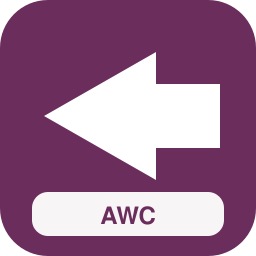

| Campo | Valor |
| --- | --- |
| Código corto | **AWC** |
| Estado | actual |
| Tipo | nacional |
| Competencia | dominante |
| Color | `#6B2D5B` / `#FFFFFF` |
| Sede | Londres Euston |
| Lands | Gran Londres, Midlands Occidentales, Noroeste de Inglaterra, Escocia |
| Servicios | `av`, `ld`, `px` |
| Eslogan | *West Coast mainline* |
| Logo | `assets/logos/awc.svg` |
| Flota | ICE 4 K1n (×29); TGV Sud-Est (×30); Thalys PBA (×46); AVE S-112 (×57); Pendolino New CH (×68); IC4 Litra MG (×24); UIC-Z1 (×35); HLE 18 + coches (×46); CAF Civity (×57); ICE 3 (livrea azul) (×65); ICE 1 (livrea nocturna) (×26); TGV Duplex (livrea azul) (×37); Stadler Giruno (livrea nocturna) (×48); AVE S-100 (livrea azul) (×54); ETR1000 Frecciarossa (livrea nocturna) (×20); Viaggio Twin (3 coches) (×26); Twindexx Swiss Express (5 coches) (×37); KISS 200 Austria (6 coches) (×48); IC4 Litra MG (livrea nocturna) (×59); UIC-Z1 (livrea nocturna) (×20); CAF Civity (livrea azul) (×31); KISS 200 (Aeropuerto) (×47) |

### c2c (`c2c`)

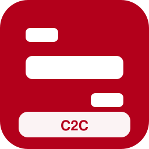

| Campo | Valor |
| --- | --- |
| Código corto | **C2C** |
| Estado | actual |
| Tipo | regional |
| Competencia | dominante |
| Color | `#B3001B` / `#FFFFFF` |
| Sede | Londres Fenchurch Street |
| Lands | Gran Londres, Este de Inglaterra |
| Servicios | `re`, `rb`, `s` |
| Eslogan | *Essex Thameside* |
| Logo | `assets/logos/c2c.svg` |
| Flota | Twindexx Vario BR 445 (×25); Regio 2N Regional (×36); FLIRT BR 429 (×47); Desiro Doble Piso (×58); Coradia Continental BR 1440.2 (×69); Régiolis Intercity (×25); Z2 Z 11500 (×41); AVG ET 2010 (×47); Desiro Classic AT (×58); LINT 41H (×19); A TER X 73500 (×30); MI2N Altéo (×41); MS70/AM70 Airport (×52); BR 480 S-Bahn BE (×63) |

### Chiltern Railways (`chl`)

| Campo | Valor |
| --- | --- |
| Código corto | **CHL** |
| Estado | actual |
| Tipo | regional |
| Competencia | dominante |
| Color | `#00A3E0` / `#FFFFFF` |
| Sede | Londres Marylebone |
| Lands | Gran Londres, Sudeste de Inglaterra, Midlands Occidentales |
| Servicios | `ld`, `re`, `rb` |
| Eslogan | ** |
| Logo | `assets/logos/chl.svg` |
| Flota | TGV Duplex (×21); Pendolino New CH (×32); ETR 500 Frecce (×43); Talgo IV/V (×54); Vectron BR 193 + coches (×65); KISS 200 (×31); Twindexx Vario BR 445 (×37); FLIRT 3 (2 puertas) (×53); FLIRT ETR 155/170 (×64); LINT 54/81 BR 620/622 (×25); MD S-599 (×36); AGC Z 27500 (×47); Series 2000 LU (×58); GTW Eléctrico AT (×64) |

### CrossCountry (`xc`)

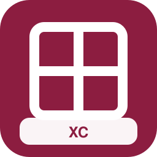

| Campo | Valor |
| --- | --- |
| Código corto | **XC** |
| Estado | actual |
| Tipo | nacional |
| Competencia | competitiva |
| Color | `#8C1D40` / `#FFFFFF` |
| Sede | Birmingham New Street |
| Lands | Gran Londres, Sudeste de Inglaterra, Sudoeste de Inglaterra, Este de Inglaterra, Midlands Orientales, Midlands Occidentales, Noroeste de Inglaterra, Noreste de Inglaterra, Yorkshire y Humber, Escocia, Gales |
| Servicios | `ld`, `ir`, `px` |
| Eslogan | ** |
| Logo | `assets/logos/xc.svg` |
| Flota | Eurostar e300 (×22); Alvia S-120/121 (×38); Viaggio Twin (×49); Loc BR 101 + coches (×60); Dosto 5ª gen IC Twindexx (×71); M7 EMU (×27); Z TER Z 21500 (×38); Viaggio Twin (6 coches) (×46); KISS 200 (3 coches) (×57); Regio 2N Omneo Premium (5 coches) (×18); ICE 4 K3s (livrea azul) (×29); ICE 2 (livrea nocturna) (×35); TGV Duplex (livrea azul) (×46); AVE S-112 (livrea nocturna) (×57); Viaggio Twin (livrea rojo) (×23); Dosto 5ª gen IC Twindexx (livrea rojo) (×34); ICE 4 K3s (Aeropuerto) (×45); KISS 200 (Aeropuerto) (×61); VIRM (3 coches) (×12); FLIRT 3 XL BR 3427 (5 coches) (×23); Régiolis Intercity (6 coches) (×34); FLIRT 4 (livrea rojo) (×45) |

### East Midlands Railway (`emr`)

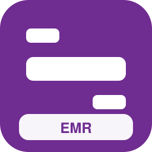

| Campo | Valor |
| --- | --- |
| Código corto | **EMR** |
| Estado | actual |
| Tipo | regional |
| Competencia | dominante |
| Color | `#6F2C91` / `#FFFFFF` |
| Sede | Derby |
| Lands | Gran Londres, Midlands Orientales, Midlands Occidentales, Yorkshire y Humber |
| Servicios | `ld`, `re`, `rb` |
| Eslogan | ** |
| Logo | `assets/logos/emr.svg` |
| Flota | Alvia S-730 (×23); IC4 Litra MG (×34); UIC-Z1 (×45); HLE 18 + coches (×56); CAF Civity (×72); VIRM (×28); FLIRT 3 BR 1428 (×44); Desiro ML 4744 (×55); Coradia Continental BR 1440.1 (×66); Régiolis Intercity (×22); Z2 Z 11500 (×38); AVG ET 2010 (×44); Desiro Classic AT (×55); LINT 41H (×66) |

### Gatwick Express (`gex`)

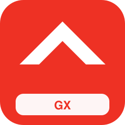

| Campo | Valor |
| --- | --- |
| Código corto | **GX** |
| Estado | actual |
| Tipo | especializado |
| Competencia | nicho |
| Color | `#EE3124` / `#FFFFFF` |
| Sede | Londres Victoria |
| Lands | Gran Londres, Sudeste de Inglaterra |
| Servicios | `ae`, `px` |
| Eslogan | ** |
| Logo | `assets/logos/gex.svg` |
| Flota | BR 490 S-Bahn HH (livrea metropolitana) (×16); AVE S-103 Velaro E (Aeropuerto) (×32); Dosto 4ª gen (Aeropuerto) (×43); Z2N (Aeropuerto) (×54); Francilien Z 50000 (Aeropuerto) (×65); Talent 2 BR 442 (Aeropuerto) (×26); ICE 4 K1n (livrea nocturna) (×32); ETR1000 Frecciarossa (livrea azul) (×43); ICE 3 Velaro D (×62); ETR1000 Frecciarossa (×23); BR 490 S-Bahn HH (5 coches) (×26) |

### Grand Central (`gc`)

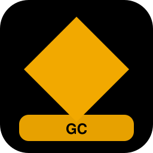

| Campo | Valor |
| --- | --- |
| Código corto | **GC** |
| Estado | actual |
| Tipo | nacional |
| Competencia | competitiva |
| Color | `#000000` / `#F2A900` |
| Sede | York |
| Lands | Gran Londres, Yorkshire y Humber, Noreste de Inglaterra |
| Servicios | `ld`, `px` |
| Eslogan | ** |
| Logo | `assets/logos/gc.svg` |
| Flota | Talgo VI (×25); Loc BR 103.1 + coches (×36); Twindexx Swiss Express (×47); AVE S-103 Velaro E (×58); Dosto 5ª gen IC Twindexx (6 coches) (×11); KISS 200 Austria (3 coches) (×22); CAF Civity (5 coches) (×33); ICE 4 K4s (livrea nocturna) (×44); TGV Atlantique (livrea azul) (×55); TGV EuroDuplex (livrea nocturna) (×16); ETR 700 Frecce (livrea azul) (×27); TEE PBA (livrea nocturna) (×38); KISS 200 Austria (livrea rojo) (×49); Alvia S-730 (Aeropuerto) (×65); AVE S-103 Velaro E (livrea azul) (×21); ETR1000 Frecciarossa (Aeropuerto) (×32); Regio 2N Gran Capacidad (Aeropuerto) (×43); MI84 (Aeropuerto) (×54); Desiro Doble Piso (Aeropuerto) (×15); ICE 4 K1n (×39); ICE TD (×45); Eurostar e320 (×56) |

### Great Northern (`gn`)

| Campo | Valor |
| --- | --- |
| Código corto | **GN** |
| Estado | actual |
| Tipo | regional |
| Competencia | dominante |
| Color | `#4B2E83` / `#FFFFFF` |
| Sede | Londres King's Cross |
| Lands | Gran Londres, Este de Inglaterra, Midlands Orientales |
| Servicios | `re`, `rb`, `s` |
| Eslogan | ** |
| Logo | `assets/logos/gn.svg` |
| Flota | Coradia Nordic (×36); Régiolis Léman Express (×42); NPZ Colibri (×53); GTW Eléctrico NL (×59); Desiro Classic DK (×20); LINT 41 BR 623 (×31); Rh 5047 (×42); MI09 (×53); BR 422 S-Bahn (×64); BR 483/484 S-Bahn BE (×25); M7 EMU (5 coches) (×33); Dosto 4ª gen (6 coches) (×44); KISS 200 (3 coches) (×55); KISS 160 (5 coches) (×16) |

### Great Western Railway (`gwr`)

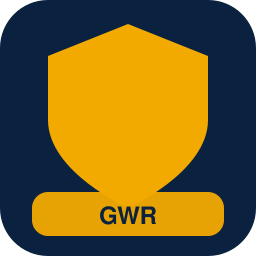

| Campo | Valor |
| --- | --- |
| Código corto | **GWR** |
| Estado | actual |
| Tipo | nacional |
| Competencia | dominante |
| Color | `#0A2240` / `#F2A900` |
| Sede | Swindon |
| Lands | Gran Londres, Sudeste de Inglaterra, Sudoeste de Inglaterra, Gales |
| Servicios | `av`, `ld`, `re`, `rb`, `n` |
| Eslogan | ** |
| Logo | `assets/logos/gwr.svg` |
| Flota | TEE PBA (×27); Traxx E 186 + coches (×38); KISS 200 Austria (×54); KISS 160 (×60); FLIRT 3 (1 puerta) (×26); GTW RABe 526.2 (×37); Coradia Continental BR 440 (×48); MD S-449 (×59); X TER X 72500 (×70); Series 2200 LU (×26); GTW Diésel AT (×37); Talent BR 644 (×48); Cercanías Civia (×59); Corail Nuit (×20); ICE 4 K4s (livrea nocturna) (×28); ICE 1 (livrea azul) (×39); TGV Réseau (livrea nocturna) (×50); Stadler Giruno (livrea azul) (×61); AVE S-112 (livrea nocturna) (×22); ETR1000 Frecciarossa (livrea azul) (×28); ETR1000 Frecciarossa (Aeropuerto) (×39); Twindexx Swiss Express (3 coches) (×55) |

### Greater Anglia (`ga`)

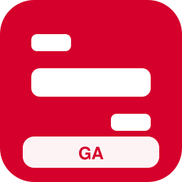

| Campo | Valor |
| --- | --- |
| Código corto | **GA** |
| Estado | actual |
| Tipo | regional |
| Competencia | dominante |
| Color | `#D5002B` / `#FFFFFF` |
| Sede | Londres Liverpool Street |
| Lands | Gran Londres, Este de Inglaterra |
| Servicios | `ld`, `re`, `rb`, `ae` |
| Eslogan | ** |
| Logo | `assets/logos/ga.svg` |
| Flota | KISS 200 (×33); Twindexx Vario BR 445 (×39); FLIRT 3 (2 puertas) (×55); FLIRT ETR 155/170 (×66); LINT 54/81 BR 620/622 (×27); MD S-599 (×38); AGC Z 27500 (×49); Series 2000 LU (×60); GTW Eléctrico AT (×66); Talent BR 643 (×27); Coradia A TER BR 641 (×38); BR 426 (×49); Dosto 5ª gen IC Twindexx (5 coches) (×57); KISS 200 (6 coches) (×18) |

### Heathrow Express (`hx`)

| Campo | Valor |
| --- | --- |
| Código corto | **HX** |
| Estado | actual |
| Tipo | especializado |
| Competencia | nicho |
| Color | `#532E8E` / `#FFFFFF` |
| Sede | Londres Paddington |
| Lands | Gran Londres |
| Servicios | `ae` |
| Eslogan | ** |
| Logo | `assets/logos/hx.svg` |
| Flota | Coradia Continental BR 440 (Aeropuerto) (×21); MS70/AM70 Airport (5 coches) (×32); MS70/AM70 Airport (livrea metropolitana) (×43); ICE T (Aeropuerto) (×54); Railjet Viaggio Comfort (Aeropuerto) (×15); KISS 160 Luxemburgo (Aeropuerto) (×26); MI09 (Aeropuerto) (×37); FLIRT 3 XL BR 3427 (Aeropuerto) (×48); Coradia Continental BR 1440.2 (Aeropuerto) (×59); BR 490 S-Bahn HH (3 coches) (×20); BR 490 S-Bahn HH (livrea azul) (×31); Pendolino New CH (Aeropuerto) (×42) |

### Hull Trains (`ht`)

| Campo | Valor |
| --- | --- |
| Código corto | **HT** |
| Estado | actual |
| Tipo | nacional |
| Competencia | competitiva |
| Color | `#E87722` / `#FFFFFF` |
| Sede | Hull |
| Lands | Gran Londres, Midlands Orientales, Yorkshire y Humber |
| Servicios | `ld`, `px` |
| Eslogan | ** |
| Logo | `assets/logos/ht.svg` |
| Flota | Viaggio Twin (6 coches) (×22); KISS 200 (3 coches) (×33); Regio 2N Omneo Premium (5 coches) (×44); ICE 4 K3s (livrea azul) (×60); ICE 2 (livrea nocturna) (×16); TGV Duplex (livrea azul) (×27); AVE S-112 (livrea nocturna) (×38); Viaggio Twin (livrea rojo) (×49); Dosto 5ª gen IC Twindexx (livrea rojo) (×60); ICE 4 K3s (Aeropuerto) (×26); KISS 200 (Aeropuerto) (×37); ICE 3 Velaro D (Aeropuerto) (×43); KISS 160 (Aeropuerto) (×54); MI2N Eole (Aeropuerto) (×15); FLIRT 3 (2 puertas) (Aeropuerto) (×26); Coradia Continental BR 1440.1 (Aeropuerto) (×37); ICE 2 (×56); TGV EuroDuplex (×67); ICN (×28); ETR 600 Pendolino (×44); TEE PBA (×50); Traxx E 186 + coches (×61) |

### LNER (`lner`)

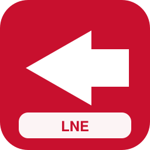

| Campo | Valor |
| --- | --- |
| Código corto | **LNER** |
| Estado | actual |
| Tipo | nacional |
| Competencia | dominante |
| Color | `#C8102E` / `#FFFFFF` |
| Sede | York |
| Lands | Gran Londres, Este de Inglaterra, Yorkshire y Humber, Noreste de Inglaterra, Escocia |
| Servicios | `av`, `ld`, `px` |
| Eslogan | ** |
| Logo | `assets/logos/lner.svg` |
| Flota | ICE 4 K3s (livrea nocturna) (×33); ICE 2 (livrea azul) (×39); TGV Atlantique (livrea nocturna) (×50); TGV POS (livrea azul) (×56); AVE S-102 (livrea nocturna) (×17); ETR 700 Frecce (livrea azul) (×33); Thalys TMST Izy (Aeropuerto) (×44); Dosto 5ª gen IC Twindexx (5 coches) (×50); KISS 200 (6 coches) (×11); CAF Civity (3 coches) (×22); Talgo IV/V (livrea nocturna) (×33); KISS 200 (livrea rojo) (×44); ETR 600 Pendolino (Aeropuerto) (×60); KISS 160 (Aeropuerto) (×16); MI2N Eole (Aeropuerto) (×27); FLIRT 3 (2 puertas) (Aeropuerto) (×38); Coradia Continental BR 1440.1 (Aeropuerto) (×49); ICE 3 Velaro D (×73); TGV EuroDuplex (×34); Stadler Giruno (×45); ETR1000 Frecciarossa (×56); Alvia S-120/121 (×62) |

### London Northwestern Railway (`lnw`)

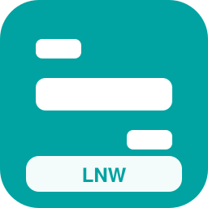

| Campo | Valor |
| --- | --- |
| Código corto | **LNW** |
| Estado | actual |
| Tipo | regional |
| Competencia | dominante |
| Color | `#00A3A1` / `#FFFFFF` |
| Sede | Birmingham |
| Lands | Gran Londres, Sudeste de Inglaterra, Midlands Occidentales, Noroeste de Inglaterra |
| Servicios | `re`, `rb`, `ld` |
| Eslogan | ** |
| Logo | `assets/logos/lnw.svg` |
| Flota | Talent BR 643 (×32); Coradia A TER BR 641 (×43); BR 426 (×54); ICE T (×65); Thalys PBA (×26); Alvia S-730 (×37); IC4 Litra MG (×48); UIC-Z1 (×59); HLE 18 + coches (×20); Dosto 5ª gen IC Twindexx (6 coches) (×28); Twindexx Vario BR 445 (3 coches) (×34); KISS 200 Austria (5 coches) (×50); KISS 160 Luxemburgo (6 coches) (×56); Regio 2N Regional (3 coches) (×22) |

### Merseyrail (`mer`)

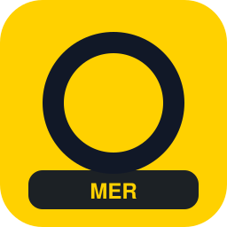

| Campo | Valor |
| --- | --- |
| Código corto | **MER** |
| Estado | actual |
| Tipo | metropolitano |
| Competencia | dominante |
| Color | `#FFD100` / `#111827` |
| Sede | Liverpool |
| Lands | Noroeste de Inglaterra |
| Servicios | `s`, `or`, `rb` |
| Eslogan | ** |
| Logo | `assets/logos/mer.svg` |
| Flota | Talent BR 644 (×33); Coradia Continental BR 1440.0 (×44); AGC X 76500 (×55); Rh 5047 (×66); Dosto 4ª gen (5 coches) (×19); KISS 200 (6 coches) (×30); VIRM (3 coches) (×41); Z2N (5 coches) (×52); MI2N Altéo (6 coches) (×18); MI79 (3 coches) (×24); Francilien Z 50000 (5 coches) (×40); FLIRT 4 (6 coches) (×51); Desiro ML 4746 (3 coches) (×62); Talent 2 BR 442 (5 coches) (×23); Coradia Continental BR 440 (6 coches) (×34); Coradia Nordic (3 coches) (×45) |

### Northern (`nor`)

| Campo | Valor |
| --- | --- |
| Código corto | **NOR** |
| Estado | actual |
| Tipo | regional |
| Competencia | dominante |
| Color | `#000066` / `#FFFFFF` |
| Sede | York |
| Lands | Noroeste de Inglaterra, Yorkshire y Humber, Noreste de Inglaterra, Midlands Orientales |
| Servicios | `re`, `rb`, `rl`, `s` |
| Eslogan | ** |
| Logo | `assets/logos/nor.svg` |
| Flota | A TER X 73500 (×39); MI2N Altéo (×45); MS70/AM70 Airport (×56); BR 480 S-Bahn BE (×67); Aventra Class 710 (×28); Dosto 4ª gen (3 coches) (×36); Twindexx Vario BR 445 (5 coches) (×47); KISS 200 Austria (6 coches) (×53); VIRM (3 coches) (×19); Regio 2N Regional (5 coches) (×30); FLIRT 4 (6 coches) (×46); FLIRT 3 XL BR 3427 (3 coches) (×52); FLIRT BR 429 (5 coches) (×63); FLIRT RABe 522/523 (6 coches) (×24) |

### ScotRail (`sco`)

| Campo | Valor |
| --- | --- |
| Código corto | **SCO** |
| Estado | actual |
| Tipo | regional |
| Competencia | dominante |
| Color | `#001E60` / `#5BC2E7` |
| Sede | Glasgow |
| Lands | Escocia |
| Servicios | `ld`, `re`, `rb`, `rl`, `s` |
| Eslogan | ** |
| Logo | `assets/logos/sco.svg` |
| Flota | MD S-599 (×40); AGC Z 27500 (×51); Series 2000 LU (×62); GTW Eléctrico AT (×73); Talent BR 643 (×34); Coradia A TER BR 641 (×45); BR 426 (×56); MI84 (×62); BR 430 S-Bahn (×23); BR 490 S-Bahn HH (×34); Dosto 5ª gen IC Twindexx (3 coches) (×42); KISS 200 (5 coches) (×58); Regio 2N Omneo Premium (6 coches) (×64); ICE 4 K3s (livrea nocturna) (×20) |

### Southeastern (`se`)

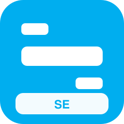

| Campo | Valor |
| --- | --- |
| Código corto | **SE** |
| Estado | actual |
| Tipo | regional |
| Competencia | dominante |
| Color | `#00AEEF` / `#FFFFFF` |
| Sede | Londres |
| Lands | Gran Londres, Sudeste de Inglaterra |
| Servicios | `av`, `re`, `rb`, `s` |
| Eslogan | ** |
| Logo | `assets/logos/se.svg` |
| Flota | GTW Diésel AT (×36); Talent BR 644 (×47); Cercanías Civia (×63); Z2N (×19); Francilien Z 50000 (×30); BR 472 S-Bahn HH (×41); BR 490.3 S-Bahn HH (×52); ICE 4 K4s (livrea azul) (×55); ICE 2 (livrea nocturna) (×16); TGV Réseau (livrea azul) (×27); TGV POS (livrea nocturna) (×38); AVE S-112 (livrea azul) (×49); ETR 700 Frecce (livrea nocturna) (×60); AVE S-103 Velaro E (Aeropuerto) (×21) |

### Southern (`sn`)

| Campo | Valor |
| --- | --- |
| Código corto | **SN** |
| Estado | actual |
| Tipo | regional |
| Competencia | dominante |
| Color | `#8CC63F` / `#FFFFFF` |
| Sede | Croydon |
| Lands | Gran Londres, Sudeste de Inglaterra |
| Servicios | `re`, `rb`, `s`, `ae` |
| Eslogan | ** |
| Logo | `assets/logos/sn.svg` |
| Flota | BR 423 S-Bahn (×37); BR 481 S-Bahn BE (×48); M7 EMU (3 coches) (×56); Dosto 4ª gen (5 coches) (×17); Twindexx Vario BR 445 (6 coches) (×28); KISS 160 (3 coches) (×39); VIRM (5 coches) (×50); Regio 2N Regional (6 coches) (×61); FLIRT 3 (2 puertas) (3 coches) (×27); FLIRT 3 XL BR 3427 (5 coches) (×33); FLIRT BR 429 (6 coches) (×44); FLIRT ETR 155/170 (3 coches) (×55); Desiro ML 4746 (5 coches) (×21); Desiro Doble Piso (6 coches) (×27) |

### South Western Railway (`swr`)

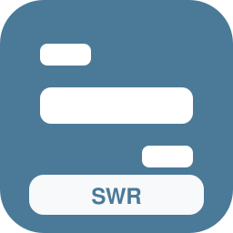

| Campo | Valor |
| --- | --- |
| Código corto | **SWR** |
| Estado | actual |
| Tipo | regional |
| Competencia | dominante |
| Color | `#4B7A99` / `#FFFFFF` |
| Sede | Londres Waterloo |
| Lands | Gran Londres, Sudeste de Inglaterra, Sudoeste de Inglaterra |
| Servicios | `ld`, `re`, `rb`, `s` |
| Eslogan | ** |
| Logo | `assets/logos/swr.svg` |
| Flota | Series 2200 LU (×43); GTW Diésel AT (×49); Talent BR 644 (×60); Cercanías Civia (×26); Z2N (×32); Francilien Z 50000 (×43); BR 472 S-Bahn HH (×54); BR 490.3 S-Bahn HH (×65); Dosto 5ª gen IC Twindexx (5 coches) (×23); KISS 200 (6 coches) (×39); CAF Civity (3 coches) (×45); ICE 4 K4s (livrea azul) (×51); ICE 1 (livrea nocturna) (×12); TGV EuroDuplex (livrea azul) (×23) |

### Thameslink (`tl`)

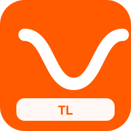

| Campo | Valor |
| --- | --- |
| Código corto | **TL** |
| Estado | actual |
| Tipo | metropolitano |
| Competencia | dominante |
| Color | `#FF5A00` / `#FFFFFF` |
| Sede | Londres |
| Lands | Gran Londres, Sudeste de Inglaterra, Este de Inglaterra |
| Servicios | `s`, `mc`, `re`, `or` |
| Eslogan | ** |
| Logo | `assets/logos/tl.svg` |
| Flota | VIRM (3 coches) (×36); Z2N (5 coches) (×42); MI2N Altéo (6 coches) (×58); MI79 (3 coches) (×14); Francilien Z 50000 (5 coches) (×30); FLIRT 4 (6 coches) (×41); Desiro ML 4746 (3 coches) (×52); Talent 2 BR 442 (5 coches) (×63); Coradia Continental BR 440 (6 coches) (×24); Coradia Nordic (3 coches) (×35); Régiolis Suburban (5 coches) (×46); Rh 4020 (6 coches) (×52); BR 423 S-Bahn (3 coches) (×18); BR 424 S-Bahn (5 coches) (×24); BR 426 (6 coches) (×35); BR 474 S-Bahn HH (3 coches) (×46) |

### TransPennine Express (`tpe`)

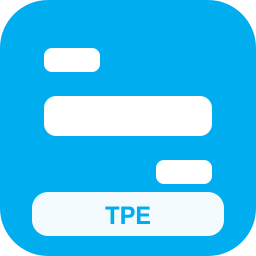

| Campo | Valor |
| --- | --- |
| Código corto | **TPE** |
| Estado | actual |
| Tipo | nacional |
| Competencia | competitiva |
| Color | `#00ADEF` / `#FFFFFF` |
| Sede | Manchester |
| Lands | Noroeste de Inglaterra, Yorkshire y Humber, Noreste de Inglaterra, Escocia |
| Servicios | `ld`, `ir`, `px` |
| Eslogan | ** |
| Logo | `assets/logos/tpe.svg` |
| Flota | AVE S-112 (livrea azul) (×32); Railjet Viaggio Comfort (livrea nocturna) (×48); IC 901 (livrea nocturna) (×54); ICE 4 K1n (Aeropuerto) (×20); Vectron E 193 + coches (Aeropuerto) (×31); Dosto 4ª gen (6 coches) (×37); FLIRT 3 XL BR 3427 (3 coches) (×48); Régiolis Intercity (5 coches) (×59); VIRM (livrea rojo) (×20); Coradia Continental BR 1440.3 (livrea rojo) (×31); Z TER Z 21500 (livrea azul) (×42); ICE 3 Velaro D (livrea azul) (×53); Thalys TMST Izy (Aeropuerto) (×14); Z2N (Aeropuerto) (×25); Francilien Z 50000 (Aeropuerto) (×36); Coradia Continental BR 440 (Aeropuerto) (×47); ICE 3 (×66); TGV Duplex (×27); Pendolino New CH (×43); ETR 500 Frecce (×49); Talgo IV/V (×60); Vectron BR 193 + coches (×26) |

### Transport for Wales (`tfw`)

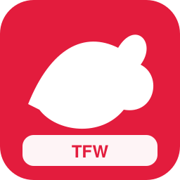

| Campo | Valor |
| --- | --- |
| Código corto | **TFW** |
| Estado | actual |
| Tipo | regional |
| Competencia | dominante |
| Color | `#E31C3D` / `#FFFFFF` |
| Sede | Cardiff |
| Lands | Gales, Midlands Occidentales, Noroeste de Inglaterra |
| Servicios | `ld`, `re`, `rb`, `rl` |
| Eslogan | ** |
| Logo | `assets/logos/tfw.svg` |
| Flota | Regio-Shuttle BR 650 (×46); AGC X 76500 (×57); Viaggio Twin (5 coches) (×55); Twindexx Swiss Express (6 coches) (×21); Regio 2N Omneo Premium (3 coches) (×32); ICE 4 K1n (livrea nocturna) (×38); ICE 2 (livrea azul) (×49); TGV Réseau (livrea nocturna) (×60); AVE S-112 (livrea azul) (×21); Railjet Viaggio Comfort (livrea nocturna) (×32); IC 901 (livrea nocturna) (×43); ICE 4 K1n (Aeropuerto) (×54); Vectron E 193 + coches (Aeropuerto) (×15); Dosto 4ª gen (6 coches) (×26) |

### West Midlands Railway (`wmr`)

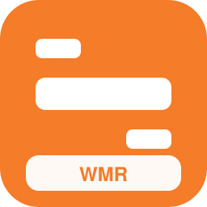

| Campo | Valor |
| --- | --- |
| Código corto | **WMR** |
| Estado | actual |
| Tipo | regional |
| Competencia | dominante |
| Color | `#F57C28` / `#FFFFFF` |
| Sede | Birmingham |
| Lands | Midlands Occidentales |
| Servicios | `re`, `rb`, `s` |
| Eslogan | ** |
| Logo | `assets/logos/wmr.svg` |
| Flota | Twindexx Swiss Express (6 coches) (×34); KISS 200 Austria (3 coches) (×45); KISS 160 Luxemburgo (5 coches) (×61); Regio 2N Omneo Premium (6 coches) (×17); FLIRT 4 (3 coches) (×38); FLIRT 3 (1 puerta) (5 coches) (×44); FLIRT 3 BR 1428 (6 coches) (×55); FLIRT RABe 522/523 (3 coches) (×16); GTW RABe 526.2 (5 coches) (×27); Desiro ML 4744 (6 coches) (×38); Mireo BR 463 (3 coches) (×54); Coradia Continental BR 440 (5 coches) (×65); Coradia Continental BR 1440.1 (6 coches) (×26); Coradia Nordic (3 coches) (×37) |

### Elizabeth line (`liz`)

| Campo | Valor |
| --- | --- |
| Código corto | **LIZ** |
| Estado | actual |
| Tipo | metropolitano |
| Competencia | dominante |
| Color | `#6950A1` / `#FFFFFF` |
| Sede | Londres |
| Lands | Gran Londres, Sudeste de Inglaterra, Este de Inglaterra |
| Servicios | `s`, `mc`, `ae` |
| Eslogan | ** |
| Logo | `assets/logos/liz.svg` |
| Flota | Mireo BR 463 (5 coches) (×35); Coradia Continental BR 1440.1 (6 coches) (×46); Cercanías Civia (3 coches) (×57); Régiolis Léman Express (5 coches) (×18); Series 2200 LU (6 coches) (×29); BR 422 S-Bahn (3 coches) (×40); BR 425 Regional/S (5 coches) (×51); BR 430 S-Bahn (6 coches) (×12); BR 480 S-Bahn BE (3 coches) (×23); BR 483/484 S-Bahn BE (5 coches) (×39); BR 490 S-Bahn HH (6 coches) (×50); Aventra Class 710 (3 coches) (×61); KISS 160 (livrea rojo) (×17); Regio 2N Gran Capacidad (livrea rojo) (×28); MI2N Altéo (livrea metropolitana) (×39); MI79 (livrea rojo) (×50) |

### London Overground (`lo`)

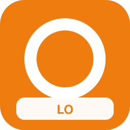

| Campo | Valor |
| --- | --- |
| Código corto | **LO** |
| Estado | actual |
| Tipo | metropolitano |
| Competencia | dominante |
| Color | `#EE7C0E` / `#FFFFFF` |
| Sede | Londres |
| Lands | Gran Londres |
| Servicios | `s`, `or`, `mc` |
| Eslogan | ** |
| Logo | `assets/logos/lo.svg` |
| Flota | Coradia Continental BR 1440.1 (3 coches) (×36); Coradia Nordic (5 coches) (×47); Régiolis Suburban (6 coches) (×58); Series 2200 LU (3 coches) (×19); BR 423 S-Bahn (5 coches) (×35); BR 424 S-Bahn (6 coches) (×41); BR 430 S-Bahn (3 coches) (×57); BR 474 S-Bahn HH (5 coches) (×13); BR 481 S-Bahn BE (6 coches) (×29); BR 490 S-Bahn HH (3 coches) (×35); S-tog SA/SE (5 coches) (×51); Twindexx Vario BR 445 (livrea rojo) (×57); KISS 160 Luxemburgo (livrea metropolitana) (×18); MI2N Altéo (livrea rojo) (×34); MI09 (livrea azul) (×40); MI84 (livrea metropolitana) (×51) |

### Caledonian Sleeper (`csl`)

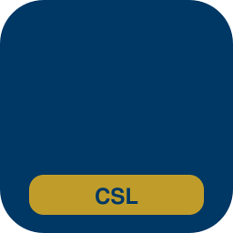

| Campo | Valor |
| --- | --- |
| Código corto | **CSL** |
| Estado | actual |
| Tipo | especializado |
| Competencia | nicho |
| Color | `#003865` / `#C9A227` |
| Sede | Inverness |
| Lands | Gran Londres, Noroeste de Inglaterra, Escocia |
| Servicios | `n` |
| Eslogan | ** |
| Logo | `assets/logos/csl.svg` |
| Flota | Talgo IV/V (livrea nocturna) (×37); Talgo IV/V (×56); Talgo VI (livrea nocturna) (×59); Talgo VI (×28); Railjet Viaggio Comfort (livrea nocturna) (×31); Railjet Viaggio Comfort (×50); Nocturno Viaggio (×61); Railjet Viaggio Comfort (Aeropuerto) (×14); Vectron BR 193 + coches (×33); Nocturno Viaggio (livrea nocturna) (×36); Loc BR 101 + coches (×55); UIC-Z1 (livrea nocturna) (×58) |

### Lumo (`lumo`)

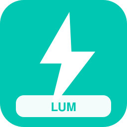

| Campo | Valor |
| --- | --- |
| Código corto | **LUMO** |
| Estado | actual |
| Tipo | nacional |
| Competencia | competitiva |
| Color | `#00C7B1` / `#FFFFFF` |
| Sede | Newcastle |
| Lands | Gran Londres, Noreste de Inglaterra, Escocia |
| Servicios | `ld`, `px` |
| Eslogan | ** |
| Logo | `assets/logos/lumo.svg` |
| Flota | ETR1000 Frecciarossa (Aeropuerto) (×38); Regio 2N Gran Capacidad (Aeropuerto) (×49); MI84 (Aeropuerto) (×60); Desiro Doble Piso (Aeropuerto) (×21); ICE 4 K1n (×45); ICE TD (×51); Eurostar e320 (×62); Alvia S-130 (×23); Railjet Viaggio Comfort (×39); IC 901 (×45); HLE 13 + coches (×56); ICE 3 Velaro D (×67); Dosto 5ª gen IC Twindexx (3 coches) (×20); KISS 200 (5 coches) (×31); Regio 2N Omneo Premium (6 coches) (×42); ICE 4 K3s (livrea nocturna) (×58); ICE 1 (livrea azul) (×14); TGV Duplex (livrea nocturna) (×25); ETR 500 Frecce (livrea azul) (×36); Talgo VI (livrea nocturna) (×47); Twindexx Swiss Express (livrea rojo) (×58); ICE T (Aeropuerto) (×24) |

### Eurostar (`eur`)

| Campo | Valor |
| --- | --- |
| Código corto | **EUR** |
| Estado | actual |
| Tipo | internacional |
| Competencia | nicho |
| Color | `#001F5B` / `#FFD100` |
| Sede | Londres St Pancras |
| Lands | Gran Londres, Sudeste de Inglaterra |
| Servicios | `av`, `ld` |
| Eslogan | ** |
| Logo | `assets/logos/eur.svg` |
| Flota | CAF Civity (livrea azul) (×39); KISS 200 (Aeropuerto) (×50); ICE 1 (×24); Thalys PBKA (×35); AVE S-102 (×41); ICE TD (×52); ETR 600 Pendolino (×63); EW IV (×24); Vectron E 193 + coches (×35); Regio 2N Omneo Premium (×46); ICE 4 K4s (livrea nocturna) (×54); ICE 1 (livrea azul) (×65); TGV Réseau (livrea nocturna) (×26); Stadler Giruno (livrea azul) (×37); AVE S-112 (livrea nocturna) (×48); ETR1000 Frecciarossa (livrea azul) (×54) |

### Stansted Express (`stx`)

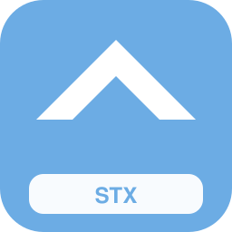

| Campo | Valor |
| --- | --- |
| Código corto | **STX** |
| Estado | actual |
| Tipo | especializado |
| Competencia | nicho |
| Color | `#6CACE4` / `#FFFFFF` |
| Sede | Londres Liverpool Street |
| Lands | Gran Londres, Este de Inglaterra |
| Servicios | `ae` |
| Eslogan | ** |
| Logo | `assets/logos/stx.svg` |
| Flota | MI2N Eole (Aeropuerto) (×40); FLIRT 3 (2 puertas) (Aeropuerto) (×51); Coradia Continental BR 1440.1 (Aeropuerto) (×12); MS70/AM70 Airport (6 coches) (×23); BR 490 S-Bahn HH (livrea rojo) (×34); Thalys TMST Izy (Aeropuerto) (×45); Vectron E 193 + coches (Aeropuerto) (×56); VIRM (Aeropuerto) (×17); MI79 (Aeropuerto) (×28); Desiro ML 4746 (Aeropuerto) (×39); Coradia Nordic (Aeropuerto) (×50); BR 490 S-Bahn HH (5 coches) (×11) |

### NI Railways (`nir`)

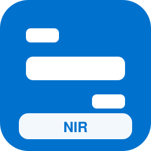

| Campo | Valor |
| --- | --- |
| Código corto | **NIR** |
| Estado | actual |
| Tipo | regional |
| Competencia | dominante |
| Color | `#0072CE` / `#FFFFFF` |
| Sede | Belfast |
| Lands | Irlanda del Norte |
| Servicios | `ld`, `re`, `rb`, `s` |
| Eslogan | ** |
| Logo | `assets/logos/nir.svg` |
| Flota | Dosto 5ª gen IC Twindexx (3 coches) (×46); KISS 200 (5 coches) (×62); Regio 2N Omneo Premium (6 coches) (×18); ICE 4 K3s (livrea nocturna) (×24); ICE 1 (livrea azul) (×35); TGV Duplex (livrea nocturna) (×46); ETR 500 Frecce (livrea azul) (×57); Talgo VI (livrea nocturna) (×18); Twindexx Swiss Express (livrea rojo) (×34); ICE T (Aeropuerto) (×40); M7 EMU (3 coches) (×56); Twindexx Vario BR 445 (5 coches) (×17); KISS 160 Luxemburgo (6 coches) (×28); Regio 2N Gran Capacidad (3 coches) (×39) |

### London Underground (`lu`)

| Campo | Valor |
| --- | --- |
| Código corto | **LU** |
| Estado | actual |
| Tipo | urbano |
| Competencia | dominante |
| Color | `#E32017` / `#FFFFFF` |
| Sede | Londres |
| Lands | Gran Londres |
| Servicios | `u` |
| Eslogan | ** |
| Logo | `assets/logos/lu.svg` |
| Flota | MI09 (livrea metropolitana) (×42); MI09 (×61); MI09 (5 coches) (×14); Metro MP89 (livrea metropolitana) (×25); Metro MP89 (×44); MI09 (livrea azul) (×47); MI09 (Aeropuerto) (×58); MI09 (3 coches) (×19); Metro MIVB Mx (livrea metropolitana) (×30); Metro MIVB Mx (×49) |

### Docklands Light Railway (`dlr`)

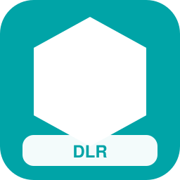

| Campo | Valor |
| --- | --- |
| Código corto | **DLR** |
| Estado | actual |
| Tipo | urbano |
| Competencia | dominante |
| Color | `#00A4A7` / `#FFFFFF` |
| Sede | Londres |
| Lands | Gran Londres |
| Servicios | `u`, `t` |
| Eslogan | ** |
| Logo | `assets/logos/dlr.svg` |
| Flota | Metro MP05 (×51); Flexity Swift A32 (×62); AVG ET 2010 (×23); MI09 (livrea azul) (×26); MI09 (Aeropuerto) (×37); Citadis 401 (livrea metropolitana) (×48); Tram Albatros (livrea metropolitana) (×59); Metro MX3000 (×28); Citadis 502 (×39); PCC 7700 (×50) |

### London Trams (`ltr`)

| Campo | Valor |
| --- | --- |
| Código corto | **LTR** |
| Estado | actual |
| Tipo | urbano |
| Competencia | dominante |
| Color | `#84B817` / `#FFFFFF` |
| Sede | Croydon |
| Lands | Gran Londres |
| Servicios | `t` |
| Eslogan | ** |
| Logo | `assets/logos/ltr.svg` |
| Flota | Tram Hermelijn (livrea metropolitana) (×44); Citadis 502 (×63); PCC 7700 (×24); AVG ET 2010 (5 coches) (×27); Citadis 502 (livrea metropolitana) (×38); PCC 7700 (livrea metropolitana) (×49); Flexity (×68); PCC 7900 (×29); AVG ET 2010 (6 coches) (×32); Flexity (livrea metropolitana) (×43) |

### Manchester Metrolink (`mm`)

| Campo | Valor |
| --- | --- |
| Código corto | **MM** |
| Estado | actual |
| Tipo | urbano |
| Competencia | dominante |
| Color | `#FFCC00` / `#111827` |
| Sede | Manchester |
| Lands | Noroeste de Inglaterra |
| Servicios | `t`, `tt` |
| Eslogan | ** |
| Logo | `assets/logos/mm.svg` |
| Flota | CAF Urbos A35/A36 (×53); Stadler Tram-Train 398 (×69); Stadler Tram-Train 398 (5 coches) (×22); Flexity Swift A32 (livrea metropolitana) (×33); Flexity M5000 (livrea metropolitana) (×44); Citadis 401 (×58); Tram Albatros (×19); Flexity M5000 (×35); Stadler Tram-Train 398 (6 coches) (×38); CAF Urbos A35/A36 (livrea metropolitana) (×44) |

### Sheffield Supertram (`sst`)

| Campo | Valor |
| --- | --- |
| Código corto | **SST** |
| Estado | actual |
| Tipo | urbano |
| Competencia | dominante |
| Color | `#C9AB55` / `#FFFFFF` |
| Sede | Sheffield |
| Lands | Yorkshire y Humber |
| Servicios | `t`, `tt` |
| Eslogan | ** |
| Logo | `assets/logos/sst.svg` |
| Flota | TEC LRV 6100 (×59); AVG ET 2010 (6 coches) (×62); Flexity (livrea metropolitana) (×23); PCC 7900 (livrea metropolitana) (×29); Talent 4024 (livrea azul) (×40); Flexity Swift A32 (×64); AVG ET 2010 (×25); Stadler Tram-Train 398 (3 coches) (×28); Flexity Classic NGT6 (livrea metropolitana) (×34); TEC LRV 6100 (livrea metropolitana) (×50) |

### Nottingham Express Transit (`net`)

| Campo | Valor |
| --- | --- |
| Código corto | **NET** |
| Estado | actual |
| Tipo | urbano |
| Competencia | dominante |
| Color | `#83846E` / `#FFFFFF` |
| Sede | Nottingham |
| Lands | Midlands Orientales |
| Servicios | `t` |
| Eslogan | ** |
| Logo | `assets/logos/net.svg` |
| Flota | PCC 7900 (×55); AVG ET 2010 (6 coches) (×58); Flexity (livrea metropolitana) (×19); PCC 7900 (livrea metropolitana) (×30); Flexity Classic NGT6 (×49); TEC LRV 6100 (×60); Stadler Tram-Train 398 (3 coches) (×13); Flexity Classic NGT6 (livrea metropolitana) (×24); TEC LRV 6100 (livrea metropolitana) (×35); Flexity Swift A32 (×54) |

### West Midlands Metro (`wmm`)

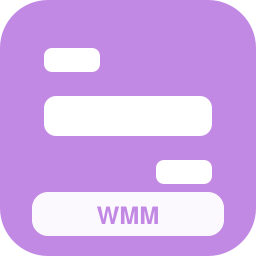

| Campo | Valor |
| --- | --- |
| Código corto | **WMM** |
| Estado | actual |
| Tipo | urbano |
| Competencia | dominante |
| Color | `#C188E4` / `#FFFFFF` |
| Sede | Birmingham |
| Lands | Midlands Occidentales |
| Servicios | `t`, `tt` |
| Eslogan | ** |
| Logo | `assets/logos/wmm.svg` |
| Flota | Stadler Tram-Train 398 (6 coches) (×53); CAF Urbos A35/A36 (livrea metropolitana) (×59); Talent 4024 (3 coches) (×20); Citadis 402 (×44); Tram Hermelijn (×50); Talent 4024 (×61); Citadis 401 (livrea metropolitana) (×14); Tram Albatros (livrea metropolitana) (×25); Talent 4024 (5 coches) (×36); Citadis 502 (×55) |

### Edinburgh Trams (`edt`)

| Campo | Valor |
| --- | --- |
| Código corto | **EDT** |
| Estado | actual |
| Tipo | urbano |
| Competencia | dominante |
| Color | `#8A1538` / `#FFFFFF` |
| Sede | Edimburgo |
| Lands | Escocia |
| Servicios | `t`, `ae` |
| Eslogan | ** |
| Logo | `assets/logos/edt.svg` |
| Flota | Flexity M5000 (×57); Stadler Tram-Train 398 (5 coches) (×60); Flexity Swift A32 (livrea metropolitana) (×21); Flexity M5000 (livrea metropolitana) (×32); MS70/AM70 Airport (livrea rojo) (×43); ICE 4 K3s (Aeropuerto) (×54); ETR 600 Pendolino (Aeropuerto) (×15); KISS 200 (Aeropuerto) (×26); MI2N Altéo (Aeropuerto) (×37); FLIRT 4 (Aeropuerto) (×48) |

### Tyne and Wear Metro (`twm`)

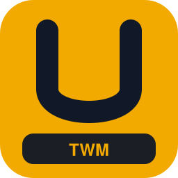

| Campo | Valor |
| --- | --- |
| Código corto | **TWM** |
| Estado | actual |
| Tipo | urbano |
| Competencia | dominante |
| Color | `#F2A900` / `#111827` |
| Sede | Newcastle |
| Lands | Noreste de Inglaterra |
| Servicios | `u`, `s` |
| Eslogan | ** |
| Logo | `assets/logos/twm.svg` |
| Flota | BR 481 S-Bahn BE (6 coches) (×50); BR 490 S-Bahn HH (3 coches) (×11); S-tog SA/SE (5 coches) (×22); Twindexx Vario BR 445 (livrea rojo) (×33); KISS 160 Luxemburgo (livrea metropolitana) (×44); MI2N Altéo (livrea rojo) (×55); MI79 (livrea azul) (×16); Francilien Z 50000 (livrea metropolitana) (×27); FLIRT 3 (2 puertas) (livrea rojo) (×38); Desiro ML 4746 (livrea azul) (×49) |

### Glasgow Subway (`gls`)

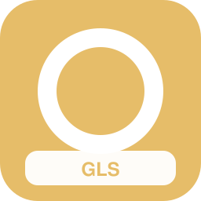

| Campo | Valor |
| --- | --- |
| Código corto | **GLS** |
| Estado | actual |
| Tipo | urbano |
| Competencia | dominante |
| Color | `#E6BD69` / `#FFFFFF` |
| Sede | Glasgow |
| Lands | Escocia |
| Servicios | `u` |
| Eslogan | ** |
| Logo | `assets/logos/gls.svg` |
| Flota | Metro MIVB Mx (×59); MI09 (livrea rojo) (×12); Metro MF01 (livrea metropolitana) (×23); Metro MF01 (×42); Metro MX3000 (livrea metropolitana) (×45); Metro MX3000 (×64); MI09 (6 coches) (×17); Metro MP05 (livrea metropolitana) (×28); Metro MP05 (×47); MI09 (livrea metropolitana) (×50) |

### Blackpool Tramway (`btr`)

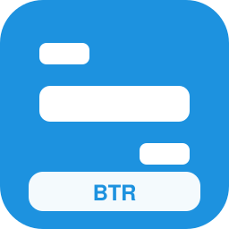

| Campo | Valor |
| --- | --- |
| Código corto | **BTR** |
| Estado | actual |
| Tipo | urbano |
| Competencia | nicho |
| Color | `#1D92DF` / `#FFFFFF` |
| Sede | Blackpool |
| Lands | Noroeste de Inglaterra |
| Servicios | `t`, `tur` |
| Eslogan | ** |
| Logo | `assets/logos/btr.svg` |
| Flota | Stadler Tram-Train 398 (×60); AutoShuttle CH (×21); Citadis 401 (livrea metropolitana) (×24); Tram Albatros (livrea metropolitana) (×35); GTW Diésel NL (5 coches) (×46); Citadis 401 (×65); Tram Albatros (×26); Flexity M5000 (×37); AVG ET 2010 (3 coches) (×40); Citadis 402 (livrea metropolitana) (×51) |

### Island Line (`isl`)

| Campo | Valor |
| --- | --- |
| Código corto | **ISL** |
| Estado | actual |
| Tipo | regional |
| Competencia | nicho |
| Color | `#4DDC4B` / `#FFFFFF` |
| Sede | Ryde |
| Lands | Sudeste de Inglaterra |
| Servicios | `rb`, `rl` |
| Eslogan | ** |
| Logo | `assets/logos/isl.svg` |
| Flota | Rh 4020 (5 coches) (×53); Series 2000 LU (6 coches) (×14); Regio 2N Regional (livrea rojo) (×25); FLIRT 3 (1 puerta) (livrea rojo) (×36); FLIRT BR 429 (livrea azul) (×47); FLIRT RABe 522/523 (livrea verde) (×58); GTW Diésel AT (livrea verde) (×24); Desiro ML 4744 (livrea azul) (×30); Desiro Classic BR 642 (livrea verde) (×46); Talent BR 643 (livrea rojo) (×57); Talent 2 BR 442 (livrea azul) (×13); LINT 41 BR 648 (livrea verde) (×29); Coradia Continental BR 1440.0 (livrea rojo) (×35); Coradia Nordic (livrea azul) (×46) |

### Great British Railways (`gbr`)

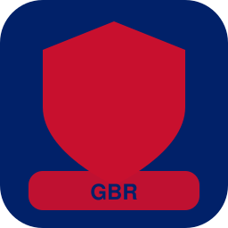

| Campo | Valor |
| --- | --- |
| Código corto | **GBR** |
| Estado | futuro |
| Tipo | nacional |
| Competencia | dominante |
| Color | `#012169` / `#C8102E` |
| Sede | Derby |
| Lands | Gran Londres, Sudeste de Inglaterra, Sudoeste de Inglaterra, Este de Inglaterra, Midlands Orientales, Midlands Occidentales, Noroeste de Inglaterra, Noreste de Inglaterra, Yorkshire y Humber, Escocia, Gales |
| Servicios | `av`, `ld`, `ir`, `re`, `px` |
| Eslogan | *La red nacional unificada* |
| Logo | `assets/logos/gbr.svg` |
| Flota | Régiolis Intercity (3 coches) (×59); Dosto 4ª gen (livrea rojo) (×20); FLIRT 3 XL BR 3427 (livrea verde) (×31); Z TER Z 21500 (livrea rojo) (×42); FLIRT 3 XL BR 3427 (Aeropuerto) (×58); KISS 160 Luxemburgo (3 coches) (×59); Regio 2N Gran Capacidad (5 coches) (×20); FLIRT 3 (1 puerta) (6 coches) (×31); FLIRT RABe 524 (3 coches) (×42); FLIRT ETR 155/170 (5 coches) (×53); Desiro ML 4746 (6 coches) (×14); Talent 2 BR 442 (3 coches) (×25); LINT 54/81 BR 620/622 (5 coches) (×36); Coradia Continental BR 1440.0 (6 coches) (×47); Coradia Nordic (3 coches) (×58); MD S-449 (5 coches) (×19); Régiolis Suburban (6 coches) (×30); AGC Z 27500 (3 coches) (×41); Z2 Z 11500 (5 coches) (×52); NPZ Colibri (6 coches) (×13); Series 2200 LU (3 coches) (×24); AVG ET 2010 (5 coches) (×35) |

### HS2 High Speed (`hs2`)

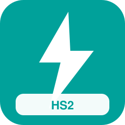

| Campo | Valor |
| --- | --- |
| Código corto | **HS2** |
| Estado | futuro |
| Tipo | nacional |
| Competencia | nicho |
| Color | `#00A19A` / `#FFFFFF` |
| Sede | Birmingham Curzon Street |
| Lands | Gran Londres, Midlands Occidentales, Noroeste de Inglaterra |
| Servicios | `av`, `px` |
| Eslogan | *Alta velocidad británica* |
| Logo | `assets/logos/hs2.svg` |
| Flota | FLIRT 3 (2 puertas) (Aeropuerto) (×55); Coradia Continental BR 1440.1 (Aeropuerto) (×16); ICE 3 Velaro D (×40); TGV EuroDuplex (×46); Stadler Giruno (×57); ETR1000 Frecciarossa (×73); ICE 4 K1n (livrea azul) (×26); ICE 3 (livrea nocturna) (×32); TGV Sud-Est (livrea azul) (×43); TGV Duplex (livrea nocturna) (×54); AVE S-103 Velaro E (livrea azul) (×20); AVE S-100 (livrea nocturna) (×26); ICE 4 K1n (Aeropuerto) (×42); ICE T (Aeropuerto) (×48); Dosto 4ª gen (Aeropuerto) (×59); Z2N (Aeropuerto) (×20); Francilien Z 50000 (Aeropuerto) (×31); Talent 2 BR 442 (Aeropuerto) (×42); ICE 4 K3s (×66); TGV Atlantique (×22); Thalys TMST Izy (×38); AVE S-100 (×44) |

### Greater Thameslink Railway (`gtr`)

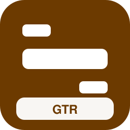

| Campo | Valor |
| --- | --- |
| Código corto | **GTR** |
| Estado | futuro |
| Tipo | metropolitano |
| Competencia | dominante |
| Color | `#6C3A00` / `#FFFFFF` |
| Sede | Londres |
| Lands | Gran Londres, Sudeste de Inglaterra, Este de Inglaterra |
| Servicios | `s`, `re`, `ae`, `mc` |
| Eslogan | *Marca unificada Thameslink/Southern/GN/GX* |
| Logo | `assets/logos/gtr.svg` |
| Flota | BR 490.3 S-Bahn HH (6 coches) (×56); M7 EMU (livrea rojo) (×22); KISS 160 Luxemburgo (livrea rojo) (×33); Z 24500 2N NG (livrea azul) (×39); MI2N Eole (livrea metropolitana) (×50); MI84 (livrea rojo) (×11); DPZ/HVZ (livrea azul) (×22); FLIRT 3 (2 puertas) (livrea verde) (×38); Desiro Doble Piso (livrea rojo) (×49); Mireo BR 463 (livrea azul) (×60); Coradia Continental BR 1440.1 (livrea verde) (×21); Cercanías Civia (livrea rojo) (×27); Régiolis Léman Express (livrea azul) (×43); Series 2200 LU (livrea verde) (×54); BR 422 S-Bahn (livrea rojo) (×60); BR 425 Regional/S (livrea azul) (×26) |

### Northern Regional Combine (`nrc`)

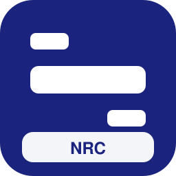

| Campo | Valor |
| --- | --- |
| Código corto | **NRC** |
| Estado | futuro |
| Tipo | regional |
| Competencia | dominante |
| Color | `#1A237E` / `#FFFFFF` |
| Sede | Leeds |
| Lands | Noroeste de Inglaterra, Yorkshire y Humber, Noreste de Inglaterra |
| Servicios | `re`, `rb`, `s`, `ir` |
| Eslogan | *Integración del norte* |
| Logo | `assets/logos/nrc.svg` |
| Flota | MD S-449 (5 coches) (×62); Régiolis Intercity (6 coches) (×23); AGC B 82500 (3 coches) (×34); X TER X 72500 (5 coches) (×45); Z2 Z 11500 (6 coches) (×56); ETR 103 POP (3 coches) (×17); Series 2200 LU (5 coches) (×28); AVG ET 2010 (6 coches) (×34); KISS 200 Austria (livrea rojo) (×50); VIRM (livrea rojo) (×66); FLIRT 3 (2 puertas) (livrea rojo) (×27); FLIRT 3 XL BR 3427 (livrea azul) (×38); FLIRT BR 429 (livrea verde) (×44); FLIRT ETR 155/170 (livrea rojo) (×55) |

### West Coast Regional (`wcr`)

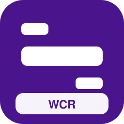

| Campo | Valor |
| --- | --- |
| Código corto | **WCR** |
| Estado | futuro |
| Tipo | regional |
| Competencia | dominante |
| Color | `#4A148C` / `#FFFFFF` |
| Sede | Crewe |
| Lands | Gran Londres, Midlands Occidentales, Noroeste de Inglaterra |
| Servicios | `re`, `rb`, `ld` |
| Eslogan | *Servicios locales West Coast* |
| Logo | `assets/logos/wcr.svg` |
| Flota | MD S-449 (5 coches) (×63); Régiolis Intercity (6 coches) (×19); AGC B 82500 (3 coches) (×35); X TER X 72500 (5 coches) (×46); Z2 Z 11500 (6 coches) (×57); ETR 103 POP (3 coches) (×18); Series 2200 LU (5 coches) (×24); AVG ET 2010 (6 coches) (×35); KISS 200 Austria (livrea rojo) (×51); VIRM (livrea rojo) (×57); FLIRT 3 (2 puertas) (livrea rojo) (×23); FLIRT 3 XL BR 3427 (livrea azul) (×29); FLIRT BR 429 (livrea verde) (×45); FLIRT ETR 155/170 (livrea rojo) (×56) |

### Open Access South (`oas`)

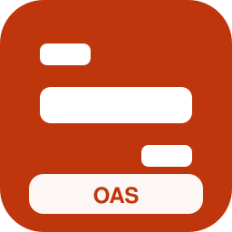

| Campo | Valor |
| --- | --- |
| Código corto | **OAS** |
| Estado | futuro |
| Tipo | nacional |
| Competencia | competitiva |
| Color | `#BF360C` / `#FFFFFF` |
| Sede | Reading |
| Lands | Gran Londres, Sudeste de Inglaterra, Sudoeste de Inglaterra |
| Servicios | `ld`, `px` |
| Eslogan | *Nuevos operadores abiertos al sur* |
| Logo | `assets/logos/oas.svg` |
| Flota | ICE 4 K3s (livrea nocturna) (×64); ICE 1 (livrea azul) (×20); TGV Duplex (livrea nocturna) (×31); ETR 500 Frecce (livrea azul) (×42); Talgo VI (livrea nocturna) (×53); Twindexx Swiss Express (livrea rojo) (×14); ICE T (Aeropuerto) (×30); ICE 3 Velaro D (livrea azul) (×36); Thalys TMST Izy (Aeropuerto) (×47); KISS 160 Luxemburgo (Aeropuerto) (×58); MI09 (Aeropuerto) (×19); FLIRT 3 XL BR 3427 (Aeropuerto) (×30); Coradia Continental BR 1440.2 (Aeropuerto) (×41); ICE 1 (×60); Thalys PBKA (×21); AVE S-112 (×32); ETR 700 Frecce (×43); EW IV (×54); Vectron E 193 + coches (×70); Regio 2N Omneo Premium (×26); Viaggio Twin (5 coches) (×29); Twindexx Swiss Express (6 coches) (×40) |

### Open Access North (`oan`)

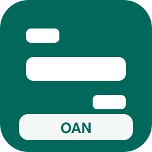

| Campo | Valor |
| --- | --- |
| Código corto | **OAN** |
| Estado | futuro |
| Tipo | nacional |
| Competencia | competitiva |
| Color | `#00695C` / `#FFFFFF` |
| Sede | York |
| Lands | Gran Londres, Yorkshire y Humber, Noreste de Inglaterra, Escocia |
| Servicios | `ld`, `px` |
| Eslogan | ** |
| Logo | `assets/logos/oan.svg` |
| Flota | ICE 2 (livrea azul) (×60); TGV Réseau (livrea nocturna) (×21); AVE S-112 (livrea azul) (×32); Railjet Viaggio Comfort (livrea nocturna) (×48); IC 901 (livrea nocturna) (×54); ICE 4 K1n (Aeropuerto) (×20); Vectron E 193 + coches (Aeropuerto) (×31); ETR1000 Frecciarossa (livrea nocturna) (×37); Twindexx Vario BR 445 (Aeropuerto) (×48); MI2N Altéo (Aeropuerto) (×59); FLIRT 4 (Aeropuerto) (×20); Coradia Continental BR 440 (Aeropuerto) (×31); ICE 3 (×50); TGV Duplex (×61); Pendolino New CH (×27); ETR 500 Frecce (×33); Talgo IV/V (×44); Vectron BR 193 + coches (×55); KISS 200 (×66); ETR1000 Frecciarossa (×27); Twindexx Swiss Express (3 coches) (×30); KISS 200 Austria (5 coches) (×41) |

### Cymru Express Futuro (`cym`)

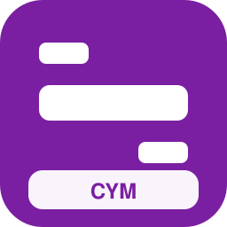

| Campo | Valor |
| --- | --- |
| Código corto | **CYM** |
| Estado | futuro |
| Tipo | regional |
| Competencia | dominante |
| Color | `#7B1FA2` / `#FFFFFF` |
| Sede | Cardiff |
| Lands | Gales, Noroeste de Inglaterra, Midlands Occidentales |
| Servicios | `ld`, `re`, `av` |
| Eslogan | *Gales de alta conectividad* |
| Logo | `assets/logos/cym.svg` |
| Flota | LINT 54/81 BR 620/622 (6 coches) (×11); Coradia Continental BR 1440.1 (3 coches) (×22); Coradia Continental BR 1440.3 (5 coches) (×33); MD S-599 (6 coches) (×44); Régiolis Intercity (3 coches) (×55); Régiolis Léman Express (5 coches) (×16); AGC Z 27500 (6 coches) (×27); Z2 Z 11500 (3 coches) (×38); NPZ Colibri (5 coches) (×49); Series 2000 LU (6 coches) (×60); AVG ET 2010 (3 coches) (×21); KISS 160 (livrea azul) (×32); Regio 2N Gran Capacidad (livrea rojo) (×43); FLIRT 3 (1 puerta) (livrea rojo) (×54) |

### ScotRail Express 2030 (`sco2`)

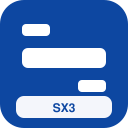

| Campo | Valor |
| --- | --- |
| Código corto | **SX3** |
| Estado | futuro |
| Tipo | regional |
| Competencia | dominante |
| Color | `#0D47A1` / `#FFFFFF` |
| Sede | Edimburgo |
| Lands | Escocia |
| Servicios | `ld`, `re`, `av` |
| Eslogan | *Escocia más rápida* |
| Logo | `assets/logos/sco2.svg` |
| Flota | Coradia Continental BR 1440.0 (5 coches) (×12); Coradia Continental BR 1440.2 (6 coches) (×23); MD S-599 (3 coches) (×34); Régiolis Regional (5 coches) (×45); Régiolis Suburban (6 coches) (×56); AGC Z 27500 (3 coches) (×17); Z TER Z 21500 (5 coches) (×28); NPZ Domino (6 coches) (×39); Series 2000 LU (3 coches) (×50); BR 425 Regional/S (5 coches) (×11); Twindexx Vario BR 445 (livrea rojo) (×22); VIRM (livrea rojo) (×33); FLIRT 3 (2 puertas) (livrea azul) (×44); FLIRT 3 XL BR 3427 (livrea verde) (×55) |

### Belfast Metro Rail (`nir2`)

| Campo | Valor |
| --- | --- |
| Código corto | **BMR** |
| Estado | futuro |
| Tipo | metropolitano |
| Competencia | dominante |
| Color | `#1565C0` / `#FFFFFF` |
| Sede | Belfast |
| Lands | Irlanda del Norte |
| Servicios | `s`, `u`, `t` |
| Eslogan | *Red metropolitana de Belfast* |
| Logo | `assets/logos/nir2.svg` |
| Flota | FLIRT 3 (2 puertas) (livrea rojo) (×13); Desiro ML 4746 (livrea azul) (×24); Talent 2 BR 442 (livrea verde) (×35); Coradia Continental BR 1440.1 (livrea rojo) (×46); Coradia Nordic (livrea azul) (×57); Régiolis Suburban (livrea metropolitana) (×18); Series 2200 LU (livrea rojo) (×29); BR 423 S-Bahn (livrea azul) (×40); BR 424 S-Bahn (livrea metropolitana) (×51); BR 430 S-Bahn (livrea rojo) (×12); BR 474 S-Bahn HH (livrea azul) (×23); BR 481 S-Bahn BE (livrea metropolitana) (×34); BR 490 S-Bahn HH (livrea rojo) (×45); S-tog SA/SE (livrea azul) (×56); Twindexx Vario BR 445 (Aeropuerto) (×17); Z 24500 2N NG (Aeropuerto) (×28) |

### Rápidos del Támesis (`raf`)

| Campo | Valor |
| --- | --- |
| Código corto | **RDT** |
| Estado | inventado |
| Tipo | nacional |
| Competencia | competitiva |
| Color | `#0B3D91` / `#FFFFFF` |
| Sede | Londres |
| Lands | Gran Londres, Sudeste de Inglaterra, Este de Inglaterra |
| Servicios | `av`, `ld`, `px` |
| Eslogan | ** |
| Logo | `assets/logos/raf.svg` |
| Flota | AVE S-112 (livrea nocturna) (×19); ETR1000 Frecciarossa (livrea azul) (×30); ETR1000 Frecciarossa (Aeropuerto) (×41); Twindexx Swiss Express (3 coches) (×47); KISS 200 Austria (5 coches) (×58); CAF Civity (6 coches) (×19); EW IV (livrea nocturna) (×30); Regio 2N Omneo Premium (livrea rojo) (×41); Vectron E 193 + coches (Aeropuerto) (×57); VIRM (Aeropuerto) (×13); MI79 (Aeropuerto) (×24); Desiro ML 4746 (Aeropuerto) (×35); Coradia Nordic (Aeropuerto) (×46); ICE 1 (×70); Thalys PBKA (×31); AVE S-102 (×37); ICE TD (×48); ETR 600 Pendolino (×64); EW IV (×20); Vectron E 193 + coches (×36); Regio 2N Omneo Premium (×42); ICE 4 K4s (livrea nocturna) (×50) |

### Expreso Caledonio (`exc`)

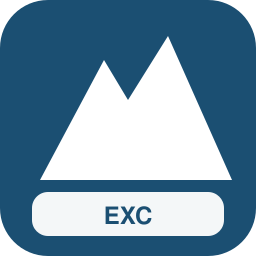

| Campo | Valor |
| --- | --- |
| Código corto | **EXC** |
| Estado | inventado |
| Tipo | nacional |
| Competencia | competitiva |
| Color | `#1B4F72` / `#FFFFFF` |
| Sede | Edimburgo |
| Lands | Escocia, Noreste de Inglaterra, Gran Londres |
| Servicios | `ld`, `px`, `n` |
| Eslogan | ** |
| Logo | `assets/logos/exc.svg` |
| Flota | ETR 700 Frecce (livrea nocturna) (×15); EW IV (livrea nocturna) (×26); Regio 2N Omneo Premium (livrea rojo) (×37); ETR 600 Pendolino (Aeropuerto) (×53); AVE S-103 Velaro E (livrea nocturna) (×59); M7 EMU (Aeropuerto) (×20); Z2N (Aeropuerto) (×31); Francilien Z 50000 (Aeropuerto) (×42); Talent 2 BR 442 (Aeropuerto) (×53); Nocturno Viaggio (livrea nocturna) (×14); ICE T (×38); Thalys PBA (×44); Alvia S-730 (×60); IC4 Litra MG (×66); UIC-Z1 (×32); HLE 18 + coches (×38); CAF Civity (×49); Viaggio Twin (3 coches) (×52); Twindexx Swiss Express (5 coches) (×13); KISS 200 Austria (6 coches) (×24); ICE 4 K1n (livrea azul) (×40); ICE 3 (livrea nocturna) (×46) |

### Corredores del Norte (`cdn`)

| Campo | Valor |
| --- | --- |
| Código corto | **CDN** |
| Estado | inventado |
| Tipo | nacional |
| Competencia | competitiva |
| Color | `#0E4D64` / `#FFFFFF` |
| Sede | Manchester |
| Lands | Noroeste de Inglaterra, Yorkshire y Humber, Noreste de Inglaterra, Escocia |
| Servicios | `ld`, `ir`, `px` |
| Eslogan | ** |
| Logo | `assets/logos/cdn.svg` |
| Flota | ETR1000 Frecciarossa (×24); Twindexx Swiss Express (3 coches) (×32); KISS 200 Austria (5 coches) (×43); CAF Civity (6 coches) (×54); ICE 3 (livrea azul) (×60); TGV Atlantique (livrea nocturna) (×21); Stadler Giruno (livrea azul) (×32); ETR 700 Frecce (livrea nocturna) (×43); EW IV (livrea nocturna) (×59); Regio 2N Omneo Premium (livrea rojo) (×20); ETR 600 Pendolino (Aeropuerto) (×31); Dosto 4ª gen (3 coches) (×37); FLIRT 4 (5 coches) (×48); Coradia Continental BR 1440.3 (6 coches) (×59); M7 EMU (livrea rojo) (×20); FLIRT 3 XL BR 3427 (livrea azul) (×31); Régiolis Intercity (livrea verde) (×42); FLIRT 4 (Aeropuerto) (×58); ETR1000 Frecciarossa (livrea nocturna) (×14); KISS 160 Luxemburgo (Aeropuerto) (×25); MI79 (Aeropuerto) (×36); Talent 2 BR 442 (Aeropuerto) (×47) |

### VeloRápido Británico (`vrp`)

| Campo | Valor |
| --- | --- |
| Código corto | **VRB** |
| Estado | inventado |
| Tipo | nacional |
| Competencia | nicho |
| Color | `#B71C1C` / `#FFFFFF` |
| Sede | Birmingham |
| Lands | Gran Londres, Midlands Occidentales, Noroeste de Inglaterra, Yorkshire y Humber |
| Servicios | `av`, `px` |
| Eslogan | ** |
| Logo | `assets/logos/vrp.svg` |
| Flota | TGV Réseau (livrea azul) (×17); TGV POS (livrea nocturna) (×28); AVE S-112 (livrea azul) (×39); ETR 700 Frecce (livrea nocturna) (×50); AVE S-103 Velaro E (Aeropuerto) (×16); Railjet Viaggio Comfort (Aeropuerto) (×22); KISS 160 Luxemburgo (Aeropuerto) (×33); MI09 (Aeropuerto) (×44); FLIRT 3 XL BR 3427 (Aeropuerto) (×55); Coradia Continental BR 1440.2 (Aeropuerto) (×16); ICE 2 (×35); TGV POS (×46); AVE S-103 Velaro E (×62); ICE T (×68); ICE 4 K1n (livrea nocturna) (×26); ICE 3 Velaro D (livrea azul) (×37); TGV Sud-Est (livrea nocturna) (×43); TGV EuroDuplex (livrea azul) (×54); AVE S-103 Velaro E (livrea nocturna) (×20); ETR 500 Frecce (livrea azul) (×26); ICE 4 K3s (Aeropuerto) (×42); Pendolino New CH (Aeropuerto) (×48) |

### Líneas Maestras UK (`lma`)

| Campo | Valor |
| --- | --- |
| Código corto | **LMU** |
| Estado | inventado |
| Tipo | nacional |
| Competencia | competitiva |
| Color | `#37474F` / `#FFFFFF` |
| Sede | Derby |
| Lands | Gran Londres, Sudeste de Inglaterra, Sudoeste de Inglaterra, Este de Inglaterra, Midlands Orientales, Midlands Occidentales, Noroeste de Inglaterra, Noreste de Inglaterra, Yorkshire y Humber, Escocia, Gales |
| Servicios | `ld`, `ir` |
| Eslogan | ** |
| Logo | `assets/logos/lma.svg` |
| Flota | IC4 Litra MG (livrea nocturna) (×23); UIC-Z1 (livrea nocturna) (×29); CAF Civity (livrea azul) (×45); Railjet Viaggio Comfort (Aeropuerto) (×51); Dosto 4ª gen (5 coches) (×12); FLIRT 4 (6 coches) (×23); Régiolis Intercity (3 coches) (×34); Dosto 4ª gen (livrea rojo) (×45); FLIRT 3 XL BR 3427 (livrea verde) (×56); Z TER Z 21500 (livrea rojo) (×17); FLIRT 3 XL BR 3427 (Aeropuerto) (×28); ICE T (×52); Thalys PBA (×58); Alvia S-730 (×19); IC4 Litra MG (×35); UIC-Z1 (×41); HLE 18 + coches (×57); CAF Civity (×68); Coradia Continental BR 1440.3 (×24); Dosto 5ª gen IC Twindexx (5 coches) (×32); KISS 200 (6 coches) (×43); CAF Civity (3 coches) (×54) |

### InterCiudades Británicas (`ica`)

| Campo | Valor |
| --- | --- |
| Código corto | **ICB** |
| Estado | inventado |
| Tipo | nacional |
| Competencia | competitiva |
| Color | `#606DE4` / `#FFFFFF` |
| Sede | York |
| Lands | Gran Londres, Sudeste de Inglaterra, Sudoeste de Inglaterra, Este de Inglaterra, Midlands Orientales, Midlands Occidentales, Noroeste de Inglaterra, Noreste de Inglaterra, Yorkshire y Humber, Escocia, Gales |
| Servicios | `ld`, `ir`, `re` |
| Eslogan | ** |
| Logo | `assets/logos/ica.svg` |
| Flota | MD S-599 (3 coches) (×19); Régiolis Regional (5 coches) (×30); Régiolis Léman Express (6 coches) (×41); X TER X 72500 (3 coches) (×52); NPZ Domino (5 coches) (×13); ETR 103 POP (6 coches) (×24); BR 425 Regional/S (3 coches) (×35); KISS 160 (livrea rojo) (×46); Regio 2N Gran Capacidad (livrea rojo) (×57); FLIRT 3 BR 1428 (livrea rojo) (×18); FLIRT RABe 524 (livrea azul) (×29); FLIRT ETR 155/170 (livrea verde) (×40); Desiro ML 4744 (livrea verde) (×51); Mireo BR 463 (livrea rojo) (×12); Coradia Continental BR 1440.0 (livrea rojo) (×23); Coradia Continental BR 1440.2 (livrea azul) (×34); MD S-449 (livrea azul) (×45); Régiolis Suburban (livrea metropolitana) (×56); AGC Z 27500 (livrea rojo) (×17); NPZ Domino (livrea rojo) (×28); ETR 103 POP (livrea azul) (×39); Series 2200 LU (livrea verde) (×50) |

### Nocturno Insular (`noc`)

| Campo | Valor |
| --- | --- |
| Código corto | **NOI** |
| Estado | inventado |
| Tipo | especializado |
| Competencia | nicho |
| Color | `#9F5C8B` / `#F2A900` |
| Sede | Londres |
| Lands | Gran Londres, Sudeste de Inglaterra, Sudoeste de Inglaterra, Este de Inglaterra, Midlands Orientales, Midlands Occidentales, Noroeste de Inglaterra, Noreste de Inglaterra, Yorkshire y Humber, Escocia, Gales |
| Servicios | `n` |
| Eslogan | ** |
| Logo | `assets/logos/noc.svg` |
| Flota | Talgo IV/V (livrea nocturna) (×20); Talgo IV/V (×39); Talgo VI (livrea nocturna) (×42); Talgo VI (×61); Railjet Viaggio Comfort (livrea nocturna) (×14); Railjet Viaggio Comfort (×33); Nocturno Viaggio (×44); Railjet Viaggio Comfort (Aeropuerto) (×47); Vectron BR 193 + coches (×66); Nocturno Viaggio (livrea nocturna) (×19); Loc BR 101 + coches (×38); UIC-Z1 (livrea nocturna) (×41) |

### Puente Europeo UK (`peu`)

| Campo | Valor |
| --- | --- |
| Código corto | **PEU** |
| Estado | inventado |
| Tipo | internacional |
| Competencia | nicho |
| Color | `#BFD352` / `#FFFFFF` |
| Sede | Ashford |
| Lands | Gran Londres, Sudeste de Inglaterra |
| Servicios | `av`, `ld` |
| Eslogan | ** |
| Logo | `assets/logos/peu.svg` |
| Flota | ICE 3 Velaro D (×29); TGV EuroDuplex (×45); Stadler Giruno (×56); ETR1000 Frecciarossa (×62); Alvia S-120/121 (×23); Talgo IV/V (×34); Vectron BR 193 + coches (×45); KISS 200 (×56); ICE 4 K3s (livrea nocturna) (×64); ICE 2 (livrea azul) (×25); TGV Atlantique (livrea nocturna) (×36); TGV POS (livrea azul) (×42); AVE S-102 (livrea nocturna) (×53); ETR 700 Frecce (livrea azul) (×19); Thalys TMST Izy (Aeropuerto) (×25); Dosto 5ª gen IC Twindexx (5 coches) (×36) |

### AeroEnlace Británico (`aex`)

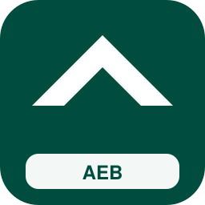

| Campo | Valor |
| --- | --- |
| Código corto | **AEB** |
| Estado | inventado |
| Tipo | especializado |
| Competencia | nicho |
| Color | `#004D40` / `#FFFFFF` |
| Sede | Heathrow |
| Lands | Gran Londres, Sudeste de Inglaterra, Noroeste de Inglaterra, Escocia, Midlands Occidentales |
| Servicios | `ae`, `px` |
| Eslogan | ** |
| Logo | `assets/logos/aex.svg` |
| Flota | ETR1000 Frecciarossa (livrea azul) (×22); ICE 3 Velaro D (×41); ETR1000 Frecciarossa (×52); BR 490 S-Bahn HH (5 coches) (×55); BR 490 S-Bahn HH (livrea metropolitana) (×16); AVE S-103 Velaro E (Aeropuerto) (×32); Dosto 4ª gen (Aeropuerto) (×43); Z2N (Aeropuerto) (×54); Francilien Z 50000 (Aeropuerto) (×65); Talent 2 BR 442 (Aeropuerto) (×26); ICE 4 K1n (livrea nocturna) (×32) |

### Panorámicos Británicos (`pan`)

| Campo | Valor |
| --- | --- |
| Código corto | **PAB** |
| Estado | inventado |
| Tipo | especializado |
| Competencia | nicho |
| Color | `#33691E` / `#FFFFFF` |
| Sede | Fort William |
| Lands | Escocia, Gales, Sudoeste de Inglaterra, Noroeste de Inglaterra |
| Servicios | `tur`, `rl` |
| Eslogan | ** |
| Logo | `assets/logos/pan.svg` |
| Flota | Desiro Classic AT (3 coches) (×23); Desiro Classic DK (5 coches) (×34); Talent BR 643 (6 coches) (×45); LINT 41H (3 coches) (×56); LINT 41 BR 623 (5 coches) (×17); Coradia A TER BR 641 (6 coches) (×28); Rh 5147 (3 coches) (×39); GTW Eléctrico AT (livrea verde) (×50); Desiro Classic BR 642 (livrea azul) (×11); Talent 4024 (livrea verde) (×22); Regio-Shuttle BR 650 (livrea verde) (×33); A TER X 73500 (livrea verde) (×44) |

### Líneas Libres UK (`lib`)

| Campo | Valor |
| --- | --- |
| Código corto | **LLU** |
| Estado | inventado |
| Tipo | nacional |
| Competencia | competitiva |
| Color | `#E65100` / `#FFFFFF` |
| Sede | Londres |
| Lands | Gran Londres, Sudeste de Inglaterra, Sudoeste de Inglaterra, Este de Inglaterra, Midlands Orientales, Midlands Occidentales, Noroeste de Inglaterra, Noreste de Inglaterra, Yorkshire y Humber, Escocia, Gales |
| Servicios | `ld`, `px`, `ir` |
| Eslogan | ** |
| Logo | `assets/logos/lib.svg` |
| Flota | TGV EuroDuplex (livrea azul) (×24); ETR 500 Frecce (livrea nocturna) (×35); Talgo IV/V (livrea nocturna) (×46); KISS 200 (livrea rojo) (×62); Pendolino New CH (Aeropuerto) (×23); ICE 3 Velaro D (livrea nocturna) (×29); AVE S-103 Velaro E (Aeropuerto) (×40); VIRM (Aeropuerto) (×56); MI79 (Aeropuerto) (×12); Desiro ML 4746 (Aeropuerto) (×23); Coradia Nordic (Aeropuerto) (×34); VIRM (3 coches) (×45); FLIRT 3 XL BR 3427 (5 coches) (×56); Régiolis Intercity (6 coches) (×17); FLIRT 4 (livrea rojo) (×28); Coradia Continental BR 1440.3 (livrea azul) (×39); Z TER Z 21500 (livrea verde) (×50); ICE T (×29); Thalys PBA (×30); Alvia S-730 (×46); IC4 Litra MG (×57); UIC-Z1 (×63) |

### Vía Abierta Regional (`via`)

| Campo | Valor |
| --- | --- |
| Código corto | **VAR** |
| Estado | inventado |
| Tipo | regional |
| Competencia | competitiva |
| Color | `#5D4037` / `#FFFFFF` |
| Sede | Sheffield |
| Lands | Midlands Orientales, Midlands Occidentales, Yorkshire y Humber, Noroeste de Inglaterra |
| Servicios | `re`, `rb`, `ir` |
| Eslogan | ** |
| Logo | `assets/logos/via.svg` |
| Flota | Coradia Continental BR 1440.0 (livrea rojo) (×30); Coradia Continental BR 1440.2 (livrea azul) (×36); Coradia Nordic (livrea metropolitana) (×52); Régiolis Regional (livrea azul) (×63); Régiolis Suburban (livrea metropolitana) (×19); AGC Z 27500 (livrea rojo) (×35); Z2 Z 11500 (livrea rojo) (×46); NPZ Colibri (livrea azul) (×57); Series 2000 LU (livrea verde) (×18); M7 EMU (Aeropuerto) (×29); Regio 2N Gran Capacidad (Aeropuerto) (×35); Mireo BR 463 (Aeropuerto) (×51); FLIRT WINK (6 coches) (×57); GTW Eléctrico AT (3 coches) (×18) |

### Nexo Ciudades UK (`nex`)

| Campo | Valor |
| --- | --- |
| Código corto | **NEX** |
| Estado | inventado |
| Tipo | nacional |
| Competencia | competitiva |
| Color | `#263238` / `#FFFFFF` |
| Sede | Birmingham |
| Lands | Gran Londres, Midlands Occidentales, Noroeste de Inglaterra, Yorkshire y Humber, Escocia |
| Servicios | `px`, `ld`, `ae` |
| Eslogan | ** |
| Logo | `assets/logos/nex.svg` |
| Flota | ETR 500 Frecce (livrea nocturna) (×26); TEE PBA (livrea nocturna) (×37); KISS 200 Austria (livrea rojo) (×48); BR 490 S-Bahn HH (5 coches) (×59); BR 490 S-Bahn HH (livrea metropolitana) (×20); AVE S-103 Velaro E (×39); ICE 3 (×50); TGV EuroDuplex (×61); AVE S-112 (×22); Viaggio Twin (×33); Loc BR 101 + coches (×44); Twindexx Swiss Express (×55); ICE 4 K1n (livrea azul) (×63); AVE S-103 Velaro E (livrea nocturna) (×19); ICE T (Aeropuerto) (×40); Railjet Viaggio Comfort (Aeropuerto) (×51); KISS 160 Luxemburgo (Aeropuerto) (×57); MI09 (Aeropuerto) (×18); FLIRT 3 XL BR 3427 (Aeropuerto) (×29); Coradia Continental BR 1440.2 (Aeropuerto) (×40); Dosto 5ª gen IC Twindexx (6 coches) (×46); KISS 200 Austria (3 coches) (×57) |

### Universidad Express UK (`uni`)

| Campo | Valor |
| --- | --- |
| Código corto | **UEX** |
| Estado | inventado |
| Tipo | especializado |
| Competencia | nicho |
| Color | `#4E342E` / `#FFFFFF` |
| Sede | Cambridge |
| Lands | Gran Londres, Este de Inglaterra, Midlands Orientales, Midlands Occidentales, Escocia |
| Servicios | `re`, `ir`, `mc` |
| Eslogan | ** |
| Logo | `assets/logos/uni.svg` |
| Flota | AGC B 82500 (livrea azul) (×27); Z TER Z 21500 (livrea azul) (×43); NPZ Domino (livrea verde) (×49); Series 2000 LU (livrea rojo) (×60); BR 425 Regional/S (livrea azul) (×21); KISS 160 Luxemburgo (Aeropuerto) (×32); Desiro Doble Piso (Aeropuerto) (×43); Viaggio Twin (3 coches) (×54); BR 483/484 S-Bahn BE (3 coches) (×15); BR 483/484 S-Bahn BE (livrea azul) (×26); Dosto 5ª gen IC Twindexx (×50); KISS 160 Luxemburgo (×56) |

### Feria y Congresos Rail (`fer`)

| Campo | Valor |
| --- | --- |
| Código corto | **FCR** |
| Estado | inventado |
| Tipo | especializado |
| Competencia | nicho |
| Color | `#880E4F` / `#FFFFFF` |
| Sede | Birmingham |
| Lands | Gran Londres, Midlands Occidentales, Noroeste de Inglaterra, Escocia |
| Servicios | `px`, `ae`, `ld` |
| Eslogan | ** |
| Logo | `assets/logos/fer.svg` |
| Flota | AVE S-112 (livrea nocturna) (×28); Talgo VI (livrea nocturna) (×39); Twindexx Swiss Express (livrea rojo) (×50); ICE 3 Velaro D (×19); ETR1000 Frecciarossa (×30); ICE 2 (×41); Thalys PBKA (×52); Alvia S-130 (×63); Talgo VI (×24); Loc BR 103.1 + coches (×35); KISS 200 (×46); ICE 4 K3s (livrea nocturna) (×54) |

### Valles Verdes UK (`val`)

| Campo | Valor |
| --- | --- |
| Código corto | **VVU** |
| Estado | inventado |
| Tipo | regional |
| Competencia | nicho |
| Color | `#1B5E20` / `#FFFFFF` |
| Sede | Swansea |
| Lands | Gales, Sudoeste de Inglaterra, Noroeste de Inglaterra, Escocia |
| Servicios | `rl`, `rb`, `tur` |
| Eslogan | ** |
| Logo | `assets/logos/val.svg` |
| Flota | Rh 4020 (livrea azul) (×29); Series 2000 LU (livrea verde) (×40); FLIRT 4 (Aeropuerto) (×51); Coradia Nordic (Aeropuerto) (×12); GTW Diésel NL (×41); Talent 4024 (×47); LINT 27 BR 640 (×58); FLIRT 4 (×64); FLIRT ETR 155/170 (×25); Coradia Continental BR 440 (×36); Régiolis Regional (×47); Rh 4020 (×58); Glacier Express coaches (×19); GTW Eléctrico NL (5 coches) (×27) |

### Costa a Costa Británica (`cos`)

| Campo | Valor |
| --- | --- |
| Código corto | **CAC** |
| Estado | inventado |
| Tipo | especializado |
| Competencia | nicho |
| Color | `#006064` / `#FFFFFF` |
| Sede | Carlisle |
| Lands | Noroeste de Inglaterra, Yorkshire y Humber, Noreste de Inglaterra, Escocia |
| Servicios | `tur`, `ir`, `ld` |
| Eslogan | ** |
| Logo | `assets/logos/cos.svg` |
| Flota | ICE 3 (livrea nocturna) (×30); TGV Réseau (livrea azul) (×41); Stadler Giruno (livrea nocturna) (×52); Railjet Viaggio Comfort (livrea nocturna) (×13); Pendolino New CH (Aeropuerto) (×24); GTW Diésel NL (×43); Alvia S-130 (×59); Vectron BR 193 + coches (×70); Dosto 4ª gen (×26); FLIRT 3 XL BR 3427 (×37); ICE 4 K4s (×48); TGV EuroDuplex (×59) |

### Mediodía Inglés (`mid`)

| Campo | Valor |
| --- | --- |
| Código corto | **MDI** |
| Estado | inventado |
| Tipo | regional |
| Competencia | competitiva |
| Color | `#B2D9DB` / `#FFFFFF` |
| Sede | Exeter |
| Lands | Sudoeste de Inglaterra, Sudeste de Inglaterra, Gran Londres |
| Servicios | `re`, `rb`, `ir`, `ld` |
| Eslogan | ** |
| Logo | `assets/logos/mid.svg` |
| Flota | Coradia Continental BR 1440.0 (livrea azul) (×36); Coradia Continental BR 1440.2 (livrea verde) (×42); CAF Civity (livrea azul) (×63); Régiolis Regional (livrea verde) (×19); Régiolis Léman Express (livrea rojo) (×25); AGC Z 27500 (livrea azul) (×41); Z2 Z 11500 (livrea azul) (×52); NPZ Colibri (livrea verde) (×63); Series 2200 LU (livrea rojo) (×19); Dosto 4ª gen (Aeropuerto) (×35); FLIRT 4 (Aeropuerto) (×51); Coradia Continental BR 440 (Aeropuerto) (×57); GTW Eléctrico NL (3 coches) (×13); GTW Eléctrico AT (5 coches) (×24) |

### Anglia Conecta (`ang`)

| Campo | Valor |
| --- | --- |
| Código corto | **ANC** |
| Estado | inventado |
| Tipo | regional |
| Competencia | competitiva |
| Color | `#AD1457` / `#FFFFFF` |
| Sede | Norwich |
| Lands | Este de Inglaterra, Gran Londres |
| Servicios | `re`, `rb`, `rl` |
| Eslogan | ** |
| Logo | `assets/logos/ang.svg` |
| Flota | NPZ Colibri (livrea azul) (×37); Series 2000 LU (livrea verde) (×48); M7 EMU (Aeropuerto) (×54); Regio 2N Gran Capacidad (Aeropuerto) (×15); Mireo BR 463 (Aeropuerto) (×31); FLIRT WINK (6 coches) (×42); GTW Eléctrico AT (3 coches) (×53); GTW RABe 520 (5 coches) (×64); Desiro Classic BR 642 (6 coches) (×25); Talent BR 643 (3 coches) (×36); Regio-Shuttle BR 650 (5 coches) (×47); LINT 41 BR 648 (6 coches) (×58); Coradia A TER BR 641 (3 coches) (×19); AGC X 76500 (5 coches) (×30) |

### Kent Rápido (`ken`)

| Campo | Valor |
| --- | --- |
| Código corto | **KER** |
| Estado | inventado |
| Tipo | regional |
| Competencia | competitiva |
| Color | `#0277BD` / `#FFFFFF` |
| Sede | Ashford |
| Lands | Sudeste de Inglaterra, Gran Londres |
| Servicios | `re`, `rb`, `av` |
| Eslogan | ** |
| Logo | `assets/logos/ken.svg` |
| Flota | Régiolis Suburban (livrea metropolitana) (×33); AGC Z 27500 (livrea rojo) (×49); Z2 Z 11500 (livrea rojo) (×60); NPZ Colibri (livrea azul) (×21); Series 2000 LU (livrea verde) (×32); M7 EMU (Aeropuerto) (×38); Regio 2N Gran Capacidad (Aeropuerto) (×49); Mireo BR 463 (Aeropuerto) (×65); FLIRT WINK (6 coches) (×21); GTW Eléctrico AT (3 coches) (×32); GTW RABe 520 (5 coches) (×43); Desiro Classic BR 642 (6 coches) (×54); Talent BR 643 (3 coches) (×15); Regio-Shuttle BR 650 (5 coches) (×26) |

### Devon y Cornualles Rail (`dev`)

| Campo | Valor |
| --- | --- |
| Código corto | **DCR** |
| Estado | inventado |
| Tipo | regional |
| Competencia | dominante |
| Color | `#2E7D32` / `#FFFFFF` |
| Sede | Plymouth |
| Lands | Sudoeste de Inglaterra |
| Servicios | `re`, `rb`, `rl`, `tur` |
| Eslogan | ** |
| Logo | `assets/logos/dev.svg` |
| Flota | Series 2000 LU (livrea rojo) (×39); BR 425 Regional/S (livrea azul) (×50); KISS 160 Luxemburgo (Aeropuerto) (×56); Desiro Doble Piso (Aeropuerto) (×17); FLIRT WINK (3 coches) (×33); GTW Diésel NL (5 coches) (×49); GTW Diésel AT (6 coches) (×55); Desiro Classic BR 642 (3 coches) (×16); Talent 4024 (5 coches) (×27); Talent BR 644 (6 coches) (×38); LINT 41 BR 648 (3 coches) (×49); LINT 27 BR 640 (5 coches) (×60); Cercanías Civia (6 coches) (×16); Rh 5147 (3 coches) (×32) |

### Cotswolds Líneas (`cot`)

| Campo | Valor |
| --- | --- |
| Código corto | **COT** |
| Estado | inventado |
| Tipo | regional |
| Competencia | dominante |
| Color | `#558B2F` / `#FFFFFF` |
| Sede | Oxford |
| Lands | Sudoeste de Inglaterra, Sudeste de Inglaterra, Midlands Occidentales |
| Servicios | `re`, `rb`, `tur` |
| Eslogan | ** |
| Logo | `assets/logos/cot.svg` |
| Flota | Series 2200 LU (livrea verde) (×35); KISS 200 (Aeropuerto) (×46); FLIRT 3 XL BR 3427 (Aeropuerto) (×57); Coradia Continental BR 1440.2 (Aeropuerto) (×18); GTW Eléctrico NL (6 coches) (×29); GTW Diésel AT (3 coches) (×40); Desiro Classic AT (5 coches) (×51); Desiro Classic DK (6 coches) (×12); Talent BR 644 (3 coches) (×23); LINT 41H (5 coches) (×34); LINT 41 BR 623 (6 coches) (×45); Cercanías Civia (3 coches) (×56); A TER X 73500 (5 coches) (×17); Rh 5047 (6 coches) (×28) |

### Penninos Express (`pen`)

| Campo | Valor |
| --- | --- |
| Código corto | **PEX** |
| Estado | inventado |
| Tipo | regional |
| Competencia | competitiva |
| Color | `#4527A0` / `#FFFFFF` |
| Sede | Huddersfield |
| Lands | Noroeste de Inglaterra, Yorkshire y Humber |
| Servicios | `re`, `ir`, `ld` |
| Eslogan | ** |
| Logo | `assets/logos/pen.svg` |
| Flota | ETR 103 POP (livrea rojo) (×36); Series 2200 LU (livrea azul) (×47); Twindexx Vario BR 445 (Aeropuerto) (×58); FLIRT 3 (2 puertas) (Aeropuerto) (×19); Coradia Continental BR 1440.1 (Aeropuerto) (×30); Viaggio Twin (livrea rojo) (×46); ICE 4 K4s (livrea azul) (×52); ICE 1 (livrea nocturna) (×13); TGV EuroDuplex (livrea azul) (×24); ETR 500 Frecce (livrea nocturna) (×35); UIC-Z1 (livrea nocturna) (×46); Railjet Viaggio Comfort (Aeropuerto) (×57); Twindexx Vario BR 445 (×26); Regio 2N Regional (×37) |

### Borde Escocés (`bor`)

| Campo | Valor |
| --- | --- |
| Código corto | **BES** |
| Estado | inventado |
| Tipo | regional |
| Competencia | competitiva |
| Color | `#1865B0` / `#FFFFFF` |
| Sede | Berwick |
| Lands | Escocia, Noreste de Inglaterra |
| Servicios | `re`, `rb`, `ld` |
| Eslogan | ** |
| Logo | `assets/logos/bor.svg` |
| Flota | Régiolis Léman Express (livrea metropolitana) (×37); X TER X 72500 (livrea verde) (×53); NPZ Domino (livrea rojo) (×64); ETR 103 POP (livrea azul) (×25); Series 2200 LU (livrea verde) (×31); KISS 200 (Aeropuerto) (×47); FLIRT 3 XL BR 3427 (Aeropuerto) (×53); Coradia Continental BR 1440.2 (Aeropuerto) (×14); GTW Eléctrico NL (6 coches) (×25); GTW Diésel AT (3 coches) (×36); Desiro Classic AT (5 coches) (×47); Desiro Classic DK (6 coches) (×58); Talent BR 644 (3 coches) (×19); LINT 41H (5 coches) (×30) |

### Clyde Urbano (`cly`)

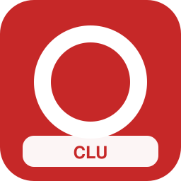

| Campo | Valor |
| --- | --- |
| Código corto | **CLU** |
| Estado | inventado |
| Tipo | metropolitano |
| Competencia | dominante |
| Color | `#C62828` / `#FFFFFF` |
| Sede | Glasgow |
| Lands | Escocia |
| Servicios | `s`, `or`, `mc` |
| Eslogan | ** |
| Logo | `assets/logos/cly.svg` |
| Flota | Desiro Doble Piso (×46); Cercanías Civia (×57); BR 422 S-Bahn (×68); BR 480 S-Bahn BE (×29); Aventra Class 710 (×50); Twindexx Vario BR 445 (3 coches) (×43); KISS 160 (5 coches) (×54); VIRM (6 coches) (×15); Z 24500 2N NG (3 coches) (×26); MI2N Eole (5 coches) (×37); MI79 (6 coches) (×48); DPZ/HVZ (3 coches) (×59); FLIRT 3 (2 puertas) (5 coches) (×20); Desiro ML 4746 (6 coches) (×31); Mireo BR 463 (3 coches) (×42); Coradia Continental BR 1440.1 (5 coches) (×53) |

### Loyola Capital Rail (`loy`)

| Campo | Valor |
| --- | --- |
| Código corto | **LCR** |
| Estado | inventado |
| Tipo | metropolitano |
| Competencia | competitiva |
| Color | `#6A1B9A` / `#FFFFFF` |
| Sede | Londres |
| Lands | Gran Londres |
| Servicios | `s`, `or`, `mc`, `u` |
| Eslogan | ** |
| Logo | `assets/logos/loy.svg` |
| Flota | DPZ/HVZ (×47); Mireo BR 463 (×58); Régiolis Léman Express (×19); BR 425 Regional/S (×30); BR 483/484 S-Bahn BE (×51); Metro MIVB Mx (×52); Dosto 4ª gen (3 coches) (×55); KISS 200 (5 coches) (×16); KISS 160 Luxemburgo (6 coches) (×27); Z2N (3 coches) (×38); MI2N Altéo (5 coches) (×54); MI09 (6 coches) (×65); Francilien Z 50000 (3 coches) (×26); FLIRT 4 (5 coches) (×32); FLIRT 3 XL BR 3427 (6 coches) (×43); Talent 2 BR 442 (3 coches) (×54) |

### Manchester Orbital (`man`)

| Campo | Valor |
| --- | --- |
| Código corto | **MAO** |
| Estado | inventado |
| Tipo | metropolitano |
| Competencia | dominante |
| Color | `#F9A825` / `#111827` |
| Sede | Manchester |
| Lands | Noroeste de Inglaterra |
| Servicios | `s`, `or`, `mc`, `tt` |
| Eslogan | ** |
| Logo | `assets/logos/man.svg` |
| Flota | VIRM (×48); MI79 (×59); Desiro ML 4746 (×20); Coradia Nordic (×31); BR 423 S-Bahn (×47); BR 474 S-Bahn HH (×53); S-tog SA/SE (×69); AVG ET 2010 (×25); Dosto 4ª gen (5 coches) (×28); KISS 200 (6 coches) (×39); VIRM (3 coches) (×50); Z2N (5 coches) (×11); MI2N Altéo (6 coches) (×27); MI79 (3 coches) (×33); Francilien Z 50000 (5 coches) (×49); FLIRT 4 (6 coches) (×55) |

### Birmingham Cruzado (`brm`)

| Campo | Valor |
| --- | --- |
| Código corto | **BCX** |
| Estado | inventado |
| Tipo | metropolitano |
| Competencia | dominante |
| Color | `#EF6C00` / `#FFFFFF` |
| Sede | Birmingham |
| Lands | Midlands Occidentales |
| Servicios | `s`, `mc`, `tt` |
| Eslogan | ** |
| Logo | `assets/logos/brm.svg` |
| Flota | MI2N Eole (×49); FLIRT 3 (2 puertas) (×60); Coradia Continental BR 1440.1 (×21); Series 2200 LU (×32); BR 430 S-Bahn (×43); BR 490 S-Bahn HH (×54); Flexity Swift A32 (×65); M7 EMU (6 coches) (×18); KISS 200 (3 coches) (×29); KISS 160 Luxemburgo (5 coches) (×40); Regio 2N Gran Capacidad (6 coches) (×51); MI2N Altéo (3 coches) (×12); MI09 (5 coches) (×23); MI84 (6 coches) (×34); FLIRT 4 (3 coches) (×45); FLIRT 3 XL BR 3427 (5 coches) (×56) |

### Leeds Distrito Rail (`lee`)

| Campo | Valor |
| --- | --- |
| Código corto | **LDR** |
| Estado | inventado |
| Tipo | metropolitano |
| Competencia | dominante |
| Color | `#6BAEE7` / `#FFFFFF` |
| Sede | Leeds |
| Lands | Yorkshire y Humber |
| Servicios | `s`, `re`, `mc` |
| Eslogan | ** |
| Logo | `assets/logos/lee.svg` |
| Flota | Regio 2N Omneo Premium (3 coches) (×42); FLIRT 3 (1 puerta) (5 coches) (×53); FLIRT BR 429 (6 coches) (×14); FLIRT ETR 155/170 (3 coches) (×25); Desiro ML 4744 (5 coches) (×36); Coradia Continental BR 1440.0 (6 coches) (×47); MD S-599 (3 coches) (×58); Régiolis Regional (5 coches) (×19); AGC B 82500 (6 coches) (×30); Z TER Z 21500 (3 coches) (×41); NPZ Domino (5 coches) (×52); ETR 103 POP (6 coches) (×13); Dosto 5ª gen IC Twindexx (livrea rojo) (×24); FLIRT 3 (1 puerta) (livrea verde) (×35); FLIRT RABe 524 (livrea rojo) (×46); FLIRT ETR 155/170 (livrea azul) (×57) |

### Bristol Bahía Rail (`bri`)

| Campo | Valor |
| --- | --- |
| Código corto | **BBR** |
| Estado | inventado |
| Tipo | metropolitano |
| Competencia | dominante |
| Color | `#00838F` / `#FFFFFF` |
| Sede | Bristol |
| Lands | Sudoeste de Inglaterra |
| Servicios | `s`, `re`, `tt` |
| Eslogan | ** |
| Logo | `assets/logos/bri.svg` |
| Flota | KISS 200 Austria (5 coches) (×43); Regio 2N Regional (6 coches) (×54); FLIRT BR 429 (3 coches) (×15); FLIRT RABe 522/523 (5 coches) (×26); GTW RABe 526.2 (6 coches) (×37); Coradia Continental BR 1440.0 (3 coches) (×48); CAF Civity (5 coches) (×59); MD S-449 (6 coches) (×20); AGC B 82500 (3 coches) (×31); X TER X 72500 (5 coches) (×42); Z2 Z 11500 (6 coches) (×53); ETR 103 POP (3 coches) (×14); AVG ET 2010 (5 coches) (×30); FLIRT 3 (1 puerta) (livrea rojo) (×36); FLIRT BR 429 (livrea azul) (×47); FLIRT RABe 522/523 (livrea verde) (×58) |

### Cardiff Bahía Express (`car`)

| Campo | Valor |
| --- | --- |
| Código corto | **CBE** |
| Estado | inventado |
| Tipo | metropolitano |
| Competencia | dominante |
| Color | `#4C8E62` / `#FFFFFF` |
| Sede | Cardiff |
| Lands | Gales |
| Servicios | `s`, `t`, `re` |
| Eslogan | ** |
| Logo | `assets/logos/car.svg` |
| Flota | Stadler Tram-Train 398 (6 coches) (×44); CAF Urbos A35/A36 (livrea metropolitana) (×55); Dosto 5ª gen IC Twindexx (3 coches) (×16); KISS 200 Austria (5 coches) (×27); Regio 2N Regional (6 coches) (×38); FLIRT BR 429 (3 coches) (×49); FLIRT RABe 522/523 (5 coches) (×60); GTW RABe 526.2 (6 coches) (×21); Coradia Continental BR 1440.0 (3 coches) (×32); CAF Civity (5 coches) (×43); MD S-449 (6 coches) (×54); AGC B 82500 (3 coches) (×15); X TER X 72500 (5 coches) (×26); Z2 Z 11500 (6 coches) (×37); ETR 103 POP (3 coches) (×48); Twindexx Swiss Express (livrea rojo) (×59) |

### Belfast Rápidos (`bel`)

| Campo | Valor |
| --- | --- |
| Código corto | **BER** |
| Estado | inventado |
| Tipo | regional |
| Competencia | competitiva |
| Color | `#9C247F` / `#FFFFFF` |
| Sede | Belfast |
| Lands | Irlanda del Norte |
| Servicios | `re`, `rb`, `s` |
| Eslogan | ** |
| Logo | `assets/logos/bel.svg` |
| Flota | GTW Diésel NL (6 coches) (×45); GTW RABe 520 (3 coches) (×56); Desiro Classic BR 642 (5 coches) (×17); Talent 4024 (6 coches) (×28); Regio-Shuttle BR 650 (3 coches) (×39); LINT 41 BR 648 (5 coches) (×50); LINT 27 BR 640 (6 coches) (×11); AGC X 76500 (3 coches) (×22); Rh 5147 (5 coches) (×33); Rh 4020 (6 coches) (×49); GTW Diésel AT (livrea verde) (×55); Desiro Classic BR 642 (livrea verde) (×16); Talent BR 643 (livrea rojo) (×27); LINT 41H (livrea verde) (×38) |

### Highlands Vías (`hig`)

| Campo | Valor |
| --- | --- |
| Código corto | **HIV** |
| Estado | inventado |
| Tipo | regional |
| Competencia | dominante |
| Color | `#C75240` / `#FFFFFF` |
| Sede | Inverness |
| Lands | Escocia |
| Servicios | `rl`, `rb`, `tur`, `re` |
| Eslogan | ** |
| Logo | `assets/logos/hig.svg` |
| Flota | Regio 2N Gran Capacidad (6 coches) (×46); Coradia Continental BR 1440.2 (3 coches) (×57); CAF Civity (5 coches) (×18); Régiolis Suburban (6 coches) (×29); Series 2200 LU (3 coches) (×40); Dosto 5ª gen IC Twindexx (livrea rojo) (×51); KISS 160 (livrea azul) (×12); Regio 2N Gran Capacidad (livrea rojo) (×23); Coradia Continental BR 1440.2 (livrea rojo) (×34); Régiolis Intercity (livrea rojo) (×45); Régiolis Léman Express (livrea azul) (×56); Series 2200 LU (livrea verde) (×17); VIRM (Aeropuerto) (×28); GTW Diésel NL (×57) |

### Gales del Norte Rail (`wal`)

| Campo | Valor |
| --- | --- |
| Código corto | **GNR** |
| Estado | inventado |
| Tipo | regional |
| Competencia | dominante |
| Color | `#A23DD8` / `#FFFFFF` |
| Sede | Bangor |
| Lands | Gales, Noroeste de Inglaterra |
| Servicios | `re`, `rb`, `tur` |
| Eslogan | ** |
| Logo | `assets/logos/wal.svg` |
| Flota | Regio-Shuttle BR 650 (5 coches) (×47); LINT 41 BR 648 (6 coches) (×58); Coradia A TER BR 641 (3 coches) (×19); AGC X 76500 (5 coches) (×30); Rh 5147 (6 coches) (×41); BR 426 (3 coches) (×52); GTW RABe 520 (livrea verde) (×13); Desiro Classic DK (livrea rojo) (×24); Talent BR 643 (livrea azul) (×35); LINT 41 BR 648 (livrea verde) (×46); AGC X 76500 (livrea verde) (×57); BR 426 (livrea rojo) (×18); Traxx BR 147 + coches (×37); KISS 200 Austria (×48) |

### Essex Orbital (`eas`)

| Campo | Valor |
| --- | --- |
| Código corto | **ESO** |
| Estado | inventado |
| Tipo | metropolitano |
| Competencia | dominante |
| Color | `#D84315` / `#FFFFFF` |
| Sede | Chelmsford |
| Lands | Este de Inglaterra, Gran Londres |
| Servicios | `s`, `re`, `mc` |
| Eslogan | ** |
| Logo | `assets/logos/eas.svg` |
| Flota | LINT 54/81 BR 620/622 (3 coches) (×48); Coradia Continental BR 1440.3 (5 coches) (×59); MD S-599 (6 coches) (×20); Régiolis Intercity (3 coches) (×31); AGC Z 27500 (5 coches) (×42); Z TER Z 21500 (6 coches) (×53); NPZ Colibri (3 coches) (×14); Series 2000 LU (5 coches) (×25); KISS 200 Austria (livrea rojo) (×36); FLIRT 3 BR 1428 (livrea azul) (×47); FLIRT RABe 524 (livrea verde) (×58); GTW RABe 526.2 (livrea verde) (×19); Coradia Continental BR 1440.0 (livrea verde) (×30); MD S-449 (livrea azul) (×41); Régiolis Intercity (livrea verde) (×52); X TER X 72500 (livrea verde) (×13) |

### Surrey Conexión (`sur`)

| Campo | Valor |
| --- | --- |
| Código corto | **SUC** |
| Estado | inventado |
| Tipo | regional |
| Competencia | competitiva |
| Color | `#6FE935` / `#FFFFFF` |
| Sede | Guildford |
| Lands | Sudeste de Inglaterra, Gran Londres |
| Servicios | `re`, `rb`, `s` |
| Eslogan | ** |
| Logo | `assets/logos/sur.svg` |
| Flota | Talent 4024 (5 coches) (×49); Talent BR 644 (6 coches) (×60); LINT 41 BR 648 (3 coches) (×21); LINT 27 BR 640 (5 coches) (×32); Cercanías Civia (6 coches) (×48); Rh 5147 (3 coches) (×54); Rh 4020 (5 coches) (×20); GTW Eléctrico AT (livrea verde) (×26); Desiro Classic BR 642 (livrea azul) (×37); Talent 4024 (livrea verde) (×48); Regio-Shuttle BR 650 (livrea verde) (×59); Cercanías Civia (livrea azul) (×25); Rh 4020 (livrea azul) (×36); Z2N (6 coches) (×42) |

### Hampshire Costero (`ham`)

| Campo | Valor |
| --- | --- |
| Código corto | **HAC** |
| Estado | inventado |
| Tipo | regional |
| Competencia | dominante |
| Color | `#412E48` / `#FFFFFF` |
| Sede | Southampton |
| Lands | Sudeste de Inglaterra, Sudoeste de Inglaterra |
| Servicios | `re`, `rb`, `tur` |
| Eslogan | ** |
| Logo | `assets/logos/ham.svg` |
| Flota | Coradia A TER BR 641 (5 coches) (×50); AGC X 76500 (6 coches) (×11); Rh 5047 (3 coches) (×22); BR 426 (5 coches) (×33); Desiro Classic AT (livrea rojo) (×44); Desiro Classic DK (livrea azul) (×55); Talent BR 643 (livrea verde) (×16); LINT 41 BR 623 (livrea verde) (×27); A TER X 73500 (livrea verde) (×38); BR 426 (livrea azul) (×49); M7 EMU (×68); KISS 160 (×29); FLIRT 3 (2 puertas) (×45); FLIRT ETR 155/170 (×56) |

### Lincolnshire Llanura (`lin`)

| Campo | Valor |
| --- | --- |
| Código corto | **LIL** |
| Estado | inventado |
| Tipo | regional |
| Competencia | dominante |
| Color | `#6D4C41` / `#FFFFFF` |
| Sede | Lincoln |
| Lands | Midlands Orientales, Yorkshire y Humber |
| Servicios | `re`, `rb`, `rl` |
| Eslogan | ** |
| Logo | `assets/logos/lin.svg` |
| Flota | A TER X 73500 (6 coches) (×56); Rh 4020 (3 coches) (×12); GTW Diésel NL (livrea verde) (×28); Desiro Classic BR 642 (livrea rojo) (×39); Talent 4024 (livrea azul) (×50); Talent BR 644 (livrea verde) (×61); Cercanías Civia (livrea rojo) (×17); Rh 4020 (livrea rojo) (×28); M7 EMU (×47); KISS 160 (×58); FLIRT 3 (2 puertas) (×24); FLIRT ETR 155/170 (×35); LINT 54/81 BR 620/622 (×46); CAF Civity (×52) |

### Cumbria Lagos Rail (`cum`)

| Campo | Valor |
| --- | --- |
| Código corto | **CLR** |
| Estado | inventado |
| Tipo | regional |
| Competencia | dominante |
| Color | `#645548` / `#FFFFFF` |
| Sede | Carlisle |
| Lands | Noroeste de Inglaterra, Escocia |
| Servicios | `rb`, `rl`, `tur` |
| Eslogan | ** |
| Logo | `assets/logos/cum.svg` |
| Flota | FLIRT WINK (5 coches) (×57); GTW Diésel NL (6 coches) (×23); GTW RABe 520 (3 coches) (×29); Desiro ML 4746 (5 coches) (×35); Desiro Classic AT (6 coches) (×51); Talent 4024 (3 coches) (×62); Talent BR 644 (5 coches) (×23); Mireo BR 463 (6 coches) (×29); LINT 41 BR 648 (3 coches) (×45); LINT 54/81 BR 620/622 (5 coches) (×51); Coradia Continental BR 440 (6 coches) (×12); Coradia Nordic (3 coches) (×23); Cercanías Civia (5 coches) (×34); MD S-449 (6 coches) (×45) |

### Norte Abierto UK (`nor2`)

| Campo | Valor |
| --- | --- |
| Código corto | **NOA** |
| Estado | inventado |
| Tipo | regional |
| Competencia | competitiva |
| Color | `#283593` / `#FFFFFF` |
| Sede | Leeds |
| Lands | Noroeste de Inglaterra, Yorkshire y Humber, Noreste de Inglaterra |
| Servicios | `re`, `rb`, `ir` |
| Eslogan | ** |
| Logo | `assets/logos/nor2.svg` |
| Flota | AGC X 76500 (5 coches) (×53); Rh 5147 (6 coches) (×14); BR 426 (3 coches) (×25); GTW RABe 520 (livrea verde) (×36); Desiro Classic DK (livrea rojo) (×47); Talent BR 643 (livrea azul) (×58); LINT 41 BR 648 (livrea verde) (×19); AGC X 76500 (livrea verde) (×30); BR 426 (livrea rojo) (×41); Viaggio Twin (livrea rojo) (×52); Twindexx Swiss Express (×26); Regio 2N Omneo Premium (×37); FLIRT 3 BR 1428 (×48); Desiro ML 4744 (×59) |

### Metro Capital Plus (`met`)

| Campo | Valor |
| --- | --- |
| Código corto | **MCP** |
| Estado | inventado |
| Tipo | urbano |
| Competencia | competitiva |
| Color | `#A6C972` / `#111827` |
| Sede | Londres |
| Lands | Gran Londres |
| Servicios | `u`, `t` |
| Eslogan | ** |
| Logo | `assets/logos/met.svg` |
| Flota | PCC 7900 (livrea metropolitana) (×54); Metro MP05 (×23); Flexity Swift A32 (×34); AVG ET 2010 (×45); MI09 (livrea azul) (×48); MI09 (Aeropuerto) (×59); Citadis 401 (livrea metropolitana) (×20); Tram Albatros (livrea metropolitana) (×31); Metro MX3000 (×50); Citadis 502 (×61) |

### Tranvías del Reino (`trl`)

| Campo | Valor |
| --- | --- |
| Código corto | **TRR** |
| Estado | inventado |
| Tipo | urbano |
| Competencia | competitiva |
| Color | `#C2185B` / `#FFFFFF` |
| Sede | Manchester |
| Lands | Gran Londres, Noroeste de Inglaterra, Midlands Occidentales, Yorkshire y Humber, Escocia |
| Servicios | `t`, `tt` |
| Eslogan | ** |
| Logo | `assets/logos/trl.svg` |
| Flota | Stadler Tram-Train 398 (3 coches) (×60); Flexity Classic NGT6 (livrea metropolitana) (×16); TEC LRV 6100 (livrea metropolitana) (×32); Talent 4024 (livrea verde) (×38); CAF Urbos A35/A36 (×57); Stadler Tram-Train 398 (×73); Stadler Tram-Train 398 (5 coches) (×26); Flexity Swift A32 (livrea metropolitana) (×37); Flexity M5000 (livrea metropolitana) (×48); Citadis 401 (×62) |

### Riberas del Mersey (`riv`)

| Campo | Valor |
| --- | --- |
| Código corto | **RDM** |
| Estado | inventado |
| Tipo | especializado |
| Competencia | nicho |
| Color | `#C3BB92` / `#FFFFFF` |
| Sede | Liverpool |
| Lands | Noroeste de Inglaterra |
| Servicios | `tur`, `re` |
| Eslogan | ** |
| Logo | `assets/logos/riv.svg` |
| Flota | VIRM (6 coches) (×56); Regio 2N Gran Capacidad (3 coches) (×17); FLIRT 3 (2 puertas) (5 coches) (×28); FLIRT 3 XL BR 3427 (6 coches) (×39); FLIRT RABe 524 (3 coches) (×50); FLIRT ETR 155/170 (5 coches) (×11); Desiro ML 4746 (6 coches) (×22); Talent 2 BR 442 (3 coches) (×33); LINT 54/81 BR 620/622 (5 coches) (×44); Coradia Continental BR 1440.0 (6 coches) (×55); Coradia Continental BR 1440.3 (3 coches) (×16); CAF Civity (5 coches) (×27) |

### Alpes Escoceses Rail (`alp`)

| Campo | Valor |
| --- | --- |
| Código corto | **AER** |
| Estado | inventado |
| Tipo | especializado |
| Competencia | nicho |
| Color | `#EDAEB1` / `#FFFFFF` |
| Sede | Aviemore |
| Lands | Escocia |
| Servicios | `tur`, `rl` |
| Eslogan | ** |
| Logo | `assets/logos/alp.svg` |
| Flota | A TER X 73500 (5 coches) (×57); Rh 5047 (6 coches) (×18); Desiro Classic AT (livrea verde) (×29); Talent 4024 (livrea rojo) (×40); Talent BR 644 (livrea azul) (×51); Coradia A TER BR 641 (livrea verde) (×12); GTW Diésel NL (×36); GTW Diésel AT (×42); Talent BR 644 (×53); AGC X 76500 (×64); TEE PBA (livrea nocturna) (×17); FLIRT WINK (6 coches) (×28) |

### Occidente Atlántico UK (`occ`)

| Campo | Valor |
| --- | --- |
| Código corto | **OAU** |
| Estado | inventado |
| Tipo | regional |
| Competencia | competitiva |
| Color | `#292B59` / `#FFFFFF` |
| Sede | Cardiff |
| Lands | Sudoeste de Inglaterra, Gales, Noroeste de Inglaterra |
| Servicios | `re`, `ir`, `ld` |
| Eslogan | ** |
| Logo | `assets/logos/occ.svg` |
| Flota | Coradia Continental BR 1440.0 (×66); MD S-449 (×27); X TER X 72500 (×38); Series 2200 LU (×49); Alvia S-120/121 (×65); Traxx E 186 + coches (×26); ICE 2 (×32); Thalys PBA (×43); ETR 500 Frecce (×54); UIC-Z1 (×65); Dosto 5ª gen IC Twindexx (3 coches) (×28); Twindexx Swiss Express (5 coches) (×39); KISS 200 (6 coches) (×50); KISS 160 Luxemburgo (3 coches) (×51) |

### Estrecho de Dover Rail (`est`)

| Campo | Valor |
| --- | --- |
| Código corto | **EDR** |
| Estado | inventado |
| Tipo | especializado |
| Competencia | nicho |
| Color | `#1C3535` / `#FFFFFF` |
| Sede | Dover |
| Lands | Sudeste de Inglaterra |
| Servicios | `ae`, `ld`, `av` |
| Eslogan | ** |
| Logo | `assets/logos/est.svg` |
| Flota | Viaggio Twin (5 coches) (×59); Twindexx Swiss Express (6 coches) (×20); Regio 2N Omneo Premium (3 coches) (×31); ICE 4 K1n (livrea nocturna) (×47); ICE 2 (livrea azul) (×58); TGV Réseau (livrea nocturna) (×19); AVE S-112 (livrea azul) (×30); Railjet Viaggio Comfort (livrea nocturna) (×36); IC 901 (livrea nocturna) (×47); ICE 3 Velaro D (livrea azul) (×58); AVE S-103 Velaro E (livrea nocturna) (×19); MS70/AM70 Airport (×38) |

### Solent Urbano (`sol`)

| Campo | Valor |
| --- | --- |
| Código corto | **SOU** |
| Estado | inventado |
| Tipo | metropolitano |
| Competencia | dominante |
| Color | `#66D12D` / `#FFFFFF` |
| Sede | Portsmouth |
| Lands | Sudeste de Inglaterra |
| Servicios | `s`, `re`, `tt` |
| Eslogan | ** |
| Logo | `assets/logos/sol.svg` |
| Flota | AVG ET 2010 (6 coches) (×65); FLIRT 3 (1 puerta) (livrea azul) (×21); FLIRT BR 429 (livrea verde) (×32); FLIRT ETR 155/170 (livrea rojo) (×43); LINT 54/81 BR 620/622 (livrea verde) (×54); CAF Civity (livrea azul) (×15); Régiolis Regional (livrea verde) (×26); AGC Z 27500 (livrea rojo) (×37); Z2 Z 11500 (livrea rojo) (×48); NPZ Colibri (livrea azul) (×59); Series 2000 LU (livrea verde) (×20); Talent 4024 (livrea rojo) (×31); Flexity M5000 (livrea metropolitana) (×42); VIRM (×66); MI79 (×22); Desiro ML 4746 (×38) |

### Tyne Express Sur (`tyn`)

| Campo | Valor |
| --- | --- |
| Código corto | **TES** |
| Estado | inventado |
| Tipo | regional |
| Competencia | competitiva |
| Color | `#F57F17` / `#111827` |
| Sede | Sunderland |
| Lands | Noreste de Inglaterra, Yorkshire y Humber |
| Servicios | `re`, `rb`, `s` |
| Eslogan | ** |
| Logo | `assets/logos/tyn.svg` |
| Flota | Desiro Classic DK (livrea verde) (×11); Talent BR 644 (livrea rojo) (×22); LINT 27 BR 640 (livrea verde) (×33); Rh 5147 (livrea verde) (×44); BR 426 (livrea metropolitana) (×60); MI2N Altéo (3 coches) (×16); MI09 (5 coches) (×27); MI84 (6 coches) (×38); MS70/AM70 Airport (3 coches) (×49); BR 422 S-Bahn (5 coches) (×60); BR 430 S-Bahn (6 coches) (×21); BR 480 S-Bahn BE (3 coches) (×32); BR 483/484 S-Bahn BE (5 coches) (×43); BR 490 S-Bahn HH (6 coches) (×54) |

